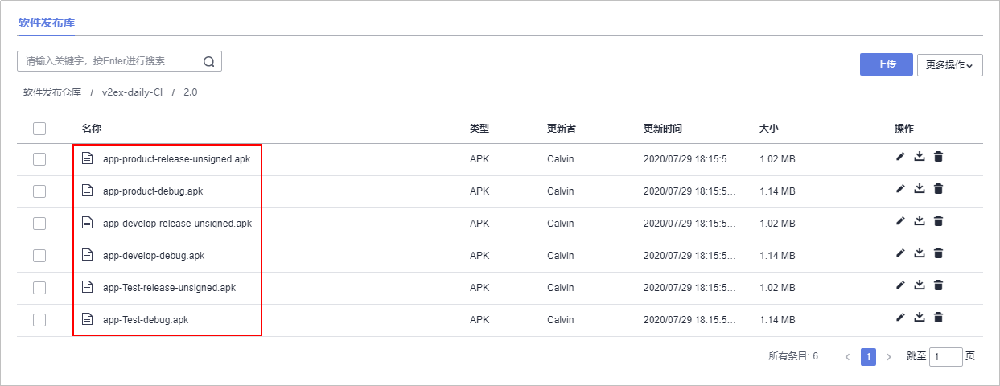

# 步骤三：构建并归档软件包<a name="devcloud_qs_0706"></a>

[编译构建](https://www.huaweicloud.com/product/cloudbuild.html)为开发者提供配置简单的混合语言构建平台，支持任务一键创建、配置和执行，实现获取代码、构建、打包等活动自动化。[发布](https://www.huaweicloud.com/product/cloudrelease.html)提供软件仓库、软件发布、发布包下载、发布包元数据管理等功能，实现软件包版本管理。通过编译构建任务中配置的归档路径，可将构建好的软件包归档在发布仓库中。

本节通过以下三步介绍如何使用编译构建服务将代码编译打包成软件包，并将软件包归档到软件发布库中。

-   [第一步：创建编译构建任务](#section167331924151713)
-   [第二步：执行编译构建任务](#section169031503229)
-   [第三步：检查发布件](#section1944352712216)

此外，本示例还将介绍以下两种构建场景：

-   [多环境构建](#section1970622012342)
-   [签名包构建](#section154263315347)

## 第一步：创建编译构建任务<a name="section167331924151713"></a>

DevCloud中内置了多种编译构建模板，本示例选择使用模板“Android APK“。

1.  单击页面上方导航栏“构建&发布  \>  编译构建“。

    

2.  单击“新建任务“，配置编译构建任务信息。

    1.  选择代码源：依次选择源码源“DevCloud“、仓库“v2ex-daily“、默认分支“master“。
    2.  选择构建模板：选择DevCloud内置的构建模板“Android APK“。

    完成配置，单击“确定“，页面自动跳转至构建步骤页面。

3.  单击“参数设置“页签，添加自定义参数“buildVersion“，用于版本管理。

    

4.  单击“构建步骤“页签，编辑编译构建步骤。
    1.  Android构建：选择Gradle版本，并编辑构建命令。

        Gradle版本的选择需要参考配置文件**build.gradle**中所配置的Gradle Plugin版本，配置文件**build.gradle**存储在代码仓库中，本示例中的配置文件如下图所示。

        

        Gradle Plugin版本与Gradle版本的对应关系如下：

        <a name="table2909422184415"></a>
        <table><thead align="left"><tr id="row1790982274417"><th class="cellrowborder" valign="top" width="50%" id="mcps1.1.3.1.1"><p id="p69091522124418"><a name="p69091522124418"></a><a name="p69091522124418"></a><strong id="b190913222445"><a name="b190913222445"></a><a name="b190913222445"></a>Plugin version</strong></p>
        </th>
        <th class="cellrowborder" valign="top" width="50%" id="mcps1.1.3.1.2"><p id="p990902224417"><a name="p990902224417"></a><a name="p990902224417"></a><strong id="b159091223446"><a name="b159091223446"></a><a name="b159091223446"></a>Required Gradle version</strong></p>
        </th>
        </tr>
        </thead>
        <tbody><tr id="row1490922216444"><td class="cellrowborder" valign="top" width="50%" headers="mcps1.1.3.1.1 "><p id="p12909322104413"><a name="p12909322104413"></a><a name="p12909322104413"></a>1.0.0 - 1.1.3</p>
        </td>
        <td class="cellrowborder" valign="top" width="50%" headers="mcps1.1.3.1.2 "><p id="p59092221445"><a name="p59092221445"></a><a name="p59092221445"></a>2.2.1 - 2.3</p>
        </td>
        </tr>
        <tr id="row090982216444"><td class="cellrowborder" valign="top" width="50%" headers="mcps1.1.3.1.1 "><p id="p390916221449"><a name="p390916221449"></a><a name="p390916221449"></a>1.2.0 - 1.3.1</p>
        </td>
        <td class="cellrowborder" valign="top" width="50%" headers="mcps1.1.3.1.2 "><p id="p59097229444"><a name="p59097229444"></a><a name="p59097229444"></a>2.2.1 - 2.9</p>
        </td>
        </tr>
        <tr id="row1490922224413"><td class="cellrowborder" valign="top" width="50%" headers="mcps1.1.3.1.1 "><p id="p1690911222444"><a name="p1690911222444"></a><a name="p1690911222444"></a>1.5.0</p>
        </td>
        <td class="cellrowborder" valign="top" width="50%" headers="mcps1.1.3.1.2 "><p id="p690918228442"><a name="p690918228442"></a><a name="p690918228442"></a>2.2.1 - 2.13</p>
        </td>
        </tr>
        <tr id="row1790902274417"><td class="cellrowborder" valign="top" width="50%" headers="mcps1.1.3.1.1 "><p id="p139095221445"><a name="p139095221445"></a><a name="p139095221445"></a>2.0.0 - 2.1.2</p>
        </td>
        <td class="cellrowborder" valign="top" width="50%" headers="mcps1.1.3.1.2 "><p id="p1690922215447"><a name="p1690922215447"></a><a name="p1690922215447"></a>2.10 - 2.13</p>
        </td>
        </tr>
        <tr id="row6909112214410"><td class="cellrowborder" valign="top" width="50%" headers="mcps1.1.3.1.1 "><p id="p1390972294418"><a name="p1390972294418"></a><a name="p1390972294418"></a>2.1.3 - 2.2.3</p>
        </td>
        <td class="cellrowborder" valign="top" width="50%" headers="mcps1.1.3.1.2 "><p id="p1490918221446"><a name="p1490918221446"></a><a name="p1490918221446"></a>2.14.1+</p>
        </td>
        </tr>
        <tr id="row89091922144413"><td class="cellrowborder" valign="top" width="50%" headers="mcps1.1.3.1.1 "><p id="p1990922216441"><a name="p1990922216441"></a><a name="p1990922216441"></a>2.3.0+</p>
        </td>
        <td class="cellrowborder" valign="top" width="50%" headers="mcps1.1.3.1.2 "><p id="p590992214449"><a name="p590992214449"></a><a name="p590992214449"></a>3.3+</p>
        </td>
        </tr>
        <tr id="row590932211442"><td class="cellrowborder" valign="top" width="50%" headers="mcps1.1.3.1.1 "><p id="p12909142219449"><a name="p12909142219449"></a><a name="p12909142219449"></a>3.0.0+</p>
        </td>
        <td class="cellrowborder" valign="top" width="50%" headers="mcps1.1.3.1.2 "><p id="p159091522144419"><a name="p159091522144419"></a><a name="p159091522144419"></a>4.1+</p>
        </td>
        </tr>
        </tbody>
        </table>

        本示例中的Gradle版本选择“4.5“，输入以下构建命令：

        ```
        gradle build
        ```

        

    2.  上传软件包到软件发布库：输入发布版本号“$\{buildVersion\}“。

        

5.  单击“新建“，完成编译构建任务的创建。页面自动跳转至任务详情页。

## 第二步：执行编译构建任务<a name="section169031503229"></a>

在编译详情页面中，单击“开始构建“，在弹框中输入版本号（例如“1.0“），启动构建任务。

任务执行耗时约1分钟，当页面中显示时，表示任务执行成功完成。


单击构建编号，可查看构建日志。若执行失败，请查看日志信息排查问题，或通过[编译构建-常见问题](https://support.huaweicloud.com/codeci_faq/codeci_02_0001.html)查找解决方法。

## 第三步：检查发布件<a name="section1944352712216"></a>

编译构建任务默认将软件包归档在软件发布库中，归档路径通常分为两层：

-   路径第一层为与编译构建任务同名的文件夹。
-   路径第二层为与[第二步：执行编译构建任务](#section169031503229)中设置的发布版本号同名的文件夹。

1.  单击页面上方导航栏“构建&发布  \>  发布“，进入软件发布库。
2.  单击文件夹“v2ex-daily-CI“，根据[第二步：执行编译构建任务](#section169031503229)中输入的版本号，单击同名文件夹进入，即可看到生成的软件包“app-debug.apk“。

    


## 多环境构建<a name="section1970622012342"></a>

在平时的Android开发中，经常会遇到在不同网络环境（比如：开发环境、测试环境）之间的切换等需求。如果每一次在不同网络环境间切换，都需要更改代码、重新打包，会消耗过多人力及时间。

下面提供一种常用的多环境打包的方法。

1.  在代码仓库中找到文件夹“app“，在其中的**build.gradle**文件中的Android代码段中添加以下代码。

    ```
    //多版本
    buildTypes {
        debug {
    		//是否输出日志
    		buildConfigField 'boolean', 'IS_DEBUG', 'true'
    		}
        release {
    		buildConfigField  'boolean', 'IS_DEBUG', 'false'
        }
    }
    //多环境
    productFlavors {
    	//开发环境
    	develop {
    		applicationId 'com.yugy.v2ex.daily.dev'
    		buildConfigField "String", "APPURL", "\"http://v2exdaily/develop/api/\""
        }
        //测试环境
        Test {
    		applicationId 'com.yugy.v2ex.daily.test'
    		buildConfigField "String", "APPURL", "\"http://v2exdaily/test/api/\""
        }
        //生产环境
        product {
    		applicationId 'com.yugy.v2ex.daily.product'
    		buildConfigField "String", "APPURL", "\"http://v2exdaily/product/api/\""
        }
    }
    ```

    

2.  执行构建任务，成功执行后，在软件发布库可看到如下APK。

    


## 签名包构建<a name="section154263315347"></a>

Android系统要求每一个Android应用程序必须要经过数字签名才能够安装到系统中。前面步骤中生成的构建包都没有签名，下面介绍如何构建签名包。

在构建前，首先要准备好一个签名文件（xxx.jks），签名文件的编写本示例不详细介绍，请参考相关的专业操作指南。

1.  进入在[步骤二：管理项目代码](Android-管理项目代码.md)中创建的代码仓库，单击，在下拉列表中选择“上传文件“，将准备好的签名文件上传到代码仓库中。

    

2.  在文件“app/build.gradle“的Android代码段中添加以下代码。

    其中，“keyPassword“与“storePassword“来源于签名文件。

    ```
    //签名文件
    signingConfigs {
        release {
    	keyAlias 'key0'
            keyPassword 'xxxxxx'
            storeFile file('../keystore.jks')
            storePassword 'xxxxxx'
    	}
    }
    ```

    并在下图所示位置添加以下代码：

    ```
    //是否签名
    signingConfig signingConfigs.release
    ```

    

3.  执行构建任务，成功执行后，在软件发布库可看到所有release包均已签名。

    


  

