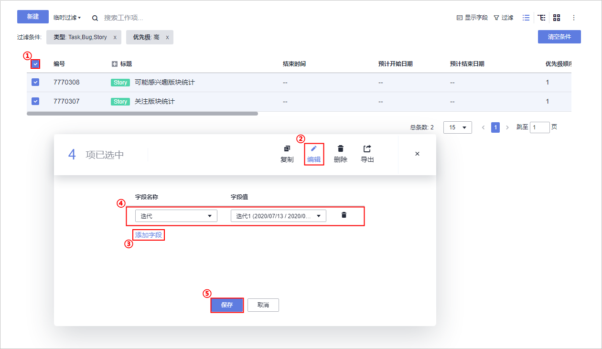

# 步骤一：管理项目规划

[项目管理](https://www.huaweicloud.com/product/projectman.html)为开发团队提供简单高效的团队协作服务，包含多项目管理、敏捷迭代、需求管理等功能。

本示例所开发的“V2EX Daily”包括热点信息、版块信息统计、个人设置三部分。

-   热点信息：包括热点信息展示、信息定向推送。
-   版块信息统计：包括关注版块统计、可能感兴趣版块统计。
-   个人设置：包括获取个人信息、反馈产品意见、获取软件更新信息、消息通知设置。

项目计划采用Scrum流程进行开发，项目周期分为三个迭代，每个迭代持续一周。

-   本示例中，最主要的功能是信息展示，而热点信息的展示和推送依赖于对用户浏览版块的统计，因此迭代一首先开发版块信息统计。
-   迭代二开发热点信息。
-   迭代三开发个人设置。

本节通过以下三步介绍如何使用项目管理服务进行项目规划的管理。

-   [第一步：建立项目规划思维导图](#section7442105320386)
-   [第二步：细化Story描述](#section16393121449)
-   [第三步：迭代规划](#section529954223812)

## 第一步：建立项目规划思维导图

在项目初期，由产品负责人Alice将从客户获取的所有需求信息，逐一落实到项目规划中，分解细化，逐步形成“Epic\>Feature\>Story“结构的思维导图。

-   Epic：中文通常翻译为史诗，指公司的关键战略举措。
-   Feature：中文通常翻译为特性，代表可以给客户带来价值的产品功能或特性。
-   Story：中文通常翻译为用户故事，User Story的简称。是从用户角度对产品需求的详细描述，更小粒度的功能。

工作项类型的详细说明，请参考[需求规划工作项说明](https://support.huaweicloud.com/usermanual-projectman/projetcman_ug_0001.html#section0)。

在本示例中，思维导图各层级与项目规划间的对应关系为：

<table><thead align="left"><tr id="row17339118163416"><th class="cellrowborder" valign="top" width="33.33333333333333%" id="mcps1.1.4.1.1">
Epic

</th>
<th class="cellrowborder" valign="top" width="33.33333333333333%" id="mcps1.1.4.1.2">
Feature

</th>
<th class="cellrowborder" valign="top" width="33.33333333333333%" id="mcps1.1.4.1.3">
Story

</th>
</tr>
</thead>
<tbody><tr id="row9339131853413"><td class="cellrowborder" rowspan="8" valign="top" width="33.33333333333333%" headers="mcps1.1.4.1.1 ">
V2EX Daily

</td>
<td class="cellrowborder" rowspan="2" valign="top" width="33.33333333333333%" headers="mcps1.1.4.1.2 ">
热点信息

</td>
<td class="cellrowborder" valign="top" width="33.33333333333333%" headers="mcps1.1.4.1.3 ">
热点信息

</td>
</tr>
<tr id="row1033918186341"><td class="cellrowborder" valign="top" headers="mcps1.1.4.1.1 ">
信息定向推送

</td>
</tr>
<tr id="row6339191820342"><td class="cellrowborder" rowspan="2" valign="top" headers="mcps1.1.4.1.1 ">
版块信息统计

</td>
<td class="cellrowborder" valign="top" headers="mcps1.1.4.1.2 ">
关注版块统计

</td>
</tr>
<tr id="row13397187343"><td class="cellrowborder" valign="top" headers="mcps1.1.4.1.1 ">
可能感兴趣版块统计

</td>
</tr>
<tr id="row203401518163417"><td class="cellrowborder" rowspan="4" valign="top" headers="mcps1.1.4.1.1 ">
个人设置

</td>
<td class="cellrowborder" valign="top" headers="mcps1.1.4.1.2 ">
获取个人信息

</td>
</tr>
<tr id="row834012183345"><td class="cellrowborder" valign="top" headers="mcps1.1.4.1.1 ">
反馈产品意见

</td>
</tr>
<tr id="row734016182347"><td class="cellrowborder" valign="top" headers="mcps1.1.4.1.1 ">
获取软件更新信息

</td>
</tr>
<tr id="row176764587355"><td class="cellrowborder" valign="top" headers="mcps1.1.4.1.1 ">
消息通知设置

</td>
</tr>
</tbody>
</table>

建立思维导图的操作步骤如下：

1.  单击页面上方导航“工作  \>  规划“，在页面中选择“思维导图“。

    

2.  单击“Epic“一栏中的“+“，输入工作项名称“V2EX-Daily“，敲击回车，完成Epic创建。

    

3.  单击图标，输入工作项名称“热点信息“，敲击回车，完成Feature创建。

    

4.  按照相同的方式创建其它Feature、Story，最终的需求规划图如下。

    

## 第二步：细化Story描述

为了便于理解，建议为每个Story添加详细的描述信息。此外，建议将需要最先完成的Story设置为最高的优先级。

1.  编辑Story描述信息。

    建议按照DevCloud中内置的Story描述模板“**作为**<用户角色\>，**我想要**<结果\>，**以便于**<目的\>”编辑每个Story的描述信息。

    1.  在思维导图中，单击Story“关注版块统计“，页面右侧将滑出窗口。
    2.  输入描述信息“作为用户，我想要关注版块统计功能，以便于快速查看我所关注的版块信息“，单击页面右上角“保存“。
    3.  按照同样的方式，编辑其它Story的描述信息。

2.  设置Story优先级。
    1.  在思维导图中，单击Story“关注版块统计“，页面右侧将滑出窗口。
    2.  在页面中单击优先级下拉列表，选择“高“，单击页面右上角“保存“。
    3.  按照同样的方式，参照下表完成其它Story的优先级设置。

        
        <table><thead align="left"><tr id="row1775471392310"><th class="cellrowborder" valign="top" width="20%" id="mcps1.1.3.1.1">
优先级

        </th>
        <th class="cellrowborder" valign="top" width="80%" id="mcps1.1.3.1.2">
Story

        </th>
        </tr>
        </thead>
        <tbody><tr id="row1754613132314"><td class="cellrowborder" valign="top" width="20%" headers="mcps1.1.3.1.1 ">
高

        </td>
        <td class="cellrowborder" valign="top" width="80%" headers="mcps1.1.3.1.2 ">
关注版块统计、可能感兴趣版块统计。

        </td>
        </tr>
        <tr id="row975431315235"><td class="cellrowborder" valign="top" width="20%" headers="mcps1.1.3.1.1 ">
中

        </td>
        <td class="cellrowborder" valign="top" width="80%" headers="mcps1.1.3.1.2 ">
热点信息展示、信息定向推送。

        </td>
        </tr>
        <tr id="row1375417135233"><td class="cellrowborder" valign="top" width="20%" headers="mcps1.1.3.1.1 ">
低

        </td>
        <td class="cellrowborder" valign="top" width="80%" headers="mcps1.1.3.1.2 ">
获取个人信息、反馈产品意见、获取软件更新信息、消息通知设置。

        </td>
        </tr>
        </tbody>
        </table>

## 第三步：迭代规划

在项目初期时，由项目经理Brain根据规划创建迭代。由于创建Scrum项目时，DevCloud会自动创建3个迭代，因此本示例中只需将迭代时长修改为1周。

在每个迭代开始时，由项目经理召开根据规划将本次迭代中待实现的Story添加在迭代中，并将Story分配给开发人员。

1.  设置迭代时长。
    1.  单击页面上方导航栏“迭代“。
    2.  在左侧迭代列表中找到“迭代1“，单击，在下拉列表中选择编辑。

        

    3.  根据实际时间，选择迭代的起止时间，迭代时长为1周，单击“确定“。
    4.  按照同样的方式编辑其它两个迭代的起止时间。

2.  将Story加入迭代。
    1.  左侧导航“未规划工作项“，单击工作项列表右上方“过滤“。
    2.  单击“增加过滤字段“，在弹框中选择“优先级“，单击“确定“，这两个字段将显示在页面中。

        

    3.  优先级选择“高“，单击“临时过滤“，页面中将显示符合过滤条件的工作项。
    4.  勾选筛选出的全部4个工作项，在页面底部单击“编辑“。
    5.  单击“添加字段“，在字段名称下拉列表中选择“迭代“，并在字段值下拉列表中选择“迭代1“，单击“保存“。

        

    6.  按照同样的方法，筛选中优先级工作项加入迭代2、低优先级工作项加入迭代3。

3.  分配Story。

    1.  在页面左侧导航中选择“迭代1“，在列表中单击Story名称，页面右侧将滑出窗口。
    2.  选择处理人为“Calvin“、输入预计工时（例如1人/天），单击页面右上角“保存“。
    3.  按照同样的方式，为其它的Story设置处理人及预计工时。

    其它迭代中的工作项可在对应迭代开始时根据实际情况编辑。

至此，您已经完成了对项目的规划操作。

  

