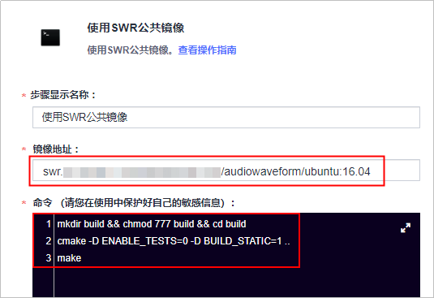
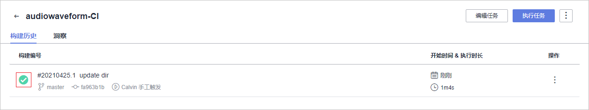

# 步骤四：构建并归档软件包<a name="devcloud_qs_0606"></a>

[编译构建](https://www.huaweicloud.com/product/cloudbuild.html)为开发者提供配置简单的混合语言构建平台，支持任务一键创建、配置和执行，实现获取代码、构建、打包等活动自动化。[发布](https://www.huaweicloud.com/product/cloudrelease.html)提供软件仓库、软件发布、发布包下载、发布包元数据管理等功能，实现软件包版本管理。通过编译构建任务中配置的归档路径，可将构建好的软件包归档在发布仓库中。

本示例中采用的构建工具为CMake+gcc。

DevCloud中内置了编译构建所需的基础环境镜像，包含多个版本的CMake和gcc工具，但这些镜像只能安装简单的构建工具和常用的软件包，不足以支撑专业性较强的C++项目，因此本示例中介绍一种解决方法：首先将工程所需的依赖包构建成环境镜像，上传到[容器镜像服务SWR](https://console.huaweicloud.com/swr/)中；然后在构建软件包时拉取环境镜像并使用。

本节通过以下五步介绍如何使用编译构建服务构建环境镜像、将代码编译打包成软件包、并将软件包归档到软件发布库中。

-   [第一步：上传环境镜像到SWR](#section85892030567)
-   [第二步：新建编译构建任务](#section1930235817716)
-   [第三步：执行编译构建任务](#section173518268483)
-   [第四步：检查发布件](#section95591547164916)
-   [第五步：上传待解析音频文件](#section131851330114710)

## 第一步：上传环境镜像到SWR<a name="section85892030567"></a>

如果本地有Linux机器并已经安装了Docker工具，可以在本地构建环境镜像并上传。在容器镜像服务中，单击“客户端上传“，会显示上传指导说明。

如果本地没有Linux机器或Docker工具，也可以按照本节的操作，通过DevCloud生成环境镜像。

1.  创建组织。

    组织用于隔离镜像仓库，上传镜像前需要先创建组织。

    登录[容器镜像服务控制台](https://console.huaweicloud.com/swr/?region&locale=zh-cn#/app/dashboard)，创建组织“audiowaveform“，详细操作请参考[创建组织](https://support.huaweicloud.com/usermanual-swr/swr_01_0014.html#section0)。

2.  准备镜像文件。
    1.  在本地准备如下“Dockerfile“文件，用于生成“环境镜像”。

        ```
        FROM ubuntu:16.04
        RUN apt-get update
        RUN apt-get install git -y
        RUN apt-get install make -y
        RUN apt-get install cmake -y
        RUN apt-get install gcc -y
        RUN apt-get install g++ -y
        RUN apt-get install libmad0-dev -y
        RUN apt-get install libid3tag0-dev -y
        RUN apt-get install libsndfile1-dev -y
        RUN apt-get install libgd-dev -y
        RUN apt-get install libboost-filesystem-dev -y
        RUN apt-get install libboost-program-options-dev -y
        RUN apt-get install libboost-regex-dev -y
        ```

    2.  进入“代码  \>  代码托管“页面，单击“普通新建“，创建代码仓库“audio-dockerfile“，并将“Dockerfile“文件上传到此代码仓库中。

        上传文件操作请参考[将本地Git库上传到代码托管的代码仓库](https://support.huaweicloud.com/usermanual-codehub/devcloud_hlp_0939.html)。

3.  构建环境镜像。
    1.  在代码仓库中，单击页面右上角“设置构建“，页面跳转至“新建编译构建任务“页面。
    2.  在页面中选择“空白构建模板“，单击“确定“，页面自动跳转至构建步骤页面。

    3.  添加步骤“制作镜像并推送到SWR仓库“。

        输入组织“audiowaveform“，设置镜像名称、镜像标签。本示例中的配置分别为“ubuntu“、“16.04“。

        

    4.  单击“新建并执行“，启动构建任务。

        任务执行耗时约6\~8分钟。当页面中显示时，表示任务执行成功完成。

        

          

4.  查看环境镜像。
    1.  进入容器镜像服务，单击左侧菜单“我的镜像“，找到生成的镜像。

        

    2.  单击镜像名称，进入“镜像详情“页面。

        单击“编辑“，将镜像权限设置成“公开“，单击“确定“。

        

    3.  <a name="li11575135474112"></a>在列表中复制获取该镜像地址（**docker pull**后面内容），以备在后续构建任务中使用。

        


## 第二步：新建编译构建任务<a name="section1930235817716"></a>

由于本示例中采用自有的环境镜像进行构建，因此在创建编译构建任务时将不选择系统模板，而是根据需要选择DevCloud内置的构建步骤。

1.  返回“编译构建“页面，单击“新建任务“，配置编译构建任务信息。

    1.  选择代码源：依次选择源码源“DevCloud“、仓库“audiowaveform“、默认分支“master“。
    2.  选择构建模板：选择“空白构建模板“。

    完成配置，单击“确定“，页面自动跳转至构建步骤页面。

2.  添加并配置构建步骤：
    1.  使用SWR公共镜像：输入在[上传环境镜像到SWR-步骤13](#li11575135474112)获取到的镜像地址，并输入以下命令。

        ```
        mkdir build && chmod 777 build && cd build
        cmake -D ENABLE_TESTS=0 -D BUILD_STATIC=1 ..
        make
        ```

        

    2.  执行shell命令：输入以下命令，将代码仓库中的运行脚本和生成的可执行文件统一压缩。

        ```
        cp startup.sh build/
        cd build
        tar zcvf audiowaveform.tar.gz audiowaveform startup.sh
        ```

        

    3.  上传软件包到软件发布库：输入构建包路径、发布版本号及包名，本示例中的配置分别为“build/audiowaveform.tar.gz“、“1.0“、“audiowaveform“。

        

3.  单击“新建“，完成编译构建任务的创建。页面自动跳转至编译详情页面。

## 第三步：执行编译构建任务<a name="section173518268483"></a>

在编译详情页面，单击“开始构建“，启动构建任务。

任务执行耗时约1分钟，当页面中显示时，表示任务执行成功完成。



单击构建编号，可查看构建日志。若执行失败，请查看日志信息排查问题，或通过[编译构建-常见问题](https://support.huaweicloud.com/codeci_faq/codeci_02_0001.html)查找解决方法。

## 第四步：检查发布件<a name="section95591547164916"></a>

编译构建任务默认将软件包归档在软件发布库中，归档路径通常分为两层：

-   路径第一层为与编译构建任务同名的文件夹。
-   路径第二层为与[第二步：新建编译构建任务](#section1930235817716)中设置的发布版本号同名的文件夹，本示例中的路径文件夹为“1.0“。

1.  单击页面上方导航栏“构建&发布  \>  发布“，进入软件发布库。
2.  依次单击文件夹“audiowaveform \> 1.0“，可以看到生成的软件包“audiowaveform.tar.gz“。

    


## 第五步：上传待解析音频文件<a name="section131851330114710"></a>

在软件发布库页面，单击“上传“，将一个压缩好的MP3压缩文件上传至软件发布库。

在部署时，将使用生成的可执行文件解析该音频文件，该文件可以用任意MP3文件替代。


至此，您已经完成了软件包的构建与归档操作。

  

