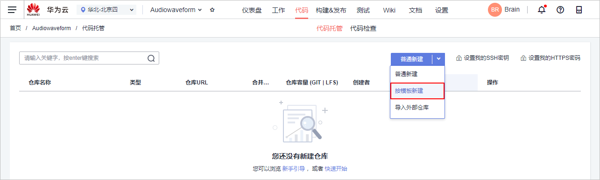
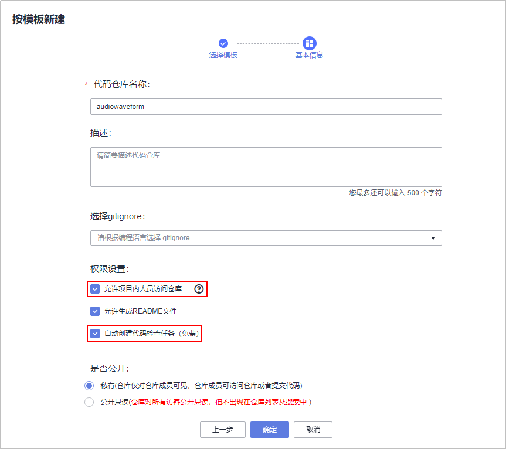
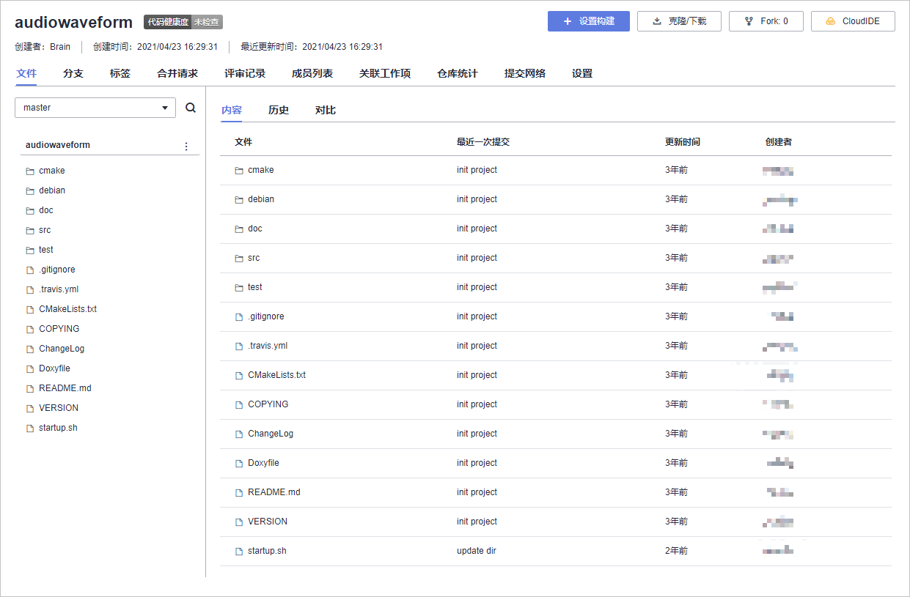

# 步骤二：管理项目代码

[代码托管](https://www.huaweicloud.com/product/codehub.html)为开发者提供基于Git的在线代码托管服务，包括代码克隆/提交、分支管理等功能。本示例中通过代码托管服务将“音频解析器”的代码保存至云端，方便项目成员间的多人协作开发。

完成项目规划后，由项目经理Brain创建代码仓库，开发人员Calvin进行代码的编写。

本示例中暂不介绍详细的代码开发过程。项目开发完成后，开发人员将代码公开为模板，本示例中以此模板为例介绍如何创建代码仓库。

代码托管支持三种新建代码仓库方式：普通新建、按模板新建、导入外部仓库。本示例中所使用的代码已公开为示例模板，因此采用“按模板新建“方式。

1.  单击导航栏“代码  \>  代码托管“。
2.  单击页面右上角“普通新建“旁边的“∨“，选择“按模板新建“。

    

3.  在搜索框中输入“audiowaveform“，并在右侧第一个下拉列表中选择“华北-北京一“，即可查找到已经被公开为示例模板的音频解析器代码，选择该模板，单击“下一步“。
4.  输入代码仓库名称（本示例中与模板仓库同名），勾选“允许项目内成员访问仓库“、“自动创建代码检查任务“，单击“确定“，完成仓库创建。

    

5.  单击仓库名称进入仓库，可查看仓库文件。

    

6.  选择“成员列表“页签，可查看代码仓库成员。
    -   Brain作为仓库创建者，在仓库中的角色为仓库管理员。
    -   Alice作为项目创建者，在仓库中的角色也是仓库管理员。
    -   开发人员Calvin在仓库中的角色为仓库普通成员。

至此，您已经完成代码仓库的创建操作。

  

