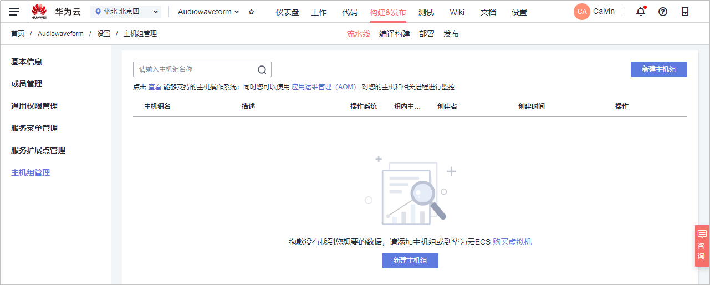
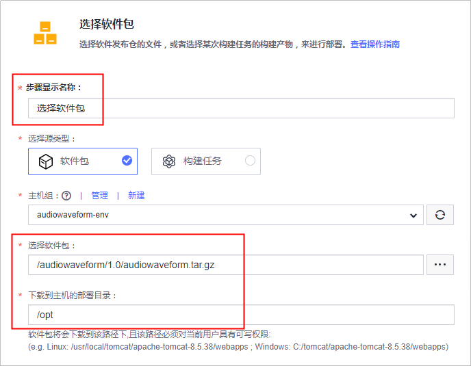
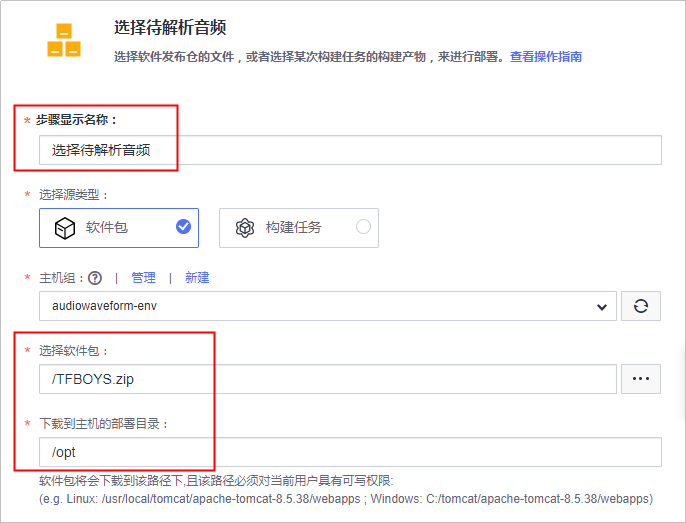
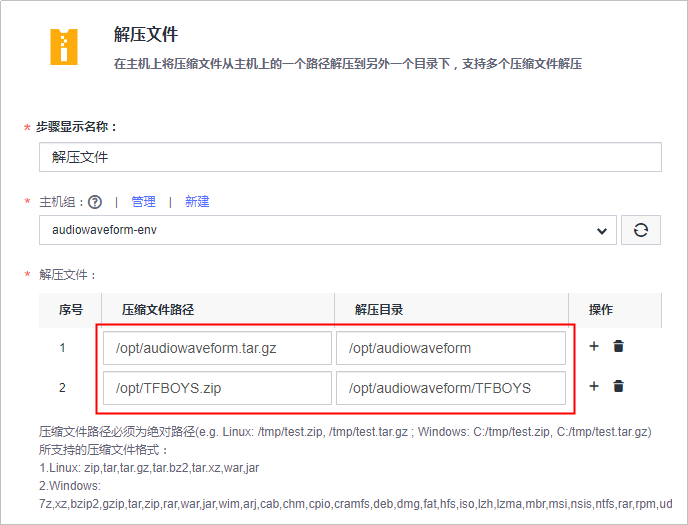
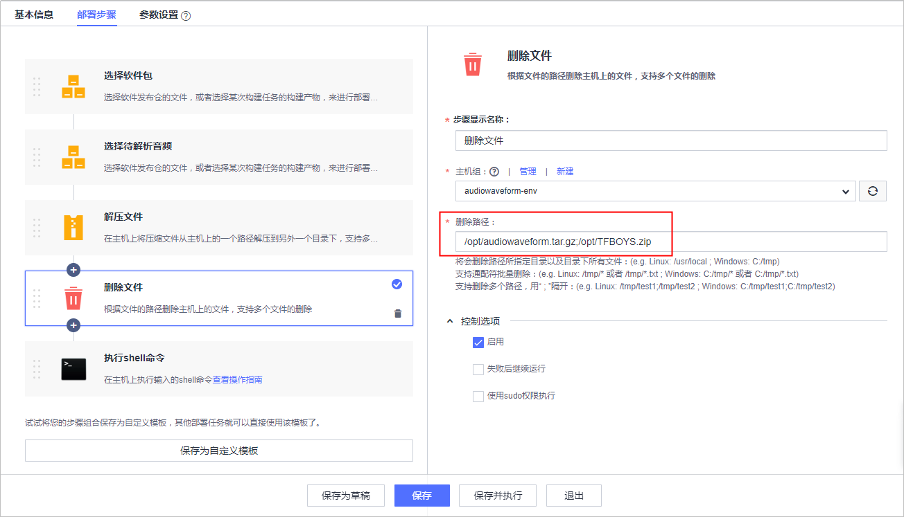
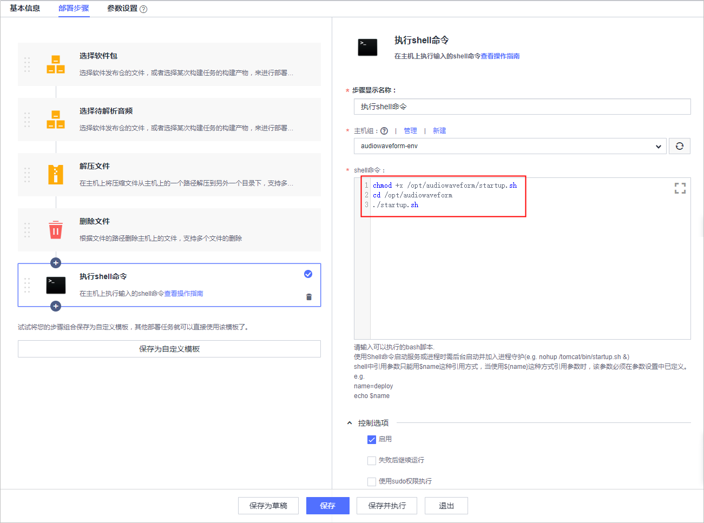
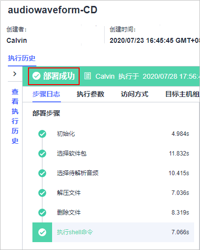
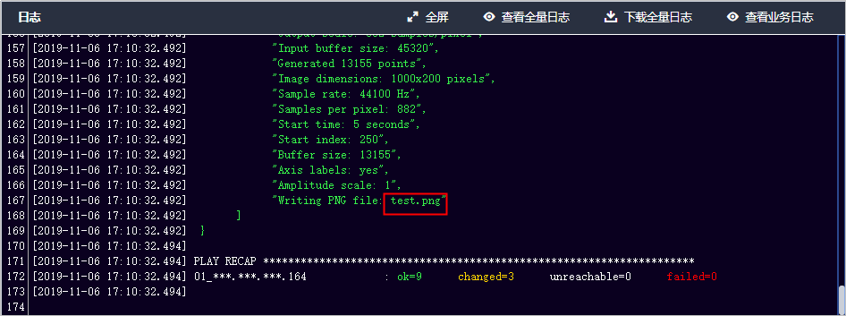
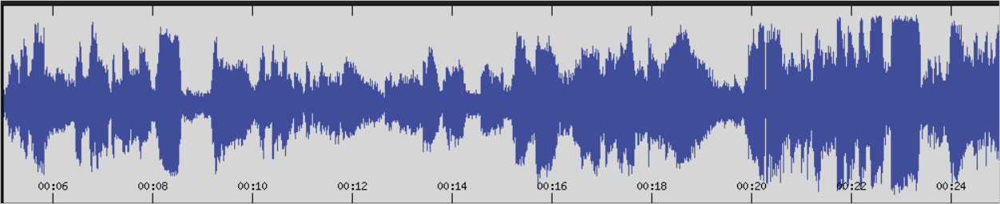

# 步骤五：部署软件包至云主机<a name="devcloud_qs_0607"></a>

[部署](https://www.huaweicloud.com/product/clouddeploy.html)提供可视化、一键式部署服务，支持并行部署和流水线无缝集成，实现部署环境标准化和部署过程自动化。

本节通过以下五步介绍如何使用部署服务将归档在软件发布库的软件包部署到云主机上。

-   [第一步：准备弹性云服务器](#section5659213183110)
-   [第二步：添加授信主机](#section2054019404494)
-   [第三步：新建部署任务](#section62010502492)
-   [第四步：执行部署任务](#section17778426183915)
-   [第五步：验证部署结果](#section354157193120)

## 第一步：准备弹性云服务器<a name="section5659213183110"></a>

“音频解析器”需要部署到Ubuntu系统服务器上才可以运行。

本示例采用部署服务器是[华为云弹性云服务器](https://support.huaweicloud.com/ecs/index.html)，所需配置如下，购买方式请参考[购买并登录Linux弹性云服务器](https://support.huaweicloud.com/basics-ecs/ecs_01_0103.html)。您也可以使用自己的Linux主机。

-   计费模式：若只参考本示例进行DevCloud体验，建议选择**按需计费**方式，在体验之后将弹性云服务器删除，避免产生不必要的费用。
-   操作系统：Ubuntu16.04。
-   规格：2vCPUs、内存4GB。
-   已绑定弹性公网IP。

购买弹性云服务器成功后，通过[弹性云服务器控制台](https://console.huaweicloud.com/ecm/?region&locale=zh-cn#/ecs/manager/vmList)查看安全组中是否有一条Any协议的入方向规则。若没有，则添加一条，安全组配置方式参考[配置安全组规则](https://support.huaweicloud.com/usermanual-ecs/zh-cn_topic_0030878383.html)。


## 第二步：添加授信主机<a name="section2054019404494"></a>

DevCloud在使用弹性云服务器之前需要先对其授信。

1.  单击页面上方导航栏“设置  \>  通用设置“，在页面左侧导航中选择“主机组管理“。

    

2.  单击“新建主机组“，输入主机组名称“audiowaveform-env“、选择操作系统（Linux），单击“保存“，完成主机组的创建。
3.  单击“添加主机“，输入主机名、云主机IP、用户名、密码、ssh端口，单击“添加“完成主机的添加。
    -   主机名、云主机IP、用户名、密码可通过[弹性云服务器控制台](https://console.huaweicloud.com/ecm/?region&locale=zh-cn#/ecs/manager/vmList)获取，查看方式请参考[查看云服务器详细信息](https://support.huaweicloud.com/usermanual-ecs/ecs_03_0123.html)。
    -   ssh端口输入默认端口22即可。

4.  等待验证，当显示“验证成功“时，说明主机成功添加。

    

    若验证失败，单击“验证消息“列中的“详情“，在弹框总可查看失败原因与操作指导。

    


## 第三步：新建部署任务<a name="section62010502492"></a>

由于DevCloud中没有与C++语言相应的内置部署模板，因此本示例在创建部署任务时将不选择系统模板，而是根据需要DevCloud内置的步骤。

1.  单击页面上方导航栏“构建&发布  \>  部署“。
2.  单击“新建任务“，配置部署任务信息。

    1.  基本信息：输入任务名称“audiowaveform-CD“。
    2.  选择构建模板：选择“空白模板“。

    完成配置，单击“确定“，页面自动跳转至部署步骤页面。

3.  添加并配置部署步骤：
    1.  选择部署来源（audiowaveform.tar.gz）：
        -   为了便于理解，将任务名从“选择部署来源“改成“选择软件包“。
        -   选择在步骤[第二步：添加授信主机](#section2054019404494)中创建的主机组“audiowaveform-env“，若系统将弹框提示“是否将后续步骤的主机组也修改为audiowaveform-env？”，选择“确定“。
        -   单击选择软件包文本框后的，在弹窗中根据[第四步：检查发布件](C++-构建并归档软件包.md#section95591547164916)中的路径逐层单击目录直至软件包“audiowaveform.tar.gz“。
        -   编辑下载到主机的部署目录，本示例中配置的部署目录是“/opt“。

            

    2.  选择部署来源（待解析音频）：
        -   为了便于理解，将任务名从“选择部署来源“改成“选择待解析音频“。
        -   单击选择软件包文本框后的，在弹窗中找到在[第五步：上传待解析音频文件](C++-构建并归档软件包.md#section131851330114710)上传的音频压缩包。
        -   编辑下载到主机的部署目录，本示例中配置的部署目录是“/opt“。

            

    3.  <a name="li694516617204"></a>解压文件：

        单击解压文件列表中的文字“添加“，添加两行记录，分别添加软件包及带解析音频的压缩文件路径及解压目录。

        本示例中的配置如下图所示：

        

    4.  删除文件：

        编辑删除路径，路径与步骤[上一步](#li694516617204)中的解压文件相同，两个解压目录见用“;“间隔开。

        

    5.  执行shell命令：

        输入以下命令，启动可执行文件的执行。

        ```
        chmod +x /opt/audiowaveform/startup.sh
        cd /opt/audiowaveform
        ./startup.sh
        ```

        

4.  单击“保存“，完成部署任务的创建。单击“退出“返回部署任务列表。

## 第四步：执行部署任务<a name="section17778426183915"></a>

单击部署任务名称进入“部署详情“页面，单击“执行“，执行部署任务。

任务执行耗时约1分钟，当页面显示“部署成功“，表示任务执行完毕。

若任务执行失败，可通过页面中的原因提示及链接来排查解决。



## 第五步：验证部署结果<a name="section354157193120"></a>

1.  查看部署任务日志，在日志中找到生成的采样图片名称（.png文件）。

    

2.  由于云主机上无法查看图片内容，因此登录云主机，将图片下载到本地打开，即可看到下图所示图片。

    下载方式可参考[在Linux云服务器上使用SFTP上传、下载文件](https://support.huaweicloud.com/ecs_faq/zh-cn_topic_0170139796.html)。

    


至此，您已经完成了软件包的部署及运行操作。

  

