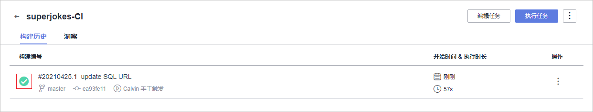
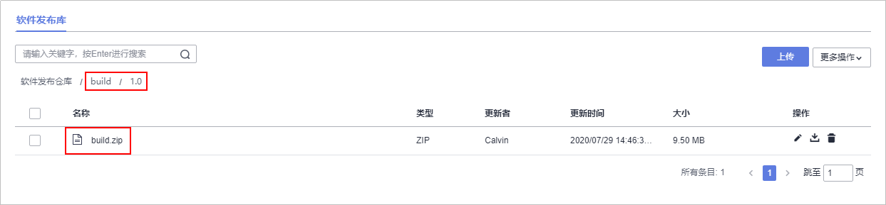

# 步骤四：构建并归档软件包<a name="devcloud_qs_0506"></a>

[编译构建](https://www.huaweicloud.com/product/cloudbuild.html)为开发者提供配置简单的混合语言构建平台，支持任务一键创建、配置和执行，实现获取代码、构建、打包等活动自动化。[发布](https://www.huaweicloud.com/product/cloudrelease.html)提供软件仓库、软件发布、发布包下载、发布包元数据管理等功能，实现软件包版本管理。通过编译构建任务中配置的归档路径，可将构建好的软件包归档在发布仓库中。

本节通过以下三步介绍如何使用编译构建服务将代码编译打包成软件包，并将软件包归档到软件发布库中。

-   [第一步：新建编译构建任务](#section982733617533)
-   [第二步：执行编译构建任务](#section102501632162113)
-   [第三步：检查发布件](#section857159902)

## 第一步：新建编译构建任务<a name="section982733617533"></a>

DevCloud中内置了多种编译构建模板，本示例中选择使用模板“MSBuild“。

1.  单击页面上方导航栏“构建&发布  \>  编译构建“。

    

2.  单击“新建任务“，配置编译构建任务信息。

    1.  选择代码源：依次选择源码源“DevCloud“、仓库“superjokes“、默认分支“master“。
    2.  选择构建模板：选择DevCloud内置的构建模板“MSBuild“。

    完成配置，单击“确定“，页面自动跳转至构建步骤页面。

3.  编辑构建步骤：
    1.  Msbuild构建：
        -   工具版本选择“msbuild15-all-dotnetcore2.1“。
        -   在powershell命令框输入以下命令：

            ```
            cd src
            nuget restore && msbuild /p:OutputPath=../buildResult/Release/bin
            powershell -Command Compress-Archive -Path ./buildResult/Release/bin/_PublishedWebsites/Joke.Web/* -DestinationPath ./archive.zip
            ```

            

            > **说明：** 
            >命令行注解如下：
            >-   由于本代码工程的sln文件路径位于“/src“目录下，故在命令行中先执行**cd src**命令。
            >-   执行构建语句：**nuget restore && msbuild /p:OutputPath=../buildResult/Release/bin**（构建语句的执行必须要在sln文件的同级目录下）
            >-   执行压缩指令：**powershell -Command Compress-Archive -Path ./buildResult/Release/bin/\_PublishedWebsites/Joke.Web/\* -DestinationPath ./archive.zip**，此命令将“./buildResult/Release/bin/\_PublishedWebsites/Joke.Web/“目录下的所有文件打包成archive.zip包，且archive.zip位于“./src“目录下（执行命令时处于src目录下）。


    2.  上传软件包到发布库（Windows环境）：输入构建包路径、发布版本号及包名，本示例中的配置为“src/archive.zip“、“1.0“、“build“。

        

          

4.  单击“新建“，完成编译构建任务的创建。页面自动跳转至编译详情页面。

## 第二步：执行编译构建任务<a name="section102501632162113"></a>

在编译详情页面中，单击“开始构建“，启动构建任务。

任务执行耗时约1分钟，当页面中显示时，表示任务执行成功完成。



单击构建编号，可查看构建日志。若执行失败，可通过日志信息排查问题，或通过[编译构建-常见问题](https://support.huaweicloud.com/codeci_faq/codeci_02_0001.html)查找解决方法。

## 第三步：检查发布件<a name="section857159902"></a>

编译构建任务默认将软件包归档在软件发布库中，归档路径通常分为两层：

-   路径第一层为与编译构建任务同名的文件夹。
-   路径第二层为与[第一步：新建编译构建任务](#section982733617533)中设置的发布版本号同名的文件夹，本示例中的路径文件夹为“1.0“。

1.  单击页面上方导航栏“构建&发布  \>  发布“，进入软件发布库。
2.  依次单击文件夹“build\> 1.0“，可以看到生成的软件包“build.zip“。

    


至此，您已经完成了软件包的构建与归档操作。

  

