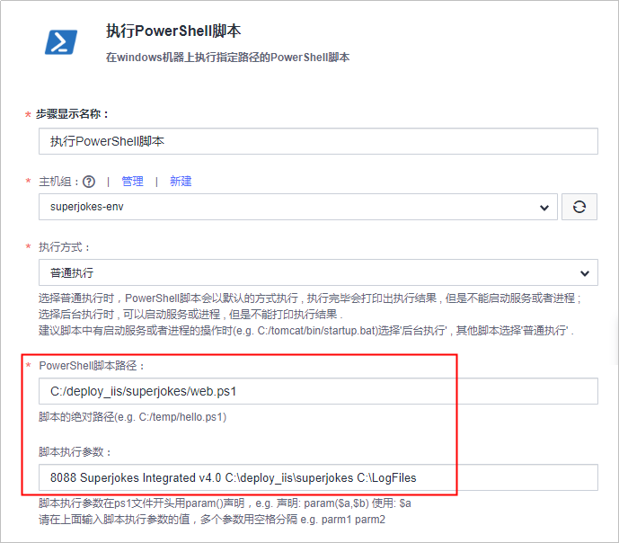
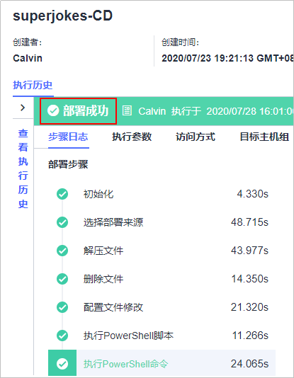

# 步骤五：部署软件包至云主机<a name="devcloud_qs_0507"></a>

[部署](https://www.huaweicloud.com/product/clouddeploy.html)提供可视化、一键式部署服务，支持并行部署和流水线无缝集成，实现部署环境标准化和部署过程自动化。

本节通过以下六步介绍如何使用部署服务将归档在软件发布库的软件包部署到云主机上。

-   [第一步：准备弹性云服务器](#section18212134913517)
-   [第二步：添加授信主机](#section1955185217417)
-   [第三步：新建部署任务](#section71691910049)
-   [第四步：执行部署任务](#section07448201849)
-   [第五步：验证部署结果](#section1466515143813)

## 第一步：准备弹性云服务器<a name="section18212134913517"></a>

“超级冷笑话网站”是一个Web项目，需要部署到服务器上才可以运行。

本示例采用部署服务器是[华为云弹性云服务器](https://support.huaweicloud.com/ecs/index.html)，所需配置如下，购买方式请参考[购买并登录Windows弹性云服务器](https://support.huaweicloud.com/basics-ecs/ecs_01_0102.html)。您也可以使用自己的Windows主机。

-   计费模式：若只参考本示例进行DevCloud体验，建议选择**按需计费**方式，在体验之后将弹性云服务器删除，避免产生不必要的费用。
-   操作系统：Windows Sever 2016。
-   规格：2vCPUs、内存4GB。
-   已绑定弹性公网IP。

购买弹性云服务器成功后，通过[弹性云服务器控制台](https://console.huaweicloud.com/ecm/?region&locale=zh-cn#/ecs/manager/vmList)查看安全组中是否有一条Any协议的入方向规则。若没有，则添加一条，安全组配置方式参考[配置安全组规则](https://support.huaweicloud.com/usermanual-ecs/zh-cn_topic_0030878383.html)。


“超级冷笑话网站”的运行需要数据库，因此还需要安装并配置数据库，本示例中使用的是MySQL 5.7.16.0版本。

数据库可安装在本地电脑，或者其他有弹性IP的主机中，本示例中安装在部署使用的弹性云服务器中。

1.  登录弹性云服务中，通过互联网下载MySQL，并按照默认配置安装。
2.  在弹性云服务器中打开浏览器，登录DevCloud，进入[步骤二：管理项目代码](C-管理项目代码.md)创建的代码仓库“superjokes“，找到数据库配置脚本“superjokes.sql“并下载。

    

3.  根据脚本在弹性云服务器上生成MySQL数据库。
    1.  打开cmd命令行窗口，切换路径到MySQL安装目录下的bin目录，本示例中的路径为“C:\\Program Files\\MySQL\\MySQL Server 5.7\\bin“，因此命令行如下：

        ```
        cd C:\Program Files\MySQL\MySQL Server 5.7\bin
        ```

    2.  输入以下命令行，其中root为MySQL默认用户名，若安装时修改了用户名，则此处将root修改您所设置的用户名。

        ```
        mysql -u root -p
        ```

        敲击回车后，根据提示输入安装MySQL时设置的密码。

    3.  引用脚本文件superjokes.sql，本示例中将脚本文件存放在弹性云服务器桌面上，因此命令行如下：

        ```
        source C:\Users\Administrator\Desktop\superjokes.sql
        ```

    4.  查看数据库。

        ```
        show databases;
        ```

        返回值如下图所示时，表示操作成功。

        

4.  返回本地电脑，登录DevCloud，将[步骤二：管理项目代码](C-管理项目代码.md)创建的代码仓库克隆到本地，打开文件“src/Joke.Web/App\_Data/appsettings.config“，找到倒数第二行代码，修改以下数据库连接配置后推送到代码仓库。代码的克隆与推送操作指导请参考[从客户端克隆/推送代码仓库](https://support.huaweicloud.com/usermanual-codehub/devcloud_hlp_00084.html)。

    -   将“\#\{SqlUrl\}\#“修改为安装MySQL的主机IP，由于本示例中MySQL安装在部署用的弹性云服务器，此处可修改为“localhost“。
    -   将“\#\{Password\}\#“修改为安装MySQL数据库时设置的连接密码。

    


## 第二步：添加授信主机<a name="section1955185217417"></a>

DevCloud在使用弹性云服务器之前需要先对其授信，需要先对其授信，保证部署服务能够访问弹性云服务器。

网站的运行需要IIS，因此还需要在弹性云服务器上安装IIS。

1.  [登录弹性云服务器](https://support.huaweicloud.com/qs-ecs/zh-cn_topic_0092494193.html#section0)，安装IIS服务。安装方法可参考[Windows弹性云服务器上搭建IIS服务](https://support.huaweicloud.com/trouble-ecs/ecs_trouble_0701.html)。
2.  参考[添加Windows2016](https://support.huaweicloud.com/usermanual-deployman/deployman_hlp_1018.html)配置弹性云服务器。
3.  返回DevCloud，单击页面上方导航栏“设置  \>  通用设置“，在页面左侧导航中选择“主机组管理“。

    

4.  单击“新建主机组“，输入主机组名称“superjokes-env“、选择操作系统（Windows），单击“保存“，完成主机组的创建。
5.  单击“添加主机“，输入主机名、云主机IP、用户名、密码、winrm端口，单击“添加“完成主机的添加。
    -   主机名、云主机IP、用户名、密码可通过[弹性云服务器控制台](https://console.huaweicloud.com/ecm/?region&locale=zh-cn#/ecs/manager/vmList)获取，查看方式请参考[查看云服务器详细信息](https://support.huaweicloud.com/usermanual-ecs/ecs_03_0123.html)。
    -   winrm端口输入默认端口5986即可。

6.  等待验证，当显示“验证成功“时，说明主机成功添加。

    

    若验证失败，单击“验证消息“列中的“详情“，在弹框总可查看失败原因与操作指导。

    


## 第三步：新建部署任务<a name="section71691910049"></a>

由于DevCloud中内置的部署模板与本项目不匹配，因此本示例在创建部署任务时将不选择系统模板，而是根据需要DevCloud内置的步骤。

1.  单击页面上方导航栏“构建&发布  \>  部署“。
2.  单击“新建任务“，配置部署任务信息。

    1.  基本信息：输入任务名称“superjokes-CD“。
    2.  选择构建模板：选择“空白模板“。

    完成配置，单击“确定“，页面自动跳转至部署步骤页面。

3.  添加并配置部署步骤：
    1.  <a name="li1261345493417"></a>选择部署来源：

        -   选择在[第二步：添加授信主机](#section1955185217417)中创建的主机组“superjokes-env“，系统将弹框提示“是否将后续步骤的主机组也修改为superjokes-env？”，选择“确定“。
        -   单击选择软件包文本框后的，在弹窗中根据[第三步：检查发布件](C-构建并归档软件包.md#section857159902)中的路径逐层单击目录直至zip包。
        -   配置下载到主机的部署目录，本示例中配置的部署目录为“C:/deploy\_iis“。

        

    2.  解压文件：

        -   单击解压文件列表中的文字“添加“，页面中显示一条空白记录。
        -   输入压缩文件路径，与[3.a](#li1261345493417)中“下载到主机的部署目录“相同。
        -   解压目录自定义，本示例中的配置为。

        

    3.  删除文件：输入删除路径（与[3.a](#li1261345493417)中“下载到主机的部署目录“相同。）。

        

    4.  <a name="li495518472169"></a>执行PowerShell脚本：

        输入PowerShell脚本web.ps1的绝对路径、以及脚本执行参数。本示例中的配置的脚本路径为“C:/deploy\_iis/superjokes/web.ps1“，脚本执行参数为“8088 Superjokes Integrated v4.0 C:\\deploy\_iis\\superjokes C:\\LogFiles“。

        

        > **说明：** 
        >脚本文件web.ps1在代码仓库的存放目录为“src/Joke.Web/“。图中脚本执行参数与脚本文件web.ps1中参数的对应关系为：
        >-   **8088**：sitePort（端口）
        >-   **Superjokes**：SiteName（站点名）
        >-   **Integrated**：SiteAppPoolsModel（进程池使用通道模式）
        >-   **v4.0**：managedRuntimeVersion（.Net版本）
        >-   **C:\\deploy\_iis\\superjokes**：WebSitePath（站点程序路径）
        >-   **C:\\LogFiles**：IISLogFile（IIS日志路径）

    5.  执行PowerShell命令：输入PowerShell命令，本示例中为“iisreset“。

        

4.  单击“保存“，完成部署任务的创建。单击“退出“返回部署任务列表。

## 第四步：执行部署任务<a name="section07448201849"></a>

单击部署任务名称进入“部署详情“页面，单击“执行“，执行部署任务。

任务执行耗时约1\~2分钟，当页面显示“部署成功“，表示任务执行完毕。

若任务执行失败，可通过页面中的原因提示及链接来排查解决。



## 第五步：验证部署结果<a name="section1466515143813"></a>

打开浏览器，访问  “http://ip:端口/默认页“查看应用，其中ip为弹性云服务器的IP，端口号为[执行PowerShell脚本](#li495518472169)中设置的第一个执行参数，本示例中为8088。

若出现如下界面，则表示部署成功。


至此，您已经完成了软件包的部署及运行操作。

  

