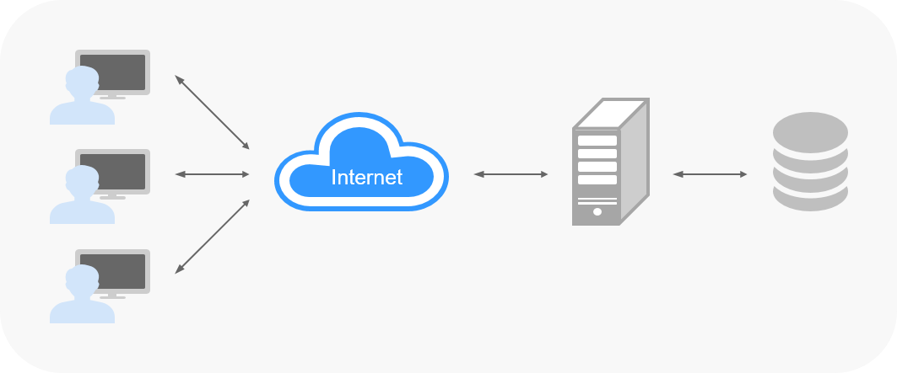

# 项目介绍

## 文档目的

本章节通过示例项目“超级冷笑话网站”介绍如何使用DevCloud开发基于C\#语言的Web应用。

## 示例项目简介

-   项目名称：超级冷笑话网站。
-   项目简介：“超级冷笑话网站”是一个Web网站，包含用户登录注册以及浏览笑话等功能的网站。

    

-   项目架构：网站属于典型的B/S架构系统，用户通过互联网访问系统，客户端处理用户操作及向数据库读取或写入数据。

    

-   构建环境：MSBuild。
-   部署环境：Windows（2016） + IIS + MySQL。
-   涉及华为云服务：
    -   本示例项目将使用到[软件开发平台DevCloud](https://www.huaweicloud.com/devcloud/)的以下服务：
        -   [项目管理ProjectMan](https://www.huaweicloud.com/product/projectman.html)
        -   [代码托管CodeHub](https://www.huaweicloud.com/product/codehub.html)
        -   [代码检查CodeCheck](https://www.huaweicloud.com/product/codecheck.html)
        -   [编译构建CloudBuild](https://www.huaweicloud.com/product/cloudbuild.html)
        -   [发布CloudRelease](https://www.huaweicloud.com/product/cloudrelease.html)
        -   [部署CloudDeploy](https://www.huaweicloud.com/product/clouddeploy.html)
        -   [流水线CloudPipeline](https://www.huaweicloud.com/product/cloudpipeline.html)

    -   本示例项目还将使用到华为云以下产品：
        -   [统一身份认证服务IAM](https://www.huaweicloud.com/product/iam.html)
        -   [弹性云服务器ECS](https://www.huaweicloud.com/product/ecs.html)

## 项目流程

DevCloud基本操作流程请参考[软件开发平台使用流程](zh-cn_topic_0110467970.md)。

本示例中的项目流程如下：

1.  [准备工作](zh-cn_topic_0268298498.md)
2.  [步骤一：管理项目规划](C-管理项目规划.md)
3.  [步骤二：管理项目代码](C-管理项目代码.md)
4.  [步骤三：静态代码扫描](zh-cn_topic_0261083598.md)
5.  [步骤四：构建并归档软件包](C-构建并归档软件包.md)
6.  [步骤五：部署软件包至云主机](C-部署软件包至云主机.md)
7.  [步骤六：流水线实现持续交付](zh-cn_topic_0261083599.md)
8.  [释放资源](zh-cn_topic_0268298521.md)

  

