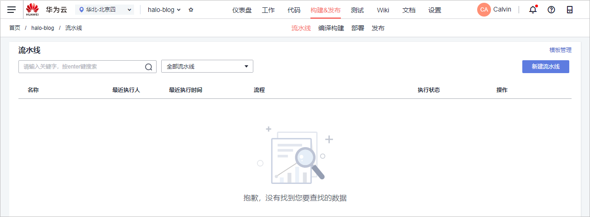

# 步骤六：流水线实现持续交付

[流水线](https://www.huaweicloud.com/product/cloudpipeline.html)提供可视化、可定制的自动交付流水线，支持代码检查、编译构建、部署等多种任务类型。

本节通过以下两步介绍如何使用流水线实现持续交付。

-   [第一步：新建流水线](#section350075783316)
-   [第二步：执行流水线](#section19117448123419)

## 第一步：新建流水线

在本节中，将前面三节中创建的代码检查、编译构建、部署任务串联起来，完成一条流水线的创建。

1.  单击页面上方导航栏“构建&发布  \>  流水线“。

    

2.  单击“新建流水线“，编辑流水线信息。

    1.  基本信息：输入流水线名称“halo-blog-pipeline“
    2.  选择代码源：依次选择代码源“CodeHub“、仓库“halo-blog“、默认分支“master“。
    3.  选择模板：选择“不使用模板，直接创建“。

    完成配置，单击“确定“，页面跳转至定义工作流页面。

3.  配置流水线工作流。
    1.  单击“构建“一栏中的“添加任务“。

        在页面右侧滑出的窗口中，类型选择“构建“，并选择在[步骤四：构建并归档软件包](Java-构建并归档软件包.md)中创建的编译构建任务，单击“保存“。

    2.  配置“代码检查“阶段。
        1.  单击构建栏前面的，添加一个阶段。

            

        2.  单击，在页面右侧滑出的窗口中输入名称“代码检查“，单击“保存“。
        3.  单击“添加任务“，在页面右侧滑出的窗口中，类型选择“代码检查“，并选择在创建代码仓库时自动创建的代码检查任务。

    3.  按照相同的方式，在构建阶段之后添加阶段“部署“，并添加在[步骤五：部署软件包至云主机](Java-部署软件包至云主机.md)中创建的部署任务。

4.  单击“保存“，完成流水线创建。页面自动跳转至“流水线详情“页面。

## 第二步：执行流水线

执行流水线时，可以选择执行所有流水线阶段/任务，也可以勾选某一/几个阶段，或者某个阶段中的一/几个任务来执行。本示例中将执行流水线全部阶段和任务。

在“流水线详情“页面，单击“全新执行“，启动流水线任务（若有弹框，保持默认配置，单击“执行“即可）。

任务执行耗时约5\~6分钟，当页面提示“成功“时，表示流水线执行完毕，即实现了持续集成流水线。

若执行失败，单击失败的任务名称，进入任务详情页面查看失败原因。

至此，您已经完成实现了项目的持续交付。

  

