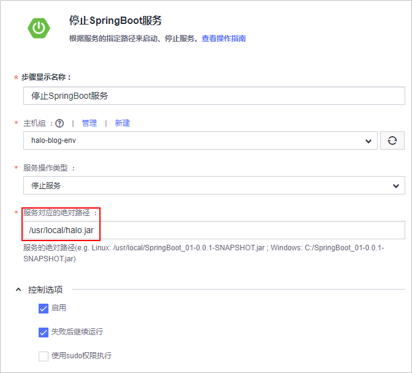
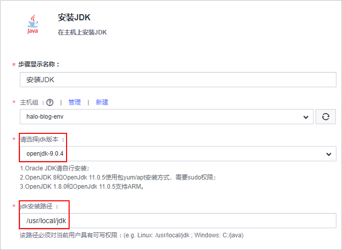
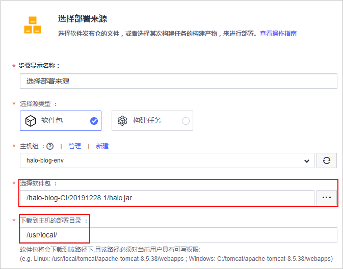
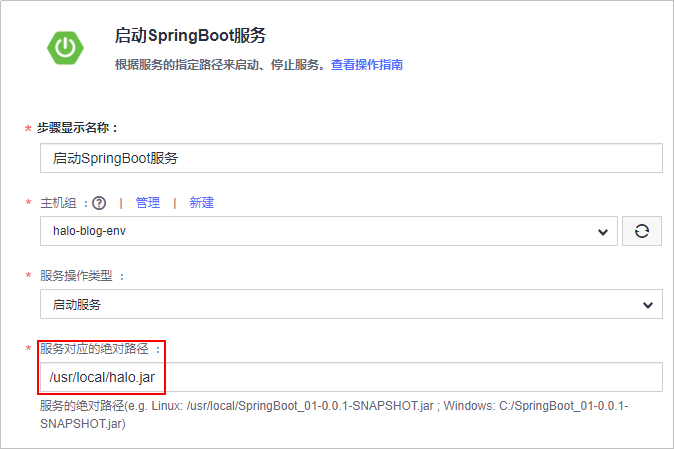
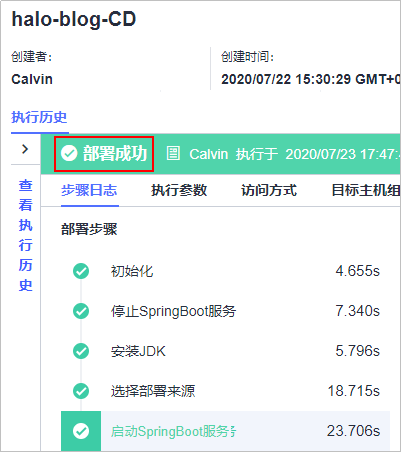

# 步骤五：部署软件包至云主机

[部署](https://www.huaweicloud.com/product/clouddeploy.html)提供可视化、一键式部署服务，支持并行部署和流水线无缝集成，实现部署环境标准化和部署过程自动化。

本节通过以下四步介绍如何使用部署服务将归档在软件发布库的软件包部署到云主机上。

-   [第一步：准备弹性云服务器](#section3237129465)
-   [第二步：添加授信主机](#section7570181910567)
-   [第三步：新建部署任务](#section103013420131)
-   [第四步：执行部署任务](#section1526814423242)
-   [第五步：验证部署结果](#section101585384)

## 第一步：准备弹性云服务器

“Halo个人独立博客系统”是一个Web项目，需要部署到服务器上才可以运行。

本示例采用部署服务器是[华为云弹性云服务器](https://support.huaweicloud.com/ecs/index.html)，所需配置如下，购买方式请参考[购买并登录Linux弹性云服务器](https://support.huaweicloud.com/basics-ecs/ecs_01_0103.html)。您也可以使用自己的Linux主机。

-   计费模式：若只参考本示例进行DevCloud体验，建议选择**按需计费**方式，在体验之后将弹性云服务器删除，避免产生不必要的费用。
-   操作系统：CentOS 7.2。
-   规格：2vCPUs、内存4GB。
-   已绑定弹性公网IP。

购买弹性云服务器成功后，通过[弹性云服务器控制台](https://console.huaweicloud.com/ecm/?region&locale=zh-cn#/ecs/manager/vmList)查看安全组中是否有一条Any协议的入方向规则。若没有，则添加一条，安全组配置方式参考[配置安全组规则](https://support.huaweicloud.com/usermanual-ecs/zh-cn_topic_0030878383.html)。

## 第二步：添加授信主机

部署应用到弹性云服务器之前，需要先对其授信，保证部署服务能够访问弹性云服务器。

1.  单击页面上方导航栏“设置  \>  通用设置“，在页面左侧导航中选择“主机组管理“。

    

2.  单击“新建主机组“，输入主机组名称“halo-blog-env“、选择操作系统（Linux），单击“保存“，完成主机组的创建。
3.  单击“添加主机“，输入主机名、云主机IP、用户名、密码、ssh端口，单击“添加“完成主机的添加。
    -   主机名、云主机IP、用户名、密码可通过[弹性云服务器控制台](https://console.huaweicloud.com/ecm/?region&locale=zh-cn#/ecs/manager/vmList)获取，查看方式请参考[查看云服务器详细信息](https://support.huaweicloud.com/usermanual-ecs/ecs_03_0123.html)。
    -   ssh端口输入默认端口22即可。

4.  等待验证，当显示“验证成功“时，说明主机成功添加。

    

    若验证失败，单击“验证消息“列中的“详情“，在弹框总可查看失败原因与操作指导。

    

## 第三步：新建部署任务

DevCloud中内置了多种部署模板，本示例采用SpringBoot框架，选择系统模板“SpringBoot应用部署“。

1.  单击页面上方导航栏“构建&发布  \>  部署“。
2.  单击“新建任务“，配置部署任务信息。

    1.  基本信息：输入任务名称“halo-blog-CD“。
    2.  选择构建模板：选择DevCloud内置的部署模板“SpringBoot应用部署“。

    完成配置，单击“确定“，页面自动跳转至部署步骤页面。

3.  配置部署步骤：

    SpringBoot应用部署模板默认包含5个步骤：停止SpringBoot服务、安装JDK、选择部署来源、启动SpringBoot服务、URL健康测试。（其中，步骤“URL健康测试“可选，根据需要配置即可，本示例暂不介绍，详细介绍请参考[URL健康测试](https://support.huaweicloud.com/usermanual-deployman/deployman_hlp_1042.html)）。

    1.  停止SpringBoot服务：

        -   选择在步骤[第二步：添加授信主机](#section7570181910567)中创建的主机组“halo-blog-env“，页面将弹框提示“是否将后续步骤的主机组也修改为halo-blog-env？”，选择“确定“。
        -   设置服务对应的绝对路径，路径通常为“/usr/local/\*.jar“，本示例中配置的绝对路径为“/usr/local/halo.jar“。
        -   第一次执行部署任务时，可能会由于主机中没有服务而导致执行失败，因此需要勾选“失败后继续运行“。

        

    2.  安装JDK：选择jdk版本，并设置jdk安装路径，本示例中配置的jdk版本为“openjdk-9.0.4“、安装路径为“/usr/local/jdk“。

        

    3.  选择部署来源：

        -   单击选择软件包文本框后的，在弹窗中根据[第三步：检查发布件](Java-构建并归档软件包.md#section6984915123311)中的路径逐层单击目录直至jar包。
        -   配置下载到主机的部署目录，本示例中配置的部署目录为“/usr/local/“。

        

    4.  启动SpringBoot服务：服务操作类型保持默认值，并配置服务对应的绝对路径（与[停止SpringBoot服务](#li1214314176130)中的路径相同）。

        

4.  选择“参数设置“页签。

    系统模板“SpringBoot应用部署“中内置了多个参数，由于在本示例部署任务各步骤中已设置好了参数值，因此删除此页签中的各参数。

5.  单击“保存“，完成部署任务的创建。单击“退出“返回部署任务列表。

## 第四步：执行部署任务

单击部署任务名称进入“部署详情“页面，单击“执行“，启动部署任务。

任务执行耗时约1\~2分钟，当页面显示“部署成功“，表示任务执行完毕。

若任务执行失败，可通过页面中的原因提示及链接来排查解决。

> **说明：** 
>第一次执行部署任务时，可能会由于弹性云服务器中没有正在运行的SpringBoot服务而导致步骤“停止SpringBoot服务“执行失败，最终部署任务执行失败。
>但如果其它步骤均执行成功，则可以忽略此结果，继续验证部署结果。

## 第五步：验证部署结果

打开浏览器，访问  “http://ip:端口“查看应用，其中ip为弹性云服务器的IP，本示例中的端口号为8090。

若出现如下界面，则表示部署成功。

至此，您已经完成了软件包的部署及运行操作。

  

