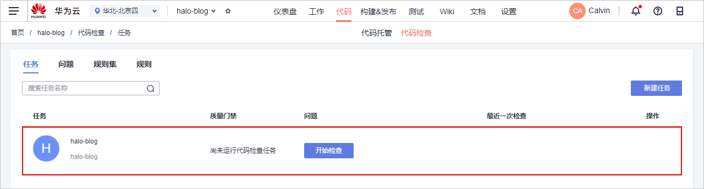

# 步骤三：静态代码扫描

[代码检查](https://www.huaweicloud.com/product/codecheck.html)是为开发者提供基于云端实现代码质量管理的服务，支持代码静态检查（包括代码质量、代码风格等）和安全检查，并提供缺陷的改进建议和趋势分析。

1.  单击页面上方导航栏“代码  \>  代码检查“。
2.  由于在[步骤二：管理项目代码](Java-管理项目代码.md)中创建代码仓库时勾选了“自动创建代码检查任务“，因此在页面中将显示在与代码仓库同名的代码检查任务。

    

3.  进入“任务详情  \>  概览“页面，单击“开始检查“，等待任务执行（约2\~3分钟），当出现如下页面时，表示任务执行成功。

    若任务执行失败，页面右上角将弹出报错提示，请参考[代码检查-常见报错解决方法](https://support.huaweicloud.com/codecheck_faq/codecheck_02_0002.html)进行排查解决。

    

4.  单击页签“代码问题“，查看问题列表。
5.  单击“修改建议“，根据建议修改代码问题。如无需修改，可以直接忽略该问题。

    

至此，您已经完成了对代码的静态扫描纠错。

  

