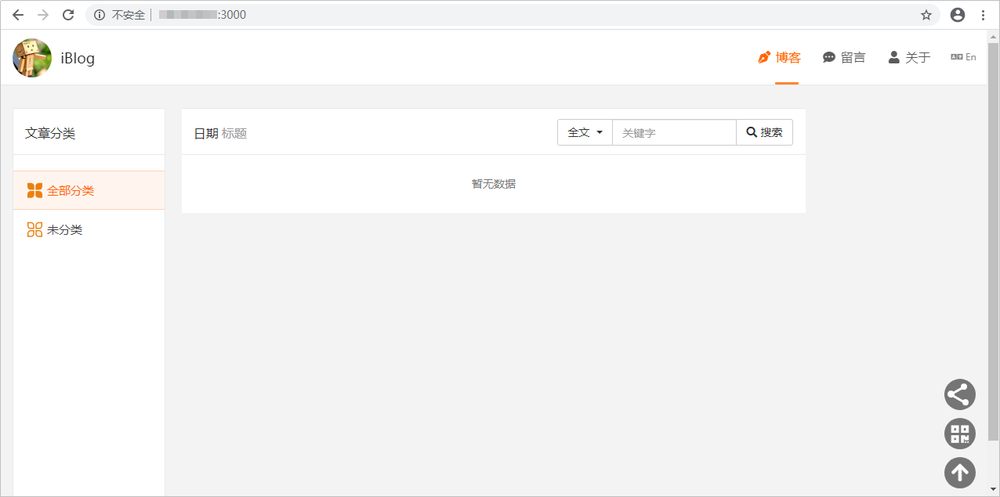

# 步骤三：部署代码至云主机<a name="devcloud_qs_0405"></a>

[部署](https://www.huaweicloud.com/product/clouddeploy.html)提供可视化、一键式部署服务，支持并行部署和流水线无缝集成，实现部署环境标准化和部署过程自动化。

本节通过以下五步介绍如何使用部署服务将项目代码部署到云主机上。

-   [第一步：准备弹性云服务器](#section1211184861711)
-   [第二步：添加授信主机](#section193914012184)
-   [第三步：新建部署任务](#section2431151171810)
-   [第四步：执行部署任务](#section5584142218182)
-   [第五步：验证部署结果](#section1349716258494)

## 第一步：准备弹性云服务器<a name="section1211184861711"></a>

本示例中的项目无需进行编译构建打包，只需将代码仓库中iBlog代码仓拉取到部署主机即可。

本示例采用部署服务器是[华为云弹性云服务器](https://support.huaweicloud.com/ecs/index.html)，所需配置如下，购买方式请参考[购买并登录Linux弹性云服务器](https://support.huaweicloud.com/basics-ecs/ecs_01_0103.html)。您也可以使用自己的Linux主机。

-   计费模式：若只参考本示例进行DevCloud体验，建议选择**按需计费**方式，在体验之后将弹性云服务器删除，避免产生不必要的费用。
-   操作系统：CentOS 7.4。
-   规格：2vCPUs、内存4GB。
-   已绑定弹性公网IP。

购买弹性云服务器成功后，通过[弹性云服务器控制台](https://console.huaweicloud.com/ecm/?region&locale=zh-cn#/ecs/manager/vmList)查看安全组中是否有一条Any协议的入方向规则。若没有，则添加一条，安全组配置方式参考[配置安全组规则](https://support.huaweicloud.com/usermanual-ecs/zh-cn_topic_0030878383.html)。


在拉取代码之前，需要在Linux主机环境下通过**npm install**安装Node.js所需的依赖包后开启服务，操作步骤如下：

1.  [登录弹性云服务器](https://support.huaweicloud.com/qs-ecs/zh-cn_topic_0092494193.html#section1)。
2.  <a name="li7330131084611"></a>输入以下命令安装Git并生成密钥。
    1.  安装git：

        ```
        yum -y install git
        ```

    2.  生成SSH密钥：

        ```
        ssh-keygen -t rsa -C "您的邮箱"
        ```

    3.  显示SSH密钥

        ```
        cat ~/.ssh/id_rsa.pub
        ```

    4.  修改配置文件

        ```
        vim /etc/ssh/ssh_config
        ```

        敲击Insert，在下图所示的位置输入**StrictHostKeyChecking no**。

        

        敲击ECS键并输入**：wq**退出编辑。

3.  在DevCloud中添加SSH密钥。
    1.  返回DevCloud页面，单击页面右上角用户名，在下拉列表中选择“个人设置“。
    2.  单击左侧菜单“代码托管  \>  SSH密钥管理“，单击页面右侧“添加SSH密钥“。
    3.  复制[上一步](#li7330131084611)中生成的SSH密钥，粘贴在“密钥“文本框中，输入标题并勾选文本框后的声明，单击“确定“完成。

        

4.  在部署主机安装上mongodb。
    1.  下载安装。
        -   下载：

            ```
            wget https://fastdl.mongodb.org/linux/mongodb-linux-x86_64-4.0.9.tgz
            ```

        -   解压：

            ```
            tar -zxvf mongodb-linux-x86_64-4.0.9.tgz
            ```

        -   改名并放到目录“/usr/local“：

            ```
            mv mongodb-linux-x86_64-4.0.9 /usr/local/mongodb
            ```

        -   进入mongodb目录：

            ```
            cd /usr/local/mongodb
            ```

        -   新建文件夹（用于存放数据库日志配置文件）：

            ```
            mkdir data log etc
            ```

        -   做软链接：

            ```
            ln -s /usr/local/mongodb/bin/mongo /usr/bin/mongo
            ```

    2.  配置文件。
        -   进入配置目录：

            ```
            cd /usr/local/mongodb/etc
            ```

        -   修改配置文件：

            ```
            vim mongodb.conf
            ```

            敲击Insert，输入以下内容：

            -   db存放的目录：

                ```
                dbpath=/usr/local/mongodb/data
                ```

            -   后台启动需要配置日志输出：

                ```
                logpath=/usr/local/mongodb/log/mongodb.log
                ```

            -   端口：

                ```
                port=27017
                bind_ip = 127.0.0.1
                ```

            -   设置成后台启动：

                ```
                fork=true
                journal=false
                ```

            敲击ECS键并输入**：wq**退出编辑。

    3.  启动服务。
        -   进入服务目录：

            ```
            cd /usr/local/mongodb/bin
            ```

        -   启动服务：

            ```
            ./mongod --config /usr/local/mongodb/etc/mongodb.conf
            ```


## 第二步：添加授信主机<a name="section193914012184"></a>

部署应用到弹性云服务器之前，需要先对其授信，保证部署服务能够访问弹性云服务器。

1.  单击页面上方导航栏“设置  \>  通用设置“，在页面左侧导航中选择“主机组管理“。

    

2.  单击页面“新建主机组“，输入主机组名称“iBlog-env“、选择操作系统（Linux），单击“保存“，完成主机组的创建。
3.  单击“添加主机“，输入主机名、云主机IP、用户名、密码、ssh端口，单击“添加“完成主机的添加。
    -   主机名、云主机IP、用户名、密码可通过[弹性云服务器控制台](https://console.huaweicloud.com/ecm/?region&locale=zh-cn#/ecs/manager/vmList)获取，查看方式请参考[查看云服务器详细信息](https://support.huaweicloud.com/usermanual-ecs/ecs_03_0123.html)。
    -   ssh端口输入默认端口22即可。

4.  等待验证，当显示“验证成功“时，说明主机成功添加。

    

    若验证失败，单击“验证消息“列中的“详情“，在弹框总可查看失败原因与操作指导。

    


## 第三步：新建部署任务<a name="section2431151171810"></a>

由于DevCloud中内置的部署模板与本项目不匹配，因此本示例在创建部署任务时将不选择系统模板，而是根据需要选择DevCloud内置的部署步骤。

1.  单击页面上方导航栏“构建&发布  \>  部署“。
2.  单击“新建任务“，配置部署任务信息。

    1.  基本信息：输入任务名称“iBlog-CD“。
    2.  选择构建模板：选择“空白模板“。

    完成配置，单击“确定“，页面自动跳转至部署步骤页面。

3.  添加并配置部署步骤：
    1.  执行shell命令（停止服务）：

        -   为了便于理解，将任务名从“执行shell命令“改成“停止服务“。
        -   选择在步骤[第二步：添加授信主机](#section193914012184)中创建的主机组“iBlog-env“，系统将弹框提示“是否将后续步骤的主机组也修改为iBlog-env？”，选择“确定“。
        -   输入以下shell命令：

            ```
            kill -9 $(netstat -tlnp | grep :3000 | awk '{print $7}' | awk -F '/' '{print $1}')
            ```

        -   本步骤的作用是：如果有Node.js进程存在，则停止。第一次执行任务时，可能会由于主机中没有服务而导致执行失败，因此需要勾选“失败后继续运行“。

        

    2.  安装Node.js：选择node.js版本，并输入安装路径，本示例中配置的jnode.js版本为“Node-10.9.0“、安装路径为“/usr/local/etc“。

        

    3.  执行shell命令（拉取代码）：
        -   为了便于理解，将任务名从“执行shell命令“改成“拉取代码“。
        -   输入以下shell命令，其中代码仓库地址为[步骤二：管理项目代码](Node-js-管理项目代码.md)中创建的代码仓库的SSH地址（进入代码仓库详情页，单击“克隆/下载“，在弹框中即可找到SSH地址）。

            ```
            cd /usr/local
            if [ ! -d "devcloud" ];then
            mkdir devcloud
            echo "新建devcloud文件夹"
            else
            echo "devcloud文件夹已存在"
            fi
            cd /usr/local/devcloud
            if [ ! -d "iBlog" ];then
            git clone 代码仓库地址
            echo "首次拉取iBlog"
            else
            cd iBlog
            git pull
            echo "iBlog文件夹已存在"
            fi
            ```

            

    4.  执行shell命令（拉取依赖）：
        -   为了便于理解，将任务名从“执行shell命令“改成“拉取依赖“。
        -   输入以下shell命令：

            ```
            cd /usr/local/devcloud/iBlog
            npm install
            ```

            

            > **说明：** 
            >如果下载依赖较慢，可以设置华为镜像仓加速构建，设置命令如下：
            >```
            >npm config set registry https://mirrors.huaweicloud.com/repository/npm/
            >```


    5.  执行shell命令（启动服务）：
        -   为了便于理解，将任务名从“执行shell命令“改成“启动服务“。
        -   输入以下shell命令：

            ```
            cd /usr/local/devcloud/iBlog
            nohup npm start &
            ```

            


4.  单击“保存“，完成部署任务的创建。单击“退出“返回部署任务列表。

## 第四步：执行部署任务<a name="section5584142218182"></a>

单击部署任务名称进入“部署详情“页面，单击“执行“，启动部署任务。

任务执行耗时约1分钟（首次执行的时候，可能耗时会更长），当页面显示“部署成功“，表示任务执行完毕。

若任务执行失败，可通过页面中的原因提示及链接来排查解决。


> **说明：** 
>第一次执行部署任务时，可能会由于弹性云服务器中没有正在运行的Node.js进程而导致步骤“停止服务“执行失败，最终部署任务执行失败。
>但如果其它步骤均执行成功，则可以忽略此结果，继续验证部署结果。

## 第五步：验证部署结果<a name="section1349716258494"></a>

打开浏览器，访问  “http://ip:端口“查看应用，其中ip为弹性云服务器的IP，本示例中的端口号为3000。

若出现如下界面，则表示部署成功。



至此，您已经完成了软件包的部署及运行操作。

  

