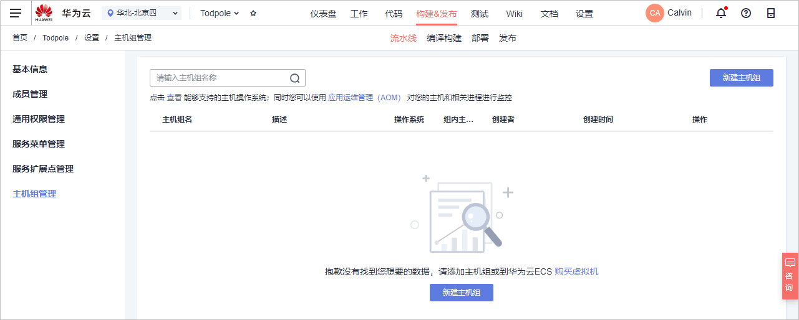

# 步骤五：部署软件包至云主机<a name="devcloud_qs_0307"></a>

[部署](https://www.huaweicloud.com/product/clouddeploy.html)提供可视化、一键式部署服务，支持并行部署和流水线无缝集成，实现部署环境标准化和部署过程自动化。

本节通过以下五步介绍如何使用部署服务将归档在软件发布库的软件包部署到云主机上。

-   [第一步：准备弹性云服务器](#section1020851762916)
-   [第二步：添加授信主机](#section4217102711294)
-   [第三步：新建部署任务](#section581744332917)
-   [第四步：执行部署任务](#section38651753132912)
-   [第五步：验证部署结果](#section5724111314468)

## 第一步：准备弹性云服务器<a name="section1020851762916"></a>

本示例中用的应用程序运行需要部署到服务器上才可以运行。

本示例采用部署服务器是[华为云弹性云服务器](https://support.huaweicloud.com/ecs/index.html)，所需配置如下，购买方式请参考[购买并登录Linux弹性云服务器](https://support.huaweicloud.com/basics-ecs/ecs_01_0103.html)。您也可以使用自己的Linux主机。

-   计费模式：若只参考本示例进行DevCloud体验，建议选择**按需计费**方式，在体验之后将弹性云服务器删除，避免产生不必要的费用。
-   操作系统：Ubuntu 16.04。
-   规格：2vCPUs、内存4GB。
-   已绑定弹性公网IP。

购买弹性云服务器成功后，通过[弹性云服务器控制台](https://console.huaweicloud.com/ecm/?region&locale=zh-cn#/ecs/manager/vmList)查看安全组中是否有一条Any协议的入方向规则。若没有，则添加一条，安全组配置方式参考[配置安全组规则](https://support.huaweicloud.com/usermanual-ecs/zh-cn_topic_0030878383.html)。


应用程序的运行需要特定的环境，因此需要在部署之前先[登录弹性云服务器](https://support.huaweicloud.com/qs-ecs/zh-cn_topic_0092494193.html#section1)进行环境搭建。

搭建环境的脚本内容如下：

-   安装php-cli：

    ```
    sudo apt-get update
    sudo apt-get install php-cli
    ```


-   安装composer：

    ```
    sudo apt-get install wget
    wget https://getcomposer.org/composer.phar
    chmod 755 composer.phar
    mv composer.phar /usr/local/bin/composer
    ```


## 第二步：添加授信主机<a name="section4217102711294"></a>

部署应用到弹性云服务器之前，需要先对其授信，保证部署服务能够访问弹性云服务器。

1.  单击页面上方导航栏“设置  \>  通用设置“，在页面左侧导航中选择“主机组管理“。

    

2.  单击左侧菜单“主机组管理“，进入“主机组管理“页面。
3.  单击“新建主机组“，输入主机组名称“workerman-todpole-env“、选择操作系统（Linux），单击“保存“，完成主机组的创建。
4.  单击“添加主机“，输入主机名、云主机IP、用户名、密码、ssh端口，单击“添加“完成主机的添加。
    -   主机名、云主机IP、用户名、密码可通过[弹性云服务器控制台](https://console.huaweicloud.com/ecm/?region&locale=zh-cn#/ecs/manager/vmList)获取，查看方式请参考[查看云服务器详细信息](https://support.huaweicloud.com/usermanual-ecs/ecs_03_0123.html)。
    -   ssh端口输入默认端口22即可。

5.  等待验证，当显示“验证成功“时，说明主机成功添加。

    

    若验证失败，单击“验证消息“列中的“详情“，在弹框总可查看失败原因与操作指导。

    


## 第三步：新建部署任务<a name="section581744332917"></a>

由于DevCloud中内置的部署模板与本项目不匹配，因此本示例在创建部署任务时将不选择系统模板，而是根据需要选择DevCloud内置的部署步骤。

1.  单击页面上方导航栏“构建&发布  \>  部署“。
2.  单击“新建任务“，页面自动跳转至部署步骤页面。

    1.  基本信息：输入任务名称“workerman-todpole-CD“。
    2.  选择构建模板：选择“空白模板“。

    完成配置，单击“确定“，页面自动跳转至部署步骤页面。

3.  添加并配置部署步骤：
    1.  选择部署来源：

        -   选择在步骤[第二步：添加授信主机](#section4217102711294)中创建的主机组“workerman-todpole-env“，系统将弹框提示“是否将后续步骤的主机组也修改为workerman-todpole-env？”，选择“确定“。
        -   源类型选择“构建任务“，构建任务选择在中创建的编译构建任务，选择构建序号（Latest），编辑下载到主机的部署目录（本示例中的配置为“/usr/local/devcloud“）。

        

    2.  执行shell命令：输入以下脚本，用以启动php服务。

        ```
        #!/bin/bash
        cd /usr/local/devcloud/
        tar -zxvf workerman_todpole.tar.gz
        composer config -g repo.packagist composer https://packagist.phpcomposer.com
        composer self-update --stable
        composer install
        sleep 20
        nohup php start.php start -d &
        ```

        

4.  单击“保存“，完成部署任务的创建。单击“退出“返回部署任务列表。

## 第四步：执行部署任务<a name="section38651753132912"></a>

单击部署任务名称进入“部署详情“页面，单击“执行“，执行部署任务。

任务执行耗时约1\~2分钟，当页面显示“部署成功“，表示任务执行完毕。

若任务执行失败，可通过页面中的原因提示及链接来排查解决。


## 第五步：验证部署结果<a name="section5724111314468"></a>

打开浏览器，访问  “http://ip:端口“查看应用，其中ip为弹性云服务器的IP，本示例中的端口号为8383。

若出现如下界面，则表示部署成功。


至此，您已经完成了软件包的部署及运行操作。

  

