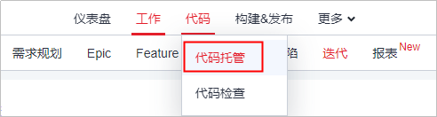
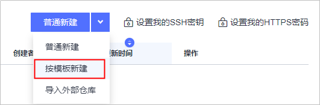
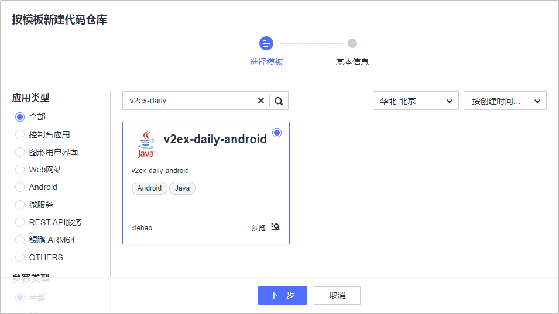
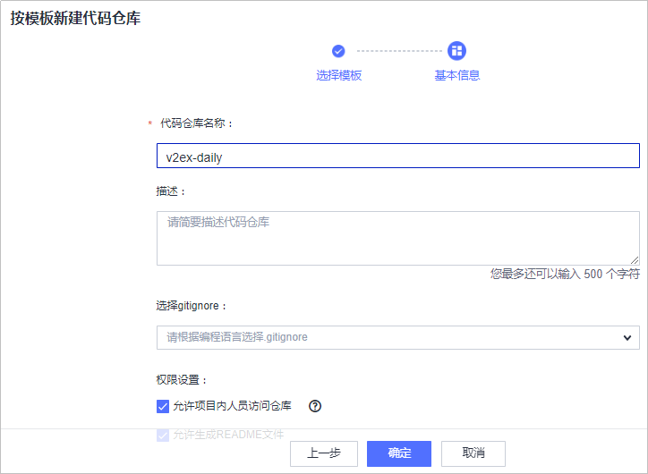
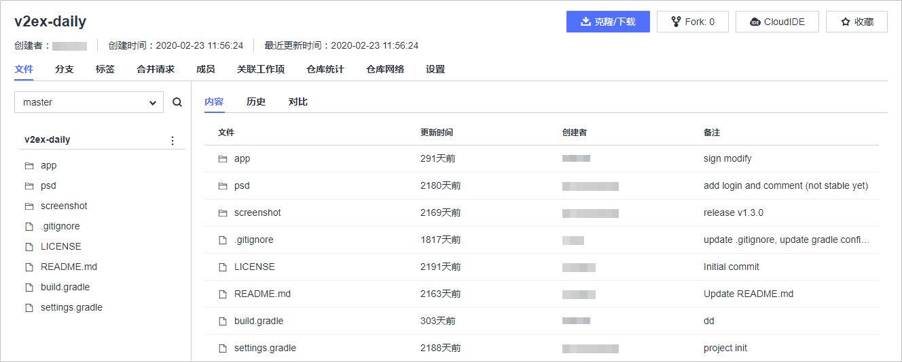

# **创建代码仓库、管理项目代码**

**代码托管**为开发者提供基于Git的在线代码托管服务，包括代码克隆/提交、分支管理等功能。

代码托管支持三种新建代码仓库方式：普通新建、按模板新建、导入外部仓库。本例中所使用的代码已公开为示例模板，因此采用“按模板新建“方式。

新建代码仓库步骤如下：

1.  选择导航栏“代码  \>  代码托管“，进入“代码托管“页面。

    

      

2.  单击页面右上角“普通新建“旁边的“∨“，选择“按模板新建“。

    

      

3.  在搜索框中输入“v2ex-daily“，并在右侧第一个下拉列表中选择“华北-北京一“，即可查找到已经被公开为示例模板的系统代码，选择该模板，单击“下一步“。

    

      

4.  输入代码仓库名称（可以和模板仓库同名），单击“确定“，完成仓库创建。

    

      

5.  单击仓库名称进入仓库，可查看仓库文件。

    

      

至此，您已经完成代码仓库的创建操作。

  

