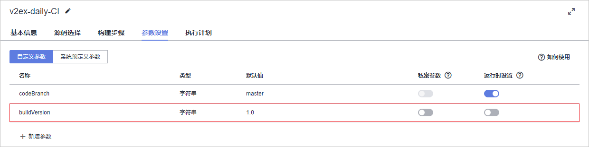
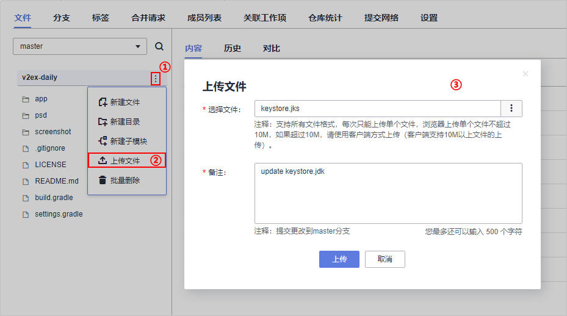
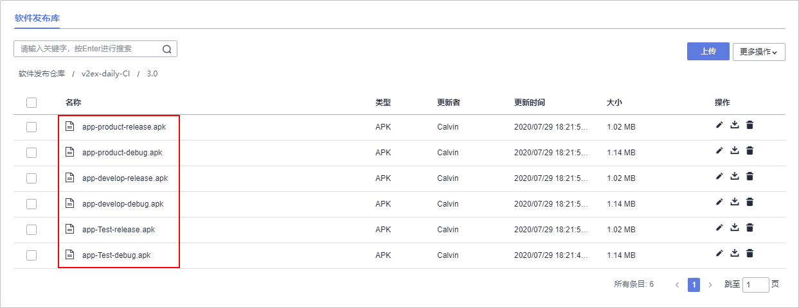

# **构建并归档软件包**<a name="devcloud_qs_0704"></a>

**编译构建**为开发者提供配置简单的混合语言构建平台，支持。任务一键创建、配置和执行，实现获取代码、构建、打包等活动自动化。**发布**提供软件仓库、软件发布、发布包下载、发布包元数据管理等功能，实现软件包版本管理。

本节通过以下三步介绍如何使用编译构建服务将代码编译打包成软件包，并将软件包归档到软件发布库中。

1.  [创建&执行编译构建任务](#section167331924151713)
2.  [多环境构建](#section1970622012342)
3.  [签名包构建](#section154263315347)

## **创建&执行编译构建任务**<a name="section167331924151713"></a>

1.  单击页面上方导航栏“构建&发布  \>  编译构建“，进入“编译构建“页面。

    

      

2.  单击“新建任务“，进入“新建编译构建任务“页面。
3.  输入任务名称，单击“下一步“。

    

      

4.  源码源选择“DevCloud“，源码仓库选择在[创建代码仓库、管理项目代码](基于Android的App开发-创建代码仓库-管理项目代码.md)中创建的代码仓库，分支选择“master“，单击“下一步“。

    

      

5.  选择推荐模板“Android APK“，  单击“确定“，进入构建步骤配置页面。

    

      

6.  选择步骤“Android构建“，配置编译用Android构建系统版本。

    

      

    Gradle版本根据代码仓库中的配置文件**build.gradle**进行选择。

    

      

    其中，Gradle版本跟gradle plugin的对应关系如下：

    <a name="table48644273473"></a>
    <table><thead align="left"><tr id="row1686412715475"><th class="cellrowborder" valign="top" width="50%" id="mcps1.1.3.1.1"><p id="p1864027134713"><a name="p1864027134713"></a><a name="p1864027134713"></a>Plugin version</p>
    </th>
    <th class="cellrowborder" valign="top" width="50%" id="mcps1.1.3.1.2"><p id="p1986418278472"><a name="p1986418278472"></a><a name="p1986418278472"></a>Required Gradle version</p>
    </th>
    </tr>
    </thead>
    <tbody><tr id="row12864152713476"><td class="cellrowborder" valign="top" width="50%" headers="mcps1.1.3.1.1 "><p id="p1286422744710"><a name="p1286422744710"></a><a name="p1286422744710"></a>1.0.0 - 1.1.3</p>
    </td>
    <td class="cellrowborder" valign="top" width="50%" headers="mcps1.1.3.1.2 "><p id="p19864162719476"><a name="p19864162719476"></a><a name="p19864162719476"></a>2.2.1 - 2.3</p>
    </td>
    </tr>
    <tr id="row58641527184719"><td class="cellrowborder" valign="top" width="50%" headers="mcps1.1.3.1.1 "><p id="p586410274476"><a name="p586410274476"></a><a name="p586410274476"></a>1.2.0 - 1.3.1</p>
    </td>
    <td class="cellrowborder" valign="top" width="50%" headers="mcps1.1.3.1.2 "><p id="p148641227104717"><a name="p148641227104717"></a><a name="p148641227104717"></a>2.2.1 - 2.9</p>
    </td>
    </tr>
    <tr id="row986417279474"><td class="cellrowborder" valign="top" width="50%" headers="mcps1.1.3.1.1 "><p id="p586422710475"><a name="p586422710475"></a><a name="p586422710475"></a>1.5.0</p>
    </td>
    <td class="cellrowborder" valign="top" width="50%" headers="mcps1.1.3.1.2 "><p id="p108646271472"><a name="p108646271472"></a><a name="p108646271472"></a>2.2.1 - 2.13</p>
    </td>
    </tr>
    <tr id="row15864227164712"><td class="cellrowborder" valign="top" width="50%" headers="mcps1.1.3.1.1 "><p id="p586420271478"><a name="p586420271478"></a><a name="p586420271478"></a>2.0.0 - 2.1.2</p>
    </td>
    <td class="cellrowborder" valign="top" width="50%" headers="mcps1.1.3.1.2 "><p id="p11864172744715"><a name="p11864172744715"></a><a name="p11864172744715"></a>2.10 - 2.13</p>
    </td>
    </tr>
    <tr id="row686410279477"><td class="cellrowborder" valign="top" width="50%" headers="mcps1.1.3.1.1 "><p id="p17864182784714"><a name="p17864182784714"></a><a name="p17864182784714"></a>2.1.3 - 2.2.3</p>
    </td>
    <td class="cellrowborder" valign="top" width="50%" headers="mcps1.1.3.1.2 "><p id="p10864162764710"><a name="p10864162764710"></a><a name="p10864162764710"></a>2.14.1+</p>
    </td>
    </tr>
    <tr id="row13864162712471"><td class="cellrowborder" valign="top" width="50%" headers="mcps1.1.3.1.1 "><p id="p18641227164714"><a name="p18641227164714"></a><a name="p18641227164714"></a>2.3.0+</p>
    </td>
    <td class="cellrowborder" valign="top" width="50%" headers="mcps1.1.3.1.2 "><p id="p786492744715"><a name="p786492744715"></a><a name="p786492744715"></a>3.3+</p>
    </td>
    </tr>
    <tr id="row2086422724714"><td class="cellrowborder" valign="top" width="50%" headers="mcps1.1.3.1.1 "><p id="p1386512273476"><a name="p1386512273476"></a><a name="p1386512273476"></a>3.0.0+</p>
    </td>
    <td class="cellrowborder" valign="top" width="50%" headers="mcps1.1.3.1.2 "><p id="p686512715473"><a name="p686512715473"></a><a name="p686512715473"></a>4.1+</p>
    </td>
    </tr>
    </tbody>
    </table>

7.  单击“参数设置“页签，添加参数“buildVersion“，用于版本管理。

    

      

8.  返回“构建步骤“页签，选择步骤“上传软件包到软件发布库“，输入发布版本号“$\{buildVersion\}“。

    

      

9.  <a name="li1261147164120"></a>单击“执行“，在弹框中输入版本号，启动构建任务，当出现如下页面时，表示任务执行成功完成。

    若执行失败，请查看日志信息排查问题，或通过[编译构建-常见问题](https://support.huaweicloud.com/codeci_faq/index.html)查找解决方法。

    

      

10. 单击页面上方导航栏“发布“，进入“软件发布库“页面。

    

      

11. 单击文件夹“halo-blog-CI“，根据[步骤9](#li1261147164120)中输入的版本号，单击同名文件夹进入，即可看到生成的软件包“app-debug.apk“。

    

      


## **多环境构建**<a name="section1970622012342"></a>

在平时的Android开发中，我们经常会遇到在不同网络环境（比如：开发环境、测试环境）之间的切换等需求，如何优雅的管理网络环境的配置？

如果每一次在不同网络环境间切换，都需要更改代码，然而重新打包，那未免有点低效。

下面我们提供一种常用的多环境打包的方法，供大家参考。

1.  在代码仓库中找到文件夹“app“，在其中的**build.gradle**文件中的Android代码段中添加以下代码。

    ```
    //多版本
    buildTypes {
        debug {
    		//是否输出日志
    		buildConfigField 'boolean', 'IS_DEBUG', 'true'
    		}
        release {
    		buildConfigField  'boolean', 'IS_DEBUG', 'false'
        }
    }
    //多环境
    productFlavors {
    	//开发环境
    	develop {
    		applicationId 'com.yugy.v2ex.daily.dev'
    		buildConfigField "String", "APPURL", "\"http://v2exdaily/develop/api/\""
        }
        //测试环境
        Test {
    		applicationId 'com.yugy.v2ex.daily.test'
    		buildConfigField "String", "APPURL", "\"http://v2exdaily/test/api/\""
        }
        //生产环境
        product {
    		applicationId 'com.yugy.v2ex.daily.product'
    		buildConfigField "String", "APPURL", "\"http://v2exdaily/product/api/\""
        }
    }
    ```

    

      

2.  执行构建任务，成功执行后，在软件发布库可看到如下APK。

    

      


## **签名包构建**<a name="section154263315347"></a>

多版本、多环境构建包已经可以生成了，但是我们的调试包并没有签名。那如何打签名包呢？

1.  准备好自己的**.jks**签名文件，将签名文件放入代码仓库中。

    

      

2.  在文件“app/build.gradle“的Android代码段中添加以下代码。

    其中，“keyPassword“与“storePassword“来源于签名文件。

    ```
    //签名文件
    signingConfigs {
        release {
    	keyAlias 'key0'
            keyPassword 'xxxxxx'
            storeFile file('../keystore.jks')
            storePassword 'xxxxxx'
    	}
    }
    ```

    并在下图所示位置添加以下代码：

    ```
    //是否签名
    signingConfig signingConfigs.release
    ```

    

      

3.  执行构建任务，成功执行后，在软件发布库可看到所有release包均已签名。

    

      


