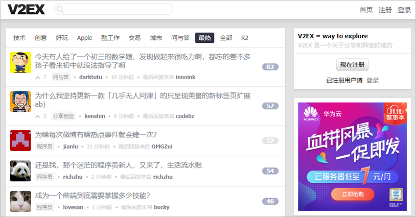

# **概述**

## **文档目的**

本文档主要想为研发Android项目的企业或个人提供上云指导，通过本文中的示例项目 “V2EX Daily”，为开发者提供包括项目管理，代码托管，编译构建的操作指导。

## **项目详情**

-   项目名称：V2EX Daily。
-   项目简介：V2EX，是一个汇集各类奇妙好玩的话题和流行动向的网站。本项目通过V2EX提供的API接口，实现在手机端实时获取V2EX提供的各种信息，让你不论身在何处，都可以徜徉在V2EX的话题的海洋中。V2EX Daily是作为android平台上的V2EX客户端，它支持视图主题、节点搜索、用户等功能。

    

      

-   项目周期：4周（敏捷迭代开发）。
-   构建环境：Android SDK 28+Build Tools 28.0.0+Gradle 4.5+Jdk 1.8。
-   华为云服务：软件开发平台 DevCloud。

## **前提条件**

使用DevCloud开展本例前，[华为云官网](https://www.huaweicloud.com/)注册华为云账号。若已有华为云账号，则可忽略。

## **项目过程**

DevCloud基本操作流程请参考[快速上手DevCloud](https://support.huaweicloud.com/qs-devcloud/devcloud_qs_1000.html)。

本例中将依次进行以下步骤：

1.  [创建项目、进行项目规划](基于Java的Web应用开发-创建项目-进行项目规划.md)
2.  [创建代码仓库、管理项目代码](基于Java的Web应用开发-创建代码仓库-管理项目代码.md)
3.  [构建并归档软件包](基于Java的Web应用开发-构建并归档软件包.md)
4.  [部署软件包至云主机](基于Java的Web应用开发-部署软件包至云主机.md)

  

