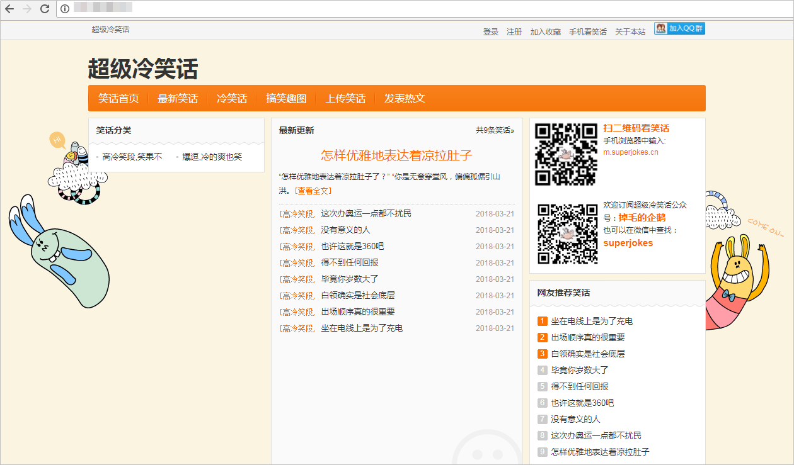

# **概述**

## **文档目的**

本文通过示例项目“超级冷笑话网站”介绍如何使用DevCloud开发基于C\#语言的Web应用，为研发C\#项目的企业或个人提供上云指导。

## **项目详情**

-   项目名称：超级冷笑话网站。
-   项目简介：“超级冷笑话网站”是一个Web网站，包含用户登录注册以及浏览笑话等功能的网站。

    

      

-   项目架构：网站属于典型的B/S架构系统，用户通过互联网访问系统，客户端处理用户操作及向数据库读取或写入数据。

    

      

-   构建环境：msbuild15-all。
-   部署环境：Windows + IIS + MySql。
-   部署方式：模板部署。

## **前提条件**

使用DevCloud开展本例前，需要先进行以下步骤。若已有华为云账号及弹性云服务器，则可忽略。

-   注册华为云账号：在[华为云官网](https://www.huaweicloud.com/)注册华为云账号，并进行实名认证，此账号适用于所有华为云产品。
-   购买弹性云服务器：部署将使用带有公网IP的华为云ECS（本文中使用的操作系统为Windows Sever 2012）。ECS的购买方式请参考[购买并登录Windows弹性云服务器](https://support.huaweicloud.com/qs-ecs/zh-cn_topic_0132727312.html)。

    > **说明：**   
    >-   本例中对弹性云服务器的配置没有特殊要求，购买时选择最基本配置即可。  
    >-   弹性云服务器的购买方式有“包周期“与“按需“，若只参考本例进行DevCloud体验，可选择“按需购买”方式，在体验之后将弹性云服务器删除，避免产生不必要的费用。  

## **项目过程**

DevCloud基本操作流程请参考[快速上手DevCloud](https://support.huaweicloud.com/qs-devcloud/devcloud_qs_1000.html)。

本例中将依次进行以下步骤：

1.  [创建项目、进行项目规划](基于C-的Web应用开发-创建项目-进行项目规划.md)
2.  [创建代码仓库、管理项目代码](基于C-的Web应用开发-创建代码仓库-管理项目代码.md)
3.  [构建并归档软件包](基于C-的Web应用开发-构建并归档软件包.md)
4.  [部署软件包至云主机](基于C-的Web应用开发-部署软件包至云主机.md)

  

