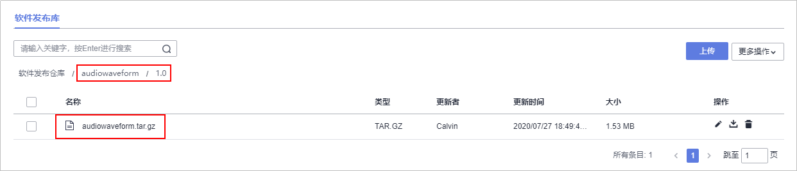

# **构建并归档软件包**<a name="devcloud_qs_0604"></a>

## **构建背景介绍**<a name="section178201733123417"></a>

**编译构建**为开发者提供配置简单的混合语言构建平台，支持。任务一键创建、配置和执行，实现获取代码、构建、打包等活动自动化。**发布**提供软件仓库、软件发布、发布包下载、发布包元数据管理等功能，实现软件包版本管理。

本例使用CMake作为构建工具，并在过程中使用到[容器镜像服务](https://console.huaweicloud.com/swr/)中自己上传的环境镜像。

-   **构建工具**

    “CMake”是“cross-platform make”的缩写，是一个跨平台的编译工具，它比我们常用的“make”更高级，可以在CmakeLists.txt用简单的语句来描述所有平台的编译过程。为了说明CMake给编译带来的简化和优点，我们来简述一下C++语言从简单到复杂项目，涉及不同平台时编译的变化：单文件编译，仅仅一条g++ main.cpp命令即可生成可执行文件；当源文件越来越多，无法一条一条命令执行时，就需要make自动编译工具，开发人员需要做的就是写make执行时所需要依据的脚本**makefile**；但是makefile抽象程度不高，对windows OS也不友好，CMake完美解决了这种多平台编译的问题。

    CMake 并不直接建构出最终的软件，而是产生标准的建构档（如 Unix 的 Makefile 或 Windows Visual C++ 的 projects/workspaces），然后再依一般的建构方式使用。本项目使用的构建工具就是CMake+gcc。

-   **镜像类型**

    构建环境采用的镜像类型分为两类： DevCloud预定义的“基础镜像”、 Docker Hub或华为容器镜像服务SWR（SoftWare Repository for Container）中的“公共镜像”。

    DevCloud预定义的“基础镜像”，包含多种版本的Cmake和gcc工具供选择使用，目前最高支持cmake3.10.1-gcc7.3.0，这些“基础镜像”仅仅安装了简单的构建工具和常用的软件包，这对于大型、专业性较强的C++项目是不够的。因为大型项目一般都需要在构建前安装大量的依赖包，显然在每次构建时都在“基础镜像”中进行安装是不可取的，所以，我们可以自己创建包含工程依赖包的镜像（以下称“环境镜像”），上传到容器镜像服务中，构建时直接使用。


本节通过以下步介绍如何使用编译构建服务将代码编译打包成软件包，并将软件包归档到软件发布库中。

1.  [上传环境镜像到SWR](#section85892030567)
2.  [新建并执行构建任务](#section1930235817716)
3.  [上传待解析音频文件](#section131851330114710)

## **上传环境镜像到SWR**<a name="section85892030567"></a>

如果本地有Linux机器并已经安装了Docker工具，可以在本地构建环境镜像并上传。在容器镜像服务中，单击“客户端上传“，会显示上传指导说明。

如果本地没有Linux机器或Docker工具，也可以按照本节的操作，通过DevCloud生成环境镜像。

1.  在本地准备如下**Dockerfile**文件，用于生成“环境镜像”。

    ```
    FROM ubuntu:16.04
    RUN apt-get update
    RUN apt-get install git -y
    RUN apt-get install make -y
    RUN apt-get install cmake -y
    RUN apt-get install gcc -y
    RUN apt-get install g++ -y
    RUN apt-get install libmad0-dev -y
    RUN apt-get install libid3tag0-dev -y
    RUN apt-get install libsndfile1-dev -y
    RUN apt-get install libgd-dev -y
    RUN apt-get install libboost-filesystem-dev -y
    RUN apt-get install libboost-program-options-dev -y
    RUN apt-get install libboost-regex-dev -y
    ```

2.  单击导航栏“代码  \>  代码托管“，进入“代码托管“页面。
3.  单击“普通新建“，创建代码仓库“audio-dockerfile“，并将**Dockerfile**文件上传到此代码仓库中。

    上传文件操作请参考[将本地Git库上传到代码托管的代码仓库](https://support.huaweicloud.com/usermanual-codehub/devcloud_hlp_0939.html)。

4.  单击页面上方导航栏“构建&发布  \>  编译构建“，进入“编译构建“页面。

    

      

5.  单击“新建任务“，进入“新建编译构建任务“页面。
6.  输入任务名“output-env-CI“，单击“下一步“。

    

      

7.  源码源选择“DevCloud“，源码仓库选择“audio-dockerfile“，分支选择“master“，单击“下一步“。

    

      

8.  选择“不使用模板，直接创建“，单击“确定“，进入“构建步骤“编辑页面。

    

      

9.  添加步骤“制作镜像并推送到SWR仓库“。

    

      

    参考下图输入构建信息，单击“新建“完成任务配置。

    

      

10. 单击“执行“，启动构建任务，当出现如下页面时，表示任务执行成功完成。

    

      

11. 进入容器镜像服务，单击左侧菜单“我的镜像“，找到生成的镜像。

    

      

12. 单击镜像名称，进入“镜像详情“页面。

    单击“编辑“，将镜像权限设置成“公开“，单击“确定“。

    

      

13. <a name="li11575135474112"></a>在列表中复制获取该镜像地址（docker pull后面内容），以备在后续构建任务中使用。

    

      


## **新建并执行构建任务**<a name="section1930235817716"></a>

1.  返回“DevCloud编译构建“页面，单击“新建任务“。
2.  输入任务名称，单击“下一步“。

    

      

3.  源码源选择“DevCloud“，源码仓库选择在[上传环境镜像到SWR](#li11575135474112)中创建的代码仓库，分支选择“master“，单击“下一步“。

    

      

4.  选择“不使用模板，直接创建任务“，进入“构建步骤“配置页面。

    

      

5.  添加步骤“使用SWR公共镜像“、“执行shell命令“、“上传软件包到软件发布库“，按照一下进行配置：
    1.  **使用SWR公共镜像**

        输入在[上传环境镜像到SWR-步骤13](#li11575135474112)获取到的镜像地址，并输入以下命令行：

        ```
        mkdir build && cd build
        cmake -D ENABLE_TESTS=0 -D BUILD_STATIC=1 ..
        make
        ```

        

          

    2.  **执行shell命令**

        输入以下命令行，将代码仓库中的运行脚本和生成的可执行文件统一压缩。

        ```
        cp startup.sh build/
        cd build
        tar zcvf audiowaveform.tar.gz audiowaveform startup.sh
        ```

        

          

    3.  **上传软件包到软件发布库**:

        参考下图配置构建包发布信息，单击“新建“完成编辑。。

        

          

          

6.  单击“执行“，启动构建任务，当出现如下页面时，表示任务执行成功完成。

    若执行失败，请查看日志信息排查问题，或通过[编译构建-常见问题](https://support.huaweicloud.com/codeci_faq/index.html)查找解决方法。

    

      

7.  单击页面上方导航栏“发布“，进入“软件发布库“页面。

    

      

8.  依次单击文件夹“audiowaveform \> 1.0“，可以看到生成的软件包“audiowaveform.tar.gz“。

    


## **上传待解析音频文件**<a name="section131851330114710"></a>

在“软件发布库“页面，单击“上传“，将一个压缩好的MP3压缩文件上传至软件发布库。

在部署时，将使用生成的可执行文件解析该音频文件，该文件可以用任意MP3文件替代。


至此，您已经完成了软件包的构建与归档操作。

  

