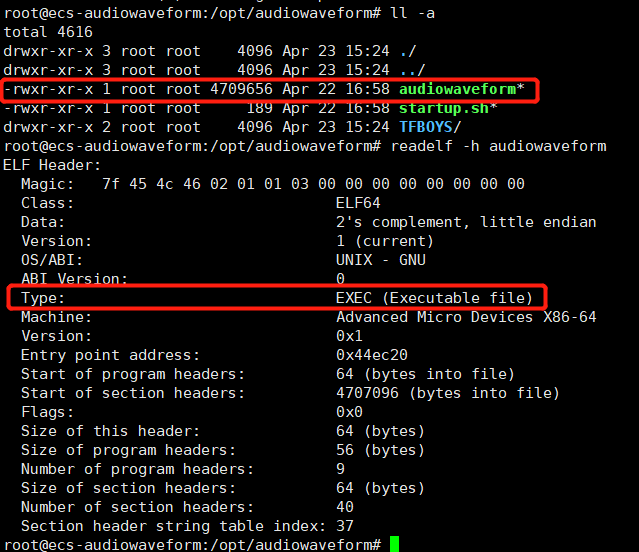

# **部署软件包至云主机**<a name="devcloud_qs_0605"></a>

**部署**提供可视化、一键式部署服务，支持并行部署和流水线无缝集成，实现部署环境标准化和部署过程自动化。

本节通过以下四步介绍如何使用部署服务将归档在软件发布库的软件包部署到云主机上。

1.  [添加授信主机](#section2054019404494)
2.  [新建部署任务](#section62010502492)
3.  [配置部署步骤](#section5316147195314)
4.  [执行部署任务](#section17778426183915)

为避免不必要的费用，在完成本例后，可选择进行[资源释放](#section1547219292578)。

## **添加授信主机**<a name="section2054019404494"></a>

“音频解析器”需要部署到Ubuntu系统服务器上才可以运行，本例采用部署服务器是[华为云弹性云服务器](https://support.huaweicloud.com/ecs/index.html)。

DevCloud在使用弹性云服务器之前需要先对其授信。

1.  单击导航“设置  \>  通用设置“。
2.  单击左侧菜单“主机组管理“，进入“主机组管理“页面。
3.  单击“新建主机组“，输入主机组名称、选择操作系统，单击“保存“，完成主机组的创建。
4.  单击“添加主机“，输入主机名、云主机IP、用户名、密码、ssh端口，单击“添加“完成主机的添加。
5.  等待验证，当显示“验证成功“时，说明主机成功添加。

    

      

    若验证失败，单击“验证消息“列中的“详情“，在弹框总可查看失败原因与操作指导。

    

      


## **新建部署任务**<a name="section62010502492"></a>

1.  单击页面上方导航栏“构建&发布  \>  部署“，进入“部署“页面。
2.  单击“新建任务“，进入“新建部署任务“页面。
3.  输入任务名称，单击“下一步“。
4.  由于C++语言没有相应的系统模板，选择“不使用模板，直接创建“，进入“部署步骤“页面。

## **配置部署步骤**<a name="section5316147195314"></a>

本例中的部署任务主要步骤有：选择部署来源（包括软件包和带解析音频）、解压文件、删除文件、执行shell命令。

详细配置如下：

1.  **选择部署来源（audiowaveform.tar.gz）**

    -   为了便于理解，将任务名从“选择部署来源“改成“选择软件包“。
    -   选择在步骤[添加授信主机](#section2054019404494)中创建的主机组，系统将弹框提示“是否将后续步骤的主机组也修改为<u>_XXX_</u>（<u>_主机组名称_</u>）”，选择“确定“。
    -   单击选择软件包文本框后的，在弹窗中找到并选择构建包“audiowaveform.tar.gz“，参考下图编辑“下载到主机的部署目录“。

        

      

2.  **选择部署来源（待解析音频）**

    -   为了便于理解，将任务名从“选择部署来源“改成“选择待解析音频“。
    -   参照上一步的操作，添加带解析音频压缩包，并参考下图编辑“下载到主机的部署目录“。

        

      

3.  **解压文件**：单击解压文件列表中的文字“添加“，参考下图编辑压缩文件路径及解压目录，将软件包及带解析音频解压。

    

      

4.  **删除文件**：参考下图输入删除路径，将软件压缩包、带解压音频压缩包删除。

    

      

5.  **执行shell命令**：输入以下命令，启动可执行文件的执行。

    ```
    chmod +x /opt/audiowaveform/startup.sh
    cd /opt/audiowaveform
    ./startup.sh
    ```

    

      

6.  完成以上操作之后，单击“保存“，完成部署任务的配置。

## **执行部署任务**<a name="section17778426183915"></a>

1.  进入“部署详情“页面，单击“执行“，执行部署任务，页面显示“部署成功“，表示任务执行完毕。

    若任务执行失败，可通过页面中的原因提示及链接来排查解决。

    

      

2.  查看部署任务日志，在日志中找到生成的采样图片名称（.png文件）。

    

      

3.  由于云主机上无法查看图片内容，因此登录云主机，将图片下载到本地打开，即可看到下图所示图片。

    下载方式可参考[在Linux云服务器上使用SFTP上传、下载文件](https://support.huaweicloud.com/ecs_faq/zh-cn_topic_0170139796.html)。

    

      


至此，您已经完成了软件包的部署及运行操作。

-   **C++可执行文件说明**

    本项目生成了一个可执行文件“audiowaveform“。

    将软件包上传到在Linux主机中并解压后，可以通过命令查看详细信息。

    

    如果发现文件无法执行，可以通过**chmod 777 audiowaveform**命令将文件置成可执行（r：读，w：写，x：可执行）。

    如果发现直接执行audiowaveform失败，可能是由于环境变量导致的，可以通过**./audiowaveform**来执行。

    该可执行文件应用于Linux系统上，不同于可视化窗口操作，它是通过终端命令进行交互，操作命令可以查看帮助信息。

    

      


## **资源释放**<a name="section1547219292578"></a>

您已经完成了使用C++进行客户端应用开发的入门示例体验，了解DevCloud的基本使用流程。

弹性云服务器运行过程中会产生费用，如果你不需要使用该主机，建议您参照[删除弹性云服务器](https://support.huaweicloud.com/ecs_faq/zh-cn_topic_0018073218.html)释放主机资源，避免费用产生，如果您想继续体验其它功能可继续保留主机资源。

  

