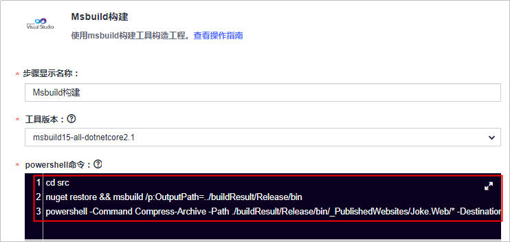

# **构建并归档软件包**<a name="devcloud_qs_0504"></a>

**编译构建**为开发者提供配置简单的混合语言构建平台，支持。任务一键创建、配置和执行，实现获取代码、构建、打包等活动自动化。**发布**提供软件仓库、软件发布、发布包下载、发布包元数据管理等功能，实现软件包版本管理。

本节通过以下三步介绍如何使用编译构建服务将代码编译打包成软件包，并将软件包归档到软件发布库中。

1.  [新建编译构建任务](#section982733617533)
2.  [配置构建步骤](#section191825309385)
3.  [执行编译构建任务](#section102501632162113)

## **新建编译构建任务**<a name="section982733617533"></a>

1.  单击页面上方导航栏“构建&发布  \>  编译构建“，进入“编译构建“页面。

    

      

2.  单击“新建任务“，进入“新建编译构建任务“页面。
3.  输入任务名称，单击“下一步“。

    

      

4.  源码源选择“DevCloud“，源码仓库选择在[创建代码仓库、管理项目代码](基于C-的Web应用开发-创建代码仓库-管理项目代码.md)中创建的代码仓库，分支选择“master“，单击“下一步“。

    

      

5.  选择推荐模板“msbuild“，  单击“确定“，进入构建步骤配置页面。

    

      


## **配置构建步骤**<a name="section191825309385"></a>

本例中，使用系统模板msbuild中的两个默认步骤即可完成构建：Msbuild构建，上传软件包到发布库（Windows环境）。

详细配置如下：

1.  **Msbuild构建**
    -   工具版本选择“msbuild15-all“
    -   在powershell命令框输入以下命令：

        ```
        cd src
        nuget restore && msbuild /p:OutputPath=../buildResult/Release/bin
        powershell -Command Compress-Archive -Path ./buildResult/Release/bin/_PublishedWebsites/Joke.Web/* -DestinationPath ./archive.zip
        ```

        

        > **说明：**   
        >命令行注解如下：  
        >-   由于本代码工程的sln文件路径位于“/src“目录下，故在命令行中先执行**cd src**命令。  
        >-   执行构建语句：**nuget restore && msbuild /p:OutputPath=../buildResult/Release/bin**（构建语句的执行必须要在sln文件的同级目录下）  
        >-   执行压缩指令：**powershell -Command Compress-Archive -Path ./buildResult/Release/bin/\_PublishedWebsites/Joke.Web/\* -DestinationPath ./archive.zip**，此命令将“./buildResult/Release/bin/\_PublishedWebsites/Joke.Web/“目录下的所有文件打包成archive.zip包，且archive.zip位于“./src“目录下（执行命令时处于src目录下）。  


2.  **上传软件包到发布库（Windows环境）**：参考下图输入构建包路径、发布版本号及包名。

    

      

    完成以上操作之后，单击“新建“完成配置。


## **执行编译构建任务**<a name="section102501632162113"></a>

1.  进入“编译详情“页，单击“执行“，启动构建任务，提示“构建成功“，表示任务执行成功完成。

    若执行失败，请查看日志信息排查问题，或通过[编译构建-常见问题](https://support.huaweicloud.com/codeci_faq/index.html)查找解决方法。

    

      

2.  单击页面上方导航栏“发布“，进入“软件发布库“页面。

    

      

3.  依次单击文件夹“build\> 1.0“，可以看到生成的软件包“build.zip“。

    

      


至此，您已经完成了软件包的构建与归档操作。

  

