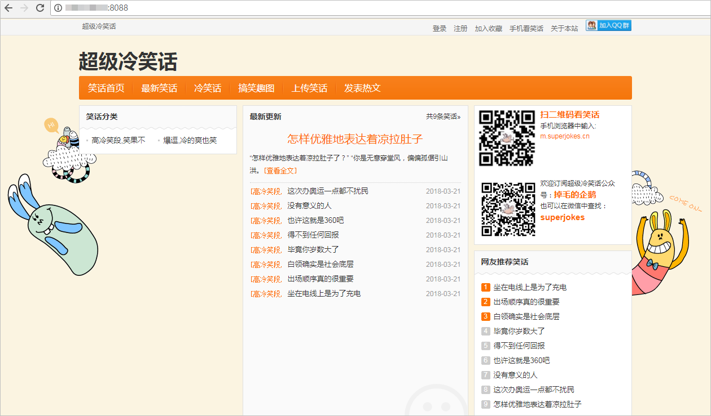

# **部署软件包至云主机**

**部署**提供可视化、一键式部署服务，支持并行部署和流水线无缝集成，实现部署环境标准化和部署过程自动化。

本节通过以下五步介绍如何使用部署服务将归档在软件发布库的软件包部署到云主机上。

1.  [配置主机环境](#section59299441232)
2.  [添加授信主机](#section1457610572318)
3.  [新建部署任务](#section71691910049)
4.  [配置部署任务](#section106831257452)
5.  [执行部署任务](#section07448201849)

为避免不必要的费用，在完成本例后，可选择进行[资源释放](#section1547219292578)。

## **配置主机环境**

“超级冷笑话网站”是一个Web项目，需要部署到服务器上才可以运行，本例采用部署服务器是[华为云弹性云服务器](https://support.huaweicloud.com/ecs/index.html)。

网站的运行需要特定的环境，因此需要在部署之前先登录对应的ECS云主机进行环境搭建。

1.  远程登录主机，安装IIS服务。安装方法可参考[Windows弹性云服务器上搭建IIS服务](https://support.huaweicloud.com/trouble-ecs/ecs_trouble_0701.html)。
2.  安装MySQL。
3.  进入代码仓库，找到数据库配置脚本**superjokes.sql**，根据此脚本在服务器上生成MySQL数据库。

    

      

## **添加授信主机**

1.  添加Windows主机为授信主机前，需要先对主机进行配置，参考[windows2012授信](https://support.huaweicloud.com/usermanual-deployman/deployman_hlp_1019.html)配置主机。
2.  返回DevCloud页面，单击导航“设置  \>  通用设置“。
3.  单击左侧菜单“主机组管理“，进入“主机组管理“页面。
4.  单击“新建主机组“，输入主机组名称、选择操作系统，单击“保存“，完成主机组的创建。
5.  单击“添加主机“，输入主机名、云主机IP、用户名、密码、winrm端口，单击“添加“完成主机的添加。
6.  等待验证，当显示“验证成功“时，说明主机成功添加。

    

      

    若验证失败，单击“验证消息“列中的“详情“，在弹框总可查看失败原因与操作指导。

    

      

## **新建部署任务**

1.  单击页面上方导航栏“构建&发布  \>  部署“，进入“部署“页面。
2.  单击“新建任务“，进入“新建部署任务“页面。
3.  输入任务名称，单击“下一步“。
4.  选择“不使用模板，直接创建“，进入“部署步骤“页面。

  

## **配置部署任务**

1.  添加部署步骤：选择部署来源、解压文件、删除文件、配置文件修改、执行PowerShell命令、执行PowerShell脚本。
2.  **选择部署来源**

    -   选择在步骤[添加授信主机](#section1457610572318)中创建的主机组，系统将弹框提示“是否将后续步骤的主机组也修改为<u>_XXX_</u>（<u>_主机组名称_</u>）”，选择“确定“。
    -   单击选择软件包文本框后的，在弹窗中找到并选择构建包“build.zip“，参考下图编辑“下载到主机的部署目录“。

        

      

3.  **解压文件**：单击解压文件列表中的文字“添加“，参考下图编辑压缩文件路径及解压目录，将build.zip解压。

    

      

4.  **删除文件**：参考下图输入删除路径，将build.zip删除。

    

      

5.  **配置文件修改**：参考下图输入配置文件appsettings.config的绝对路径。

    

      

6.  **执行PowerShell脚本**：参考下图输入PowerShell脚本web.ps1的绝对路径、以及脚本执行参数（参数间用空格分开）。

    

      

    > **须知：**   
    >-   PowerShell脚本参数中，Windows系统下路径的“\\”需要以“\\\\”替换。（只有在“脚本执行参数“一栏需要如此操作。例：“C:\\LogFiles“在此栏应写作“C:\\\\LogFiles“）  
    >-   脚本文件web.ps1在代码仓库的存放目录为“src/Joke.Web/“。  
    >    图中脚本执行参数与脚本文件web.ps1中参数的对应关系为：  
    >    -   **8080**：sitePort（端口）  
    >    -   **Superjokes**：SiteName（站点名）  
    >    -   **Integrated**：SiteAppPoolsModel（进程池使用通道模式）  
    >    -   **v4.0**：managedRuntimeVersion（.Net版本）  
    >    -   **C:\\\\deploy\_iis\\\\superjokes**：WebSitePath（站点程序路径）  
    >    -   **C:/LogFiles**：IISLogFile（IIS日志路径）  

7.  **执行PowerShell命令**：

    

      

8.  单击“参数设置“页签，添加参数“password“，参数值为数据库连接密码。
9.  完成以上操作之后，单击“保存“，完成部署任务的配置。

## **执行部署任务**

1.  进入“部署详情“页面，单击“执行“，执行部署任务。页面显示“部署成功“，表示任务执行完毕。

    若任务执行失败，可通过页面中的原因提示及链接来排查解决。

    

      

2.  打开浏览器，访问  “http://ip:端口/默认页“查看应用。

    若出现如下界面，则表示部署成功。

    

      

至此，您已经完成了软件包的部署及运行操作。

## **资源释放**

您已经完成了使用C\#进行客户端应用开发的入门示例体验，了解DevCloud的基本使用流程。

弹性云服务器运行过程中会产生费用，如果你不需要使用该主机，建议您参照[删除弹性云服务器](https://support.huaweicloud.com/ecs_faq/zh-cn_topic_0018073218.html)释放主机资源，避免费用产生，如果您想继续体验其它功能可继续保留主机资源。

  

