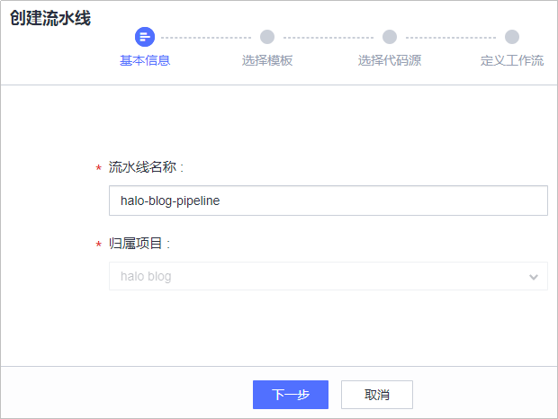
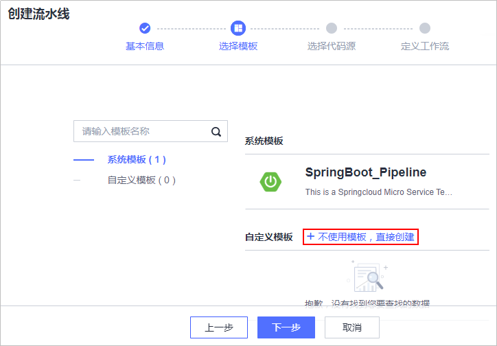
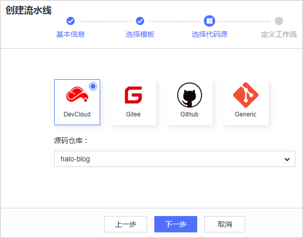
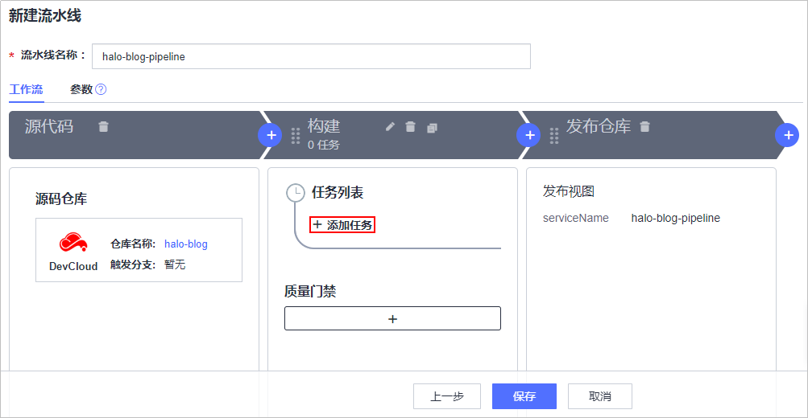
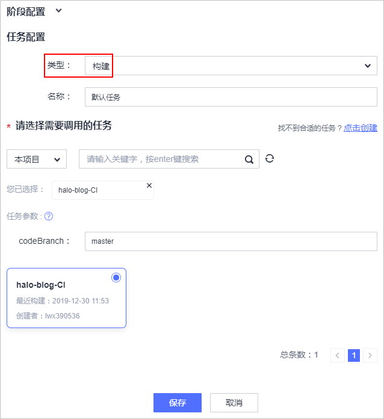
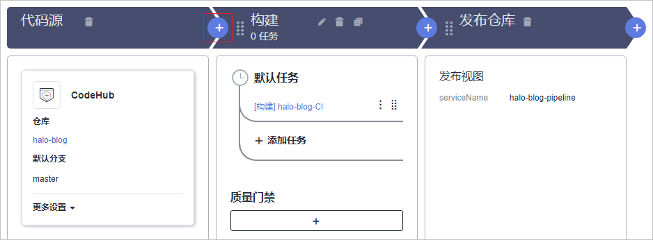
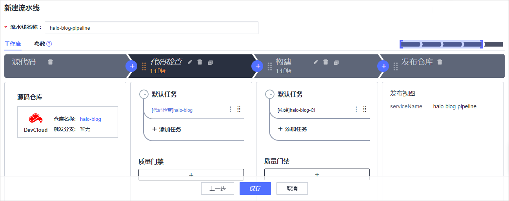
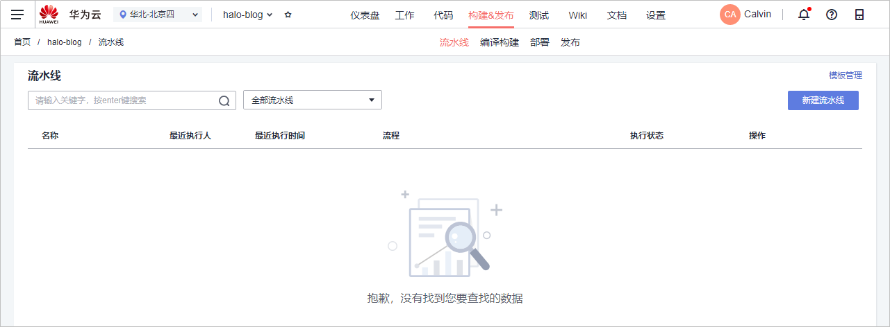
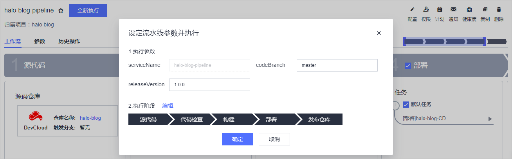
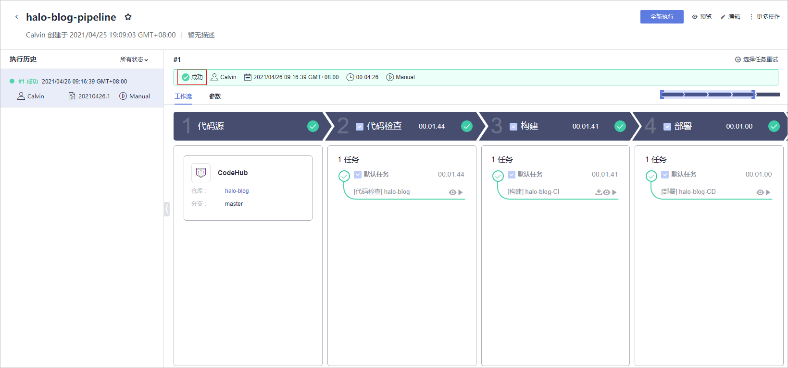

# **创建流水线、实现持续交付**

**流水线**提供可视化、可定制的自动交付流水线，支持编译构建、代码检查、子流水线、部署、流水线控制五种任务类型，

本节通过以下三步介绍如何使用流水线实现持续交付。

1.  [新建流水线](#section350075783316)
2.  [执行流水线](#section19117448123419)

为避免不必要的费用，在完成本例后，可选择进行[资源释放](#section1547219292578)。

## **新建流水线**

1.  单击页面上方导航栏“构建&发布  \>  流水线“，进入“流水线“页面。

    

      

2.  单击“新建流水线“，进入“新建流水线“页面。
3.  输入任务名称，单击“下一步“。

    

      

4.  选择“不使用模板，直接创建“。

    

      

5.  单击“DevCloud“，源码仓库选择在[创建代码仓库、管理项目代码](基于Java的Web应用开发-创建代码仓库-管理项目代码.md)中创建的代码仓库，单击“下一步“。

    

      

6.  单击“构建“一栏中的“添加任务“。

    

      

    页面右侧滑出“阶段配置“窗口，类型选择“构建“，需要调用的任务选择[新建编译构建任务](基于Java的Web应用开发-构建并归档软件包.md#section097945133519)中创建的任务，单击“保存“完成构建任务的配置。

    

      

7.  单击构建栏前面的，添加一个阶段。

    

      

    单击，在右侧滑出的“阶段配置“窗口中输入名称“代码检查“，单击“保存“。

    

      

    参照[步骤6](#li71814342053)的操作，添加在[静态代码扫描、保证代码质量](基于Java的Web应用开发-静态代码扫描-保证代码质量.md)中创建的代码检查任务。

    

      

8.  参照[步骤7](#li171713441184)的操作，在构建阶段之后添加阶段“部署“，并配置部署任务，单击“保存“完成流水线创建。

    

      

## **执行流水线**

1.  进入“流水线详情“页面，单击“全新执行“，启动流水线任务。

    

      

2.  等待流水线执行，当提示成功时，表示流水线执行完毕，即实现了持续集成流水线。

    若执行失败，单击失败的任务名称，进入任务详情页面查看失败原因。

    

      

至此，您已经完成实现了项目的持续交付。

## **资源释放**

您已经完成了使用Java进行Web应用开发的入门示例体验，了解DevCloud的基本使用流程。

弹性云服务器运行过程中会产生费用，如果你不需要使用该主机，建议您参照[删除弹性云服务器](https://support.huaweicloud.com/ecs_faq/zh-cn_topic_0018073218.html)释放主机资源，避免费用产生，如果您想继续体验其它功能可继续保留主机资源。

  

