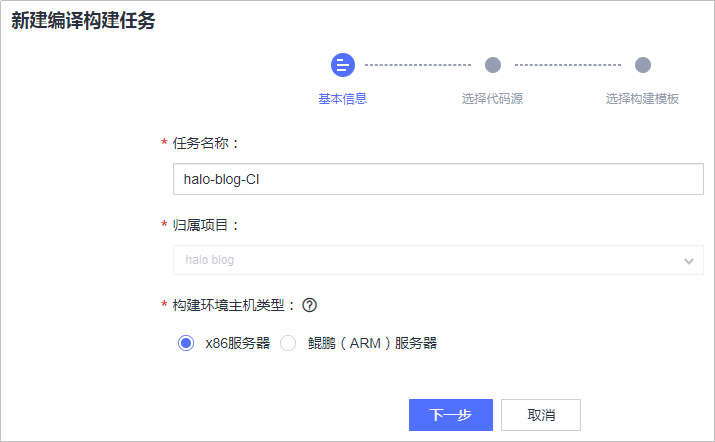
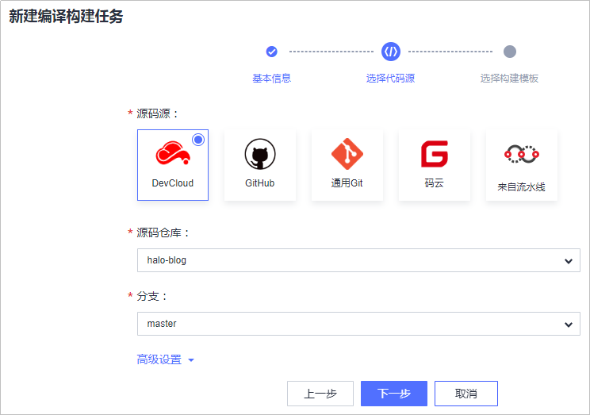
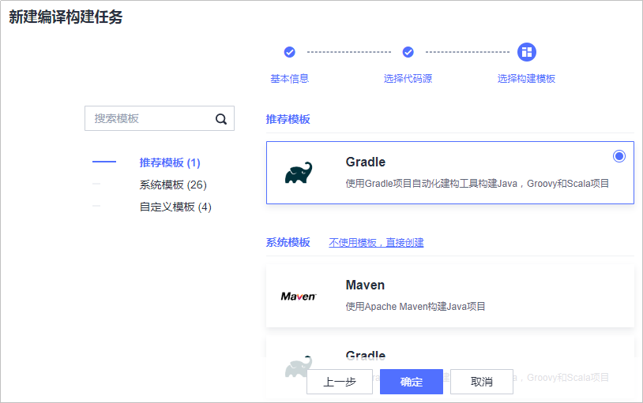
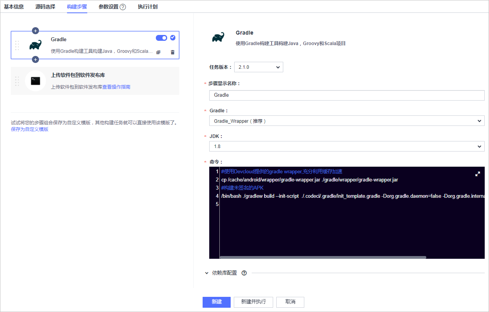
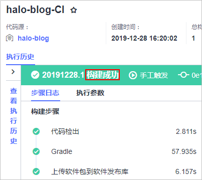
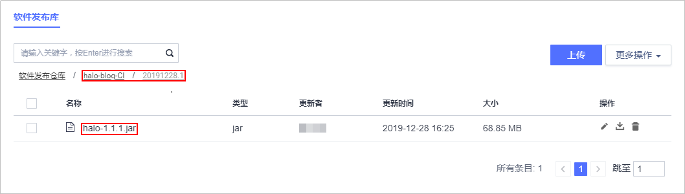

# **构建并归档软件包**

**编译构建**为开发者提供配置简单的混合语言构建平台，支持。任务一键创建、配置和执行，实现获取代码、构建、打包等活动自动化。**发布**提供软件仓库、软件发布、发布包下载、发布包元数据管理等功能，实现软件包版本管理。

本节通过以下两步介绍如何使用编译构建服务将代码编译打包成软件包，并将软件包归档到软件发布库中。

1.  [新建编译构建任务](#section097945133519)
2.  [执行编译构建任务](#section6914025125118)

## **新建编译构建任务**

1.  单击页面上方导航栏“构建&发布  \>  编译构建“，进入“编译构建“页面。

    

      

2.  单击“新建任务“，进入“新建编译构建任务“页面。
3.  输入任务名称，单击“下一步“。

    

      

4.  源码源选择“DevCloud“，源码仓库选择在[创建代码仓库、管理项目代码](基于Java的Web应用开发-创建代码仓库-管理项目代码.md)中创建的代码仓库，分支选择“master“，单击“下一步“。

    

      

5.  本项目是一个Java Gradle项目，系统智能会推荐使用Gradle构建。

    选择推荐模板“Gradle“，  单击“确定“，进入构建步骤配置页面。

    

      

6.  使用系统模板中提供的两个默认步骤、以及每个步骤中的默认配置，即可完成本例的构建。
    1.  Gradle

        

          

    2.  上传软件包到发布库

        

          

        完成以上操作之后，单击“新建“，完成步骤的配置。

## **执行编译构建任务**

1.  单击“执行“，启动构建任务，当出现如下页面时，表示任务执行成功完成。

    若执行失败，请查看日志信息排查问题，或通过[编译构建-常见问题](https://support.huaweicloud.com/codeci_faq/index.html)查找解决方法。

    

      

2.  单击页面上方导航栏“发布“，进入“软件发布库“页面。

    

      

3.  单击文件夹“halo-blog-CI“，根据[步骤1](#li2374202833310)中“执行成功“字样前的数字，单击同名文件夹进入，即可看到生成的软件包“halo-1.1.1.jar“。

    

      

至此，您已经完成了软件包的构建与归档操作。

  

