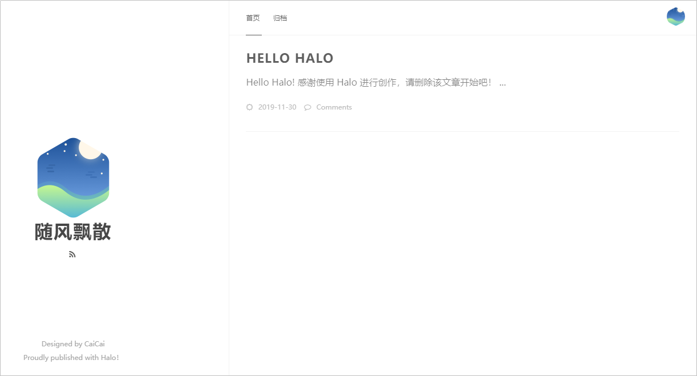

# **概述**

## **文档目的**

本文通过示例项目“Halo个人独立博客系统”介绍如何使用DevCloud开发基于Java语言的Web应用，为研发Java项目的企业或个人提供上云指导。

## **项目详情**

-   项目名称：Halo个人独立博客系统。
-   项目简介：“Halo个人独立博客系统”是一个在线文档管理平台，可以根据项目进行成员添加、文档管理，以及文档评论管理等功能。

    

      

-   项目周期：4周（敏捷迭代开发）。
-   构建环境：JDK1.8+Gradle\_Wrapper。
-   部署环境：CentOS 7.2。
-   涉及华为云服务：
    -   [软件开发平台 DevCloud](https://www.huaweicloud.com/devcloud/)
    -   [弹性云服务器 ECS](https://www.huaweicloud.com/product/ecs.html)

## **前提条件**

使用DevCloud开展本例前，需要先进行以下步骤。若已有华为云账号及弹性云服务器，则可忽略。

-   注册华为云账号：在[华为云官网](https://www.huaweicloud.com/)注册华为云账号，并进行实名认证，此账号适用于所有华为云产品。
-   购买弹性云服务器：部署将使用带有公网IP的华为云ECS（本文中使用的操作系统为CentOS 7.2）。ECS的购买方式请参考[购买并登录Linux弹性云服务器](https://support.huaweicloud.com/qs-ecs/zh-cn_topic_0132727313.html)。

    > **说明：**   
    >-   本例中对弹性云服务器的配置没有特殊要求，购买时选择最基本配置即可。  
    >-   弹性云服务器的购买方式有“包周期“与“按需“，若只参考本例进行DevCloud体验，可选择“按需购买”方式，在体验之后将弹性云服务器删除，避免产生不必要的费用。  

## **项目过程**

DevCloud基本操作流程请参考[快速上手DevCloud](https://support.huaweicloud.com/qs-devcloud/devcloud_qs_1000.html)。

本例中将依次进行以下步骤：

1.  [创建项目、进行项目规划](基于Java的Web应用开发-创建项目-进行项目规划.md)
2.  [创建代码仓库、管理项目代码](基于Java的Web应用开发-创建代码仓库-管理项目代码.md)
3.  [静态代码扫描、保证代码质量](基于Java的Web应用开发-静态代码扫描-保证代码质量.md)
4.  [构建并归档软件包](基于Java的Web应用开发-构建并归档软件包.md)
5.  [部署软件包至云主机](基于Java的Web应用开发-部署软件包至云主机.md)
6.  [创建流水线、实现持续交付](基于Java的Web应用开发-创建流水线-实现持续交付.md)

  

