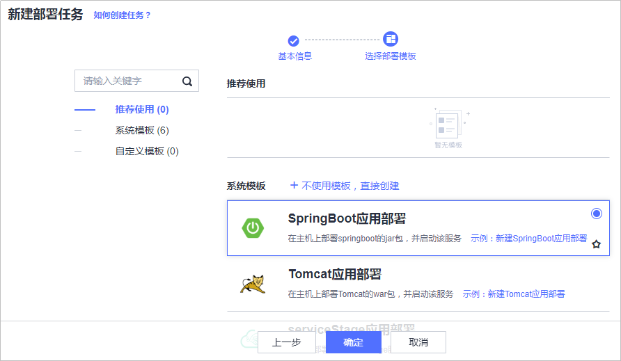
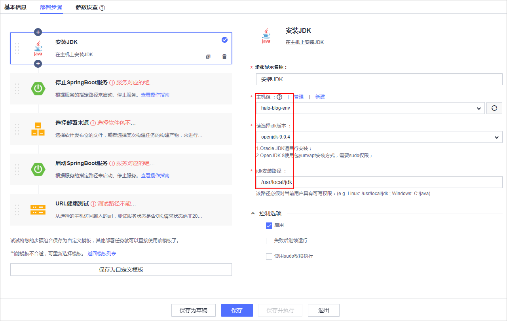
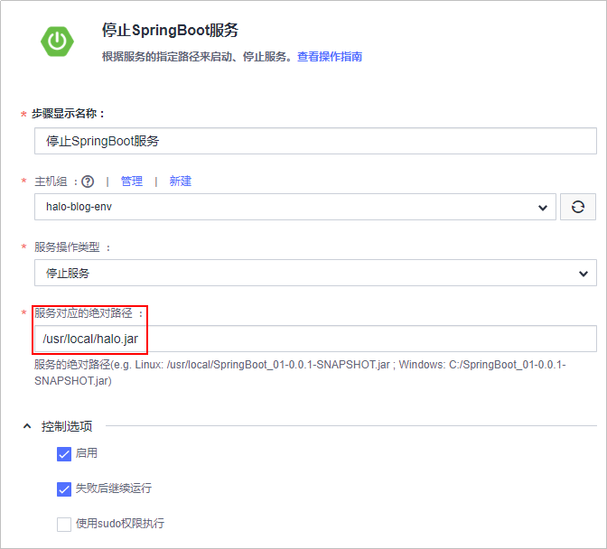
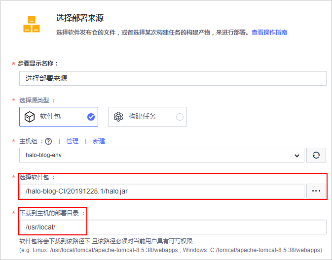
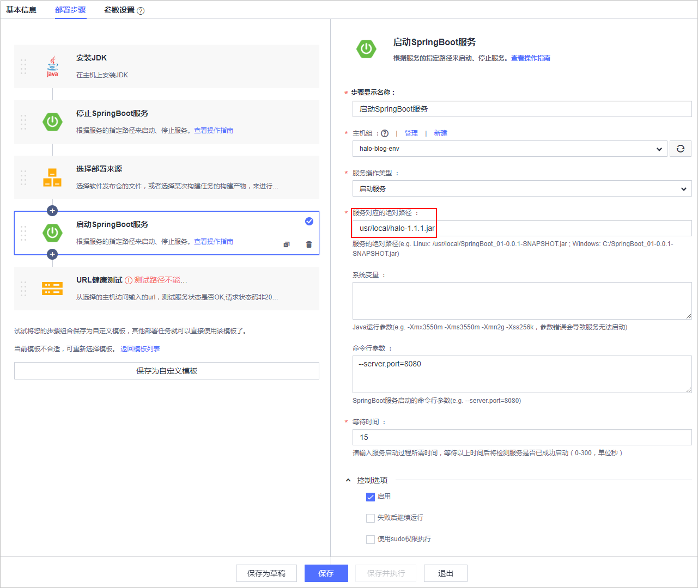
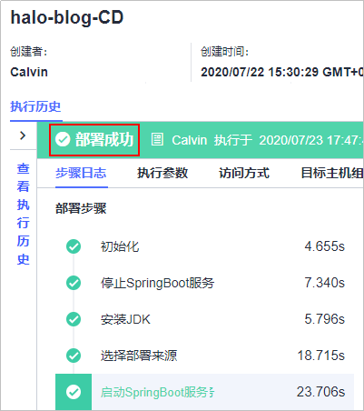
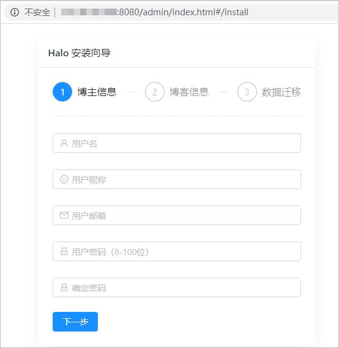

# **部署软件包至云主机**

**部署**提供可视化、一键式部署服务，支持并行部署和流水线无缝集成，实现部署环境标准化和部署过程自动化。

本节通过以下四步介绍如何使用部署服务将归档在软件发布库的软件包部署到云主机上。

1.  [添加授信主机](#section7570181910567)
2.  [新建部署任务](#section103013420131)
3.  [配置部署步骤](#section01305414155)
4.  [执行部署任务](#section1526814423242)

## **添加授信主机**

“Halo个人独立博客系统”是一个Web项目，需要部署到服务器上才可以运行，本例采用部署服务器是[华为云弹性云服务器](https://support.huaweicloud.com/ecs/index.html)。

DevCloud在使用弹性云服务器之前需要先对其授信。

1.  单击导航“设置  \>  通用设置“。

    

      

    单击左侧菜单“主机组管理“，进入“主机组管理“页面。

    

      

2.  单击“新建主机组“，输入主机组名称、选择操作系统，单击“保存“，完成主机组的创建。

    

      

3.  单击“添加主机“，输入主机名、云主机IP、用户名、密码、ssh端口，单击“添加“完成主机的添加。

    

      

4.  等待验证，当显示“验证成功“时，说明主机成功添加。

    

      

    若验证失败，单击“验证消息“列中的“详情“，在弹框总可查看失败原因与操作指导。

    

      

## **新建部署任务**

1.  单击页面上方导航栏“构建&发布  \>  部署“，进入“部署“页面。

    

      

2.  单击“新建任务“，进入“新建部署任务“页面。
3.  输入任务名称，单击“下一步“。

    

      

4.  模板选择“SpringBoot应用部署“，单击“确定“，进入部署步骤配置页面。

    

      

## **配置部署步骤**

SpringBoot应用部署模板默认包含以下步骤：安装JDK、停止SpringBoot服务、选择部署来源、启动SpringBoot服务、URL健康测试。（其中，步骤“URL健康测试“可选，根据需要配置即可，本文暂不介绍）。

步骤配置详情如下：

1.  **安装JDK**：

    -   选择在步骤[添加授信主机](#section7570181910567)中创建的主机组，系统将弹框提示“是否将后续步骤的主机组也修改为<u>_XXX_</u>（<u>_主机组名称_</u>）”，选择“确定“。
    -   参考下图选择jdk版本，jdk安装路径可保持默认值。

    

      

2.  **停止SpringBoot服务**：服务操作类型保持默认值，参考下图输入服务对应的绝对路径。

    

      

3.  **选择部署来源**：单击选择软件包文本框后的，在弹窗中找到并选择在[构建并归档软件包](基于Java的Web应用开发-构建并归档软件包.md)中生成的构建包，参考下图编辑“下载到主机的部署目录“。

    

      

4.  **启动SpringBoot服务**：服务操作类型保持默认值，参考下图输入服务对应的绝对路径。

    

      

    完成以上操作之后，单击“保存“，完成部署任务的配置。

## **执行部署任务**

1.  进入“部署详情“页面，单击“执行“，执行部署任务。页面显示“部署成功“，表示任务执行完毕。

    若任务执行失败，可通过页面中的原因提示及链接来排查解决。

    

      

2.  打开浏览器，访问  “http://ip:端口/默认页“查看应用。

    若出现如下界面，则表示部署成功。

    

      

    > **说明：**   
    >代码中默认访问端口为8090。  
    >若需要修改为其他端口，可在部署步骤[启动SpringBoot服务](#li623614616178)中，通过设置命令行参数**--server.port**来实现。  

至此，您已经完成了软件包的部署及运行操作。

  

