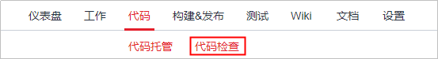
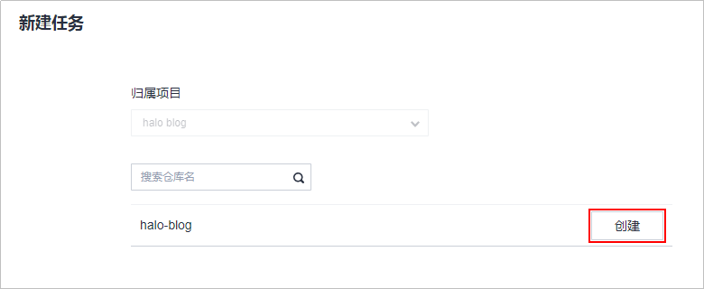
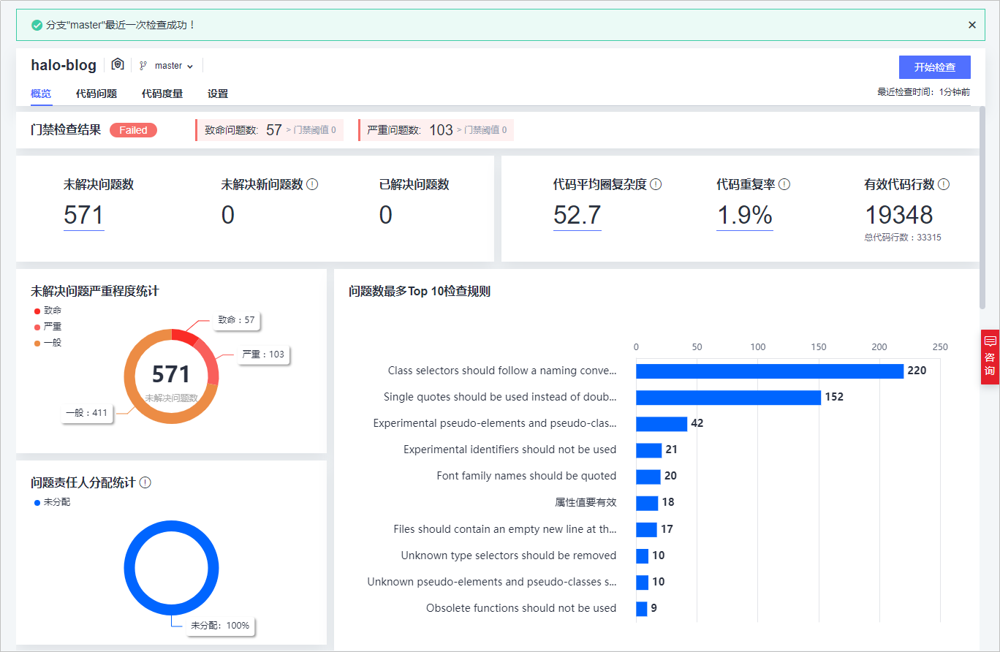
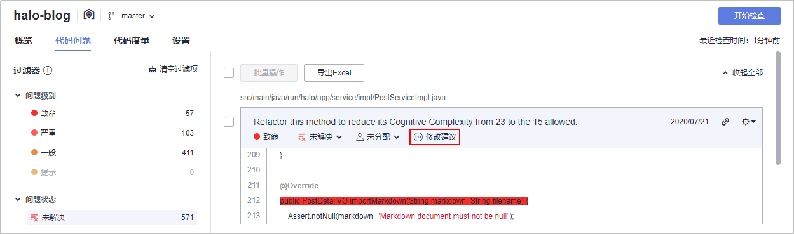

# **静态代码扫描、保证代码质量**

**代码检查**是为开发者提供基于云端实现代码质量管理的服务，支持代码静态检查（包括代码质量、代码风格等）和安全检查，并提供缺陷的改进建议和趋势分析。

1.  单击页面上方导航栏“代码检查“，进入“代码检查“页面。

    

      

2.  单击页面右上角“新建任务“。
3.  选择在[创建代码仓库、管理项目代码](基于Java的Web应用开发-创建代码仓库-管理项目代码.md)中创建的代码仓库，单击仓库名称后的“创建“。

    

      

4.  进入“任务详情  \>  概览“页面，单击“开始检查“，等待任务执行，当出现如下页面时，表示任务执行成功。

    若任务执行失败，请参考[代码检查-常见报错解决方法](https://support.huaweicloud.com/codecheck_faq/codecheck_02_0002.html)进行排查解决。

    

      

5.  单击页签“代码问题“，查看问题列表。
6.  单击“修改建议“，根据建议修改代码问题。如无需修改，可以直接忽略该问题。

    

      

至此，您已经完成了对代码的静态扫描纠错。

  

