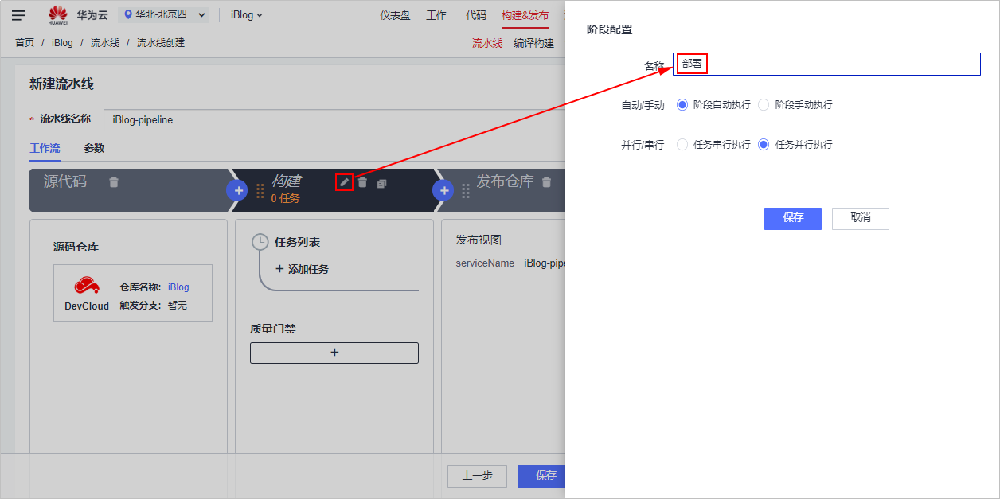
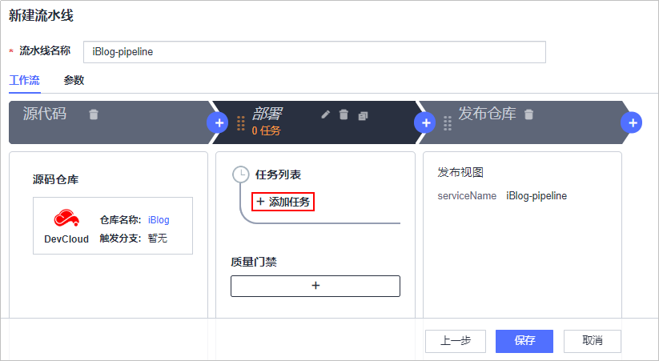
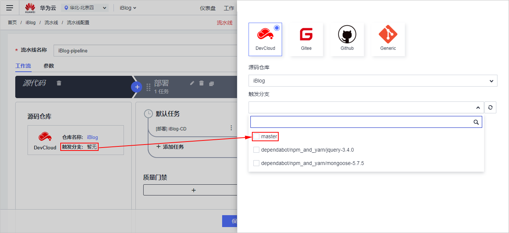
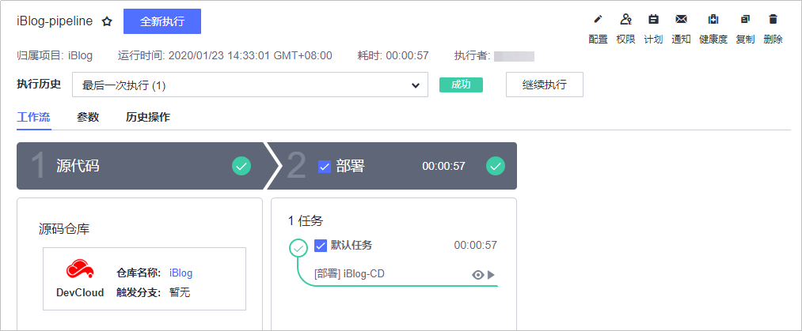

# **创建流水线、实现持续交付**

**流水线**提供可视化、可定制的自动交付流水线，支持编译构建、代码检查、子流水线、部署、流水线控制五种任务类型，

本节通过以下三步介绍如何使用流水线实现持续交付。

1.  [新建流水线](#section1415133316189)
2.  [执行流水线](#section04955407189)

为避免不必要的费用，在完成本例后，可选择进行[资源释放](#section1547219292578)。

## **新建流水线**

1.  单击页面上方导航栏“构建&发布  \>  流水线“，进入“流水线“页面。
2.  单击“新建流水线“，进入“新建流水线“页面。
3.  输入任务名称，单击“下一步“。
4.  选择“不使用模板，直接创建“。
5.  单击“DevCloud“，源码仓库选择在[创建代码仓库、管理项目代码](基于Java的Web应用开发-创建代码仓库-管理项目代码.md)中创建的代码仓库，单击“下一步“。
6.  单击“构建“一栏中的图标，在页面右侧滑出的“阶段配置“窗口中修改名称为“部署“，单击“保存“。

    

      

7.  单击“部署“一栏中的“添加任务“。

    页面右侧滑出“阶段配置“窗口，类型选择“部署“，需要调用的任务选择[部署代码至云主机](基于Node-js的Web应用开发-部署代码至云主机.md)中创建的任务，单击“保存“。

    

      

8.  单击“发布仓库“一栏中的图标，删除此阶段。

    

      

9.  单击“源代码“一栏中“触发分支“，在右侧画出窗口中，单击“触发分支“下拉列表，勾选“master“。

    

      

10. 完成以上操作之后，单击“保存“，完成流水线的配置。

## **执行流水线**

有两种方式可以出发流水线的执行。

-   **方法一：手动执行**
    1.  进入“流水线详情“页面，单击“全新执行“，启动流水线任务。
    2.  等待流水线执行，当提示成功时，表示流水线执行完毕，即实现了持续集成流水线。

        若执行失败，单击失败的任务名称，进入任务详情页面查看失败原因。

        

          

-   **方法二：修改代码仓库代码自动触发**

    由于在[新建流水线-步骤9](#li19519201918170)中设置了触发分支，因此在代码仓库的master分支发生变化时，会自动触发流水线的执行。执行结果的查看[•方法一：手动执行](#li1672410147281)与相同。

至此，您已经完成实现了项目的持续交付。

## **资源释放**

您已经完成了使用Node.js进行Web应用开发的入门示例体验，了解DevCloud的基本使用流程。

弹性云服务器运行过程中会产生费用，如果你不需要使用该主机，建议您参照[删除弹性云服务器](https://support.huaweicloud.com/ecs_faq/zh-cn_topic_0018073218.html)释放主机资源，避免费用产生，如果您想继续体验其它功能可继续保留主机资源。

  

