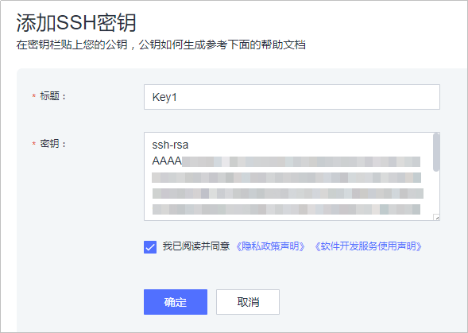
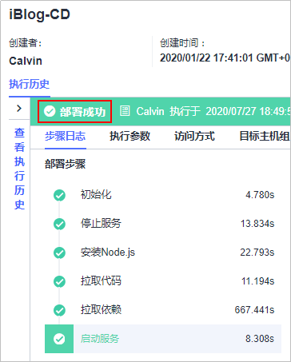

# **部署代码至云主机**<a name="devcloud_qs_0404"></a>

**部署**提供可视化、一键式部署服务，支持并行部署和流水线无缝集成，实现部署环境标准化和部署过程自动化。

本例中的项目无需进行编译构建打包，只需将代码仓库中iBlog代码仓拉取到我们的部署主机即可。在此之前，需要在Linux主机环境下通过**npm install**安装Node.js所需的依赖包后开启服务。

本节通过以下五步介绍如何使用部署服务将项目代码部署到云主机上。

1.  [前提准备](#section1211184861711)
2.  [添加授信主机](#section193914012184)
3.  [新建部署任务](#section2431151171810)
4.  [配置部署步骤](#section733314816274)
5.  [执行部署任务](#section5584142218182)

## **前提准备**<a name="section1211184861711"></a>

1.  <a name="li7330131084611"></a>登录部署主机，输入以下命令安装Git并生成密钥。
    1.  安装git：

        ```
        yum -y install git
        ```

    2.  生成SSH密钥：

        ```
        ssh-keygen -t rsa -C "您的邮箱"
        ```

    3.  显示SSH密钥

        ```
        cat ~/.ssh/id_rsa.pub
        ```

    4.  修改配置文件

        ```
        vim /etc/ssh/ssh_config
        ```

        在下图所示的位置输入**StrictHostKeyChecking no**。

        

          

        敲击ECS键并输入**：wq**退出编辑。

2.  在DevCloud中添加SSH密钥。
    1.  返回DevCloud页面，单击页面右上角用户名，在下拉列表中选择“个人设置“。

        

          

    2.  单击左侧菜单“代码托管  \>  SSH密钥管理“，单击页面右侧“添加SSH密钥“。

        

          

    3.  复制[步骤1](#li7330131084611)中生成的SSH密钥，粘贴在“密钥“文本框中，输入标题并勾选文本框后的声明，单击“确定“完成。

        

          

3.  在部署主机安装上mongodb。
    1.  下载安装
        -   下载：

            ```
            wget https://fastdl.mongodb.org/linux/mongodb-linux-x86_64-4.0.9.tgz
            ```

        -   解压：

            ```
            tar -zxvf mongodb-linux-x86_64-4.0.9.tgz
            ```

        -   改名并放到目录“/usr/loca“：

            ```
            mv mongodb-linux-x86_64-4.0.9 /usr/local/mongodb
            ```

        -   新建必要的文件夹（依次是：数据库 日志 配置文件）：

            ```
            cd /usr/local/mongodb
            mkdir data log etc
            ```

        -   做软链接：

            ```
            ln -s /usr/local/mongodb/bin/mongo /usr/bin/mongo
            ```

    2.  配置文件
        -   进入配置目录

            ```
            cd /usr/local/mongodb/etc
            ```

        -   修改配置文件

            ```
            vim mongodb.conf
            ```

            输入以下内容：

            -   db存放的目录

                ```
                dbpath=/usr/local/mongodb/data
                ```

            -   后台启动需要配置日志输出

                ```
                logpath=/usr/local/mongodb/log/mongodb.log
                ```

            -   端口

                ```
                port=27017
                bind_ip = 127.0.0.1
                ```

            -   设置成后台启动

                ```
                fork=true
                journal=false
                ```


    3.  启动服务
        -   进入服务目录

            ```
            cd /usr/local/mongodb/bin
            ```

        -   启动服务

            ```
            ./mongod --config /usr/local/mongodb/etc/mongodb.conf
            ```


## **添加授信主机**<a name="section193914012184"></a>

本项目一个Web项目，需要部署到服务器上才可以运行，本文采用部署服务器是华为云弹性云主机。

DevCloud在使用这台云主机之前需要先对其授信。

1.  单击“首页“返回DevCloud首页，进入在[新建项目](基于Node-js的Web应用开发-创建项目-进行项目规划.md#section186017194012)中创建的项目。
2.  单击导航“设置  \>  通用设置“。

    

      

    单击左侧菜单“主机组管理“，进入“主机组管理“页面。

    

      

3.  单击页面“新建主机组“，输入主机组名称、选择操作系统，单击“保存“，完成主机组的创建。

    

      

4.  单击“添加主机“，输入主机名、云主机IP、用户名、密码、ssh端口，单击“添加“完成主机的添加。

    

      

5.  等待验证，当显示“验证成功“时，说明主机成功添加。

    

      

    若验证失败，单击“验证消息“列中的“详情“，在弹框总可查看失败原因与操作指导。

    

      


## **新建部署任务**<a name="section2431151171810"></a>

1.  单击页面上方导航栏“构建&发布  \>  部署“，进入“部署“页面。

    

      

2.  单击“新建任务“，进入“新建部署任务“页面。
3.  输入任务名称，单击“下一步“。

    

      

4.  选择“不使用模板，直接创建“，进入“部署步骤“配置页面。

    

      


## **配置部署步骤**<a name="section733314816274"></a>

1.  添加部署步骤：执行shell命令（停止服务）、安装Node.js、执行shell命令（拉取代码）、执行shell命令（拉取依赖）、执行shell命令（启动服务）。

    

      

2.  **执行shell命令（停止服务）**

    -   为了便于理解，将任务名从“执行shell命令“改成“停止服务“。
    -   选择在步骤[添加授信主机](#section193914012184)中创建的主机组，系统将弹框提示“是否将后续步骤的主机组也修改为<u>_XXX_</u>（<u>_主机组名称_</u>）”，选择“确定“。
    -   输入以下shell命令：

        ```
        kill -9 $(netstat -tlnp | grep :3000 | awk '{print $7}' | awk -F '/' '{print $1}')
        ```

    -   本步骤的作用是：如果有nodejs进程存在，则停止。第一次执行没有服务的时候会失败，需要勾选“失败后继续运行“。

    

      

3.  **安装Node.js**：选择node.js版本，并参考下图输入安装路径。

    

      

4.  **执行shell命令（拉取代码）**
    -   为了便于理解，将任务名从“执行shell命令“改成“拉取代码“。
    -   输入以下shell命令：

        ```
        cd /usr/local
        if [ ! -d "devcloud" ];then
        mkdir devcloud
        echo "新建devcloud文件夹"
        else
        echo "devcloud文件夹已存在"
        fi
        cd /usr/local/devcloud
        if [ ! -d "iBlog" ];then
        git clone 自己的代码仓库地址
        echo "首次拉取iBlog"
        else
        cd iBlog
        git pull
        echo "iBlog文件夹已存在"
        fi
        ```

        

          

5.  **执行shell命令（拉取依赖）**
    -   为了便于理解，将任务名从“执行shell命令“改成“拉取依赖“。
    -   输入以下shell命令：

        ```
        cd /usr/local/devcloud/iBlog
        npm install
        ```

        

          

        > **说明：**   
        >如果下载依赖较慢，可以设置华为镜像仓加速构建，设置命令如下：  
        >```  
        >npm config set registry https://mirrors.huaweicloud.com/repository/npm/  
        >```  


6.  **执行shell命令（启动服务）**
    -   为了便于理解，将任务名从“执行shell命令“改成“启动服务“。
    -   输入以下shell命令：

        ```
        cd /usr/local/devcloud/iBlog
        nohup npm start &
        ```

        

          

        完成以上操作之后，单击“保存“，完成部署任务的配置。


## **执行部署任务**<a name="section5584142218182"></a>

1.  进入“部署详情“页面，单击“执行“，执行部署任务。页面显示“部署成功“，表示任务执行完毕。

    若任务执行失败，可通过页面中的原因提示及链接来排查解决。

    

      

2.  打开浏览器，访问  “http://ip:端口“查看应用。若出现如下界面，则表示部署成功。

    

      

    > **说明：**   
    >如访问不可用，先检查安全组中3000端口是否设置。  


至此，您已经完成了软件包的部署及运行操作。

  

