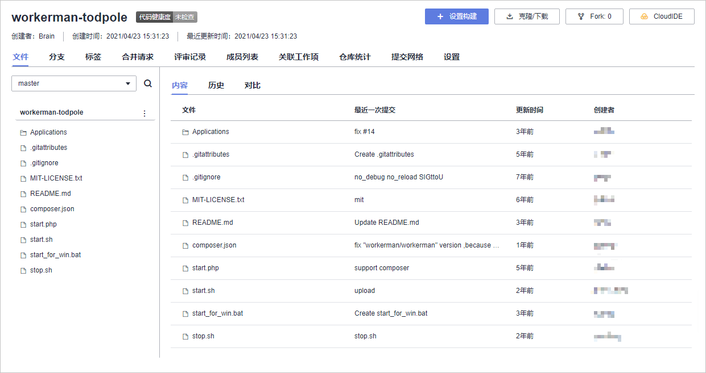

# **创建代码仓库、管理项目代码**

**代码托管**为开发者提供基于Git的在线代码托管服务，包括代码克隆/提交、分支管理等功能。

本节通过以下两步介绍如何使用代码托管服务管理项目代码。

1.  [新建代码仓库](#section1402231103510)
2.  [查看代码仓库](#section18158113720351)

## **新建代码仓库**

代码托管支持三种新建代码仓库方式：普通新建、按模板新建、导入外部仓库。本例中所使用的代码已公开为示例模板，因此采用“按模板新建“方式。

1.  单击导航栏“代码  \>  代码托管“，进入“代码托管“页面。

    

      

2.  单击页面右上角“普通新建“旁边的“∨“，选择“按模板新建“。

    

      

3.  在搜索框中输入“workerman-todpole“，即可查找到已经被公开为示例模板的蝌蚪即时交互游戏代码，选择该模板，单击“下一步“。

    

      

4.  输入代码仓库名称（可以和模板仓库同名），单击“确定“，完成仓库创建。

    

      

## **查看代码仓库**

单击仓库名称进入仓库，可查看仓库文件。

仓库中的主要代码架构如下：

至此，您已经完成代码仓库的创建操作。

  

