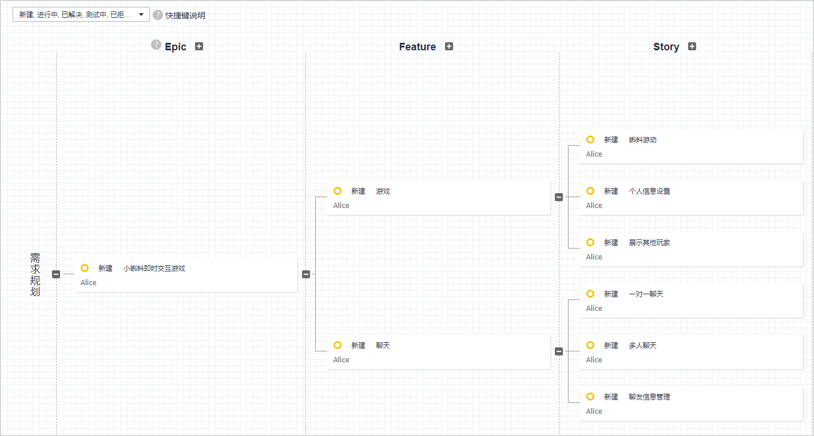
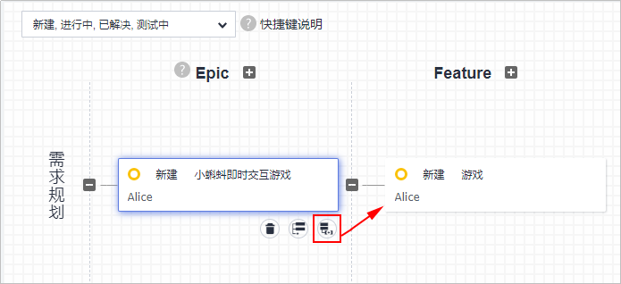
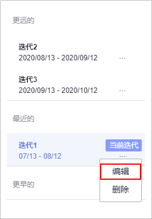
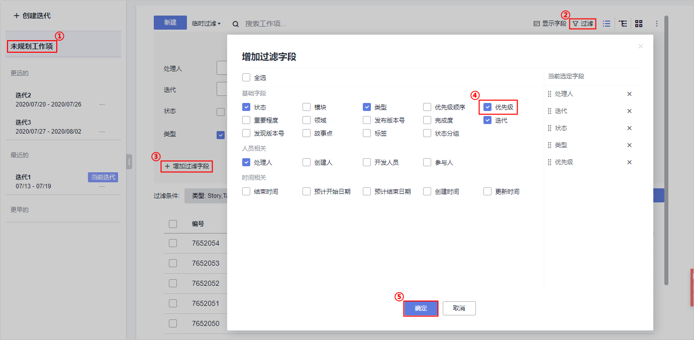

# **创建项目、进行项目规划**

**项目管理**为开发团队提供简单高效的团队协作服务，包含多项目管理、敏捷迭代、需求管理等功能。

本节通过以下四步介绍如何使用项目管理服务进行项目规划的管理。

1.  [新建项目](#section798823141415)
2.  [使用需求规划新建工作项](#section139932346144)
3.  [新建迭代](#section9562202911416)
4.  [向迭代中添加工作项](#section2905184419141)

## **新建项目**

DevCloud支持两种研发流程：[Scrum流程](https://support.huaweicloud.com/usermanual-projectman/devcloud_hlp_00021sm.html#section0)、[看板流程](https://support.huaweicloud.com/usermanual-projectman/devcloud_hlp_00021.html#section0)，本例选择使用Scrum流程项目。

新建项目操作步骤如下：

1.  登录[华为云DevCloud](https://devcloud.cn-north-4.huaweicloud.com/home)，单击页面右上角“新建项目“。
2.  单击选择“Scrum“，输入项目名称，单击“确定“，完成项目创建。

## **使用需求规划新建工作项**

“需求规划“是以思维导图的形式将工作项的层级结构展示出来，直观的展示父子关系。在“需求规划“页面中新建的工作项，会自动生成到后面的Epic、Feature、Backlog页面。

在项目初期，Product Owner（项目经理）将从客户获取的所有需求信息，逐一落实到项目规划中，分解细化，逐步形成“Epic\>Feature\>Story“的结构，并为工作项设置优先级。

需求规划操作步骤如下：

1.  单击页面上方导航栏“工作  \>  需求规划“，进入“需求规划“页面。
2.  单击“Epic“一栏中的“+“，输入工作项名称，敲击回车，完成Epic创建。

    

      

3.  单击Epic卡片，在右侧滑出框中编辑工作项详情（例如描述信息、带\*的必填项），单击“保存“，完成工作项编辑。
4.  单击图标，输入工作项名称，敲击回车，完成Feature创建。

    

      

5.  单击Feature卡片，在右侧滑出框中编辑工作项详情，单击“保存“，完成工作项编辑。
6.  按照相同的方式创建其它Feature、Story，并完成详情编辑。

## **新建迭代**

Scrum项目周期通常被划分为若干个“迭代“，在每个迭代中完成一部分Story。

1.  单击页面上方导航栏“工作项  \>  迭代“，进入“迭代“页面。
2.  系统会自动创建3个迭代，单击迭代卡片上的，选择编辑，即可编辑名称、计划时间以及迭代描述。

    

      

3.  若需要创建新的迭代，单击“创建迭代“，在弹窗中输入迭代名称、计划时间，单击“新建“，完成迭代创建。

## **向迭代中添加工作项**

在迭代1开始前，在Backlog中过滤出优先级“高”且重要程度为“关键”的工作项。

评估工作量后，将story纳入迭代1，与开发人员进行需求澄清。

其余迭代，均可根据组内实际情况，按照优先级从高到低，重要程度减弱的顺序进行开发。

1.  选择页面左侧导航“未规划工作项“，单击工作项列表右上方“高级过滤“。
2.  单击“增加过滤字段“，在弹框中选择“优先级“、“重要程度“，单击“确定“，这两个字段将显示在页面中。

    

      

3.  优先级选择“高“，重要程度选择“关键“，单击“临时过滤“，页面中将显示符合过滤条件的工作项。
4.  单击每个工作项对应的“迭代“一列，在下拉列表中选择“迭代1“。

至此，您已经完成了对项目的规划操作。

  

