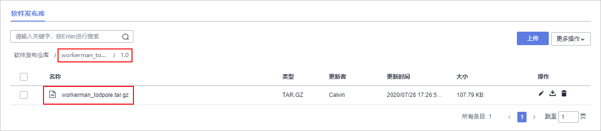

# **构建并归档软件包**

**编译构建**为开发者提供配置简单的混合语言构建平台，支持。任务一键创建、配置和执行，实现获取代码、构建、打包等活动自动化。**发布**提供软件仓库、软件发布、发布包下载、发布包元数据管理等功能，实现软件包版本管理。

本PHP项目直接在Linux主机环境下直接开启服务即可运行，本身无需进行编译构建打包，但是在DevCloud中云端部署需要可识别的软件包，所以需要对PHP的程序进行简单的打包。

本节通过以下三步介绍如何使用编译构建服务将代码编译打包成软件包，并将软件包归档到软件发布库中。

1.  [新建编译构建任务](#section790312181427)
2.  [配置构建步骤](#section1763143018425)
3.  [执行编译构建任务](#section31215590488)

## **新建编译构建任务**

1.  单击页面上方导航栏“构建&发布  \>  编译构建“，进入“编译构建“页面。

    

      

2.  单击“新建任务“，进入“新建编译构建任务“页面。
3.  输入任务名称，单击“下一步“。

    

      

4.  源码源选择“DevCloud“，源码仓库选择在[新建代码仓库](基于PHP的H5应用开发-创建代码仓库-管理项目代码.md#section1402231103510)中创建的代码仓库，分支选择“master“，单击“下一步“。

    

      

5.  选择“不使用模板，直接创建“，进入“构建步骤“编辑页面。

    

      

## **配置构建步骤**

1.  添加构建步骤：“执行shell命令“、“上传软件包到发布仓库“。

    

      

2.  **执行shell命令**：输入打包命令**tar zcvf workerman\_todpole.tar.gz \***。

    

      

3.  **上传软件包到发布仓库**：参考下图配置构建包信息。

    

      

    完成以上操作之后，单击“新建“完成配置。

## **执行编译构建任务**

1.  进入“编译详情“页，单击“执行“，启动构建任务，提示“构建成功“，表示任务执行成功完成。

    若执行失败，请查看日志信息排查问题，或通过[编译构建-常见问题](https://support.huaweicloud.com/codeci_faq/index.html)查找解决方法。

    

      

2.  单击页面上方导航栏“发布“，进入“软件发布库“页面。

    

      

3.  依次单击文件夹“workerman\_todpole \> 1.0“，可以看到生成的软件包“workerman\_todpole.tar.gz“。

    

      

至此，您已经完成了软件包的构建与归档操作。

  

