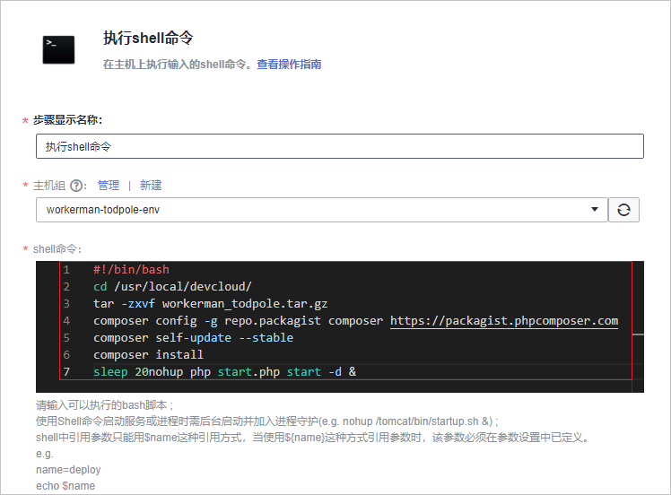

# **部署软件包至云主机**<a name="devcloud_qs_0305"></a>

**部署**提供可视化、一键式部署服务，支持并行部署和流水线无缝集成，实现部署环境标准化和部署过程自动化。

本节通过以下五步介绍如何使用部署服务将归档在软件发布库的软件包部署到云主机上。

1.  [准备主机环境](#section1020851762916)
2.  [添加授信主机](#section4217102711294)
3.  [创建部署任务](#section581744332917)
4.  [配置部署步骤](#section25552010102310)
5.  [执行部署任务](#section38651753132912)

为避免不必要的费用，在完成本例后，可选择进行[资源释放](#section1547219292578)。

## **准备主机环境**<a name="section1020851762916"></a>

本文中用的应用程序运行需要部署到服务器上才可以运行，本例采用部署服务器是[华为云弹性云服务器](https://support.huaweicloud.com/ecs/index.html)。

应用程序的运行需要特定的环境，因此需要在部署之前先登录对应的ECS云主机进行环境搭建。

搭建环境的脚本内容如下：

-   **安装php-cli**：

    ```
    sudo apt-get update
    sudo apt-get install php-cli
    ```


-   **安装composer**：

    ```
    sudo apt-get install wget
    wget https://getcomposer.org/composer.phar
    chmod 755 composer.phar
    mv composer.phar /usr/local/bin/composer
    ```


## **添加授信主机**<a name="section4217102711294"></a>

1.  单击导航“设置  \>  通用设置“。
2.  单击左侧菜单“主机组管理“，进入“主机组管理“页面。
3.  单击“新建主机组“，输入主机组名称、选择操作系统，单击“保存“，完成主机组的创建。
4.  单击“添加主机“，输入主机名、云主机IP、用户名、密码、ssh端口，单击“添加“完成主机的添加。
5.  等待验证，当显示“验证成功“时，说明主机成功添加。

    

      

    若验证失败，单击“验证消息“列中的“详情“，在弹框总可查看失败原因与操作指导。

    

      


## **创建部署任务**<a name="section581744332917"></a>

1.  单击页面上方导航栏“构建&发布  \>  部署“，进入“部署“页面。
2.  单击“新建任务“，进入“新建部署任务“页面。
3.  输入任务名称，单击“下一步“。
4.  选择“不使用模板，直接创建“，进入“部署步骤“页面。

## **配置部署步骤**<a name="section25552010102310"></a>

1.  添加部署步骤：选择部署来源、执行shell命令。
2.  **选择部署来源**

    -   选择在步骤[添加授信主机](#section4217102711294)中创建的主机组，系统将弹框提示“是否将后续步骤的主机组也修改为<u>_XXX_</u>（<u>_主机组名称_</u>）”，选择“确定“。
    -   源类型选择“构建任务“，构建任务选择在中创建的编译构建任务，参考下图编辑“构建序号“及“下载到主机的部署目录“。

        

      

3.  **执行shell命令**

    输入以下脚本，用以启动php服务。

    ```
    #!/bin/bash
    cd /usr/local/devcloud/
    tar -zxvf workerman_todpole.tar.gz
    composer config -g repo.packagist composer https://packagist.phpcomposer.com
    composer install
    sleep 20
    nohup php start.php start -d &
    ```

    

      

4.  完成以上操作之后，单击“保存“，完成部署任务的配置。

## **执行部署任务**<a name="section38651753132912"></a>

1.  进入“部署详情“页面，单击“执行“，执行部署任务，页面显示“部署成功“，表示任务执行完毕。

    若任务执行失败，可通过页面中的原因提示及链接来排查解决。

    

      

2.  打开浏览器，访问  “http://ip:端口“查看应用，本例中的端口号为8383。

    若出现如下界面，则表示部署成功。

    

      


至此，您已经完成了软件包的部署及运行操作。

## **资源释放**<a name="section1547219292578"></a>

您已经完成了使用PHP进行客户端应用开发的入门示例体验，了解DevCloud的基本使用流程。

弹性云服务器运行过程中会产生费用，如果你不需要使用该主机，建议您参照[删除弹性云服务器](https://support.huaweicloud.com/ecs_faq/zh-cn_topic_0018073218.html)释放主机资源，避免费用产生，如果您想继续体验其它功能可继续保留主机资源。

  

