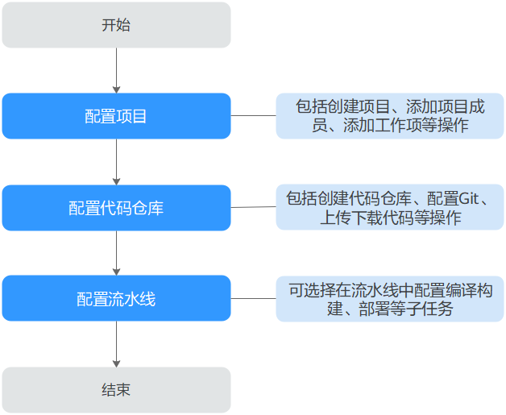

# 软件开发平台使用流程<a name="devcloud_qs_1000"></a>

软件开发平台是华为云提供的一站式云端DevOps平台，本章节为您介绍软件开发平台的基本操作流程。



## 前提条件<a name="section453712458"></a>

1.  拥有已实名认证的华为云帐号。若没有，请先[注册帐号](https://support.huaweicloud.com/usermanual-account/account_id_001.html)并完成[实名认证](https://support.huaweicloud.com/usermanual-account/account_auth_00001.html)。
2.  已[购买软件开发平台](https://support.huaweicloud.com/usermanual-devcloud/devcloud_01_0002.html)。

## 配置项目<a name="section18531144810357"></a>

项目管理服务是使用软件开发平台各服务的基础，首先需要创建项目、添加项目成员，然后可以根据项目规划添加工作项。

1.  创建项目。
    1.  登录软件开发平台，单击“新建项目“。
    2.  选择项目类型（“Scrum“或“看板“），输入项目名称，单击“确定“。

2.  添加项目成员**。**
    1.  进入已创建的项目，单击页面上方导航栏“设置  \>  通用设置  \>  成员管理“。
    2.  在页面右上角选择“添加成员“或者[通过链接邀请](https://support.huaweicloud.com/usermanual-projectman/devcloud_hlp_00026.html#section7)。

        其中，添加成员有[从本企业用户](https://support.huaweicloud.com/usermanual-projectman/devcloud_hlp_00026.html#section3)、[从其他项目导入用户](https://support.huaweicloud.com/usermanual-projectman/devcloud_hlp_00026.html#section5)、[邀请其他企业用户](https://support.huaweicloud.com/usermanual-projectman/devcloud_hlp_00026.html#section4)三种方式，请根据实际情况选择。

3.  创建工作项。
    1.  进入已创建的项目，单击页面上方导航栏“工作  \>  工作项“。
    2.  单击“新建“，选择工作项类型，根据实际情况输入工作项标题、优先级、处理人等信息。


项目管理服务更多操作请参见[项目管理用户指南](https://support.huaweicloud.com/usermanual-projectman/projetcman_ug_3000.html)。

## 配置代码仓库<a name="section1376513531304"></a>

代码仓库用于项目代码的版本管理，与本地的交互基于Git，因此在使用代码仓库之前需要在本地安装Git客户端。

1.  <a name="li1168425195810"></a>安装并配置Git客户端。
    1.  通过[Git官网](https://git-scm.com/download/win)下载安装包，并使用默认配置安装Git客户端到本地电脑。
    2.  运行Git Bash，Git Bash中输入以下命令行配置用户名和邮箱。

        ```
        git config  --global user.name "您的名字"
        git config  --global user.email "您的邮箱"
        ```

    3.  输入以下命令行，生成一对SSH密钥。生成的密钥通常保存在“\~/.ssh/id\_rsa.pub“中。

        ```
        ssh-keygen -t rsa -C "<您的邮箱>"
        ```

    4.  输入以下命令可显示密钥内容。

        ```
        cat ~/.ssh/id_rsa.pub
        ```

2.  创建代码仓库。
    1.  进入已创建的项目，单击页面上方导航“代码  \>  代码托管“。
    2.  根据需要选择[普通新建](https://support.huaweicloud.com/usermanual-codehub/codehub_ug_0000.html)、[按模板新建](https://support.huaweicloud.com/usermanual-codehub/codehub_ug_1008.html)或[导入外部仓库](https://support.huaweicloud.com/usermanual-codehub/codehub_ug_8001.html)，按照页面提示输入仓库名称等基本信息，单击“确定“。
    3.  代码仓库创建成功后，页面自动跳转到仓库详情页，可查看仓库内的文件。

3.  克隆/推送代码。
    1.  单击页面右上角用户名，在下拉列表中选择“个人设置“。
    2.  单击页面左侧导航“代码托管  \>  SSH密钥管理“。
    3.  单击“添加SSH密钥“，输入标题，并将在[安装并配置Git客户端](#li1168425195810)中生成的密钥，单击“确定“。
    4.  返回代码仓库，单击“克隆/下载“，复制仓库地址。

        运行Git Bash，输入以下命令行，克隆云端仓库到本地。

        ```
        git clone <您仓库的SSH下载链接>
        ```

    5.  在本地完成代码的编辑后，在Git Bash中输入以下命令行，保存代码并推送到代码仓库。

        ```
        git add .
        git commit -m "<您对本次提交备注的信息>"
        git push origin master
        ```

    6.  返回代码仓库，即可查看更新后的文件。


代码托管服务更多操作请参见[代码托管用户指南](https://support.huaweicloud.com/usermanual-codehub/codehub_hlp_0000.html)。

## 配置流水线<a name="section61291059192"></a>

流水线集成代码检查、编译构建、部署等任务，可根据需要灵活配置流水线中的任务。流水线为非必须操作，根据需要配置即可。

-   代码检查任务可以对代码进行静态检查和安全检查，代码检查任务为非必须操作，根据需要配置即可。
-   编译构建任务将软件的源代码编译成目标文件，并把配置文件和资源文件等打包。对于一些项目，例如PHP、Node.js前端代码，不需要进行编译，无需配置编译构建任务。
-   部署任务用于将软件包或代码部署到虚拟机或者容器。对于一些项目，例如手机APP开发，无需配置部署任务。

1.  创建代码检查任务。

    1.  进入已创建的项目，单击页面上方导航栏“代码  \>  代码检查“。
    2.  单击“新建任务“，在页面中选择需要检查的代码仓库，单击仓库名称后的“创建“，启动任务的创建。
    3.  代码检查任务创建成功后，页面自动跳转至任务详情页，单击“开始检查“启动任务。任务执行成功后，即可查看代码问题列表。

    代码检查服务更多操作请参考[代码检查用户指南](https://support.huaweicloud.com/usermanual-codecheck/devcloud_hlp_00101.html)。

2.  创建编译构建任务。

    1.  进入已创建的项目，单击页面上方导航栏“构建&发布  \>  编译构建“。
    2.  单击“新建任务“，根据实际情况配置编译构建任务信息。

        <a name="table15936325816"></a>
        <table><thead align="left"><tr id="row1893772288"><th class="cellrowborder" valign="top" width="20%" id="mcps1.1.3.1.1"><p id="p1733916394248"><a name="p1733916394248"></a><a name="p1733916394248"></a>步骤</p>
        </th>
        <th class="cellrowborder" valign="top" width="80%" id="mcps1.1.3.1.2"><p id="p123391739192413"><a name="p123391739192413"></a><a name="p123391739192413"></a>填写/选择建议</p>
        </th>
        </tr>
        </thead>
        <tbody><tr id="row193722188"><td class="cellrowborder" valign="top" width="20%" headers="mcps1.1.3.1.1 "><p id="p12339133918248"><a name="p12339133918248"></a><a name="p12339133918248"></a>选择代码源</p>
        </td>
        <td class="cellrowborder" valign="top" width="80%" headers="mcps1.1.3.1.2 "><a name="ul359775711220"></a><a name="ul359775711220"></a><ul id="ul359775711220"><li>源码源：DevCloud。</li><li>源码仓库：选择在<a href="#section1376513531304">配置代码仓库</a>中创建的代码仓库。</li><li>分支：master。</li></ul>
        </td>
        </tr>
        <tr id="row99379218817"><td class="cellrowborder" valign="top" width="20%" headers="mcps1.1.3.1.1 "><p id="p113397396244"><a name="p113397396244"></a><a name="p113397396244"></a>选择构建模板</p>
        </td>
        <td class="cellrowborder" valign="top" width="80%" headers="mcps1.1.3.1.2 "><p id="p16339639132410"><a name="p16339639132410"></a><a name="p16339639132410"></a>服务内置了20余个构建模板，请根据实际情况选择；也可以选择<span class="parmvalue" id="parmvalue97321826277"><a name="parmvalue97321826277"></a><a name="parmvalue97321826277"></a>“不使用模板，直接创建”</span>，自定义构建步骤。</p>
        </td>
        </tr>
        </tbody>
        </table>

    3.  完成配置，单击“确定“，页面自动跳转至构建步骤页面。根据实际情况编辑各步骤中的配置项，单击“新建“。
    4.  编译构建任务创建成功后，页面自动跳转至任务详情页，单击“执行启动“启动任务。待任务执行成功后，可以在页面中查看构建日志，也可以到发布服务中查找生成的软件包。

    编译构建服务更多操作指导请参考[编译构建用户指南](https://support.huaweicloud.com/usermanual-codeci/codeci_ug_0079.html)。

3.  创建部署任务。

    1.  准备授信主机：部署任务通常是将软件包部署服务器中，因此需要准备一台具有弹性IP的主机，可以使用已有主机，也可以[购买华为云弹性云服务器](https://support.huaweicloud.com/qs-ecs/ecs_02_0009.html)。
    2.  添加授信主机：
        1.  进入已创建的项目，单击页面上方导航栏“设置  \>  通用设置“。
        2.  单击页面左侧导航“主机组管理“，[创建主机组](https://support.huaweicloud.com/usermanual-deployman/deployman_hlp_1024.html)并[添加授信主机](https://support.huaweicloud.com/usermanual-deployman/deployman_hlp_1016.html)。

    3.  在页面上方导航栏选择“构建&发布  \>  部署“，单击“新建任务“，根据实际情况配置编译构建任务信息。

        <a name="table10438172302913"></a>
        <table><thead align="left"><tr id="row164381123172912"><th class="cellrowborder" valign="top" width="20%" id="mcps1.1.3.1.1"><p id="p16438112392911"><a name="p16438112392911"></a><a name="p16438112392911"></a>步骤</p>
        </th>
        <th class="cellrowborder" valign="top" width="80%" id="mcps1.1.3.1.2"><p id="p12438142317293"><a name="p12438142317293"></a><a name="p12438142317293"></a>填写/选择建议</p>
        </th>
        </tr>
        </thead>
        <tbody><tr id="row15438023122912"><td class="cellrowborder" valign="top" width="20%" headers="mcps1.1.3.1.1 "><p id="p14438823142920"><a name="p14438823142920"></a><a name="p14438823142920"></a>基本信息</p>
        </td>
        <td class="cellrowborder" valign="top" width="80%" headers="mcps1.1.3.1.2 "><p id="p4876113711292"><a name="p4876113711292"></a><a name="p4876113711292"></a>根据实际情况输入任务名称。</p>
        </td>
        </tr>
        <tr id="row44399239292"><td class="cellrowborder" valign="top" width="20%" headers="mcps1.1.3.1.1 "><p id="p16439162316293"><a name="p16439162316293"></a><a name="p16439162316293"></a>选择构建模板</p>
        </td>
        <td class="cellrowborder" valign="top" width="80%" headers="mcps1.1.3.1.2 "><p id="p843962382920"><a name="p843962382920"></a><a name="p843962382920"></a>服务内置了多个构建模板，请根据实际情况选择；也可以选择<span class="parmvalue" id="parmvalue24390238295"><a name="parmvalue24390238295"></a><a name="parmvalue24390238295"></a>“空白模板”</span>，自定义部署步骤。</p>
        </td>
        </tr>
        </tbody>
        </table>

    4.  完成配置，单击“确定“，页面自动跳转至部署步骤页面。根据实际情况编辑各步骤中的配置项，单击“保存“。
    5.  编译构建任务创建成功后，页面自动跳转至任务详情页，单击“执行启动“启动任务。待任务执行成功后，可以在页面中查看部署日志，也可以登录主机查看部署结果。

    部署服务更多操作指导请参考[部署用户指南](https://support.huaweicloud.com/usermanual-deployman/deployman_hlp_1015.html)。

4.  配置流水线。

    1.  进入已创建的项目，单击页面上方导航栏“构建&发布  \>  流水线“，进入“流水线“页面。
    2.  单击“新建流水线“，根据实际情况配置流水线信息。

        <a name="table6492156203413"></a>
        <table><thead align="left"><tr id="row144928643412"><th class="cellrowborder" valign="top" width="20%" id="mcps1.1.3.1.1"><p id="p1049215620344"><a name="p1049215620344"></a><a name="p1049215620344"></a>步骤</p>
        </th>
        <th class="cellrowborder" valign="top" width="80%" id="mcps1.1.3.1.2"><p id="p649219623416"><a name="p649219623416"></a><a name="p649219623416"></a>填写/选择建议</p>
        </th>
        </tr>
        </thead>
        <tbody><tr id="row1149212620343"><td class="cellrowborder" valign="top" width="20%" headers="mcps1.1.3.1.1 "><p id="p24926618345"><a name="p24926618345"></a><a name="p24926618345"></a>基本信息</p>
        </td>
        <td class="cellrowborder" valign="top" width="80%" headers="mcps1.1.3.1.2 "><p id="p3492146153410"><a name="p3492146153410"></a><a name="p3492146153410"></a>根据实际情况输入流水线名称。</p>
        </td>
        </tr>
        <tr id="row134921693419"><td class="cellrowborder" valign="top" width="20%" headers="mcps1.1.3.1.1 "><p id="p64927643417"><a name="p64927643417"></a><a name="p64927643417"></a>选择模板</p>
        </td>
        <td class="cellrowborder" valign="top" width="80%" headers="mcps1.1.3.1.2 "><p id="p16492865348"><a name="p16492865348"></a><a name="p16492865348"></a>可选择服务内置的流水线模板，也可以选择<span class="parmvalue" id="parmvalue3470112103519"><a name="parmvalue3470112103519"></a><a name="parmvalue3470112103519"></a>“不使用模板，直接创建”</span>，自定义流水线工作流。</p>
        </td>
        </tr>
        <tr id="row14412114517359"><td class="cellrowborder" valign="top" width="20%" headers="mcps1.1.3.1.1 "><p id="p17412204512357"><a name="p17412204512357"></a><a name="p17412204512357"></a>选择代码源</p>
        </td>
        <td class="cellrowborder" valign="top" width="80%" headers="mcps1.1.3.1.2 "><a name="ul942014153365"></a><a name="ul942014153365"></a><ul id="ul942014153365"><li>第一个选项选择<span class="parmvalue" id="parmvalue1382633153611"><a name="parmvalue1382633153611"></a><a name="parmvalue1382633153611"></a>“CodeHub”</span>。</li><li>仓库：选择在<a href="#section1376513531304">配置代码仓库</a>中创建的代码仓库。</li></ul>
        </td>
        </tr>
        <tr id="row10848121753711"><td class="cellrowborder" valign="top" width="20%" headers="mcps1.1.3.1.1 "><p id="p178489175374"><a name="p178489175374"></a><a name="p178489175374"></a>定义工作流</p>
        </td>
        <td class="cellrowborder" valign="top" width="80%" headers="mcps1.1.3.1.2 "><p id="p16406229193817"><a name="p16406229193817"></a><a name="p16406229193817"></a>根据需要配置代码检查、编译构建、部署等阶段，添加相应任务。</p>
        </td>
        </tr>
        </tbody>
        </table>

    3.  流水线创建成功后，页面自动跳转至流水线详情页，单击“全新执行“启动任务。待任务执行成功后，可单击各任务查看其详情。

    流水线服务更多操作指导请参考[流水线用户指南](https://support.huaweicloud.com/usermanual-pipeline/pipeline_01_0014.html)


## 相关操作<a name="section8808757163617"></a>

-   [基于Java的Web应用开发](基于Java的Web应用开发.md)
-   [基于C\#的Web应用开发](基于C-的Web应用开发.md)
-   [基于Node.js的Web应用开发](基于Node-js的Web应用开发.md)
-   [基于PHP的H5应用开发](基于PHP的H5应用开发.md)
-   [基于C++的客户端应用开发](基于C++的客户端应用开发.md)
-   [基于Android的App开发](基于Android的App开发.md)

  

