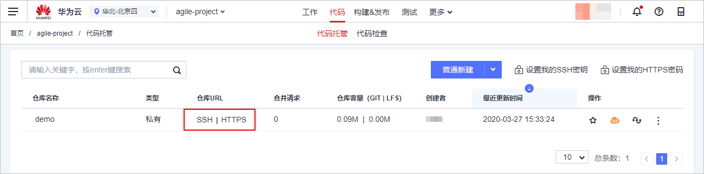

# **已有代码迁移**<a name="ZH-CN_TOPIC_0226742972"></a>

本小节介绍如何通过Git Bash终端将代码库从GitLab迁移至CodeHub，操作流程主要包括两步：

第一步：将GitLab服务器代码克隆或下载到本地。

第二步：将本地代码推送至CodeHub服务器。

## **密码/密钥配置**<a name="section5685172114610"></a>

使用CodeHub前，需要配置SSH密钥或HTTPS密码。**SSH密钥**是使用SSH协议和代码托管服务端交互的凭证，**HTTPS密码**是使用HTTPS协议和代码托管服务端交互的凭证。Git终端用户必须配置其中一种协议才能和CodeHub进行交互，详细配置可以参考华为云指导[设置SSH密钥/HTTPS密码](https://support.huaweicloud.com/usermanual-codehub/devcloud_hlp_00083.html)。

## **代码仓库迁移**<a name="section99313231117"></a>

企业迁移代码库一般也包括两种场景：

-   场景一：迁移代码并保留完整LOG、标签等信息。

    ```
    git clone GitLab仓库地址    #克隆GitLab仓库到本地cd 仓库文件夹    #进入本地仓库git remote -v    #查看当前远端仓库地址（应为GitLab仓库地址）git remote remove origin > /dev/null 2>&1    #移除远端地址git remote add origin CodeHub仓库地址    #添加CodeHub仓库地址为远端地址git push -u origin --all -fgit push -u origin --tags -f    #推送本地代码至CodeHub
    ```

-   只迁移代码。

    先手动将代码从GitLab服务器中下载到本地，并解压缩，此时本地代码库并没有进行Git版本管理。

    ```
    cd 仓库文件夹    #进入本地仓库git init    #初始化git仓库git remote add origin CodeHub仓库地址    #添加CodeHub仓库地址为远端地址git remote -v    #查看当前远端仓库地址（应为CodeHub仓库地址）git add -a     
    git commit -m "Initial commit"        
    git push -u origin master    #推送本地代码至CodeHub
    ```


CodeHub仓库地址通过代码仓库列表中的“仓库URL“获取。



