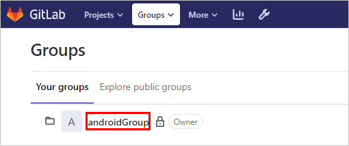
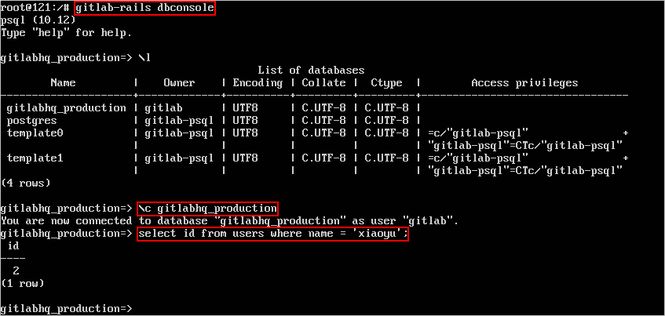
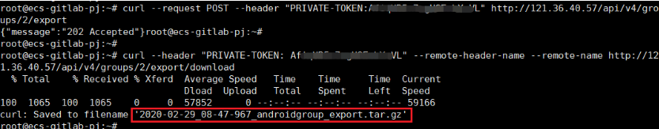
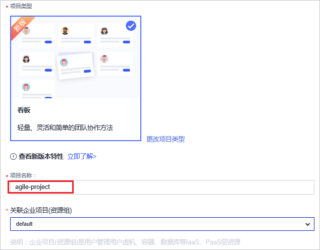
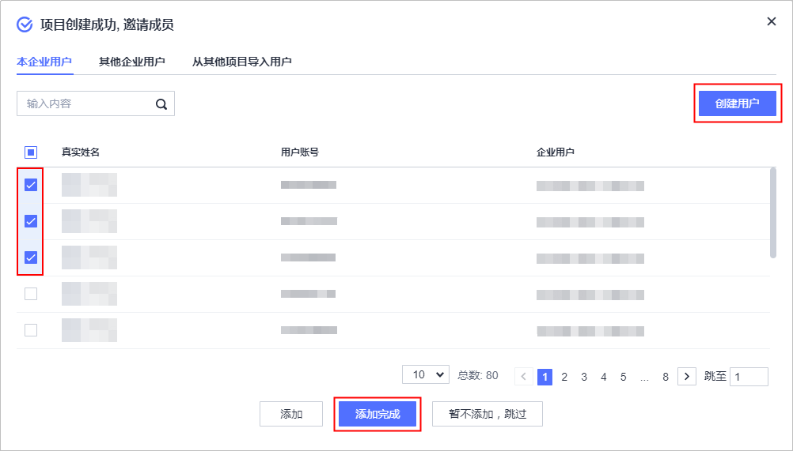
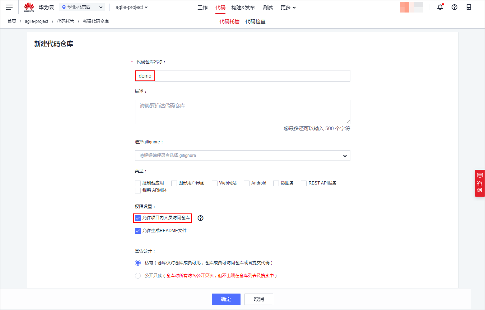
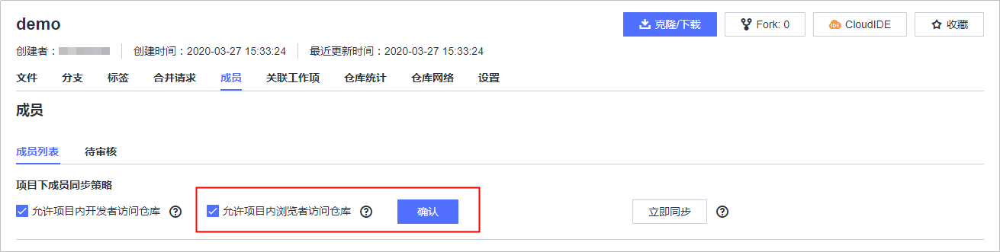
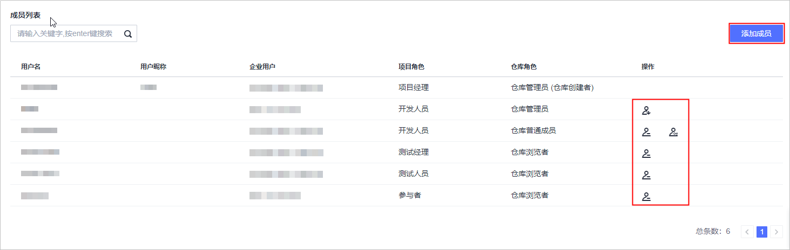

# **项目成员迁移**

## **项目成员迁移流程**

项目成员迁移需要先从GitLab中导出已有的群组信息，并根据DevCloud支持的角色重新划分成员角色，从而将已有成员迁移至DevCloud。

1.  [步骤1：获取GitLab群组信息](#section963518481815)

    项目成员迁移需要先从GitLab中导出已有的群组信息，此步骤提供了界面以及接口两种方式，帮助您获取已有GitLab群组信息。

2.  [步骤2：创建项目](#section3511530113416)

    在DevCloud服务中创建用于成员管理的项目。

3.  [步骤3：创建代码仓库](#section9872141515348)

    创建代码仓库用于存放代码。

4.  [步骤4：创建DevCloud角色](#section415613563515)

    根据已有成员规划在DevCloud中的成员角色，并在DevCloud在创建对应角色。

## **步骤1：获取GitLab群组信息**

-   **方法一：手动导出群组信息**

    此方法适合群组成员信息规模较小的情况。

    1.  进入GitLab群组中，如名为““androidGroup”“的群组。

        

    2.  进入androidGroup群组，在Members中查看群组所有成员信息应该包括Existing shares和Pending下的成员姓名、邮箱、角色等。

        

-   **方法二：API接口导出群组信息**

    1.  获取群组Owner用户的Private Token和id。下图在GitLab服务器中获取名为“xiaoyu”用户的id步骤。

        

    2.  通过curl命令导出群组信息压缩包，解压后可查看详细信息。下图为通过两条curl命令导出群组信息示例。

        

    更多操作指导，请参考GitLab官方参考链接[https://docs.gitlab.com/ee/api/group\_import\_export.html](https://docs.gitlab.com/ee/api/group_import_export.html)。

## **步骤2：创建项目**

项目是DevCloud的项目管理单位，每个项目下可以创建多个Git代码仓库，为了保证代码安全，项目成员访问代码仓库需要二次授权，就是说项目中的开发者只能看到自己被加入的仓库代码。

1.  使用华为云账号登录[DevCloud](https://devcloud.cn-north-4.huaweicloud.com/home)。
2.  在页面左上角根据您业务所在区域就近选择区域，可减少网络时延，提高访问速度；不同区域的软件开发服务之间内网互不相通。

    例如您当前在北京，区域可以就近选择“华北-北京四”。

    

3.  单击页面右上角“新建项目“，创建新的项目。

    DevCloud支持Scrum和看板两种项目类型，由于迁移源GitLab仓库管理较为简单，选择看板项目即可。

    

4.  项目创建成功后，会直接跳转到“成员管理“界面中添加成员。

    1.  如果“本企业用户“下已有需要添加的用户，直接勾选账号添加即可。
    2.  如果还没有成员，则单击右上角“创建用户“跳转到统一身份认证服务IAM中，根据GitLab导出的用户进行创建。创建方法请参见[创建IAM用户](https://support.huaweicloud.com/usermanual-iam/iam_02_0001.html)。

    

    > **说明：**   
    >1.  当项目中的成员数量等于5人时，不收取费用，当超过5人后，需要购买套餐才可以继续使用，套餐详情请参见[产品价格详情](https://www.huaweicloud.com/pricing.html?tab=detail#/devcloud)。  
    >2.  新账号创建看板项目成功后，会看到弹框提示输入真实姓名，需完成此设置后才能添加项目成员。  

## **步骤3：创建代码仓库**

完成项目创建后，请为项目创建代码仓库，用于存放代码。

1.  进入项目，单击页面上方导航“代码  \>  代码托管“，进入代码托管服务。
2.  单击右上角“普通新建“按钮，输入代码仓库名称，并勾选“允许项目内人员访问仓库“，单击“确定“保存。

    项目内的项目经理、开发人员会被加入到代码仓库中，具有操作权限。

    

3.  为代码仓库添加只读成员。

    单击仓库名称进入代码仓库，选择“成员“页签，勾选“允许项目内的浏览者访问仓库“，单击“确认“保存。

    单击“立即同步“，项目内测试经理、测试人员、浏览者、参与者会被加入代码仓库，具有只读权限。

    

## **步骤4：创建DevCloud角色**

DevCloud支持多种角色，提供了基于角色的隔离权限。同一个项目中的成员，根据项目角色的不同，可以拥有不同的权限。您可以根据自己的实际情况为群组中的成员划分角色。

GitLab中包含五种角色，分别为Owner、Master、Developer、Reporter、Guest。而DevCloud中 项目成员可以设置为七种角色，分别为：项目创建者、项目经理、测试经理、开发人员、测试人员、参与者、浏览者（不同权限角色的权限请参见[项目管理-角色与操作](https://support.huaweicloud.com/usermanual-projectman/projetcman_ug_3001.html)）。DevCloud角色分类比GitLab存在差异，无法完全对应。建议参照下表为DevCloud项目成员设置角色，角色设置方法请参见[项目管理-设置项目角色](https://support.huaweicloud.com/usermanual-projectman/devcloud_hlp_00026.html#section8)。若DevCloud提供的默认角色不符合您的需求，您可以通过“更多  \>  权限配置“添加角色。

<table><thead align="left"><tr id="row18511428175513"><th class="cellrowborder" valign="top" width="50%" id="mcps1.1.3.1.1">
GitLab角色

</th>
<th class="cellrowborder" valign="top" width="50%" id="mcps1.1.3.1.2">
DevCloud角色

</th>
</tr>
</thead>
<tbody><tr id="row18521328185518"><td class="cellrowborder" valign="top" width="50%" headers="mcps1.1.3.1.1 ">
Owner/Master

</td>
<td class="cellrowborder" valign="top" width="50%" headers="mcps1.1.3.1.2 ">
项目经理

</td>
</tr>
<tr id="row95222812558"><td class="cellrowborder" valign="top" width="50%" headers="mcps1.1.3.1.1 ">
Developer

</td>
<td class="cellrowborder" valign="top" width="50%" headers="mcps1.1.3.1.2 ">
开发人员

</td>
</tr>
<tr id="row16525287554"><td class="cellrowborder" valign="top" width="50%" headers="mcps1.1.3.1.1 ">
Reporter

</td>
<td class="cellrowborder" valign="top" width="50%" headers="mcps1.1.3.1.2 ">
测试人员

</td>
</tr>
<tr id="row131519395566"><td class="cellrowborder" valign="top" width="50%" headers="mcps1.1.3.1.1 ">
Guest

</td>
<td class="cellrowborder" valign="top" width="50%" headers="mcps1.1.3.1.2 ">
参与者/浏览者

</td>
</tr>
</tbody>
</table>

此外，为了保障代码安全，代码托管服务有更进步一步的成员管理。代码托管提供三种角色：仓库管理员 、仓库普通成员、仓库浏览者。

在代码仓库成员界面，单击右上角“添加成员“，可将项目成员拉入代码仓库。

项目成员加入代码仓库时，项目角色与仓库角色的映射关系、以及三种仓库角色的操作权限请参考[代码托管-基础角色权限](https://support.huaweicloud.com/usermanual-codehub/codehub_hlp_0005.html#section0)。

单击可以将仓库普通成员升级为仓库管理员，单击可以将仓库管理员降级为仓库普通成员，单击可以删除仓库成员。

