# **已有代码迁移**<a name="ZH-CN_TOPIC_0235814001"></a>

## **SVN目录结构**<a name="section3193102111509"></a>

本文档要迁移的SVN代码仓库（KotlinGallery）及目录结构如下图所示：

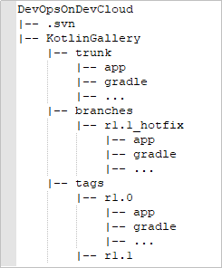

这是一个标准的SVN布局，trunk为主开发目录，branches为分支开发目录，tags为tag存档目录（不允许修改）。但是具体这几个目录应该如何使用，svn并没有明确的规范，更多的还是用户自己的习惯。

本文档提供两种方法进行SVN已有代码迁移，用户可根据自己的实际场景进行选用。本文档建议的使用方式如下：

-   项目研发过程中-部分代码：建议使用[迁移方法一：GitBash客户端导入](#section358022155619)进行迁移。
-   项目完成后-完整代码：建议使用[迁移方法二：HTTP在线导入](#section1566655328)进行迁移。

## **迁移方法一：GitBash客户端导入**<a name="section358022155619"></a>

-   **步骤1：获取SVN代码库提交者信息**
    1.  通过TortoiseSVN将待迁移的代码仓库下载到本地。
    2.  进入本地SVN代码仓库（本文为KotlinGallery），在Git Bash客户端执行如下命令：

        ```
        svn log --xml | grep "^<author" | sort -u | \awk -F '<author>' '{print $2}' | awk -F '</author>' '{print $1}' > userinfo.txt
        ```

        执行完毕后，该目录下出现文件“userinfo.txt“。：

        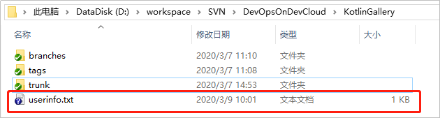

    3.  打开文件“userinfo.txt“，可看到文件中显示所有对该仓库又提交的提交者信息。

        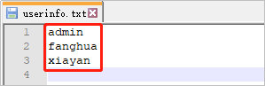

    4.  因为Git是用邮箱来标识一个提交者的，为了更好的将SVN已有的信息映射到 Git 仓库里，需要从SVN用户名到Git作一个映射关系。

        修改“userinfo.txt“，使每一行中，svn作者 = Git作者昵称 <邮箱地址\>，用如下格式表示映射关系：

        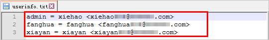


-   **步骤2：建立本地Git仓库**
    1.  在本地新建一个空的Git仓库目录，并将步骤1中的“userinfo.txt“文件拷贝到该目录下。

        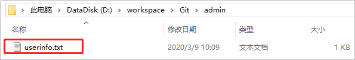

    2.  在该目录下启动GitBash客户端，并执行如下命令克隆一个Git版本库。其中，“svn://XXX.XXX.XXX.XXX/DevOpsOnDevCloud/KotlinGallery“替换为您要迁移的SVN仓库地址。

        ```
        git svn clone svn://XXX.XXX.XXX.XXX/DevOpsOnDevCloud/KotlinGallery --no-metadata --authors-file=userinfo.txt --trunk=trunk --tags=tags --branches=branches
        ```

        命令行中的参数，说明如下（用户在迁移过程中，根据实际情况选择相应参数即可）:

        <a name="table262264791919"></a>
        <table><thead align="left"><tr id="row12622847141914"><th class="cellrowborder" valign="top" width="25%" id="mcps1.1.3.1.1"><p id="p16221947151916"><a name="p16221947151916"></a><a name="p16221947151916"></a><strong id="b14881597197"><a name="b14881597197"></a><a name="b14881597197"></a>参数</strong></p>
        </th>
        <th class="cellrowborder" valign="top" width="75%" id="mcps1.1.3.1.2"><p id="p66229478192"><a name="p66229478192"></a><a name="p66229478192"></a><strong id="b121011359181916"><a name="b121011359181916"></a><a name="b121011359181916"></a>说明</strong></p>
        </th>
        </tr>
        </thead>
        <tbody><tr id="row8622174717197"><td class="cellrowborder" valign="top" width="25%" headers="mcps1.1.3.1.1 "><p id="p562294712195"><a name="p562294712195"></a><a name="p562294712195"></a>–-no-metadata</p>
        </td>
        <td class="cellrowborder" valign="top" width="75%" headers="mcps1.1.3.1.2 "><p id="p17622194761918"><a name="p17622194761918"></a><a name="p17622194761918"></a>阻止git导出SVN包含的一些无用信息。</p>
        </td>
        </tr>
        <tr id="row862216478194"><td class="cellrowborder" valign="top" width="25%" headers="mcps1.1.3.1.1 "><p id="p106224474195"><a name="p106224474195"></a><a name="p106224474195"></a>–-authors-file</p>
        </td>
        <td class="cellrowborder" valign="top" width="75%" headers="mcps1.1.3.1.2 "><p id="p1162218477192"><a name="p1162218477192"></a><a name="p1162218477192"></a>SVN账号映射到git账号文件，所有svn作者都要做映射。</p>
        </td>
        </tr>
        <tr id="row1462214474199"><td class="cellrowborder" valign="top" width="25%" headers="mcps1.1.3.1.1 "><p id="p1862216472199"><a name="p1862216472199"></a><a name="p1862216472199"></a>–-trunk</p>
        </td>
        <td class="cellrowborder" valign="top" width="75%" headers="mcps1.1.3.1.2 "><p id="p146220473199"><a name="p146220473199"></a><a name="p146220473199"></a>主开发项目</p>
        </td>
        </tr>
        <tr id="row166231447101912"><td class="cellrowborder" valign="top" width="25%" headers="mcps1.1.3.1.1 "><p id="p1262374715195"><a name="p1262374715195"></a><a name="p1262374715195"></a>–-branches</p>
        </td>
        <td class="cellrowborder" valign="top" width="75%" headers="mcps1.1.3.1.2 "><p id="p462316471198"><a name="p462316471198"></a><a name="p462316471198"></a>分支项目</p>
        </td>
        </tr>
        <tr id="row1623144791916"><td class="cellrowborder" valign="top" width="25%" headers="mcps1.1.3.1.1 "><p id="p10623194731913"><a name="p10623194731913"></a><a name="p10623194731913"></a>--tags</p>
        </td>
        <td class="cellrowborder" valign="top" width="75%" headers="mcps1.1.3.1.2 "><p id="p66231047121920"><a name="p66231047121920"></a><a name="p66231047121920"></a>标签</p>
        </td>
        </tr>
        </tbody>
        </table>

        执行成功后，本地生成一个Git仓库。

        

    3.  输入以下命令，进入“KotlinGallery“文件夹，并验证当前Git仓库分支结构

        ```
        cd KotlinGallery
        git branch -a
        ```

        可以看到所有SVN中的目录结构均以Git分支的形式迁移成功。

        


-   **步骤3：本地分支修正**

    在步骤2中，使用**git svn clone**命令将SVN仓库中tags文件夹也作为分支进行保存，这个明显不符合Git的使用规范，因此在上传到远端仓库前，我们先对本地分支进行调整，使之更符合Git使用规范。

    1.  在步骤2生成的本地Git仓库中，执行如下命令，把tags分支变成合适的Git 标签。

        ```
        cp -Rf .git/refs/remotes/origin/tags/* .git/refs/tags/
        rm -Rf .git/refs/remotes/origin/tags
        git branch -a
        git tag
        ```

        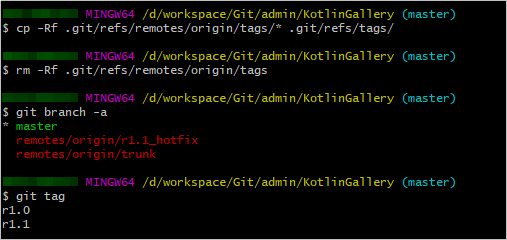

    2.  输入以下命令，把“refs/remotes“下面剩下的索引变成本地分支。

        ```
        cp -Rf .git/refs/remotes/origin/* .git/refs/heads/
        rm -Rf .git/refs/remotes/origin
        git branch -a
        git tag
        ```

        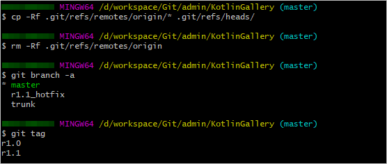

    3.  输入以下命令，将trunk分支合入master分支，并删除trunk分支。

        ```
        git merge trunk
        git branch -d trunk
        git branch -a
        git tag
        ```

        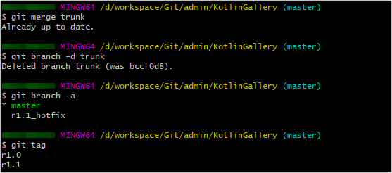


-   **步骤4：本地代码上传**
    1.  参考[设置SSH密钥/HTTPS密码](https://support.huaweicloud.com/usermanual-codehub/devcloud_hlp_00083.html)，设置代码仓库SSH密钥。
    2.  通过如下命令将本地仓库与CodeHub仓库进行关联，并推送master分支到Codehub。其中“git@codehub.devcloud.cn-north-4.huaweicloud.com:xx/KotlinGallery-SVN.“git为[项目成员迁移-步骤3](SVN迁移-项目成员迁移.md#section480644834912)的中创建的仓库地址。

        ```
        git remote add origin git@codehub.devcloud.cn-north-4.huaweicloud.com:xx/KotlinGallery-SVN.git
        git push --set-upstream origin master
        ```

        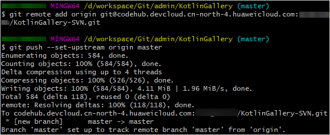

        推送成功后，登录CodeHub，可在“分支“页面中当前仓库下已有master分支。

        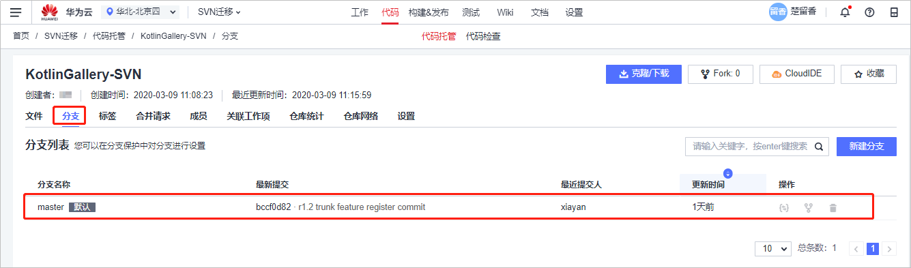

    3.  输入以下命令，从本地推送剩余分支至CodeHub。

        ```
        git push origin –-all
        ```

        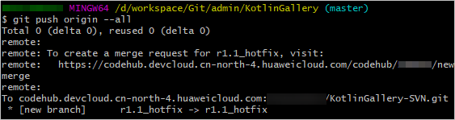

        推送成功后，可在CodeHub“分支“页面中查看到当前仓库下已有r1.1\_hotfix分支。

        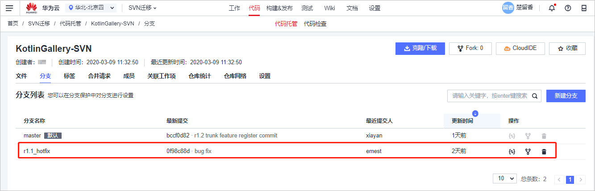

    4.  输入以下命令，从本地推送tags至CodeHub。

        ```
        git push origin --tags
        ```

        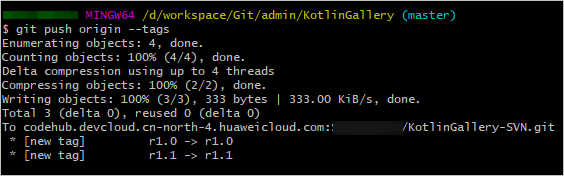

        推送成功后，可在CodeHub“标签“页面中查看到当前仓库下已有标签“r1.0“与“r1.1“。

        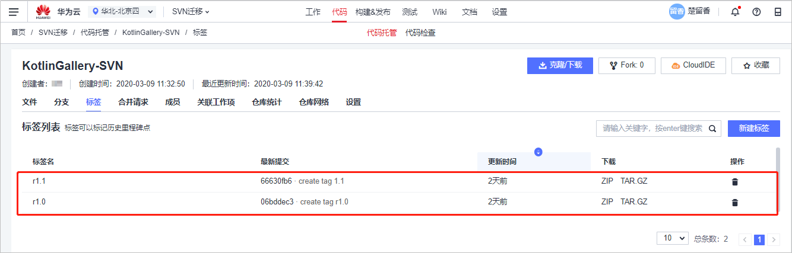


## **迁移方法二：HTTP在线导入**<a name="section1566655328"></a>

首先确保你的SVN服务器支持HTTP或HTTPS方式访问，可以在任一浏览器，输入“http或https+SVN服务器地址+访问仓库名称“进行验证。

本文案例如下图所示：

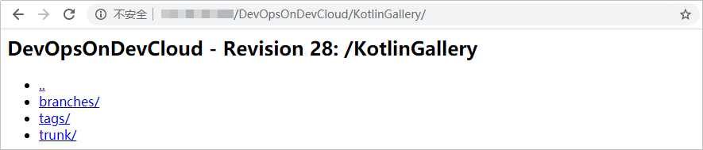

1.  进入在[项目成员迁移-步骤2](SVN迁移-项目成员迁移.md#section149687147492)中创建的项目，单击页面上方导航“代码  \>  代码托管“，进入代码托管服务。
2.  单击“普通新建“旁的箭头，在下拉列表中选择“导入外部仓库“。

    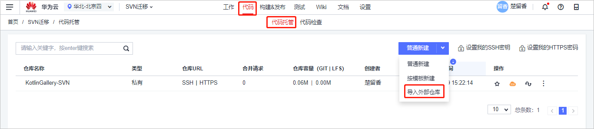

3.  填入要导入的SVN仓库地址，输入相应SVN用户名、密码，单击“下一步“。

    

4.  输入要新建的代码仓库名称，进行相应权限配置，单击“确定“，等待仓库创建。

    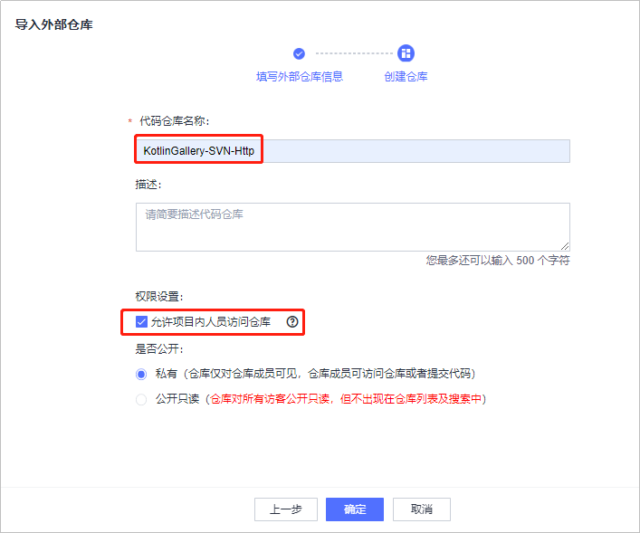

5.  代码仓库创建成功后，单击仓库名称查看仓库内容。

    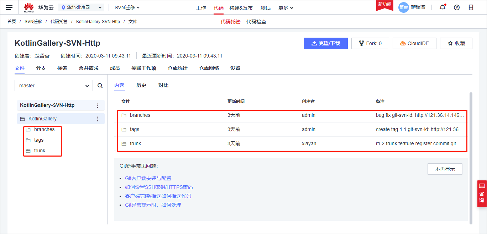


## **迁移方法小结**<a name="section105618314234"></a>

通过对比可以发现，本文里两种迁移方法都对SVN中的代码及操作记录进行了有效迁移，区别点在于方法一在迁移的过程中，将SVN中的branch、tag文件夹映射为Git中的分支及标签，这样做有利于后续继续基于DevCloud进行开发，但是迁移过程较为繁琐。方法二操作方式简单，但是将SVN中的branch、tag文件夹进行平移，不利于后续的继续开发。

