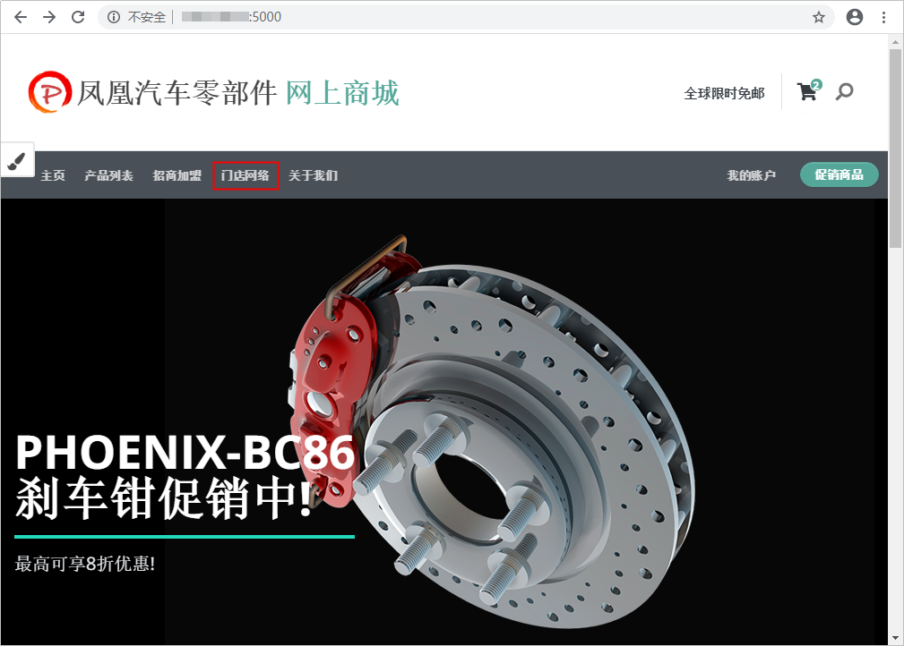

# HE2E DevOps实践介绍<a name="ZH-CN_TOPIC_0162964253"></a>

本文档基于微服务架构的应用程序“凤凰商城”，使用软件开发平台进行全流程管理。

## “凤凰商城”示例程序简介<a name="section105541453272"></a>

“凤凰商城”是一套汽车零部件配件电子商城示例代码。此套示例代码具有结构与逻辑简单、代码量少、技术栈丰富的特点，可以帮助开发者快速了解软件开发平台的各项特性以及使用微服务解决软件开发、测试和部署过程中可能遇到的各种问题。

-   **架构与业务场景**

    凤凰商城示例程序架构图如[图1](#fig185868554519)所示。

    **图 1**  凤凰商城技术架构图<a name="fig185868554519"></a>  
    

    示例程序由[表1](#table410464416303)中的5个可以独立开发、测试和部署的微服务组件构成。

    **表 1**  凤凰商城微服务组件表

    <a name="table410464416303"></a>
    <table><thead align="left"><tr id="row201041844103018"><th class="cellrowborder" valign="top" width="20%" id="mcps1.2.3.1.1"><p id="p13104134443018"><a name="p13104134443018"></a><a name="p13104134443018"></a>微服务组件</p>
    </th>
    <th class="cellrowborder" valign="top" width="80%" id="mcps1.2.3.1.2"><p id="p18104184416307"><a name="p18104184416307"></a><a name="p18104184416307"></a>说明</p>
    </th>
    </tr>
    </thead>
    <tbody><tr id="row10104154473015"><td class="cellrowborder" valign="top" width="20%" headers="mcps1.2.3.1.1 "><p id="p71041844163010"><a name="p71041844163010"></a><a name="p71041844163010"></a>Web用户端服务器（对应样例代码中的“Vote”功能）</p>
    </td>
    <td class="cellrowborder" valign="top" width="80%" headers="mcps1.2.3.1.2 "><a name="ul1917115203814"></a><a name="ul1917115203814"></a><ul id="ul1917115203814"><li>业务逻辑：用户可以通过浏览器访问此服务的WebUI。当用户在特定商品上单击<span class="uicontrol" id="uicontrol6818150181419"><a name="uicontrol6818150181419"></a><a name="uicontrol6818150181419"></a>“Like”</span>时，服务将用户所选择物品的记录保存在Redis缓存中。</li><li>技术栈：Python、Flask框架。</li><li>应用服务器：Gunicorn。</li></ul>
    </td>
    </tr>
    <tr id="row1810494473012"><td class="cellrowborder" valign="top" width="20%" headers="mcps1.2.3.1.1 "><p id="p6104154413303"><a name="p6104154413303"></a><a name="p6104154413303"></a>Web管理端服务器（对应样例代码中的“Result”功能）</p>
    </td>
    <td class="cellrowborder" valign="top" width="80%" headers="mcps1.2.3.1.2 "><a name="ul1175852101110"></a><a name="ul1175852101110"></a><ul id="ul1175852101110"><li>业务逻辑：用户可以通过浏览器访问此服务的WebUI，会动态显示用户端UI上用户单击<span class="uicontrol" id="uicontrol15412214181518"><a name="uicontrol15412214181518"></a><a name="uicontrol15412214181518"></a>“Like”</span>的统计数据，此数据来自PostgreSQL数据库。</li><li>技术栈：Node.js、express框架。</li><li>应用服务器：server.js。</li></ul>
    </td>
    </tr>
    <tr id="row1310415442309"><td class="cellrowborder" valign="top" width="20%" headers="mcps1.2.3.1.1 "><p id="p101041244133018"><a name="p101041244133018"></a><a name="p101041244133018"></a>后台订单批处理程序（对应样例代码中的“Worker”功能）</p>
    </td>
    <td class="cellrowborder" valign="top" width="80%" headers="mcps1.2.3.1.2 "><a name="ul5436132142315"></a><a name="ul5436132142315"></a><ul id="ul5436132142315"><li>业务逻辑：此服务为后台进程，会监控Redis缓存中物品记录，并将新纪录取出并保存在PostgreSQL数据库中，以便管理端UI可以抽取数据进行统计显示。</li><li>技术栈：.net core或者Java（此服务提供两种技术栈实现了同样的功能，可根据需要修改配置选择其中一个作为运行时进程）。</li></ul>
    </td>
    </tr>
    <tr id="row15104174416308"><td class="cellrowborder" valign="top" width="20%" headers="mcps1.2.3.1.1 "><p id="p1817773610373"><a name="p1817773610373"></a><a name="p1817773610373"></a>订单缓存（对应样例代码中的“Redis”功能）</p>
    </td>
    <td class="cellrowborder" valign="top" width="80%" headers="mcps1.2.3.1.2 "><p id="p133362138369"><a name="p133362138369"></a><a name="p133362138369"></a>业务逻辑：此服务作为用户端UI服务的数据持久化服务存在。</p>
    </td>
    </tr>
    <tr id="row111041444143018"><td class="cellrowborder" valign="top" width="20%" headers="mcps1.2.3.1.1 "><p id="p06011338203720"><a name="p06011338203720"></a><a name="p06011338203720"></a>订单数据库（对应样例代码中的“PostgreSQL”功能）</p>
    </td>
    <td class="cellrowborder" valign="top" width="80%" headers="mcps1.2.3.1.2 "><p id="p1210424413307"><a name="p1210424413307"></a><a name="p1210424413307"></a>业务逻辑：此服务作为管理端UI服务的数据源。</p>
    </td>
    </tr>
    </tbody>
    </table>

-   **页面展示**
    -   **用户端UI**：默认使用“http://localhost:5000“地址，即可打开如[图2](#fig1559113115454)所示页面。

        **图 2**  用户端UI<a name="fig1559113115454"></a>  
        

    -   **管理端UI**：默认使用“http://localhost:5001“地址，即可打开如[图3](#fig123831940124617)所示页面。

        **图 3**  管理端UI<a name="fig123831940124617"></a>  
        


-   **调试、测试、打包和部署方式**

    示例程序全部使用Docker进行打包和部署，并使用**docker-compose**作为配置文件的基本格式。

    本地调试可以使用以下命令（确保在代码库的根目录中执行）：

    ```
    docker-compose up
    ```


## “DevOps全流程样例项目”简介<a name="section832616561436"></a>

软件开发平台提供了一个样例项目“DevOps全流程样例项目“来承载“凤凰商城”示例程序，本文档通过此样例项目讲解软件研发生命周期的操作。

“DevOps全流程样例项目”是一个Scrum类型的模板项目，项目中预置了部分软件开发平台服务的使用模板。项目实践过程中涉及到的产品及服务如[表2](#table14798674720)。

**表 2**  实践涉及产品/服务列表

<a name="table14798674720"></a>
<table><thead align="left"><tr id="row14801166470"><th class="cellrowborder" colspan="2" valign="top" id="mcps1.2.4.1.1"><p id="p5480186184712"><a name="p5480186184712"></a><a name="p5480186184712"></a>服务</p>
</th>
<th class="cellrowborder" valign="top" id="mcps1.2.4.1.2"><p id="p13480166204717"><a name="p13480166204717"></a><a name="p13480166204717"></a>说明</p>
</th>
</tr>
</thead>
<tbody><tr id="row1848020617475"><td class="cellrowborder" rowspan="9" valign="top" width="20%" headers="mcps1.2.4.1.1 "><p id="p1348011694713"><a name="p1348011694713"></a><a name="p1348011694713"></a>DevCloud使用模板</p>
</td>
<td class="cellrowborder" valign="top" width="19.96%" headers="mcps1.2.4.1.1 "><p id="p348012613479"><a name="p348012613479"></a><a name="p348012613479"></a><a href="https://www.huaweicloud.com/product/projectman.html" target="_blank" rel="noopener noreferrer">项目管理</a></p>
</td>
<td class="cellrowborder" valign="top" width="60.040000000000006%" headers="mcps1.2.4.1.2 "><p id="p14480168477"><a name="p14480168477"></a><a name="p14480168477"></a>预置项目的整体需求规划图、3个已规划并已完成的迭代、项目的模块设置、以及若干统计报表。</p>
</td>
</tr>
<tr id="row1148036124713"><td class="cellrowborder" valign="top" headers="mcps1.2.4.1.1 "><p id="p8480136194718"><a name="p8480136194718"></a><a name="p8480136194718"></a><a href="https://www.huaweicloud.com/product/codehub.html" target="_blank" rel="noopener noreferrer">代码托管</a></p>
</td>
<td class="cellrowborder" valign="top" headers="mcps1.2.4.1.1 "><p id="p54802684712"><a name="p54802684712"></a><a name="p54802684712"></a>预置代码仓库phoenix-sample，存放“凤凰商城”项目代码。</p>
</td>
</tr>
<tr id="row1548017613473"><td class="cellrowborder" valign="top" headers="mcps1.2.4.1.1 "><p id="p8480467472"><a name="p8480467472"></a><a name="p8480467472"></a><a href="https://www.huaweicloud.com/product/codecheck.html" target="_blank" rel="noopener noreferrer">代码检查</a></p>
</td>
<td class="cellrowborder" valign="top" headers="mcps1.2.4.1.1 "><p id="p2480176164715"><a name="p2480176164715"></a><a name="p2480176164715"></a>预置4个代码检查任务，任务详情介绍请参见<a href="步骤五-检查项目代码.md">步骤五：检查项目代码</a>。</p>
</td>
</tr>
<tr id="row19480146174711"><td class="cellrowborder" valign="top" headers="mcps1.2.4.1.1 "><p id="p348066164717"><a name="p348066164717"></a><a name="p348066164717"></a><a href="https://www.huaweicloud.com/product/cloudbuild.html" target="_blank" rel="noopener noreferrer">编译构建</a></p>
</td>
<td class="cellrowborder" valign="top" headers="mcps1.2.4.1.1 "><p id="p1648076104713"><a name="p1648076104713"></a><a name="p1648076104713"></a>预置5个编译构建任务，任务详情介绍请参见<a href="步骤六-构建应用.md">步骤六：构建应用</a>。</p>
</td>
</tr>
<tr id="row114802619471"><td class="cellrowborder" valign="top" headers="mcps1.2.4.1.1 "><p id="p17480116134716"><a name="p17480116134716"></a><a name="p17480116134716"></a><a href="https://www.huaweicloud.com/product/clouddeploy.html" target="_blank" rel="noopener noreferrer">部署</a></p>
</td>
<td class="cellrowborder" valign="top" headers="mcps1.2.4.1.1 "><p id="p1448086164716"><a name="p1448086164716"></a><a name="p1448086164716"></a>预置3个部署任务，任务详情介绍请参见<a href="步骤七-部署应用（弹性云服务器篇）.md">步骤七：部署应用（弹性云服务器篇）</a>。</p>
</td>
</tr>
<tr id="row448020664717"><td class="cellrowborder" valign="top" headers="mcps1.2.4.1.1 "><p id="p84800614711"><a name="p84800614711"></a><a name="p84800614711"></a><a href="https://www.huaweicloud.com/product/cloudtest.html" target="_blank" rel="noopener noreferrer">云测</a></p>
</td>
<td class="cellrowborder" valign="top" headers="mcps1.2.4.1.1 "><p id="p4480126104715"><a name="p4480126104715"></a><a name="p4480126104715"></a>功能测试用例库，包含十余个测试用例。</p>
</td>
</tr>
<tr id="row7480186114714"><td class="cellrowborder" valign="top" headers="mcps1.2.4.1.1 "><p id="p4480146204716"><a name="p4480146204716"></a><a name="p4480146204716"></a><a href="https://www.huaweicloud.com/product/cloudpipeline.html" target="_blank" rel="noopener noreferrer">流水线</a></p>
</td>
<td class="cellrowborder" valign="top" headers="mcps1.2.4.1.1 "><p id="p44812674717"><a name="p44812674717"></a><a name="p44812674717"></a>预置5个流水线任务，任务详情介绍请参见<a href="步骤八-配置流水线-实现持续交付.md">步骤八：配置流水线，实现持续交付</a>。</p>
</td>
</tr>
<tr id="row1511784218238"><td class="cellrowborder" valign="top" headers="mcps1.2.4.1.1 "><p id="p91198425234"><a name="p91198425234"></a><a name="p91198425234"></a><a href="https://www.huaweicloud.com/product/cloudide.html" target="_blank" rel="noopener noreferrer">CloudIDE</a></p>
</td>
<td class="cellrowborder" valign="top" headers="mcps1.2.4.1.1 "><p id="p1666816411242"><a name="p1666816411242"></a><a name="p1666816411242"></a>用于开发项目代码。</p>
</td>
</tr>
<tr id="row246217422237"><td class="cellrowborder" valign="top" headers="mcps1.2.4.1.1 "><p id="p346214210235"><a name="p346214210235"></a><a name="p346214210235"></a><a href="https://www.huaweicloud.com/product/cloudrelease.html" target="_blank" rel="noopener noreferrer">发布</a></p>
</td>
<td class="cellrowborder" valign="top" headers="mcps1.2.4.1.1 "><p id="p146244292319"><a name="p146244292319"></a><a name="p146244292319"></a>用于存储通过编译构建任务生成的软件包。</p>
</td>
</tr>
<tr id="row3870742152312"><td class="cellrowborder" rowspan="4" valign="top" width="20%" headers="mcps1.2.4.1.1 "><p id="p128701542152315"><a name="p128701542152315"></a><a name="p128701542152315"></a>其它华为云组件和服务</p>
</td>
<td class="cellrowborder" valign="top" width="19.96%" headers="mcps1.2.4.1.1 "><p id="p98701142152314"><a name="p98701142152314"></a><a name="p98701142152314"></a><a href="https://www.huaweicloud.com/product/iam.html" target="_blank" rel="noopener noreferrer">统一身份认证服务IAM</a></p>
</td>
<td class="cellrowborder" valign="top" width="60.040000000000006%" headers="mcps1.2.4.1.2 "><p id="p587012424236"><a name="p587012424236"></a><a name="p587012424236"></a>用于管理帐号。</p>
</td>
</tr>
<tr id="row828784313238"><td class="cellrowborder" valign="top" headers="mcps1.2.4.1.1 "><p id="p1728704372314"><a name="p1728704372314"></a><a name="p1728704372314"></a><a href="https://www.huaweicloud.com/product/swr.html" target="_blank" rel="noopener noreferrer">容器镜像服务SWR</a></p>
</td>
<td class="cellrowborder" valign="top" headers="mcps1.2.4.1.1 "><p id="p1273218111258"><a name="p1273218111258"></a><a name="p1273218111258"></a>用于存放编译构建任务中生成的Docker镜像。</p>
</td>
</tr>
<tr id="row1641359122410"><td class="cellrowborder" valign="top" headers="mcps1.2.4.1.1 "><p id="p1966859132413"><a name="p1966859132413"></a><a name="p1966859132413"></a><a href="https://www.huaweicloud.com/product/ecs.html" target="_blank" rel="noopener noreferrer">弹性云服务器ECS</a></p>
</td>
<td class="cellrowborder" valign="top" headers="mcps1.2.4.1.1 "><p id="p106610599249"><a name="p106610599249"></a><a name="p106610599249"></a>用于软件包部署。</p>
</td>
</tr>
<tr id="row18836155910246"><td class="cellrowborder" valign="top" headers="mcps1.2.4.1.1 "><p id="p1783785922416"><a name="p1783785922416"></a><a name="p1783785922416"></a><a href="https://www.huaweicloud.com/product/cce.html" target="_blank" rel="noopener noreferrer">云容器引擎CCE</a></p>
</td>
<td class="cellrowborder" valign="top" headers="mcps1.2.4.1.1 "><p id="p128373592247"><a name="p128373592247"></a><a name="p128373592247"></a>用于软件包部署，与ECS部署属于两种不同的部署方式。</p>
</td>
</tr>
</tbody>
</table>

## 实践流程<a name="section1636192817598"></a>

本文档将按照以下步骤介绍HE2E DevOps实践的操作流程。

1.  准备实践环境。

    请参照[实践准备工作](实践准备工作.md)完成实践前的准备，包括：

    -   注册帐号并实名认证。
    -   为项目成员分配帐号。
    -   创建项目、添加项目成员。

2.  管理项目规划。

    请参照[步骤一：管理项目规划](步骤一-管理项目规划.md)完成以下项目规划操作：

    -   管理需求规划。
    -   管理迭代规划。
    -   监控和跟踪项目状态。

3.  管理项目配置。

    请参照[步骤二：管理项目配置](步骤二-管理项目配置.md)完成以下项目设置：

    -   管理项目通知。
    -   定制项目工作流程。

4.  开发项目代码。

    请参照[步骤四：开发项目代码](步骤四-开发项目代码.md)完成以下代码开发过程：

    -   使用分支管理项目代码。
    -   使用CloudIDE修改和提交代码。
    -   检视代码、合并分支。

5.  检查项目代码。

    请参照[步骤五：检查项目代码](步骤五-检查项目代码.md)对代码进行静态检查，主要操作包括：

    -   配置并执行代码检查任务。
    -   查看代码检查结果。

6.  构建应用

    请参照[步骤六：构建应用](步骤六-构建应用.md)配置编译构建任务，包括：

    -   配置并执行编译构建任务。
    -   设置提交代码触发自动编译。
    -   设置定时执行编译构建任务。

7.  部署应用。

    软件开发平台支持部署应用至弹性云服务器或云容器引擎，请根据需要选择。

    -   [步骤七：部署应用（弹性云服务器篇）](步骤七-部署应用（弹性云服务器篇）.md)。
    -   [步骤七：部署应用（云容器引擎篇）](步骤七-部署应用（云容器引擎篇）.md)。

8.  创建流水线

    请参照[步骤八：配置流水线，实现持续交付](步骤八-配置流水线-实现持续交付.md)创建并配置流水线，包括：

    -   配置并执行流水线。
    -   配置质量门禁。
    -   配置代码变更自动触发流水线。

9.  释放资源

    完成实践全部操作后，请参照[释放资源](释放资源.md)释放不需要的资源，包括：

    -   删除项目。
    -   删除集群。


