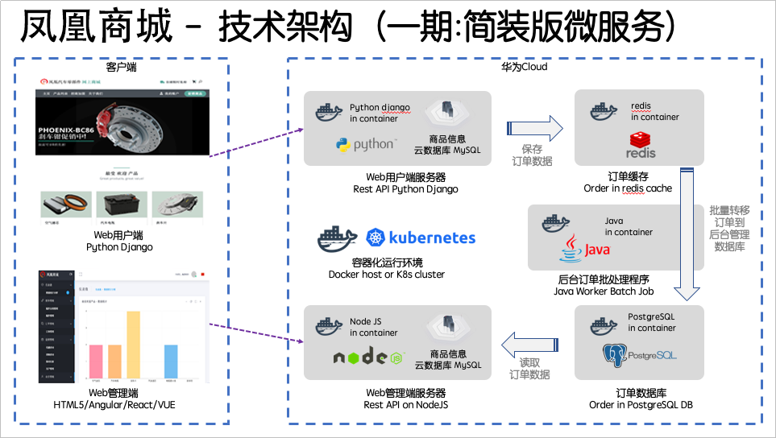

# **HE2E DevOps实践流程**<a name="devcloud_practice_2009"></a>

本文档使用DevCloud进行全流程管理，当前实验场景涉及到以下主要模块：

-   [项目管理](https://support.huaweicloud.com/projectman/index.html)
-   [云测](https://support.huaweicloud.com/cloudtest/index.html)
-   [代码托管](https://support.huaweicloud.com/codehub/index.html)
-   [代码检查](https://support.huaweicloud.com/codecheck/index.html)
-   [编译构建](https://support.huaweicloud.com/cloudbuild/index.html)
-   [部署](https://support.huaweicloud.com/clouddeploy/index.html)
-   [流水线](https://support.huaweicloud.com/cloudpipeline/index.html)
-   [开源镜像站](https://mirrors.huaweicloud.com/)

以及以下组件和服务：

-   [容器镜像服务 SWR](https://www.huaweicloud.com/product/swr.html)
-   [云容器引擎 CCE](https://www.huaweicloud.com/product/cce.html)

本文档基于微服务架构的应用程序【凤凰商城】，在整个实验场景中我们将围绕此套代码完成软件研发的整个生命周期的操作。

为了更方便的进行本实验，DevCloud提供了一个样例项目“DevOps全流程样例项目“，本文档将通过此样例项目进行各练习的讲解。

## **【凤凰商城】示例程序简介**<a name="section105541453272"></a>

【凤凰商城】是一套电子商务商城示例代码。此套示例代码具有结构复杂，逻辑简单，代码量少，技术栈丰富的特点，可以帮助开发者快速学习华为DevCloud的各项特性以及使用微服务进行软件开发，测试和部署过程中可能遇到的各种问题。

-   **架构与业务场景**

    凤凰商城示例程序由5个可以独立开发，测试和部署的微服务组件构成，分别为：

    -   用户端UI服务（对应样例代码中的“Vote”功能）
        -   业务逻辑：用户可以通过浏览器访问此服务的WebUI，并在特定商品上单击Like按钮。服务将用户所选择物品的记录保存在Redis缓存中。
        -   技术栈：Python， Flask框架。
        -   应用服务器：Gunicorn。

    -   管理端UI服务（对应样例代码中的“Result”功能）
        -   业务逻辑：用户可以通过浏览器访问此服务的WebUI，会动态显示用户端UI上用户单击Like按钮的统计数据。此数据来自PostgreSQL数据库。
        -   技术栈：Node.js， express框架。
        -   应用服务器：server.js。

    -   工作进程服务（对应样例代码中的“Worker”功能）
        -   此服务为后台进程，会监控redis缓存中物品记录，并将新纪录取出并保存在PostgreSQL数据库中，以便管理端UI可以抽取数据进行统计显示。
        -   技术栈：.net core 或者 Java（此服务提供2种技术栈实现了同样的功能，可根据需要修改配置选择其中一个座位运行时进程）

    -   Redis缓存
        -   业务逻辑：此服务作为用户端UI服务的数据持久化服务存在。

    -   PostgreSQL数据库

        -   业务逻辑：此服务作为管理端UI服务的数据源。

        

          


-   **页面展示**
    -   **用户端UI**：默认使用“http://localhost:5000“地址。

        

          

    -   **管理端UI**：默认使用“http://localhost:5001“地址。

        

          


-   **调试、测试、打包和部署方式**

    示例程序全部使用Docker进行打包和部署，并使用**docker-compose**作为配置文件的基本格式。

    本地调试可以使用以下命令（确保在代码库根中执行）：

    ```
    docker-compose up
    ```


## **实验场景列表**<a name="section1099423482914"></a>

以下是当前提供的实验场景文档链接，您可以跟随这些链接、配合示例程序源代码完成DevCloud的端到端场景操作。

-   [练习一：使用DevCloud进行敏捷项目规划](使用DevCloud进行敏捷项目规划.md)
    -   使用Scrum项目模板进行项目规划，并管理Epic和Feature
    -   使用Scrum项目模板管理Backlog并进行迭代开发
    -   使用效率工具监控和跟踪项目状态

-   [练习二：使用DevCloud管理项目配置](使用DevCloud管理项目配置.md)
    -   维护项目基本信息，成员和通知功能
    -   定制项目工作流程

-   [练习三：使用DevCloud进行敏捷测试管理](使用DevCloud进行敏捷测试管理.md)
    -   使用追溯视图进行需求驱动的测试
    -   测试管理相关设置
    -   使用DevCloud执行手工测试

-   [练习四：使用Git代码托管支撑敏捷团队持续交付](使用Git代码托管支撑敏捷团队持续交付.md)
    -   使用Git修改和提交代码
    -   使用Git分支+合并请求方式提交代码并进行代码检视
    -   使用代码托管的高级管理功能

-   [练习五：使用静态代码检查确保编码规范的有效落地](使用静态代码检查确保编码规范的有效落地.md)
    -   为示例项目配置代码检查任务并执行
    -   分析代码检查结果并修复问题
    -   配置和管理代码检查规则集

-   [练习六：使用持续集成，加快代码质量反馈速度](使用持续集成-加快代码质量反馈速度.md)
    -   使用自动化编译提高代码质量验证速度
    -   配置持续集成并通过提交代码触发自动化编译
    -   使用内置的Maven任务改进自动化编译
    -   配置通知第一时间获取编译结果

-   [练习七：使用持续发布，在代码更新后自动完成应用部署](使用持续发布-在代码更新后自动完成应用部署（ECS篇）.md)
    -   使用自动化部署实现一键发布

-   [练习八：构建持续交付流水线，串接代码托管、代码检查、编译构建和自动化发布](构建持续交付流水线-串接代码托管-代码检查-编译构建和自动化发布.md)
    -   配置流水线串接代码检查、编译构建和自动化部署步骤
    -   更新流水线配置，实现代码版更触发的持续交付流水线


  

