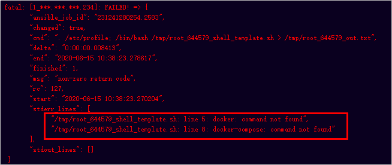
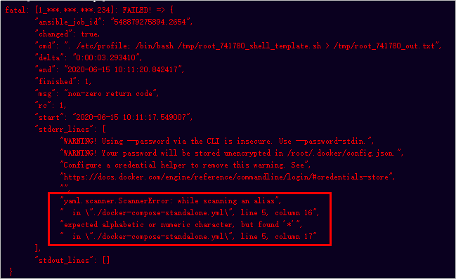
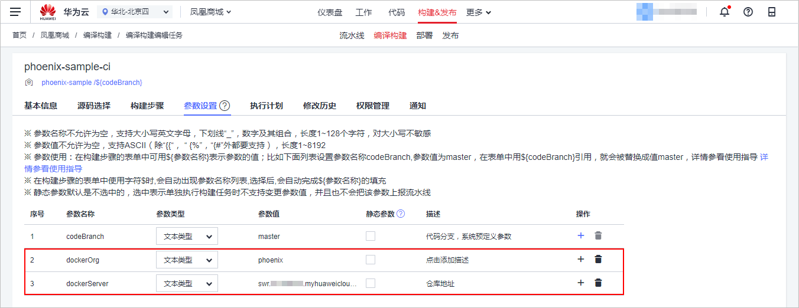
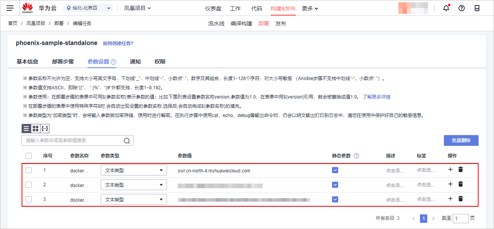
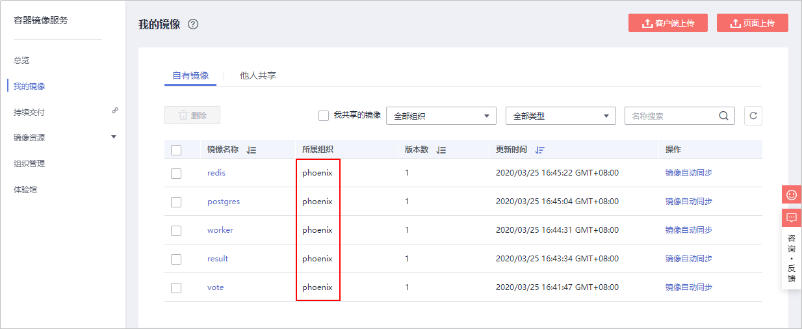

# **HE2E DevOps实践项目部署失败常见问题汇总**<a name="devcloud_practice_2012"></a>

## **主机系统问题**<a name="section91323541792"></a>

-   **问题现象**：部署主机已添加入方向规则“允许访问5000以及5001端口”，且部署任务执行成功，但无法访问部署网站（即“http://_ip__地址_:5000”与“http://_ip地址_:5001”）。
-   **原因分析**：本实践项目所使用目标主机的操作系统为Ubuntu 16.04，其它类型主机无法访问部署后的网站。
-   **处理方法**：重新购买一台操作系统为Ubuntu 16.04的主机（购买方式请参考[购买并配置弹性云服务器](使用持续发布-在代码更新后自动完成应用部署（ECS篇）.md#section369110705717)），或将当前主机操作系统切换为Ubuntu 16.04（切换操作系统方式请参考[切换操作系统](https://support.huaweicloud.com/usermanual-ecs/zh-cn_topic_0031523135.html)）。

## **主机环境依赖问题**<a name="section3485193013108"></a>

-   **问题现象**：部署任务执行失败，报错信息为“docker: commond not found”、“docker-compose: commond not found”。

    

      

-   **原因分析**：部署主机未安装运行程序所需的依赖工具“Python\\Docker\\Docker-Compose”，或安装失败。

    登录主机，分别执行以下三行命令，检测“Python\\Docker\\Docker-Compose”是否安装成功。

    ```
    python --version
    docker -v
    docker-compose -v
    ```

    若出现以下提示，表示已安装成功。

    

      

-   **处理方法**：登录主机，参考[安装Docker以及Python](使用持续发布-在代码更新后自动完成应用部署（ECS篇）.md#li792618518)操作步骤，安装“Python\\Docker\\Docker-Compose”。

## **参数问题**<a name="section26021344492"></a>

参数设置错误，可能会导致以下几种问题：

-   **问题一**：
    -   问题现象：部署任务执行失败，报错信息为“docker login failed”、“Get  _https://XXX_  denied”。
    -   原因分析：目标主机重启等情况造成Docker登录指令失效。
    -   处理方法：重新获取参数并填入构建及部署任务当中。

-   **问题二：**
    -   问题现象：部署任务执行失败，报错信息为“expected alphabetic or numeric character, but found '\*'”。

        

          

    -   原因分析：构建任务参数设置不正确，导致部署任务获取不到正确的部署来源数据。
    -   处理方法：将SWR对应的地址填入构建任务的“dockerServer“参数中。


对于由于参数设置导致的报错，可以通过以下几个步骤进行检查。

1.  **检查参数设置是否正确**

    1.  确认在构建任务中，参数dockerOrg的值在SWR中存在、参数dockerServer的值与SWR对应区域的docker login指令中最后的字符串相同。

        

          

    2.  确认在部署任务中：

        -   参数docker-name的值，与SWR对应区域的docker login指令中**-u**之后的字符串相同。
        -   参数docker-password的值，与SWR对应区域的docker login指令中**-p**之后的字符串相同。
        -   参数docker-server的值，与构建任务参数dockerSever的值相同。

        

          

    > **说明：**   
    >docker login指令的获取方式请参考[编辑并执行编译构建任务](使用持续集成-加快代码质量反馈速度.md#li1383411387327)。  

2.  **检查SWR中镜像是否存在**

    确认所检查的区域与构建任务所在区域相同，镜像的所属组织与编译构建任务中参数dockerOrg的值相同。

    

      


