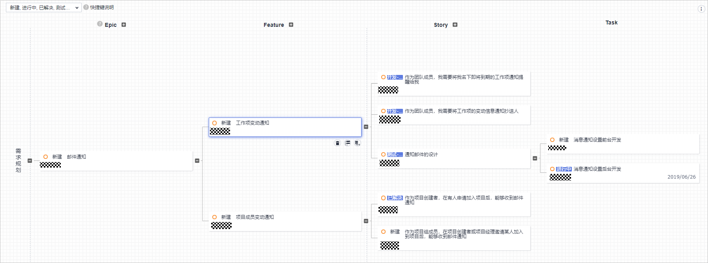
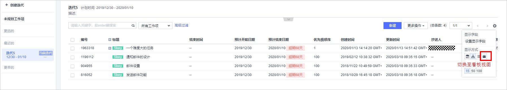
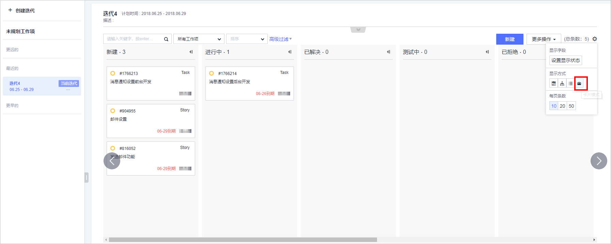
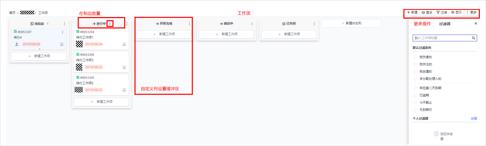

# **Scrum和看板如何选择**

## **背景**

目前，Scrum和看板已成为了帮助团队贯彻敏捷的重要方法，我们也能经常看到敏捷爱好者在关于二者在各类社区、场合的讨论。无论是交流分享还是企业的咨询实施，关于Scrum和看板的讨论就一直没有停歇过。那么，对于一个正准备实践敏捷的团队，到底应该如何选择呢？

## **问题分析**

一般来说，客户会纠结Scrum和看板的选择问题，主要是因为不清楚Scrum和看板方法的区别，不知道哪种更适合目前的项目或团队，也不清楚Scrum和看板方法能应对哪些场景。

首先，从Scrum和看板方法的比较来了解两者的不同，具体参考了如下表：

**表 1**  Scrum和看板方法的特征比较

<table><tbody><tr id="row1015155116187"><td class="cellrowborder" valign="top" width="33.33333333333333%">
<strong id="b515125121818">描述</strong>

</td>
<td class="cellrowborder" valign="top" width="33.33333333333333%">
<strong id="b10151851201814">Scrum</strong>

</td>
<td class="cellrowborder" valign="top" width="33.33333333333333%">
<strong id="b515115118182">看板方法</strong>

</td>
</tr>
<tr id="row1151185111180"><td class="cellrowborder" valign="top" width="33.33333333333333%">
目的

</td>
<td class="cellrowborder" valign="top" width="33.33333333333333%">
探讨未知，处理新的、复杂项目

</td>
<td class="cellrowborder" valign="top" width="33.33333333333333%">
自我检讨、消除浪费、得到好的效能

</td>
</tr>
<tr id="row13151135111815"><td class="cellrowborder" valign="top" width="33.33333333333333%">
团队角色

</td>
<td class="cellrowborder" valign="top" width="33.33333333333333%">
产品负责人，Scrum Master，开发团队

</td>
<td class="cellrowborder" valign="top" width="33.33333333333333%">
没有指定的角色

</td>
</tr>
<tr id="row2151155131813"><td class="cellrowborder" valign="top" width="33.33333333333333%">
度量指标

</td>
<td class="cellrowborder" valign="top" width="33.33333333333333%">
团队速率

</td>
<td class="cellrowborder" valign="top" width="33.33333333333333%">
生产周期、WIP（在制品）

</td>
</tr>
<tr id="row51529512187"><td class="cellrowborder" valign="top" width="33.33333333333333%">
多变性

</td>
<td class="cellrowborder" valign="top" width="33.33333333333333%">
承诺在Sprint周期不发生改变

</td>
<td class="cellrowborder" valign="top" width="33.33333333333333%">
变化随时可能发生

</td>
</tr>
<tr id="row1715285141818"><td class="cellrowborder" valign="top" width="33.33333333333333%">
交付周期

</td>
<td class="cellrowborder" valign="top" width="33.33333333333333%">
固定的Sprint时间盒

</td>
<td class="cellrowborder" valign="top" width="33.33333333333333%">
完成一项工作的时间

</td>
</tr>
</tbody>
</table>

Scrum和看板方法在不同方面特征有所不同，企业在选择使用Scrum和看板方法的时候，可以根据二者的特征并结合不同的实际情况，做出选择，具体参考如下表。

**表 2**  Scrum和看板方法的选择

<table><tbody><tr id="row10573191151911"><td class="cellrowborder" valign="top" width="33.33333333333333%">
<strong id="b32961649142419">场景</strong>

</td>
<td class="cellrowborder" valign="top" width="33.33333333333333%">
<strong id="b16573191115198">Scrum</strong>

</td>
<td class="cellrowborder" valign="top" width="33.33333333333333%">
<strong id="b115732115196">看板方法</strong>

</td>
</tr>
<tr id="row9573611101916"><td class="cellrowborder" valign="top" width="33.33333333333333%">
团队所做的项目VUCA、需要一定的可预测性

</td>
<td class="cellrowborder" valign="top" width="33.33333333333333%">
√

</td>
<td class="cellrowborder" valign="top" width="33.33333333333333%">
-

</td>
</tr>
<tr id="row1573121181919"><td class="cellrowborder" valign="top" width="33.33333333333333%">
团队优先考虑客户需求的响应能力、经常应对紧急情况改变优先级

</td>
<td class="cellrowborder" valign="top" width="33.33333333333333%">
-

</td>
<td class="cellrowborder" valign="top" width="33.33333333333333%">
√

</td>
</tr>
<tr id="row1157351116192"><td class="cellrowborder" valign="top" width="33.33333333333333%">
项目需要有固定的迭代交付时间（2到4周）

</td>
<td class="cellrowborder" valign="top" width="33.33333333333333%">
√

</td>
<td class="cellrowborder" valign="top" width="33.33333333333333%">
-

</td>
</tr>
<tr id="row125731112190"><td class="cellrowborder" valign="top" width="33.33333333333333%">
项目的初期探索迎合市场的阶段

</td>
<td class="cellrowborder" valign="top" width="33.33333333333333%">
√

</td>
<td class="cellrowborder" valign="top" width="33.33333333333333%">
-

</td>
</tr>
<tr id="row2574311111912"><td class="cellrowborder" valign="top" width="33.33333333333333%">
团队规模较小（不足5人）或较大(9人以上)

</td>
<td class="cellrowborder" valign="top" width="33.33333333333333%">
-

</td>
<td class="cellrowborder" valign="top" width="33.33333333333333%">
√

</td>
</tr>
</tbody>
</table>

-   **场景1：团队所做的项目VUCA、需要一定的可预测性**

    在[VUCA](https://zh.wikipedia.org/wiki/VUCA)的时代，很多团队做的是易变的、不确定的、复杂的、模糊的项目，如互联网项目。针对于这样的特性，团队如果需要在某特定的时间发布或推广产品，以达到一定的市场预期的话。团队一般会将需求进行拆分和细化，如 Epic、 Feature、 User Story 、Task后，制定发布计划。随着拆分为较小的需求后，团队可以通过检查每个Sprint的进度并进行调整，从而预测交付时间，进而确保整个项目成功交付，Scrum是首选的方式。

-   **场景2：团队优先考虑客户需求的响应能力、经常应对紧急情况改变优先级**

    Scrum的价值观之一是，承诺在Sprint内对计划不做修改，如果团队经常会应对紧急情况或者修改任务的优先级，那么看板方法因其灵活的工作流程可以更好的适应。

-   **场景3：项目需要有固定的交付时间（2到4周）**

    在Scrum中每个Sprint的时间长度是固定（2到4周），并且每个Sprint结束后会交付潜在可交付产品增量，如果项目需要有固定的交付时间（2到4周），那么Scrum是比较好的选择。

-   **场景4：****项目的初期探索迎合市场阶段******

    以市场为导向的产品，产品越年轻，使用Scrum方式就越可能受益。因为在开发全新产品，尝试实现PMF（Product-Market Fit，产品市场契合）或努力保持产品增长时，通常面临许多未知因素以及大量不确定性和变化。要通过迭代不断的输出增量以获取市场的反馈，进而更快更好的迎合市场的需求，所以Scrum是比较好的选择。（详见参考[Scrum适合你的项目吗？](https://www.romanpichler.com/blog/is-scrum-right-for-your-product/)）

-   **场景5：团队规模较小（不足5人）或较大（9人以上）**

    Scrum团队理想的规模是2个披萨团队，给出的建议是5到9人，如果团队不足5人，在人员方面可能无法发挥Scrum的最大功效或存在一定上的浪费，那么建议使用看板方法。（Scrum of Scrums不在本文讨论范围内。）

## **解决措施**

目前很多企业和团队，都是通过工具在实践Scrum或看板方法，DevCloud也是基于敏捷思想设计的DevOps工具链。DevCloud提供了更加鲜明化的Scrum项目和看板项目的选择，可参考[表2](#table18537111117190)，针对不同情况选择不同的项目。

从目的来说，Scrum主要是为了探讨未知、处理复杂（VUCA）项目，从而提升效率。效率往往是和时间关联起来的，例如要在一个什么样的时间得到什么样的结果，这就要求对时间把控与做计划的能力。若团队所做的项目为了这样的目的，则一定要选用Scrum，哪怕团队的规模没有达到Scrum所推荐的5到9人，或者团队要为估算所浪费的时间开销而苦恼，又或者在一个Sprint中需求经常变更等情况。因为不管是人数的问题也好、还是估算的问题也好、又或是需求变更的问题都是可以通过团队在回顾中不断的分析、复盘、总结慢慢优化的，如估算问题，那就提高估算能力减少开销。时间开销问题，可以通过熟练度的提升、形式的改变来较少开销。总之，只要核心是不变的或者说关注点是围绕Scrum目的就应选择Scrum项目，典型项目有：新的应用程序开发、品牌发展、营销活动、具有季度/定时发布时间表的大型企业等。

相反，如果团队的关注点是优先响应需求的能力，需求是必须要随时跟进和变更的，项目的可预测性、产品市场的契合度等的优先级并没有成为超过响应能力的话，那么看板项目就是一种更好的选择。看板方法让价值能够快速的流动起来，以更快的满足客户的需求，典型项目有：生产支持、补丁发布、UX设计、营销宣传材料、新闻稿等。

所以，对Scrum项目和看板项目的选择上，一定参考的是客户认为最重要的关注的点是什么，以目的来驱动做响应的选择。

在DevCloud中， Scrum项目是以Scrum框架为核心的，提供用于处理探讨未知，处理新的、复杂项目的项目类型。Scrum项目提供了类似思维导图的方式，用来整理需求做项目规划，并提供了Epic 、Feature 、Story、Task的四级需求划分。

在Scrum项目中的**迭代**视图中，**未规划工作项**相当于 Scrum中的 Product Backlog，当前的迭代相当于Sprint Backlog，可以很好的结合Scrum中Product Backlog和Sprint Backlog两个工件。

在DevCloud的Scrum项目也提供了看板视图，可以很好的在Scrum的项目中使用看板方法，进而让Scrum可以和看板有效的结合起来，发挥更强大的效能。

  

在DevCloud中，看板项目是以看板方法为核心，为团队提供流程可视化、限制WIP， 加速价值流动，以更快的满足客户的需求，看板项目中提供了非常友好的可视化看板板，默认提供了，新建、进行中、测试中、已关闭等状态列，用来标示任务的状态，可以通过拖拽的方式来实现任务的价值流动。

团队在使用看板项目时，还可以修改默认提供的列（修改列名等）和自定义列以实现项目或团队定制化需求。此外，看板项目还提供了很多过滤和显示的快捷和便利操作等。

  

更多操作和相关内容请见参考[项目管理用户指南-管理Scrum项目](https://support.huaweicloud.com/usermanual-projectman/projetcman_ug_0000.html)。

  

