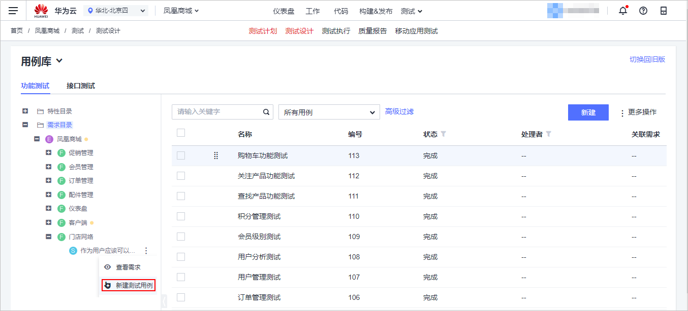
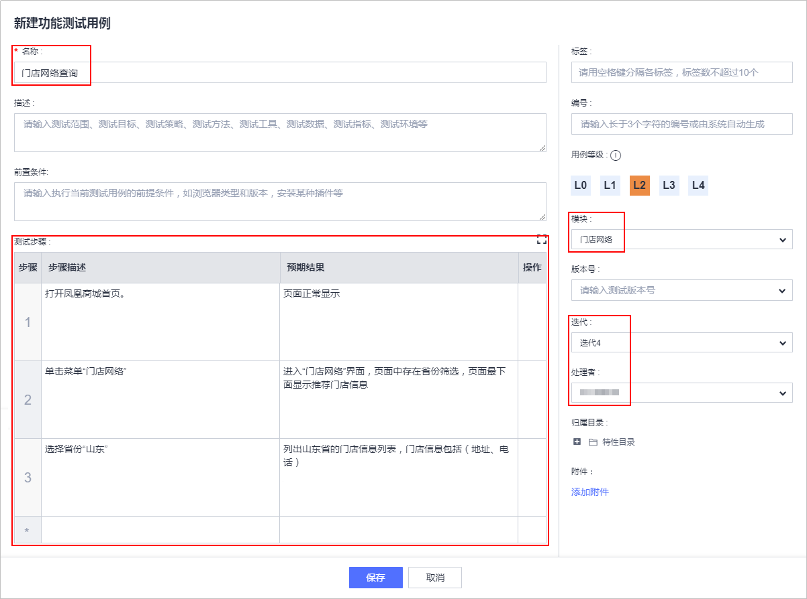
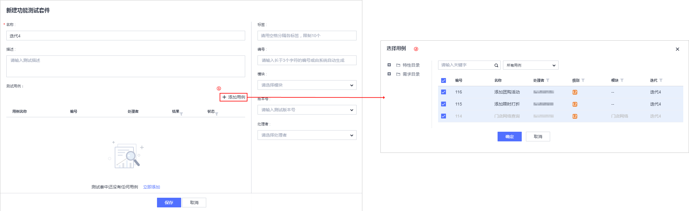
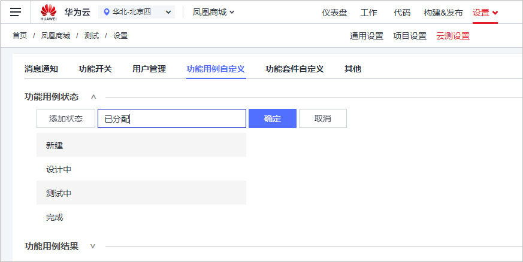
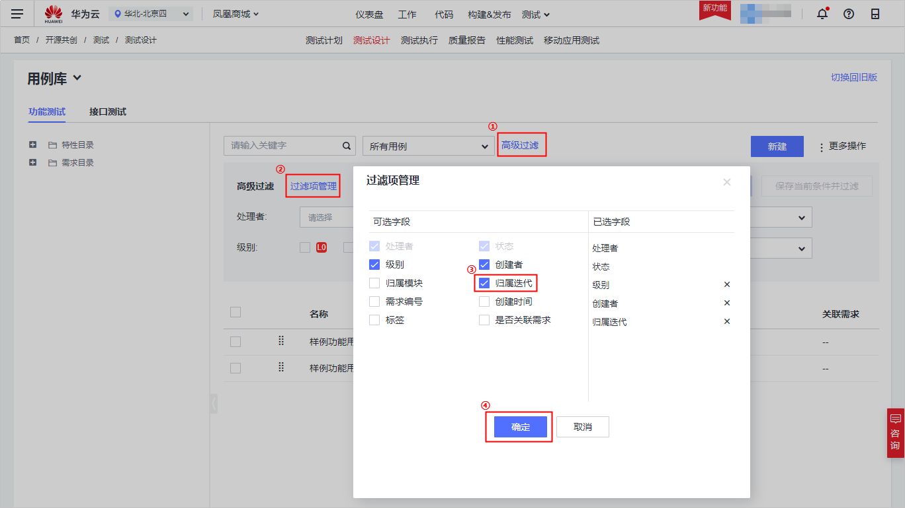
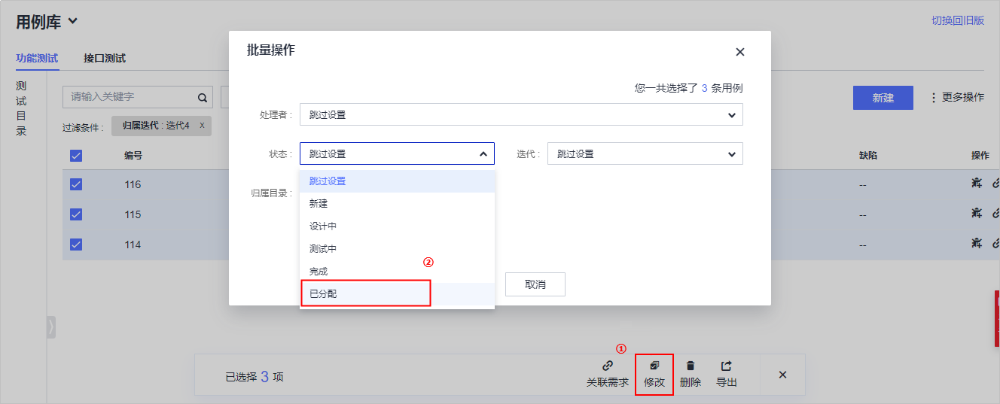
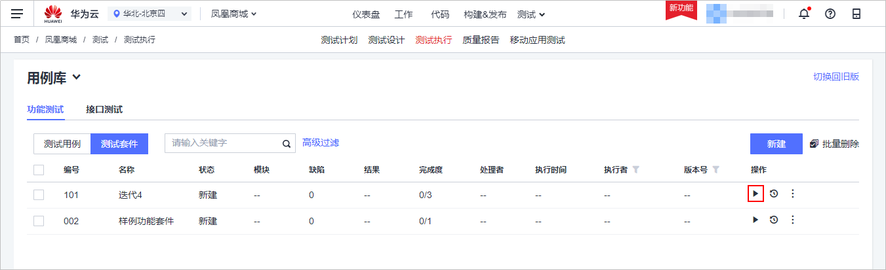
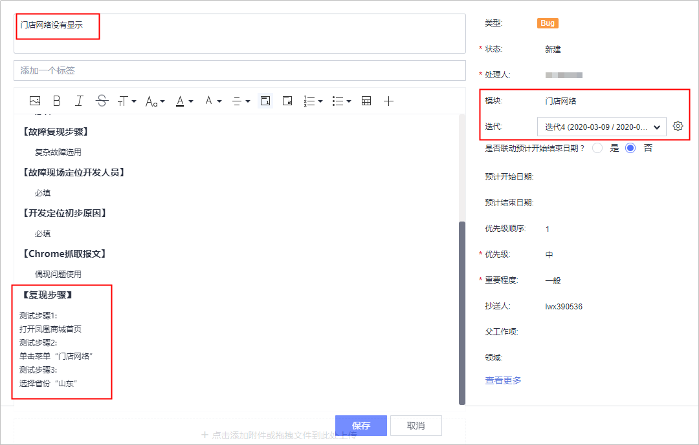
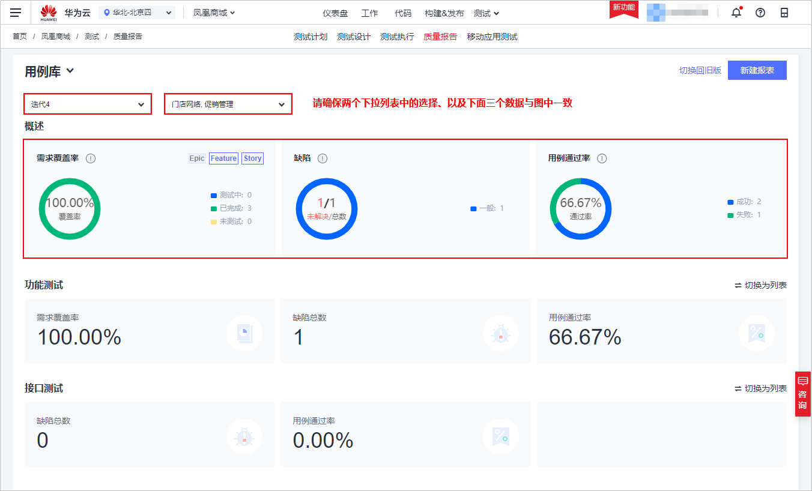
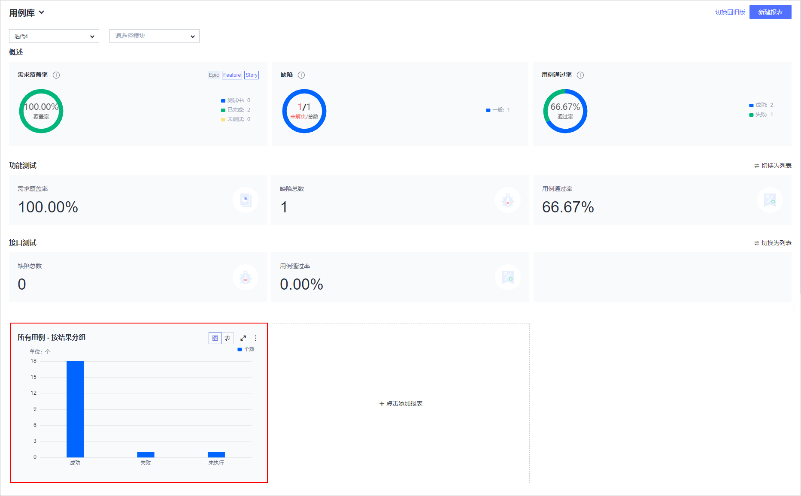

# **使用DevCloud进行敏捷测试管理**<a name="devcloud_practice_2003"></a>

## **背景**<a name="section66578044"></a>

在前面的练习中我们已经完成了凤凰商城**迭代4**的需求规划，此时测试人员可以同步的进行测试用例的编写，这样测试人员在迭代之初就可以进行软件测试工作。

通过本章节，您将学习如何使用**云测服务**管理项目的测试生命周期。本章节将指导您创建有效设计的测试套件，以验证您的软件里程碑。您还将创建测试测试，这些测试测试可以在每次发布时重复执行。

## **01.使用追溯视图进行需求驱动的测试**<a name="section62331491"></a>

通过本节，您将学习如何通过**追溯视图**完成测试用例的设计，并在测试用例中细化测试步骤，验证用户的使用场景。

操作步骤如下：

1.  进入项目，单击页面上方导航“测试  \>  测试设计“，进入“测试设计“页面。

    > **说明：**   
    >若您导航中没有“测试设计“，请参考[进入新版云测首页](https://support.huaweicloud.com/qs-testman/cloudtest_06_0002.html)，进入新版云测页面后，再选择“测试设计“页面。  

2.  单击页面左侧菜单“需求目录“，逐层展开需求树，找到Story“作为用户应该可以查看、查询所有门店网络“。

    单击图标，选择“新建测试用例“。

    

      

3.  输入名称“门店网络查询“，选择模块“门店网络“、迭代“迭代4“，处理人。

    添加以下测试步骤与预期结果，单击“保存“。

    <a name="table1699411493456"></a>
    <table><thead align="left"><tr id="row699418495455"><th class="cellrowborder" valign="top" width="17.169999999999998%" id="mcps1.1.3.1.1"><p id="p1995174917456"><a name="p1995174917456"></a><a name="p1995174917456"></a>测试步骤</p>
    </th>
    <th class="cellrowborder" valign="top" width="82.83%" id="mcps1.1.3.1.2"><p id="p1099519490456"><a name="p1099519490456"></a><a name="p1099519490456"></a>预期结果</p>
    </th>
    </tr>
    </thead>
    <tbody><tr id="row12995204924511"><td class="cellrowborder" valign="top" width="17.169999999999998%" headers="mcps1.1.3.1.1 "><p id="p1799554919457"><a name="p1799554919457"></a><a name="p1799554919457"></a>打开凤凰商城首页</p>
    </td>
    <td class="cellrowborder" valign="top" width="82.83%" headers="mcps1.1.3.1.2 "><p id="p1999584920459"><a name="p1999584920459"></a><a name="p1999584920459"></a>页面正常显示。</p>
    </td>
    </tr>
    <tr id="row599544920457"><td class="cellrowborder" valign="top" width="17.169999999999998%" headers="mcps1.1.3.1.1 "><p id="p169951949114510"><a name="p169951949114510"></a><a name="p169951949114510"></a>单击菜单“门店网络”</p>
    </td>
    <td class="cellrowborder" valign="top" width="82.83%" headers="mcps1.1.3.1.2 "><p id="p12995124994514"><a name="p12995124994514"></a><a name="p12995124994514"></a>进入“门店网络”界面，页面中存在省份筛选，页面最下面显示推荐门店信息。</p>
    </td>
    </tr>
    <tr id="row29951349124516"><td class="cellrowborder" valign="top" width="17.169999999999998%" headers="mcps1.1.3.1.1 "><p id="p1099516499452"><a name="p1099516499452"></a><a name="p1099516499452"></a>选择省份“山东”</p>
    </td>
    <td class="cellrowborder" valign="top" width="82.83%" headers="mcps1.1.3.1.2 "><p id="p8995104954514"><a name="p8995104954514"></a><a name="p8995104954514"></a>列出山东省的门店信息列表，门店信息包括（地址、电话）。</p>
    </td>
    </tr>
    </tbody>
    </table>

    

      

4.  按照同样的方式，完成下面两个用户故事的测试用例设计：
    -   作为管理员应该可以添加限时打折
    -   作为管理员应该可以添加团购活动


## **02.使用测试套件进行迭代测试规划**<a name="section24112512"></a>

DevCloud允许团队将多个测试用例组织到测试套件中。

测试套件用于跟踪迭代或里程碑中的测试用例，通过测试套件您可以看到特定迭代或里程碑的测试何时完成。

接下来让我们把**迭代4**的测试用例添加到新的测试套件中。

操作步骤如下：

1.  进入项目，单击页面上方导航“测试  \>  测试执行“。

    单击“测试套件“页签，单击“新建“。

2.  输入名称“迭代4“，单击“+添加用例“。

    在弹框中单击图标筛选迭代“迭代4“，勾选全部筛选出的用例，单击“确定“。

    

      

3.  单击“保存“，保存测试套件。

## **03.用例自定义**<a name="section3291103615342"></a>

```
背景
测试经理：我已经设计完成用例，并分配给了对应的测试人员，但是现在我们的测试用例流程中并没有用例设计完成的状态标识。
建议在用例的流程中添加“已分配”状态，用来表示用例已经设计完成，并分配给了对应的测试人员，可以进行用例执行。
```

操作步骤如下：

1.  进入项目，单击页面上方导航“设置  \>  云测设置“。
2.  选择“功能用例自定义“页签，单击“新建状态“，输入“已分配“，单击“确定“保存。

    

      

3.  返回“测试设计“页面。

    单击“高级过滤“，通过“过滤项管理“弹框，勾选“归属迭代“，单击“确定“保存。

    

      

4.  选择归属迭代为“迭代4“，单击“过滤“，筛选测试用例。
5.  勾选全部测试用例，单击页面下方“修改“，在弹框中选择状态“已分配“，单击“确定“保存。

    

      


## **04.使用测试用例和测试套件视图进行用例驱动测试**<a name="section6956456"></a>

通过本节，您将学习如何执行手工测试用例、创建缺陷，反馈测试结果。

```
背景
测试经理：经过开发跟运维的共同努力，现在我们的应用已经可以在迭代内持续的往测试环境部署了，每天都会有新的功能部署到测试环境。大家可以同步的进行软件测试工作，有问题大家及时的反馈，以保证我们迭代交付的质量。
```

操作步骤如下：

1.  进入项目，单击页面上方导航“测试  \>  测试执行“。
2.  选择“测试套件“页签，可查看测试套件执行情况，其中：
    -   “完成度“表示当前测试套件一共包含多少个测试用例、以及完成了多少个测试用例的执行。
    -   “缺陷“表示在执行测试套件的过程中一共创建了多少个缺陷。

3.  在页面中找到测试套件“迭代4“，单击操作列图标，执行测试套件。

    

      

4.  页面右侧滑框中列出该套件中包含的所有手工测试用例。

    测试人员按照测试步骤，逐步执行并记录测试结果，根据每个步骤的结果设置测试用例结果；再根据测试用例结果，记录测试套件的执行结果。

    

      

5.  在本节中，我们设定步骤3执行失败，将此步骤结果设置为“失败“，参考下图填写实际测试结果。

    同时将用例的结果设置为“失败“，并单击图标创建缺陷。

    

      

6.  系统将根据执行步骤，自动填充缺陷的重现步骤。

    参考下图输入缺陷名称、选择模块与迭代，单击“保存“。

    

      

7.  返回“测试执行“页面，按照同样的方式完成其他测试用例的执行，最后设置测试套件的执行结果，单击“保存“。

    

      

8.  套件测试完成，返回列表可查看套件的执行情况（缺陷、结果、完成度）是否与前面步骤中的设置相同。

## **05.使用测试总览跟踪测试进度和质量**<a name="section62608109"></a>

通过本节，您将学习如何查看项目测试情况，包括需求覆盖率、缺陷、用例通过率、完成率等相关统计。

-   **测试情况分析**

    进入项目，单击页面上方导航“测试  \>  质量报告“。

    选择“迭代4“，即可查看此迭代的需求覆盖率、缺陷、用例通过率等相关统计。

    

      

    > **说明：**   
    >如果您在实际练习中所得的报告结果与截图内容不符，请确认您的目标工作项以及测试用例是否都选中了”迭代04“和”门店网络“模块，并且确保工作项与测试用例都已关联正确。  

-   **自定义测试报表**

    测试经理通过统计度量可以量化高效管理测试团队和测试项目,自定义报表可以帮助创建个性化的统计报表。

    1.  在“质量报告“页面，单击“新建报表“，在弹框中选择“自定义报表“。
    2.  输入名称“所有用例 - 按结果分组“，选择工件类型“测试用例“、分析维度“结果“，单击“刷新列表“。

        当图表刷新出内容后，单击“保存“，新报表将显示在“质量报告“页面中。

        

          


