# **使用DevCloud进行敏捷项目规划**<a name="devcloud_practice_2001"></a>

## **凤凰商城示例项目介绍**<a name="section32073719"></a>

【凤凰项目】示例项目是耗时数年所开发的汽车零部件配件电子商城。

项目采用 Scrum模式 进行迭代开发，每个迭代周期为**两周**，前3个迭代已经完成**凤凰商城1.0**版本的开发，当前正在进行**迭代4**的规划。

通过本章节，您将置身其中完成最新的迭代规划、以及产品的开发、测试、部署。

```
临时事件
刚刚接到业务部门的最后通牒，要求月底必须上线功能门店网络查询，可以在凤凰商城中查询各个门店的相关信息。
```

## **01.使用Scrum项目模板进行项目规划，并管理Epic和Feature**<a name="section47834478"></a>

通过本节，您将学习如何使用**需求规划**视图以思维导图的模式完成需求从“Epic\>Feature\>Story\>Task“的创建以及管理。

-   **项目规划**
    1.  打开凤凰商城项目，单击“工作  \>  需求规划“，项目规划视图以树形结构列出了需求从“Epic\>Feature\>Story\>Task“的逐级关系。

        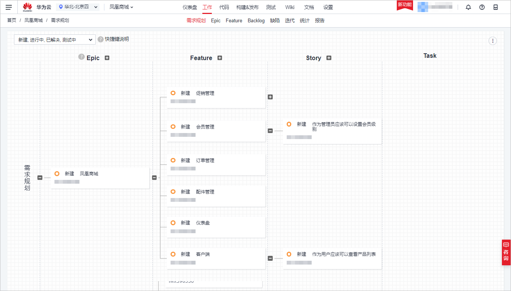

          

        下表是对不同类型工作项的说明，以及凤凰商城项目的映射关系：

        <a name="table59839225506"></a>
        <table><thead align="left"><tr id="row29827226507"><th class="cellrowborder" valign="top" width="25%" id="mcps1.1.3.1.1"><p id="p129822227507"><a name="p129822227507"></a><a name="p129822227507"></a><strong id="b9606153185018"><a name="b9606153185018"></a><a name="b9606153185018"></a>工作项类型</strong></p>
        </th>
        <th class="cellrowborder" valign="top" width="75%" id="mcps1.1.3.1.2"><p id="p139822229504"><a name="p139822229504"></a><a name="p139822229504"></a><strong id="b263712512502"><a name="b263712512502"></a><a name="b263712512502"></a>说明</strong></p>
        </th>
        </tr>
        </thead>
        <tbody><tr id="row2098213226502"><td class="cellrowborder" valign="top" width="25%" headers="mcps1.1.3.1.1 "><p id="p1698292216504"><a name="p1698292216504"></a><a name="p1698292216504"></a>Epic</p>
        </td>
        <td class="cellrowborder" valign="top" width="75%" headers="mcps1.1.3.1.2 "><p id="p1982152218508"><a name="p1982152218508"></a><a name="p1982152218508"></a>通常是公司重要战略举措，比如“凤凰商城”，对于无极限零部件公司是一个与企业生存攸关的关键战略措施。</p>
        </td>
        </tr>
        <tr id="row15982162218505"><td class="cellrowborder" valign="top" width="25%" headers="mcps1.1.3.1.1 "><p id="p3982172214509"><a name="p3982172214509"></a><a name="p3982172214509"></a>Feature</p>
        </td>
        <td class="cellrowborder" valign="top" width="75%" headers="mcps1.1.3.1.2 "><p id="p39829225508"><a name="p39829225508"></a><a name="p39829225508"></a>通常是对用户有价值的功能，用户可以通过使用特性满足他们的需求。比如凤凰商城中的“门店网络查询功能”，特性通常会通过多个迭代持续交付。</p>
        </td>
        </tr>
        <tr id="row1998316223500"><td class="cellrowborder" valign="top" width="25%" headers="mcps1.1.3.1.1 "><p id="p10983102235018"><a name="p10983102235018"></a><a name="p10983102235018"></a>Story</p>
        </td>
        <td class="cellrowborder" valign="top" width="75%" headers="mcps1.1.3.1.2 "><p id="p8983522195018"><a name="p8983522195018"></a><a name="p8983522195018"></a>通常是对一个功能进行用户场景细分，并且能在一个迭代内完成，Story通常需要满足INVEST原则。</p>
        </td>
        </tr>
        <tr id="row298332235015"><td class="cellrowborder" valign="top" width="25%" headers="mcps1.1.3.1.1 "><p id="p16983112275015"><a name="p16983112275015"></a><a name="p16983112275015"></a>Task</p>
        </td>
        <td class="cellrowborder" valign="top" width="75%" headers="mcps1.1.3.1.2 "><p id="p189833223506"><a name="p189833223506"></a><a name="p189833223506"></a>通常是用户故事的细分，准备环境，准备测试用例等都可以是完成Story的细分任务。</p>
        </td>
        </tr>
        </tbody>
        </table>

    1.  在Epic“凤凰商城“下方单击图标新建Feature， 输入标题“门店网络“，回车保存。

        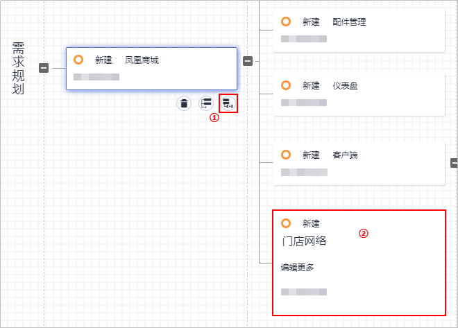

          

    2.  按照同样的方式，为Feature“门店网络“添加Story“作为用户应该可以查看、查询所有门店网络“。


-   **项目规划折叠**

    为了更清晰的展示规划视图，不同用户角色可以根据实际需求，展开/折叠对应级别的列表。

    例如，某用户角色只关心Feature级别的列表，单击“Feature“旁边图标完成折叠。折叠后如下图所示：

    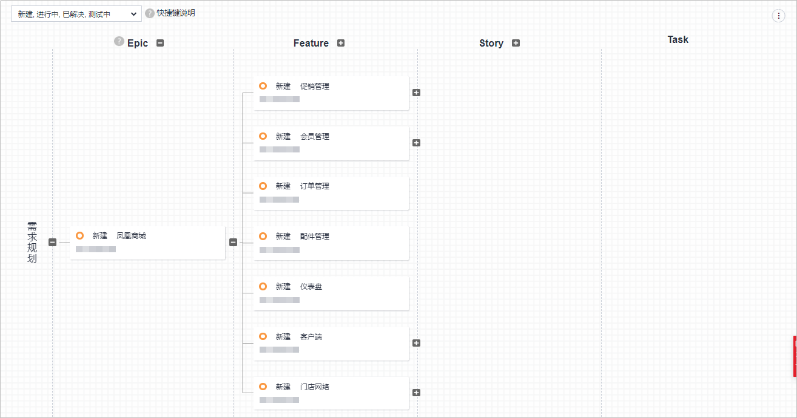

      


-   **导出项目规划**

    您可以将项目规划导出到Excel，以条目化的方式查看以及管理。

    单击右上角图标，在下拉列表中选择导出方式。

    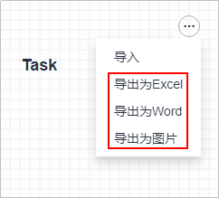

      

    导出后的Excel表格如下图所示：

    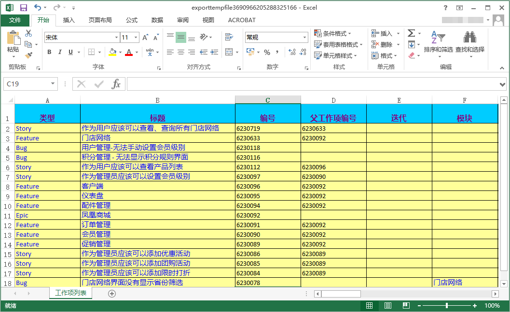

      


## **02.使用Scrum项目模板管理 backlog 并进行迭代开发**<a name="section27857118"></a>

通过本节，您将学习如何使用**项目流程管理**来帮助你快速的制定团队计划，管理和追踪相关工作进度。

-   <a name="li1875913505916"></a>**Backlog管理**

    在市场部门的施压下，Story“门店网络查询功能“被指定为最高优先级处理，因为许多客户需要通过它来查询最近的门店网络地址，从而获取服务。

    1.  单击“工作  \>  Backlog“， 进入Backlog页面。
    2.  单击Story名称“作为用户应该可以查看、查询所有门店网络“，编辑Story。

        -   可输入用户故事描述信息、开始日期、结束日期、预计工时、优先级、重要程度字段信息。
        -   可通过本地文件拖拽到“附件“框中，作为工作项的附件。

        完成编辑后，单击“保存“。

        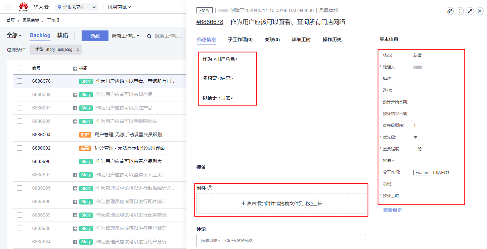

          

    3.  在列表中，我们同时可以设置自己关注的用户故事，方便查询。

        单击图标即可关注，当图标变成蓝色，表示关注成功。

        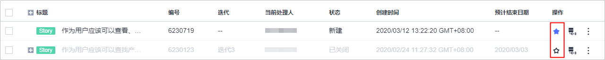

          


-   **Backlog高级管理**

    用户可以通过快速过滤器方便的查询特定的工作项，也可以使用“高级过滤“实现特定字段指定条件的过滤。

    -   **我关注的**：在Backlog页面，单击列表上方“所有工作项“下拉列表，选择“我关注的“，即可过滤已关注的工作项列表。

        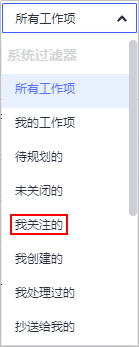

          

    -   **自定义过滤器**
        1.  单击“高级过滤“，选择“增加过滤字段“，在弹框中勾选“优先级“，单击“确定“。

            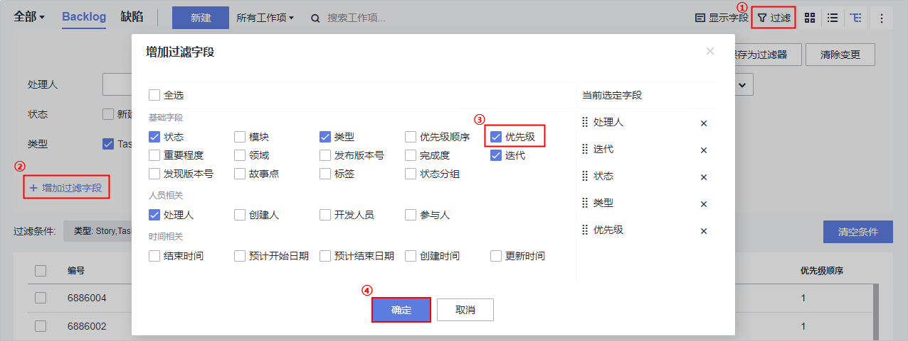

              

        2.  在“优先级“字段，  “高“，单击“保存为过滤器“，输入过滤器名称“高优先级“，单击“确定“保存。

            此时可“所有工作项“下拉列表中选择“高优先级“过滤工作项。

            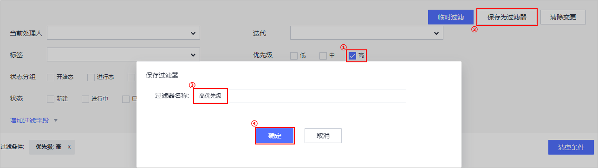

              


-   **迭代的创建与管理**
    1.  单击“工作  \>  迭代“，进入迭代管理视图。
    2.  单击“创建迭代“，在弹框中输入迭代名称“迭代4“、设置迭代计划时间，单击“新建“。

        本练习中，设置迭代设置迭代的开始日期为本周一，结束日期为下周五。

        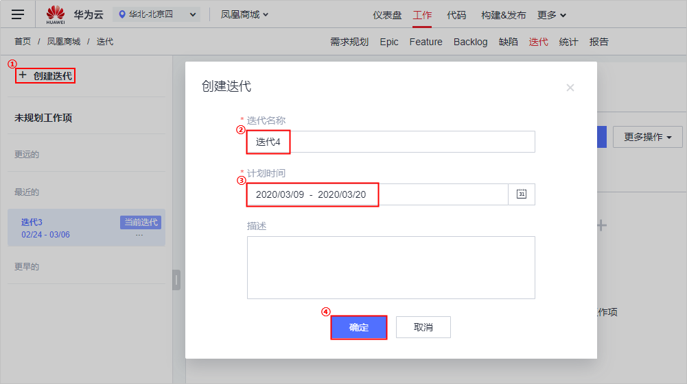

          

    3.  按照同样方式创建迭代5，并设置迭代周期为下一个周期。

-   **迭代规划**

    接下来我们需要对当前迭代（近两周）的工作进行规划，其中最重要的工作“作为用户应该可以查看、查询所有门店网络“需要在本迭代完成并上线。

    1.  在迭代页面，单击“未计划工作项“，找到Story“作为用户应该可以查看、查询所有门店网络“，单击所在行的“迭代“列，在下拉列表中选择“迭代4“。

        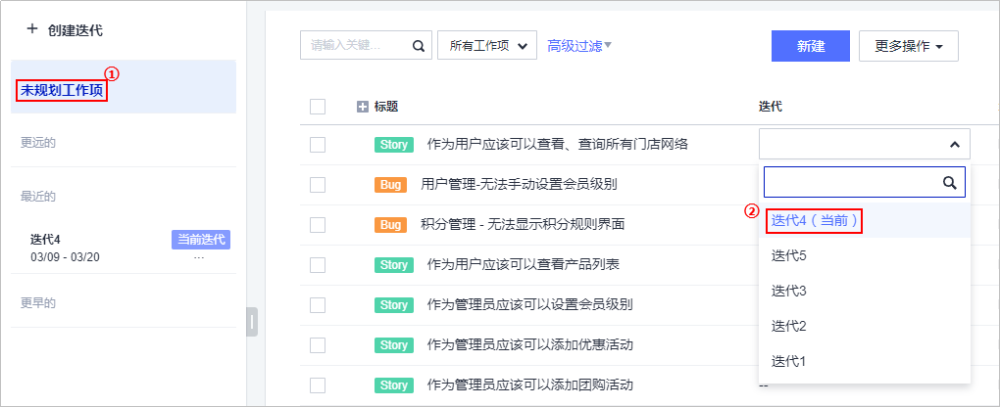

          

    2.  按照同样的方式，添加以下两个Story添加至迭代4。
        -   作为管理员应该可以添加限时打折
        -   作为管理员应该可以添加团购活动

    3.  单击  “迭代4“， 参照[•Backlog管理](#li1875913505916)，设置各Story的预计开始日期与预计结束日期。

-   **Story分解**

    接下来我们需要将Story“作为用户应该可以查看、查询所有门店网络“拆分到开发任务级别，并指派给对应的负责人。

    1.  单击“操作“列中的图标，添加子工作项。

        输入Task标题“前端展示 - 添加门店网络菜单“，并选择处理人，单击“确定“完成。

        

          

    2.  按照同样的方式，添加Task“后台管理 - 添加门店网络管理维护模块“

-   **看板视图使用**
    -   单击列表右上方图标，在下拉列表中单击图标，切换视图为“卡片模式“。

        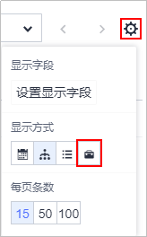

          

        在此模式下，可通过拖拽修改工作项状态。

        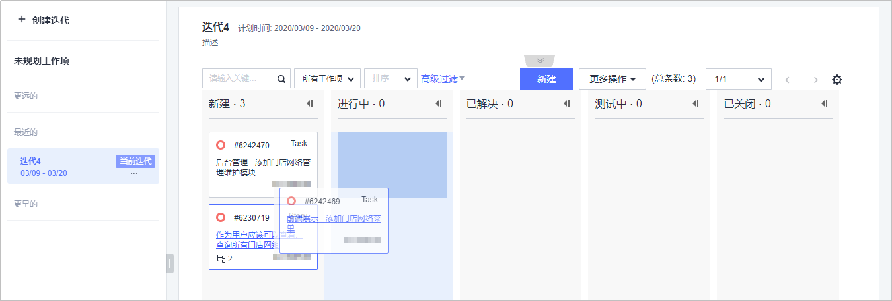

          

        在每日站立会议中，可以通过电子白板报告和更新任务进度，你可以考虑为团队添置一个带触摸功能的壁挂平板电视。

    -   单击图标，可切换视图为“成员模式“。

        通过成员模式视图可以看到当前团队每个成员的工作饱和度以及每个需求预估的完成时间点。

        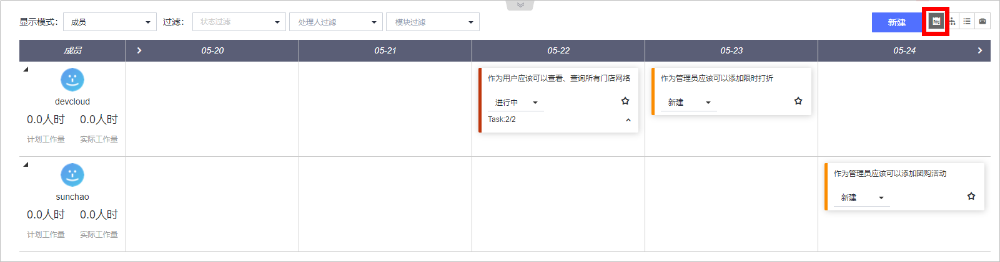

          


## **03.使用效率工具监控和跟踪项目状态**<a name="section49387472"></a>

通过本节，您将学习如何使用**效率工具**来持续的监控跟进项目进度。

-   **迭代进度视图**

    通过迭代图表，团队可以方便的统计当前迭代的进度情况，包括需求完成情况、迭代燃尽图、工作量等。

    在迭代页面，单击工作项列表上方的图标，即可展开迭代进度视图。

    如果是新创建的项目，在项目创建第二天可看到报表效果

    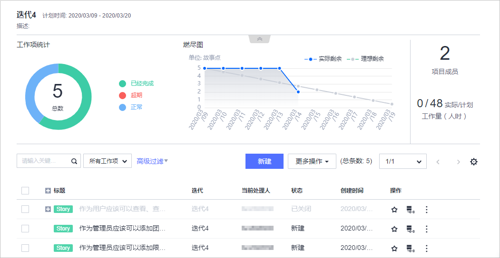

      

-   **项目仪表盘查看以及管理**

    项目仪表盘提供了强大的项目进度跟进能力、包括需求进度统计、燃尽图、工作完成度、工时统计等等。

    1.  单击页面上方导航“仪表盘“，进入“仪表盘“页面。
    2.  单击页面右下角图标，进入编辑模式。

        -   单击任意组件右上角的，可将此组件移除。
        -   通过鼠标拖拽，可改变组件在仪表盘中的位置。
        -   单击右下角图标，在页面右侧滑框中可拖拽新组件至仪表盘中。
        -   完成编辑后，单击页面右下角图标保存。

        更多仪表盘操作，请参考[项目管理用户指南-使用仪表盘](https://support.huaweicloud.com/usermanual-projectman/projetcman_ug_2006.html)。

        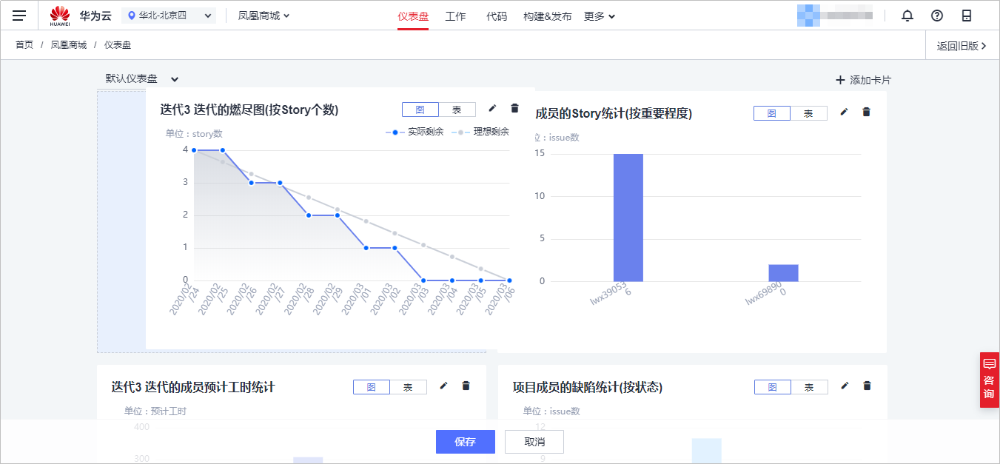

          


