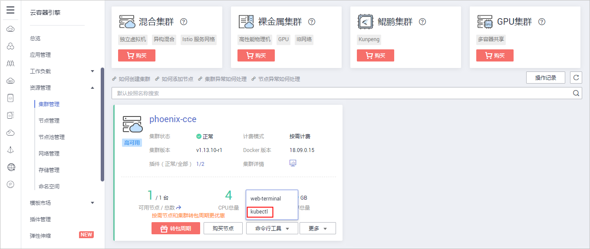
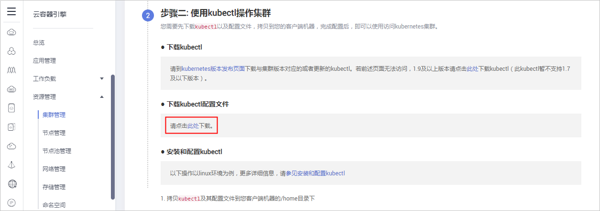
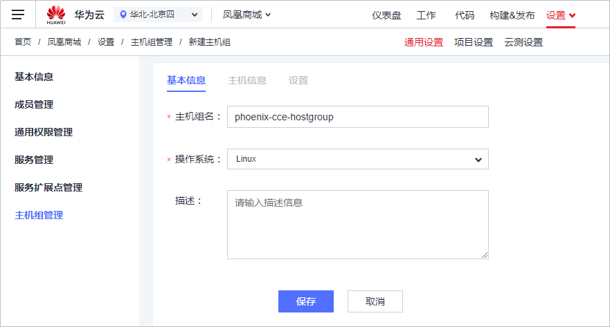
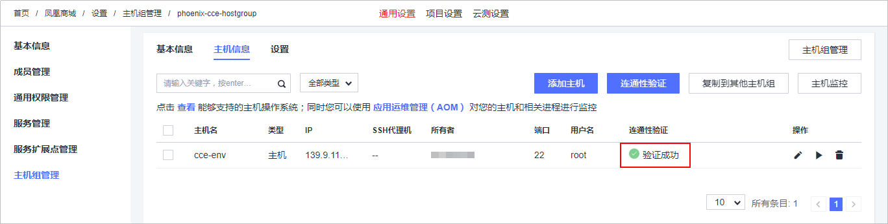
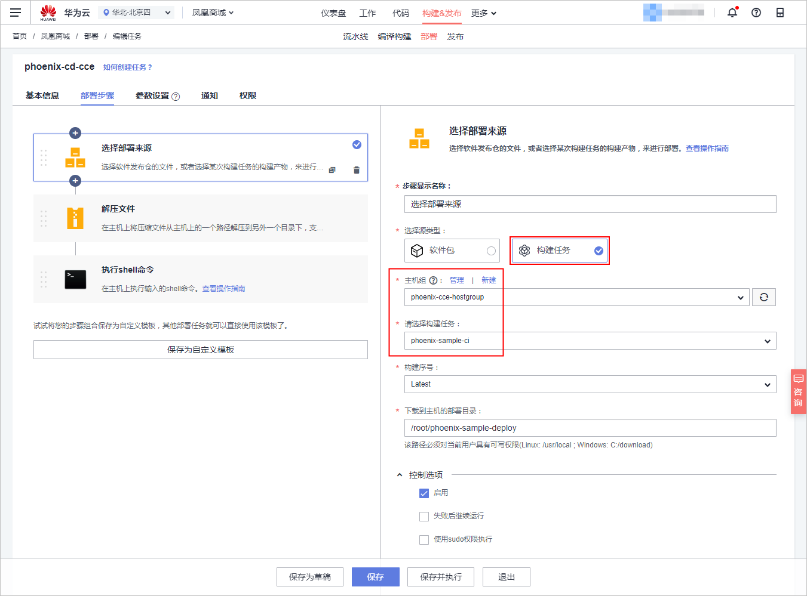
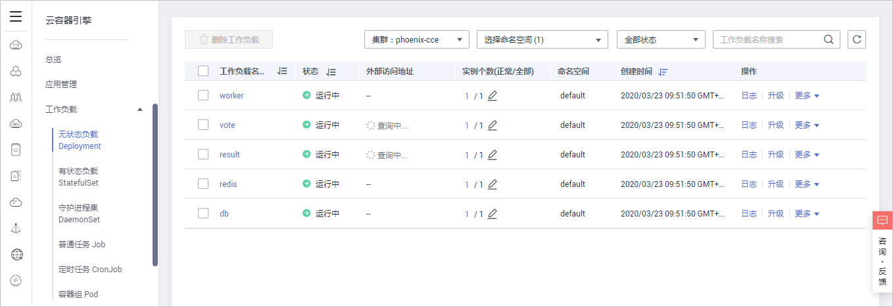
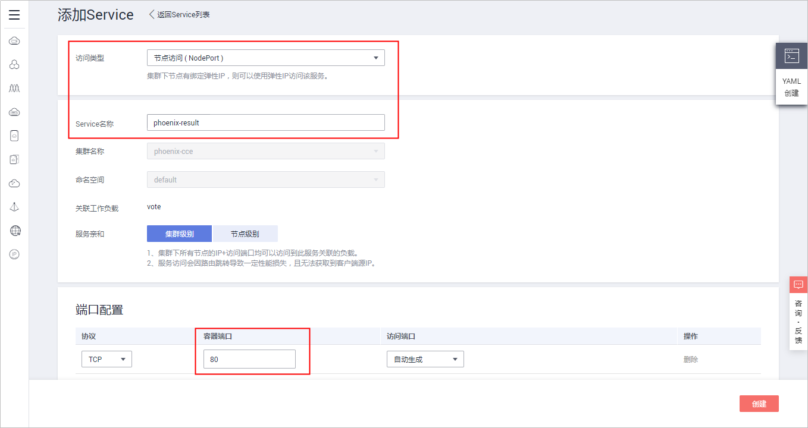
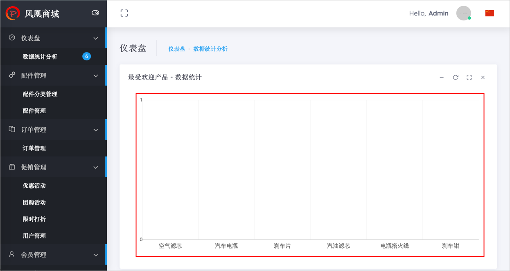
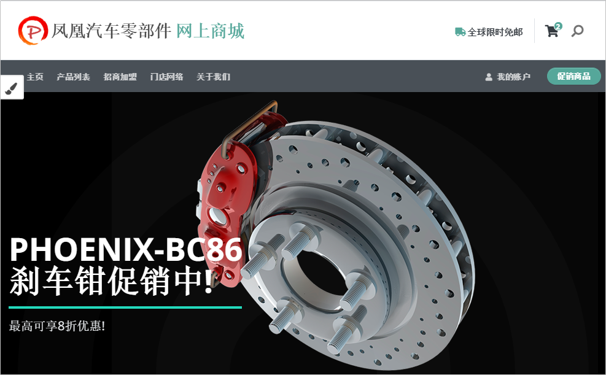
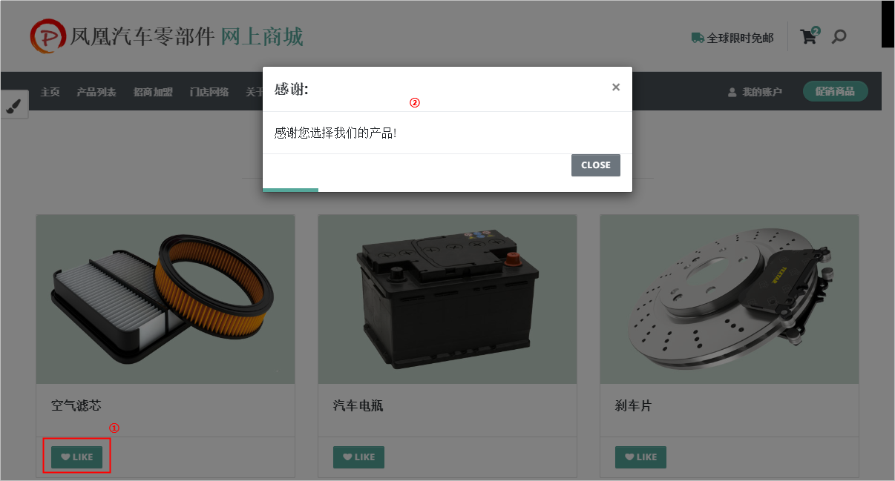

# **使用持续发布，在代码更新后自动完成应用部署（CCE篇）**<a name="devcloud_practice_2011"></a>

本章节以样例项目内置的部署任务“phoenix-sample-standalone“为例进行讲解，使用的部署环境是云容器引擎CCE。

## **购买并配置CCE环境**<a name="section369110705717"></a>

通过本节，您将学习如何购买并配置一套CCE环境。

-   **购买Kubernetes集群**
    1.  登录[云容器引擎CCE官网](https://www.huaweicloud.com/product/cce.html)，单击“立即使用“，进入云容器引擎控制台。
    2.  单击页面右上角“购买Kubernetes集群“。
    3.  参照以下配置购买集群，列表中未涉及的配置保持默认值。

        <a name="table4383935114417"></a>
        <table><thead align="left"><tr id="row93831035154415"><th class="cellrowborder" valign="top" width="15%" id="mcps1.1.4.1.1"><p id="p7383635154416"><a name="p7383635154416"></a><a name="p7383635154416"></a><strong id="b777995394412"><a name="b777995394412"></a><a name="b777995394412"></a>配置分类</strong></p>
        </th>
        <th class="cellrowborder" valign="top" width="15%" id="mcps1.1.4.1.2"><p id="p123081050204415"><a name="p123081050204415"></a><a name="p123081050204415"></a><strong id="b127964532445"><a name="b127964532445"></a><a name="b127964532445"></a>配置项</strong></p>
        </th>
        <th class="cellrowborder" valign="top" width="70%" id="mcps1.1.4.1.3"><p id="p13087504447"><a name="p13087504447"></a><a name="p13087504447"></a><strong id="b781645394415"><a name="b781645394415"></a><a name="b781645394415"></a>建议选择</strong></p>
        </th>
        </tr>
        </thead>
        <tbody><tr id="row238373516441"><td class="cellrowborder" rowspan="9" valign="top" width="15%" headers="mcps1.1.4.1.1 "><p id="p163112585917"><a name="p163112585917"></a><a name="p163112585917"></a>服务选型</p>
        </td>
        <td class="cellrowborder" valign="top" width="15%" headers="mcps1.1.4.1.2 "><p id="p139343012596"><a name="p139343012596"></a><a name="p139343012596"></a>计费模式</p>
        </td>
        <td class="cellrowborder" valign="top" width="70%" headers="mcps1.1.4.1.3 "><p id="p83931730145918"><a name="p83931730145918"></a><a name="p83931730145918"></a>按需计费</p>
        </td>
        </tr>
        <tr id="row10383135174416"><td class="cellrowborder" valign="top" headers="mcps1.1.4.1.1 "><p id="p53933303597"><a name="p53933303597"></a><a name="p53933303597"></a>区域</p>
        </td>
        <td class="cellrowborder" valign="top" headers="mcps1.1.4.1.2 "><p id="p193931430125912"><a name="p193931430125912"></a><a name="p193931430125912"></a>最好选择部署任务所在的区域（若项目所在区域资源已售罄，可选其他区域）。</p>
        </td>
        </tr>
        <tr id="row951910545313"><td class="cellrowborder" valign="top" headers="mcps1.1.4.1.1 "><p id="p059917361934"><a name="p059917361934"></a><a name="p059917361934"></a>企业项目</p>
        </td>
        <td class="cellrowborder" valign="top" headers="mcps1.1.4.1.2 "><p id="p75994361839"><a name="p75994361839"></a><a name="p75994361839"></a>default</p>
        </td>
        </tr>
        <tr id="row13383735114415"><td class="cellrowborder" valign="top" headers="mcps1.1.4.1.1 "><p id="p11393130195918"><a name="p11393130195918"></a><a name="p11393130195918"></a>集群名称</p>
        </td>
        <td class="cellrowborder" valign="top" headers="mcps1.1.4.1.2 "><p id="p1939311307591"><a name="p1939311307591"></a><a name="p1939311307591"></a>自定义（为避免账户下购买过多个集群时不易查找的情况，建议修改系统默认集群名称，使用易于辨认的名称）。</p>
        </td>
        </tr>
        <tr id="row2038333511442"><td class="cellrowborder" valign="top" headers="mcps1.1.4.1.1 "><p id="p1393193055915"><a name="p1393193055915"></a><a name="p1393193055915"></a>版本</p>
        </td>
        <td class="cellrowborder" valign="top" headers="mcps1.1.4.1.2 "><p id="p1539316309599"><a name="p1539316309599"></a><a name="p1539316309599"></a>v1.13.10</p>
        </td>
        </tr>
        <tr id="row1838314356447"><td class="cellrowborder" valign="top" headers="mcps1.1.4.1.1 "><p id="p839323010593"><a name="p839323010593"></a><a name="p839323010593"></a>集群管理规模</p>
        </td>
        <td class="cellrowborder" valign="top" headers="mcps1.1.4.1.2 "><p id="p0393103045919"><a name="p0393103045919"></a><a name="p0393103045919"></a>50节点</p>
        </td>
        </tr>
        <tr id="row73833352446"><td class="cellrowborder" valign="top" headers="mcps1.1.4.1.1 "><p id="p14394230185916"><a name="p14394230185916"></a><a name="p14394230185916"></a>高可用</p>
        </td>
        <td class="cellrowborder" valign="top" headers="mcps1.1.4.1.2 "><p id="p17394530195917"><a name="p17394530195917"></a><a name="p17394530195917"></a>是</p>
        </td>
        </tr>
        <tr id="row1538443574418"><td class="cellrowborder" valign="top" headers="mcps1.1.4.1.1 "><p id="p123941830135916"><a name="p123941830135916"></a><a name="p123941830135916"></a>网络类型</p>
        </td>
        <td class="cellrowborder" valign="top" headers="mcps1.1.4.1.2 "><p id="p14394193045915"><a name="p14394193045915"></a><a name="p14394193045915"></a>容器隧道网络</p>
        </td>
        </tr>
        <tr id="row9321649124515"><td class="cellrowborder" valign="top" headers="mcps1.1.4.1.1 "><p id="p139413018598"><a name="p139413018598"></a><a name="p139413018598"></a>容器网段</p>
        </td>
        <td class="cellrowborder" valign="top" headers="mcps1.1.4.1.2 "><p id="p1739415300599"><a name="p1739415300599"></a><a name="p1739415300599"></a>自动选择</p>
        </td>
        </tr>
        <tr id="row11863194994513"><td class="cellrowborder" rowspan="9" valign="top" width="15%" headers="mcps1.1.4.1.1 "><p id="p138631049134515"><a name="p138631049134515"></a><a name="p138631049134515"></a>创建节点</p>
        </td>
        <td class="cellrowborder" valign="top" width="15%" headers="mcps1.1.4.1.2 "><p id="p388911348715"><a name="p388911348715"></a><a name="p388911348715"></a>创建节点</p>
        </td>
        <td class="cellrowborder" valign="top" width="70%" headers="mcps1.1.4.1.3 "><p id="p58901034679"><a name="p58901034679"></a><a name="p58901034679"></a>现在添加</p>
        </td>
        </tr>
        <tr id="row78061710173713"><td class="cellrowborder" valign="top" headers="mcps1.1.4.1.1 "><p id="p080771016373"><a name="p080771016373"></a><a name="p080771016373"></a>计费模式</p>
        </td>
        <td class="cellrowborder" valign="top" headers="mcps1.1.4.1.2 "><p id="p4807121083716"><a name="p4807121083716"></a><a name="p4807121083716"></a>按需计费</p>
        </td>
        </tr>
        <tr id="row18352106619"><td class="cellrowborder" valign="top" headers="mcps1.1.4.1.1 "><p id="p18890103416710"><a name="p18890103416710"></a><a name="p18890103416710"></a>节点类型</p>
        </td>
        <td class="cellrowborder" valign="top" headers="mcps1.1.4.1.2 "><p id="p138901341178"><a name="p138901341178"></a><a name="p138901341178"></a>虚拟机节点</p>
        </td>
        </tr>
        <tr id="row466655817369"><td class="cellrowborder" valign="top" headers="mcps1.1.4.1.1 "><p id="p8432538103719"><a name="p8432538103719"></a><a name="p8432538103719"></a>节点名称</p>
        </td>
        <td class="cellrowborder" valign="top" headers="mcps1.1.4.1.2 "><p id="p19432163833711"><a name="p19432163833711"></a><a name="p19432163833711"></a>自定义（为避免账户下购买过多个主机时不易查找的情况，建议修改系统默认主机名称，使用易于辨认的主机名）。</p>
        </td>
        </tr>
        <tr id="row19261811467"><td class="cellrowborder" valign="top" headers="mcps1.1.4.1.1 "><p id="p19890133420719"><a name="p19890133420719"></a><a name="p19890133420719"></a>节点规格</p>
        </td>
        <td class="cellrowborder" valign="top" headers="mcps1.1.4.1.2 "><p id="p58904341079"><a name="p58904341079"></a><a name="p58904341079"></a>通用型 - s3.large.4（若已售罄，可选其他2核8G以上规格）。</p>
        </td>
        </tr>
        <tr id="row147003119611"><td class="cellrowborder" valign="top" headers="mcps1.1.4.1.1 "><p id="p6890434878"><a name="p6890434878"></a><a name="p6890434878"></a>操作系统</p>
        </td>
        <td class="cellrowborder" valign="top" headers="mcps1.1.4.1.2 "><p id="p58900341577"><a name="p58900341577"></a><a name="p58900341577"></a>EulerOS2.5</p>
        </td>
        </tr>
        <tr id="row18661711862"><td class="cellrowborder" valign="top" headers="mcps1.1.4.1.1 "><p id="p7890934976"><a name="p7890934976"></a><a name="p7890934976"></a>弹性IP</p>
        </td>
        <td class="cellrowborder" valign="top" headers="mcps1.1.4.1.2 "><p id="p2089016349718"><a name="p2089016349718"></a><a name="p2089016349718"></a>现在购买</p>
        </td>
        </tr>
        <tr id="row1034141211616"><td class="cellrowborder" valign="top" headers="mcps1.1.4.1.1 "><p id="p158901734871"><a name="p158901734871"></a><a name="p158901734871"></a>登录方式</p>
        </td>
        <td class="cellrowborder" valign="top" headers="mcps1.1.4.1.2 "><p id="p1789010341876"><a name="p1789010341876"></a><a name="p1789010341876"></a>密码</p>
        </td>
        </tr>
        <tr id="row220221216620"><td class="cellrowborder" valign="top" headers="mcps1.1.4.1.1 "><p id="p68901348717"><a name="p68901348717"></a><a name="p68901348717"></a>密码</p>
        </td>
        <td class="cellrowborder" valign="top" headers="mcps1.1.4.1.2 "><p id="p089013341774"><a name="p089013341774"></a><a name="p089013341774"></a>自定义，建议P2ssw0d</p>
        </td>
        </tr>
        </tbody>
        </table>

    4.  步骤“安装插件“中，各参数保持默认即可。

        步骤“配置确认“中，勾选“我已知晓上述限制“，单击“提交“。

    5.  待系统提示“创建成功“，单击“返回集群管理“返回控制台，即可查看刚刚购买的CCE集群。


-   **配置Kubectl**
    1.  登录[云容器引擎控制台](https://console.huaweicloud.com/cce2.0/?region=&locale=zh-cn#/app/dashboard)。
    2.  在页面左侧导航中选择“集群管理“，找到刚刚创建的CCE集群。

        单击“命令行工具“，在下拉列表中选择“Kubectl“。

        

          

    3.  <a name="li917834134810"></a>系统自动跳转至“集群详情“页面。向下浏览页面，在下图所示位置下载kubectl配置文件至本地。

        

          

    4.  单击页面左上角图标，跳转至弹性云服务器控制台。

        找到购买Kubernetes集群时创建的节点主机，单击“远程登录“，打开并登录云主机。

    5.  输入以下命令，创建配置文件。

        ```
        mkdir .kube 
        cd .kube
        sudo vim config
        ```

    6.  打开在[步骤3](#li917834134810)中下载的kubectl配置文件，复制全部内容，粘贴至主机中。使用**wq**命令退出并保存kubectl配置文件。


## **使用自动化部署实现一键部署**<a name="section28755816516"></a>

通过本节，您将学习如何使用**部署**服务结合**云容器引擎CCE**，完成应用的自动化部署。

-   <a name="li14054321820"></a>**添加授信主机**
    1.  进入项目，单击页面上方导航“设置  \>  通用设置“。
    2.  在左侧导航栏选择“主机组管理“，单击“新建主机组“。

        输入主机组名，单击“保存“。

        

          

    3.  单击“添加主机“，在弹框中输入购买Kubernetes集群时创建的节点主机信息，单击“添加“保存。

        当出现以下提示时，表示主机添加成功。若主机添加失败，请参考[部署-常见问题-主机问题](https://support.huaweicloud.com/deployman_faq/deployman_faq_0000.html)排查。

        

          


-   **持续部署配置**
    1.  进入项目，单击页面上方导航“构建&发布  \>  部署“，进入部署服务。

        找到编译构建任务“phoenix-sample-cce“，单击此任务对应操作列中的图标，进入“编辑任务“页面。

    2.  选择“部署步骤“页签，单击部署步骤“选择部署来源“，编译以下信息。

        -   选择源类型：选择“构建任务“。
        -   主机组：选择在[•添加授信主机](#li14054321820)中创建的主机组。选择主机最后，系统会弹框确认“是否将后续步骤的主机组也修改为phoenix-hostgroup？“，单击“确定“即可。
        -   请选择构建任务：选择“phoenix-sample-ci“。

        

          

        > **说明：**   
        >“选择源类型“处也可以选择“软件包“，软件包需选择最新版本。  

    3.  步骤“解压文件“与“执行shell命令“保持默认配置即可。
    4.  选择“参数设置“页签，根据SWR服务登录指令填写参数。

        登录指令通过SWR控制台获取，操作方式如下：

        1.  登录[容器镜像服务SWR官网](https://www.huaweicloud.com/product/swr.html)，单击“立即使用“，进入容器镜像服务控制台。

            检查页面左上方的“区域“列表，选择与编译构建任务所在区相同的区域。

        2.  单击“登录指令“，系统生成并弹框显示docker login指令。

            登录指令中：

            -   **-u**之后的字符串为用户名（docker-username）
            -   **-p**之后的字符串为密码（docker-password）
            -   最后的字符串为服务器地址（docker-server）

            

              

    5.  单击“保存并执行“，启动部署任务。

        系统自动跳转至“部署详情“页面，可以查看任务执行进展。

        当出现以下页面时，表示任务执行成功。若任务执行失败，请参照[部署-常见问题-任务步骤问题](https://support.huaweicloud.com/deployman_faq/deployman_faq_1017.html)排查。

        

          

    6.  进入“云容器引擎控制台“，单击页面左侧导航“工作负载  \>  无状态负载（Deployment）“。

        列表中展示5条状态为“运行中“的记录。

        

          


-   **配置集群服务，验证部署结果**
    1.  进入“云容器引擎控制台“，单击页面左侧导航“工作负载  \>  无状态负载（Deployment）“

        在列表中单击“result“，选择“访问方式“页签，单击“添加Service“。

    2.  访问类型选择“节点访问（NodePort）“，输入Service名称“phoenix-result“、容器端口“80“，其余配置保持默认，单击“创建“保存。

        

          

    3.  系统自动跳转至“网络管理“页面，在列表中找到服务“phoenix-vote“，单击对应的弹性IP，即可访问管理端UI。

        管理端UI如下图所示：页面中的图表显示为空白。

        

          

    4.  按照同样的方式完成凤凰商城用户端（vote）的公网访问配置。

        用户端UI运行结果如下：

        

          

    5.  下拉网页，找到产品“空气滤芯“，单击该产品下方的“LIKE“。

        

          

    6.  返回管理端UI，刷新页面。

        此时页面中，产品“空气滤芯“处出现直方图，数值为1。

        

          


