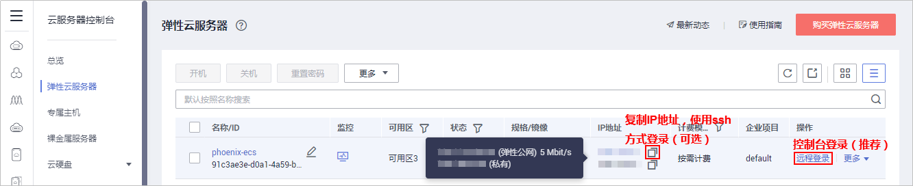
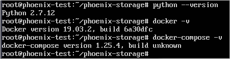
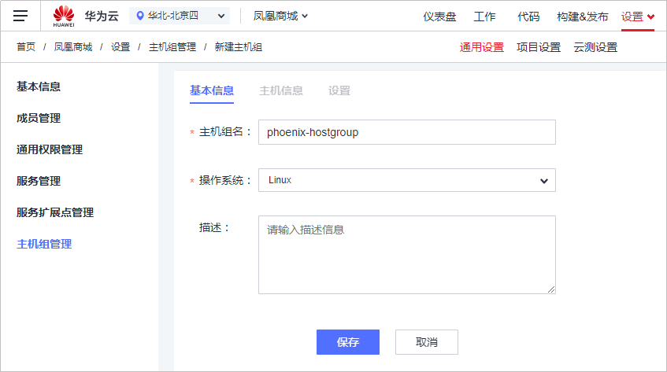
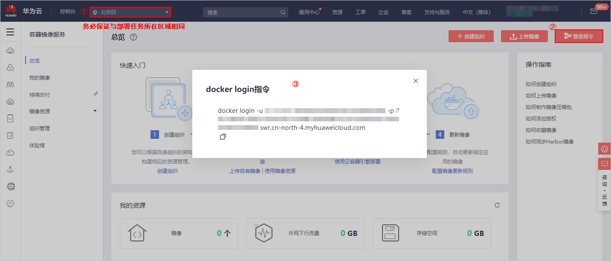
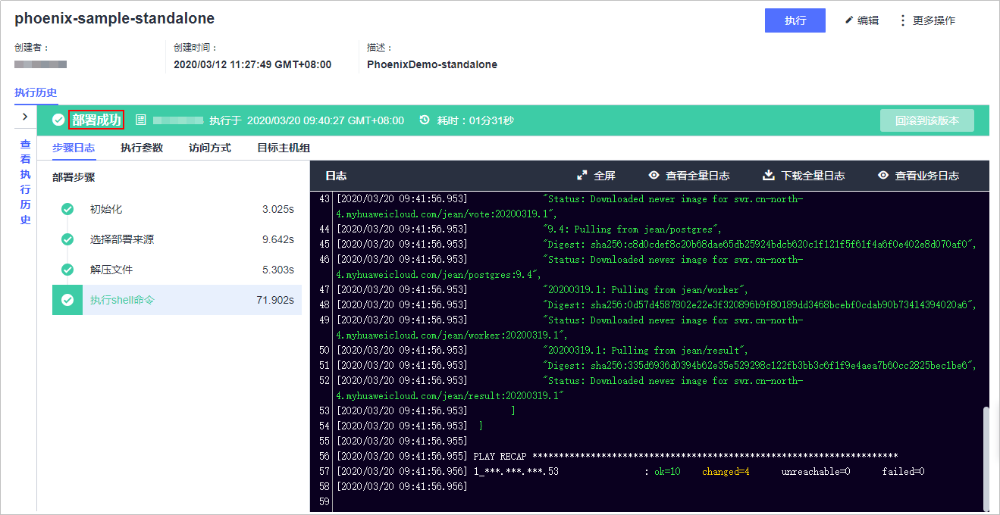
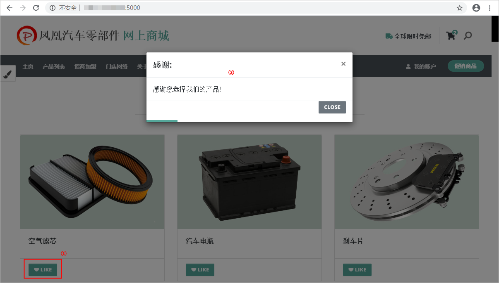

# **使用持续发布，在代码更新后自动完成应用部署（ECS篇）**<a name="devcloud_practice_2007"></a>

## **背景**<a name="section188891718810"></a>

```
克里斯（应用程序开发副总裁）：Hey 比尔为了可以更快的、更稳定的持续地交付软件，我们需要运维提供自助、自动化部署服务的能力，这样就可以把一部分运维工作给到我们开发部门，同时也解放了你们运维的一些工作。
比尔（IT运维副总裁）：兄弟你说的对，我们可不想因为类似上次的人为误操作等问题，再一次凌晨3点被叫醒。
比尔（IT运维副总裁）：好消息，我们已经在DevCloud提供了自助部署服务能力，你们开发部门现在可以在平台上创建自动化部署任务完成应用的自动化环境部署了。
```

**本文档提供了如下两种部署方式：**

-   使用持续发布，在代码更新后自动完成应用部署到云主机ECS（本章节介绍）
-   使用持续发布，在代码更新后自动完成应用部署到云容器引擎CCE（下一章节介绍）

样例项目中预置了以下3个部署任务，本章节以任务“phoenix-sample-standalone“为例进行讲解。

<a name="table11691548568"></a>
<table><thead align="left"><tr id="row51691481065"><th class="cellrowborder" valign="top" width="25%" id="mcps1.1.3.1.1"><p id="p31694485618"><a name="p31694485618"></a><a name="p31694485618"></a><strong id="b734511581767"><a name="b734511581767"></a><a name="b734511581767"></a>预置部署任务</strong></p>
</th>
<th class="cellrowborder" valign="top" width="75%" id="mcps1.1.3.1.2"><p id="p7169194811614"><a name="p7169194811614"></a><a name="p7169194811614"></a><strong id="b15129419718"><a name="b15129419718"></a><a name="b15129419718"></a>任务说明</strong></p>
</th>
</tr>
</thead>
<tbody><tr id="row10169164815619"><td class="cellrowborder" valign="top" width="25%" headers="mcps1.1.3.1.1 "><p id="p131708481462"><a name="p131708481462"></a><a name="p131708481462"></a>phoenix-sample-standalone</p>
</td>
<td class="cellrowborder" valign="top" width="75%" headers="mcps1.1.3.1.2 "><p id="p717017481762"><a name="p717017481762"></a><a name="p717017481762"></a>standalone流程对应的部署任务，即部署至ECS。</p>
</td>
</tr>
<tr id="row1217014480615"><td class="cellrowborder" valign="top" width="25%" headers="mcps1.1.3.1.1 "><p id="p517015481762"><a name="p517015481762"></a><a name="p517015481762"></a>phoenix-cd-cce</p>
</td>
<td class="cellrowborder" valign="top" width="75%" headers="mcps1.1.3.1.2 "><p id="p111708481361"><a name="p111708481361"></a><a name="p111708481361"></a>CCE流程对应的部署任务，即部署至CCE。</p>
</td>
</tr>
<tr id="row31709481564"><td class="cellrowborder" valign="top" width="25%" headers="mcps1.1.3.1.1 "><p id="p117064813612"><a name="p117064813612"></a><a name="p117064813612"></a>phoenix-sample-test</p>
</td>
<td class="cellrowborder" valign="top" width="75%" headers="mcps1.1.3.1.2 "><p id="p111704485610"><a name="p111704485610"></a><a name="p111704485610"></a>测试环境对应的部署任务。</p>
</td>
</tr>
</tbody>
</table>

> **说明：**   
>关于vote、result、worker的说明，请参见[HE2E DevOps实践流程](HE2E-DevOps实践流程.md)。  

## **01.购买并弹性云服务器**<a name="section369110705717"></a>

通过本节，您将学习如何购买并配置Linux系统ECS主机。

本章节使用的是弹性云服务器ECS，您也可以使用自己的Linux主机（建议使用Ubuntu 16.04操作系统）。

-   <a name="li1196412555335"></a>**购买ECS主机**
    1.  登录[弹性云服务器ECS官网](https://www.huaweicloud.com/product/ecs.html)，单击“立即购买“，进入弹性云服务器控制台。
    2.  参照以下配置购买云主机，列表中未涉及的配置保持默认值。

        <a name="table4383935114417"></a>
        <table><thead align="left"><tr id="row93831035154415"><th class="cellrowborder" valign="top" width="15%" id="mcps1.1.4.1.1"><p id="p7383635154416"><a name="p7383635154416"></a><a name="p7383635154416"></a><strong id="b777995394412"><a name="b777995394412"></a><a name="b777995394412"></a>配置分类</strong></p>
        </th>
        <th class="cellrowborder" valign="top" width="15%" id="mcps1.1.4.1.2"><p id="p123081050204415"><a name="p123081050204415"></a><a name="p123081050204415"></a><strong id="b127964532445"><a name="b127964532445"></a><a name="b127964532445"></a>配置项</strong></p>
        </th>
        <th class="cellrowborder" valign="top" width="70%" id="mcps1.1.4.1.3"><p id="p13087504447"><a name="p13087504447"></a><a name="p13087504447"></a><strong id="b781645394415"><a name="b781645394415"></a><a name="b781645394415"></a>建议选择</strong></p>
        </th>
        </tr>
        </thead>
        <tbody><tr id="row238373516441"><td class="cellrowborder" rowspan="5" valign="top" width="15%" headers="mcps1.1.4.1.1 "><p id="p1338333510448"><a name="p1338333510448"></a><a name="p1338333510448"></a>基础配置</p>
        </td>
        <td class="cellrowborder" valign="top" width="15%" headers="mcps1.1.4.1.2 "><p id="p121871626174519"><a name="p121871626174519"></a><a name="p121871626174519"></a>计费模式</p>
        </td>
        <td class="cellrowborder" valign="top" width="70%" headers="mcps1.1.4.1.3 "><p id="p1187172617450"><a name="p1187172617450"></a><a name="p1187172617450"></a>按需付费</p>
        </td>
        </tr>
        <tr id="row10383135174416"><td class="cellrowborder" valign="top" headers="mcps1.1.4.1.1 "><p id="p151875265457"><a name="p151875265457"></a><a name="p151875265457"></a>区域</p>
        </td>
        <td class="cellrowborder" valign="top" headers="mcps1.1.4.1.2 "><p id="p418782664520"><a name="p418782664520"></a><a name="p418782664520"></a>最好选择部署任务所在的区域（若项目所在区域主机已售罄，可选其他区域）。</p>
        </td>
        </tr>
        <tr id="row13383735114415"><td class="cellrowborder" valign="top" headers="mcps1.1.4.1.1 "><p id="p71871126104511"><a name="p71871126104511"></a><a name="p71871126104511"></a>可用区</p>
        </td>
        <td class="cellrowborder" valign="top" headers="mcps1.1.4.1.2 "><p id="p14187102617458"><a name="p14187102617458"></a><a name="p14187102617458"></a>随机分配</p>
        </td>
        </tr>
        <tr id="row2038333511442"><td class="cellrowborder" valign="top" headers="mcps1.1.4.1.1 "><p id="p1018772684519"><a name="p1018772684519"></a><a name="p1018772684519"></a>规格</p>
        </td>
        <td class="cellrowborder" valign="top" headers="mcps1.1.4.1.2 "><p id="p111871267459"><a name="p111871267459"></a><a name="p111871267459"></a>通用计算型 - s3.large.2（<span>若已售罄，可选其他2核8G以上规格</span>）。</p>
        </td>
        </tr>
        <tr id="row1838314356447"><td class="cellrowborder" valign="top" headers="mcps1.1.4.1.1 "><p id="p111874269457"><a name="p111874269457"></a><a name="p111874269457"></a>镜像</p>
        </td>
        <td class="cellrowborder" valign="top" headers="mcps1.1.4.1.2 "><p id="p18187126204511"><a name="p18187126204511"></a><a name="p18187126204511"></a>公共镜像 - Ubuntu 16.04 Server 64bit</p>
        </td>
        </tr>
        <tr id="row247710421267"><td class="cellrowborder" rowspan="4" valign="top" width="15%" headers="mcps1.1.4.1.1 "><p id="p2384133564416"><a name="p2384133564416"></a><a name="p2384133564416"></a>网络配置</p>
        </td>
        <td class="cellrowborder" valign="top" width="15%" headers="mcps1.1.4.1.2 "><p id="p9479164215261"><a name="p9479164215261"></a><a name="p9479164215261"></a>网络</p>
        </td>
        <td class="cellrowborder" valign="top" width="70%" headers="mcps1.1.4.1.3 "><p id="p147954232611"><a name="p147954232611"></a><a name="p147954232611"></a>在列表中任选一个即可。</p>
        </td>
        </tr>
        <tr id="row73833352446"><td class="cellrowborder" valign="top" headers="mcps1.1.4.1.1 "><p id="p1385011580453"><a name="p1385011580453"></a><a name="p1385011580453"></a>弹性公网IP</p>
        </td>
        <td class="cellrowborder" valign="top" headers="mcps1.1.4.1.2 "><p id="p585045884510"><a name="p585045884510"></a><a name="p585045884510"></a>现在购买</p>
        </td>
        </tr>
        <tr id="row1538443574418"><td class="cellrowborder" valign="top" headers="mcps1.1.4.1.1 "><p id="p4850358124513"><a name="p4850358124513"></a><a name="p4850358124513"></a>规格</p>
        </td>
        <td class="cellrowborder" valign="top" headers="mcps1.1.4.1.2 "><p id="p18850155874515"><a name="p18850155874515"></a><a name="p18850155874515"></a>静态BGP</p>
        </td>
        </tr>
        <tr id="row9321649124515"><td class="cellrowborder" valign="top" headers="mcps1.1.4.1.1 "><p id="p5850958164519"><a name="p5850958164519"></a><a name="p5850958164519"></a>计费方式</p>
        </td>
        <td class="cellrowborder" valign="top" headers="mcps1.1.4.1.2 "><p id="p1585035814459"><a name="p1585035814459"></a><a name="p1585035814459"></a>按宽带计费</p>
        </td>
        </tr>
        <tr id="row11863194994513"><td class="cellrowborder" rowspan="4" valign="top" width="15%" headers="mcps1.1.4.1.1 "><p id="p138631049134515"><a name="p138631049134515"></a><a name="p138631049134515"></a>高级配置</p>
        </td>
        <td class="cellrowborder" valign="top" width="15%" headers="mcps1.1.4.1.2 "><p id="p475414237464"><a name="p475414237464"></a><a name="p475414237464"></a>云服务器名称</p>
        </td>
        <td class="cellrowborder" valign="top" width="70%" headers="mcps1.1.4.1.3 "><p id="p1675419232461"><a name="p1675419232461"></a><a name="p1675419232461"></a>自定义（为避免账户下购买过多个主机时不易查找的情况，建议修改系统默认主机名称，使用易于辨认的主机名）。</p>
        </td>
        </tr>
        <tr id="row16903122194611"><td class="cellrowborder" valign="top" headers="mcps1.1.4.1.1 "><p id="p07549237460"><a name="p07549237460"></a><a name="p07549237460"></a>登录凭证</p>
        </td>
        <td class="cellrowborder" valign="top" headers="mcps1.1.4.1.2 "><p id="p275412232465"><a name="p275412232465"></a><a name="p275412232465"></a>密码</p>
        </td>
        </tr>
        <tr id="row411812313463"><td class="cellrowborder" valign="top" headers="mcps1.1.4.1.1 "><p id="p14754623174612"><a name="p14754623174612"></a><a name="p14754623174612"></a>密码</p>
        </td>
        <td class="cellrowborder" valign="top" headers="mcps1.1.4.1.2 "><p id="p1575472319462"><a name="p1575472319462"></a><a name="p1575472319462"></a>自定义，建议P2ssw0rd。</p>
        </td>
        </tr>
        <tr id="row559115324610"><td class="cellrowborder" valign="top" headers="mcps1.1.4.1.1 "><p id="p7754132314619"><a name="p7754132314619"></a><a name="p7754132314619"></a>云备份</p>
        </td>
        <td class="cellrowborder" valign="top" headers="mcps1.1.4.1.2 "><p id="p475452311464"><a name="p475452311464"></a><a name="p475452311464"></a>暂不购买</p>
        </td>
        </tr>
        </tbody>
        </table>

    3.  在步骤“确认配置“中，企业项目选择“default“，勾选“我已经阅读并同意《华为镜像免责声明》“，单击“立即购买“。

        系统将提示“任务提交成功！“，单击“返回云主机列表“，即可看到刚刚购买的云主机。


-   **安装Docker以及Python**
    1.  登录[弹性云服务器ECS官网](https://www.huaweicloud.com/product/ecs.html)，单击“立即购买“，进入弹性云服务器控制台。
    2.  登录云主机：

        -   在列表中单击“远程登录“，打开云主机。

            输入用户名“root“，及在[ 购买ECS主机](#li1196412555335)中设置的密码，登录云主机

        -   使用ssh方式登录远程主机（可选）：使用命令行或者Xshell等工具输入以下指令并登录。

            ```
            ssh root@主机IP地址
            ```

            IP地址通过单击列表中图标获取。

        

          

    3.  执行以下命令，安装运行程序所需的依赖工具“Python\\Docker\\Docker-Compose“。

        ```
        git clone https://codehub.devcloud.huaweicloud.com/fhxmjxmb00001/phoenix-storage.git 
        cd phoenix-storage
        sh install.sh
        ```

    4.  执行以下命令，指令检测“Python\\Docker\\Docker-Compose“是否安装成功。

        ```
        python --version
        docker -v
        docker-compose -v
        ```

        当出现以下提示时，表示安装成功。

        

          

    5.  返回控制台，单击云主机名称，进入主机管理页面。

        选择“安全组“页签，单击安全组名称，展开详情，单击“更改安全组规则“，进入安全组管理界面。

        

          

    6.  选择“入方向规则“页签，单击“添加规则“，添加一条入方向规则“允许访问5000以及5001端口“。

        

          


## **02.使用自动化部署实现一键部署**<a name="section13226643184211"></a>

通过本节，您将学习如何学**部署**服务结合**弹性云服务器ECS**，完成应用的自动化部署。

-   <a name="li1079619123430"></a>**添加授信主机**
    1.  进入项目，单击页面上方导航“设置  \>  通用设置“。
    2.  在左侧导航栏选择“主机组管理“，单击“新建主机组“。

        输入主机组名，单击“保存“。

        

          

    3.  单击“添加主机“，在弹框中输入刚刚购买的ECS主机信息，单击“添加“保存。

        当出现以下提示时，表示主机添加成功。若主机添加失败，请参考[部署-常见问题-主机问题](https://support.huaweicloud.com/deployman_faq/deployman_faq_0000.html)排查。

        

          


-   **持续部署配置**
    1.  进入项目，单击页面上方导航“构建&发布  \>  部署“，进入部署服务。

        找到编译构建任务“phoenix-sample-standalone“，单击此任务对应操作列中的图标，进入“编辑任务“页面。

    2.  选择“部署步骤“页签，单击部署步骤“选择部署来源“，编译以下信息。

        -   选择源类型：选择“构建任务“。
        -   主机组：选择在[•添加授信主机](#li1079619123430)中创建的主机组。选择主机最后，系统会弹框确认“是否将后续步骤的主机组也修改为phoenix-hostgroup？“，单击“确定“即可。
        -   请选择构建任务：选择“phoenix-sample-ci“。

        

          

        > **说明：**   
        >“选择源类型“处也可以选择“软件包“，软件包需选择最新版本。  

    3.  步骤“解压文件“与“执行shell命令“保持默认配置即可。
    4.  选择“参数设置“页签，根据SWR服务登录指令填写参数。

        登录指令通过SWR控制台获取，操作方式如下：

        1.  登录[容器镜像服务SWR官网](https://www.huaweicloud.com/product/swr.html)，单击“立即使用“，进入容器镜像服务控制台。

            检查页面左上方的“区域“列表，选择与编译构建任务所在区相同的区域。

        2.  单击“登录指令“，系统生成并弹框显示docker login指令。

            登录指令中：

            -   **-u**之后的字符串为用户名（docker-username）
            -   **-p**之后的字符串为密码（docker-password）
            -   最后的字符串为服务器地址（docker-server）

        

          

    5.  单击“保存并执行“，启动部署任务。

        系统自动跳转至“部署详情“页面，可以查看任务执行进展。

        当出现以下页面时，表示任务执行成功。若任务执行失败，请参照[部署-常见问题-任务步骤问题](https://support.huaweicloud.com/deployman_faq/deployman_faq_1017.html)排查。

        

          


-   ****验证部署结果****
    1.  打开浏览器，输入“http://ip:5001“，打开管理端UI。

        此时，页面中的图表显示为空白。

        

          

    2.  打开另一个浏览器页面，输入“http://ip:5000“，打开用户端UI。

        下拉网页，找到产品“空气滤芯“，单击该产品下方的“LIKE“。

        

          

    3.  返回管理端UI，刷新页面。

        此时页面中，产品“空气滤芯“处出现直方图，数值为1。

        

          


