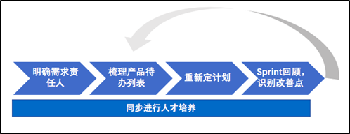
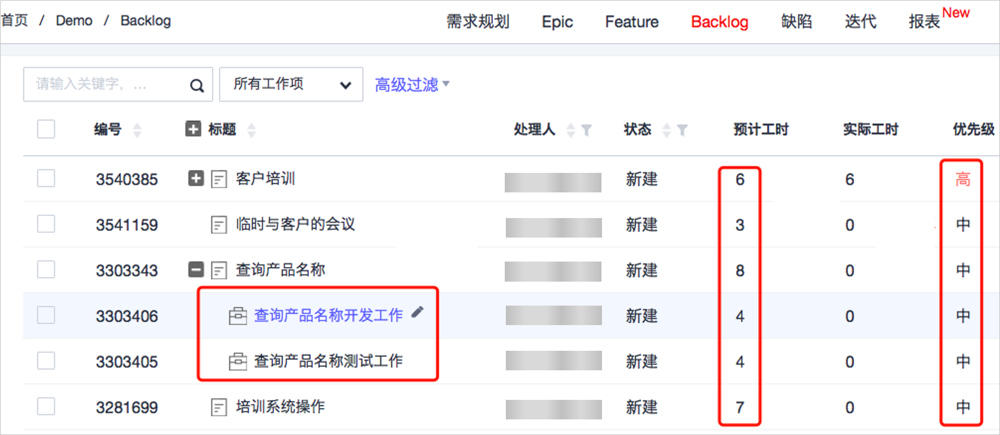
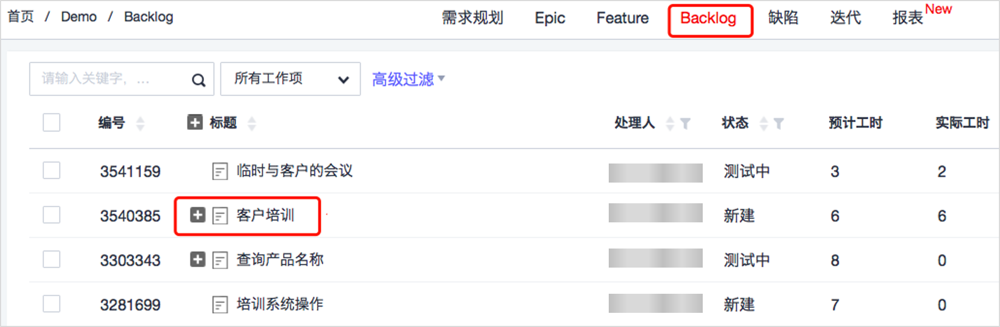
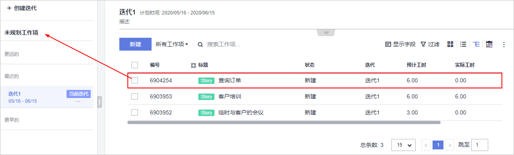
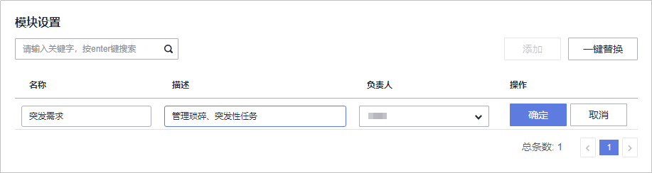
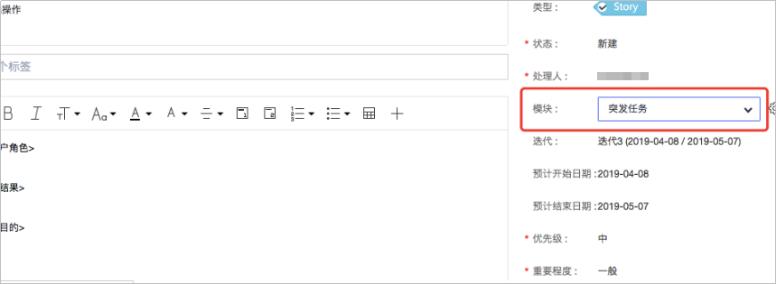
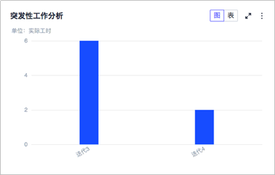
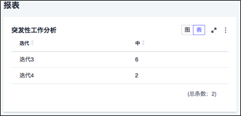

# 如何在软件开发团队中管理琐碎、突发性任务

## 背景

开发团队如何管理琐碎、突发性工作？

企业的一些软件开发团队经常出现类似培训支撑等突发性工作，开发团队不清楚如何管理好类似客户培训这样的突发性支撑工作。

解决突发性工作的问题被很多开发团队所重视，它直接影响开发团队工作的进度和速率，间接着影响迭代目标是否能完成，甚至整个项目的成败。所以降低或解决突发性工作对开发团队的干扰非常重要。

## 问题分析

我们先将场景大致分成以下两种：

<table><thead align="left"><tr id="row1773274974011"><th class="cellrowborder" valign="top" width="25%" id="mcps1.1.3.1.1">
<strong id="b37321049134017">场景特点</strong>

</th>
<th class="cellrowborder" valign="top" width="75%" id="mcps1.1.3.1.2">
<strong id="b573219499403">分析</strong>

</th>
</tr>
</thead>
<tbody><tr id="row1173274944015"><td class="cellrowborder" valign="top" width="25%" headers="mcps1.1.3.1.1 ">
支撑工作与开发工作混合，出现突发性工作是常态。

</td>
<td class="cellrowborder" valign="top" width="75%" headers="mcps1.1.3.1.2 ">
支撑的工作和正常的开发工作混合在一起，开发人员会经常临时切换工作内容，难免会对管理增加难度，频繁切换工作内容也会造成时间的浪费，因为开发人员需要梳理新工作，新工作完成后还要继续回想之前的工作做到了哪里。因此，问题的根源在于开发团队模式上，在此模式下需要考虑时刻应对问题、风险。

</td>
</tr>
<tr id="row1673244910404"><td class="cellrowborder" valign="top" width="25%" headers="mcps1.1.3.1.1 ">
开发工作为主，伴随着出现突发性应急工作，也就是正常的需求变更。

</td>
<td class="cellrowborder" valign="top" width="75%" headers="mcps1.1.3.1.2 ">
有了新的应急工作，开发团队成员不知道怎么应对，什么时候去接受这个工作，谁来决定是否要做，谁去做，没有一个公开、透明的规则。没有一个可以承载这些新工作的地方。问题的根源在于如何管理好Backlog。再进一步理解，当有新的工作项加进来时，如何更新Backlog，也就是我们常说的有了需求变更（临时增加任务也算需求变更）怎么办？

</td>
</tr>
</tbody>
</table>

-   **在第一种场景中**，支撑工作与开发工作混合，没有明显的优先级，需要随时接受和完成新的支撑任务。从管理上来说，这些突发的琐碎任务和开发任务同时管理增加了很大的难度。
-   **在第二种场景中**，开发团队正常进行开发工作的时候，客户经常会提出一些干扰开发团队冲突任务。而且突发性的工作是由客户重点提出并需要优先处理的，所以开发团队经常会额外付出工作量去处理，造成迭代目标不能达成的风险。

开发团队主要想解决如何处理琐碎、突发性的支撑工作，如何提高工作效率的问题。

## 解决措施

敏捷方式是趋势，越来越多的开发团队开始接触和使用，DevCloud产品也是基于敏捷思维设计的，以下内容均以敏捷方式叙述，包括但不限于Scrum框架。

-   对于场景一，可以从人员分工角度思考，建议开发团队人员最好有工作侧重点的划分。一部分人员精力用于开发，另一部分人员侧重于应对突发工作。应对突发工作的人员时刻准备着问题风险的对应（比如开发工作尽量领取简单、松耦合的）。应对开发工作的人员专心完成开发内容。不管工作分工是哪种类型的开发团队，再有新的工作进来时，都需要遵循开发团队制定的规则，也就是管理好工作项的规则。
-   上表中的场景二是我们很多开发团队中经常遇见过的，也是本文着重描述术的情况。从根本解决工作项优先级的问题，系统地学习怎么样应对需求变更才是根本。

**对于场景二的解决方案思路如下**：

由于管理好工作项是解决问题的核心，因此在形成工作项之前，我们需要解决谁对工作项负责或者说工作项来源的问题，然后要针对工作项做好工作计划，这样开发团队才能很好的执行。

-   **首先**，明确产品经理，做到需求来源唯一。
-   **其次**，梳理产品待办列表，高优先级的工作项先做。
-   **然后**，重新定计划，确保开发团队容量适合，合理更新迭代目标。
-   **再然后**，回顾总结，选出改善点，下个迭代做得更好。
-   **最后**，几个迭代下来，度量分析，不断改善。另外，同步需要进行的是人才的培养，向跨职能型团队努力。

解决方案思路示意图如下：

1.  **明确需求责任人**

    明确需求责任人，做到需求来源唯一。在DevCloud中一般指**产品经理**充当这个角色。需求责任人至少同时要面对两个方向。

    -   **方向一**：需求责任人必须很好地理解项目中的利益干系人、客户和用户的需要（包括前面提到的突发工作项）及其优先级，以便能充当他们的代言人。从这个角度理解，一般是产品经理充当需求责任人。
    -   **方向二**：需求责任人必须与开发团队交流要构建的特性及其构建顺序。需求责任人还必须保证特性的接收标准已有明确说明，让开发团队可以确定在什么情况下需求责任人可以认为特性完成了。在这个角度理解，一般是业务分析人员和测试人员的角色。

    同时，需求责任人还要在版本、迭代和Backlog层面都能够持续做出良好的经济决策，管理经济效益。为了统一叫法、便于理解，后面需求责任人都由产品经理充当（类似Scrum框架中的产品负责人）。

    **总结一下，产品经理的主要职责如下图所示：**

    

    图中标亮部分的产品经理职责就与迭代中对应这些突发性工作相关了。产品经理需要与利益干系人充分沟通，确定这些突发的工作优先级别，同时从业务价值和管理经济效益等维度考虑，明确是否一定要在本迭代中完成。一旦确定这些突发工作属于高优先级，必须在本迭代中完成，那就需要重新梳理工作项了。

2.  **梳理Backlog**

    梳理Backlog，高优先级的Backlog放到迭代待办列表即迭代中（更多关于迭代待办列表的内容请参考下面的“了解更多”）中先做。

    -   **首先**，我们一起先来了解一下什么是Backlog。Backlog是一个按优先顺序排列的、预期产品功能的列表。
    -   **其次**，再来理解一下什么是工作项。工作项是Backlog中的待办事项。对用户和客户来说，大多数的工作项都是有实际价值的特性和功能，当然也包括一些需要缺陷修复、技术改进、知识获取等工作以及产品负责人认为有价值的任何工作（当然有价值的突发性工作也属于工作项）。
    -   **然后**，什么是梳理？梳理是指三大重要活动。第一，确立并细化工作项；第二，对工作项进行估算；第三，为工作项排列优先顺序。

    下图说明了通过梳理活动改变Backlog的结构：

    

    梳理后，对应DevCloud中的体现，如DevCloud梳理活动结果图所示。

    

    经过产品经理梳理后，如图红色框线部分，突发培训任务的工作项得到了合理的优先级，而且是经过工作量估算，同时将原来的查询产品名称任务进行了拆分细化。产品经理是梳理活动的最终决策者，也就是说突发性的工作由产品经理主导梳理。优秀的产品经理能够充分协调利益干系人安排足够的时间，根据开发团队的特点和项目类型来开展梳理活动。同时开发团队还要估算新加入突发工作的工作量，帮助产品经理根据技术依赖关系和资源约束来排列工作项的优先顺序，如果新加入突发性培训任务的工作项优先级高，那么就会纳入本迭代代办列表中。

3.  **重新定计划**

    重新定计划，确保开发团队容量适合，合理更新迭代目标。在重新定计划之前，我们一起来了解下什么是敏捷下的计划，敏捷提倡的计划和传统瀑布开发模式下的计划有什么区别。

    我们知道敏捷宣言中提倡“响应变化高于遵循计划。”，它与传统瀑布开发模式或者说计划驱动的顺序开发模式的计划**不同点就是一个是偏向响应变化，一个是偏向遵循计划**。

    **顺序开发过程中**，是计划驱动，计划是工作如何开展、何时进行的权威信息源。因此，计划是需要遵循的。相比之下，在敏捷中，根据实时信息关注适应重新制定计划胜于遵循计划。我们认为盲目的相信计划往往会让我们忽视“计划可能有错”这个事实。

    **敏捷开发过程中**，我们的目标不是满足某个计划或者某个事先认为事情如何进展的预言。相反，我们的目标是快速地重新制定计划并根据开发过程中不断出现的、具有重要经济价值的信息进行调整。因此，通过梳理以后的工作项，可以对应的调整计划。原计划准备做的工作项可能被移入到下一个迭代中实现，这里体现的是“等价交换原则”，意思是用优先级高的突发性工作项，替掉同等工作量的其它工作项，这也是为了保开发团队按照一个稳定的节奏交付。因为固定的开发团队一个迭代中容量是不变的，新加入突发工作项而不移除其它工作项势必会给开发团队交付带来压力，破坏开发团队的交付节奏。等价交换示意图如下：

    

    具体在DevCloud中的体现，如下面两张图所示。

    **图 1**  等价交换图一  
    

    **图 2**  等价交换图二  
    

    最后，从迭代中选取差不多工作量的低优先级工作项移回到Backlog中，即在DevCloud中完成了工作项的等价交换。

4.  **迭代回顾，识别改善点**

    迭代回顾是一个会议，目标是持续改进流程，根据开发团队的需要改进和制定流程，以提高士气，提高效率，提高工作产出速率。几个迭代下来，需要对这类突发工作进行度量分析，识别改善点，持续改善。虽然我们提倡响应变化高于遵循计划，但同时执行迭代的时候也需要开发团队在不受干扰的情况下全力以赴的迭代。因此，就应该思考为什么每个迭代中都有外界的干扰（突发工作）存在，开发团队共同学会分析和找到解决办法才是真正的解决问题之道。

    这里给出一个DevCloud产品很好的小实践，可以提供客观数据帮助回顾。新纳入迭代待办列表的突发性工作项可以在DevCould的“模块”下进行管理。也就是说，在新建User Story之前建立一个“突发任务”模块，然后将User Story中的“模块”属性选中它。这是为了在后续几个迭代中对这类突发性工作进行度量分析（可以按模块排序，方便度量分析）以便持续改善做准备。如以下两图所示：

    **图 3**  新建突发模块图  
    

    **图 4**  新建User Story  
    

    选择“报计 \> 新建报表 \> 自定义报表 \> 增加筛选条件（模块） \> 按迭代维度 \> 保存”，对统计出来的数据进行分析。可以以图和表两种方式展示，如以下两图所示：

    **图 5**  按图展示  
    

    **图 6**  按表展示  
    

5.  **同步进行人才培养**

    同步需要进行的是人才的培养，向跨职能型开发团队努力。不仅仅是应对处理突发性工作，而是让开发团队更高效。

    每个任务应该由谁来做，或者说突发性工作应该由谁来做？答案很明显，应该是能够最快且正确完成这个工作的人来做。如果这个人不在了怎么办？或者他正在做其他工作，抽不出时间，但这个任务需要马上完成。开发团队成员都有责任考虑各种不确定因素，做出最好的选择。如果开发团队成员都是T型技能的时候，每个任务都有好几个人可以做，那么开发团队就能够在迭代执行期间几个人全力完成制约工作项流程的任务，更灵活地平衡资源，使开发团队更高效。

## 了解更多：迭代待办列表

迭代待办列表在DevCloud中称“迭代”，它是一组为当前迭代选出的产品待办列表项，同时加上交付产品增量和实现迭代目标的计划。迭代待办列表是开发团队对于下一个产品增量所需的那些功能以及交付那些功能能到“完成”的增量中所需要工作的预测。

当新工作出现时，开发团队需要将其加入到迭代待办列表中去。随着工作的执行或完成，剩余的工作量被估算并更新。当计划中的某个部分失去开发意义，就可以将其移除。在迭代期间，只有开发团队可以改变迭代待办列表。迭代待办列表是高度可见的，是对开发团队计划在当前迭代内工作完成情况的实时反映，该列表由开发团队全权负责。

迭代待办列表在迭代计划会议中形成，其中开发团队不会被动分配任务而是由开发团队成员主动认领他们擅长和喜爱的任务。任务被分解为以小时为单位，建议任务不要超过16个小时。如果一个任务超过16个小时，那么它就应该被进一步分解。每项任务信息包括其负责人、工作量、承诺的完成时间及其在迭代中任意一天的剩余工作量，且仅开发团队有权改变其内容。

_**参考文献**_

1.  _Kenneth S. Rubin. Scrum精髓\[M\].北京：清华大学出版社。_
2.  _Scrum指南2007版。_
3.  _Mark C. Layton. 敏捷项目管理\[M\].北京：人民邮电出版社。_

