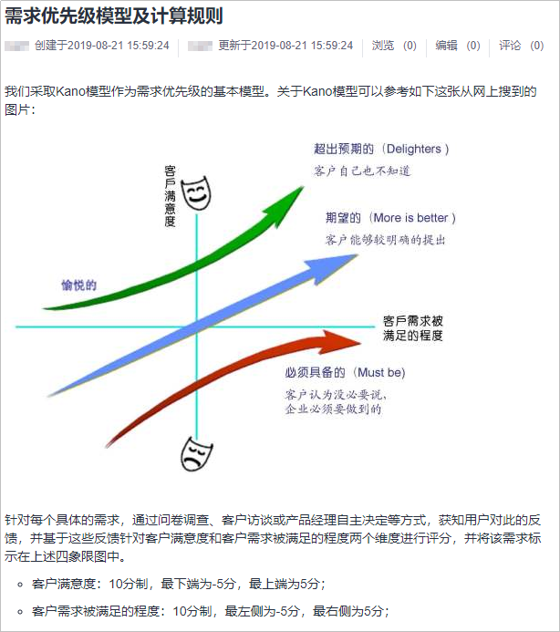
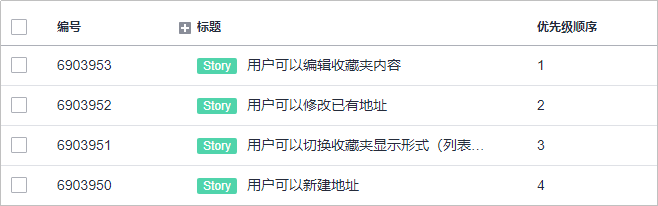
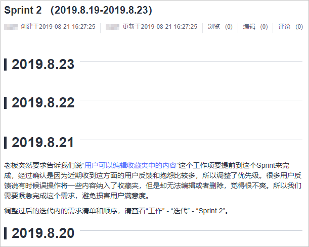

# **如何进行需求优先级管理**

## **需求优先级管理四步走**

需求优先级的管理，其实是为了帮助我们确定先做哪个需求后做哪个需求，从而可以最大化我们的回报、最小化我们的风险或投入。要做好优先级管理，或者更直接来说是优先级顺序管理，我们需要做到如下几件事情：

1.  确定优先级模型：优先级看起来像是一个简单直接的值，但实际上它是一个基于多种因素进行综合判断之后得出的一个值，这些因素和判断原则，就是我们所说的优先级模型。
2.  排定需求优先级顺序：将需求代入优先级模型进行计算，得出每个需求的优先级顺序。
3.  调整需求优先级顺序。
4.  改进优先级模型：如果经常发生需要调整需求优先级顺序的情况，那么最好是对这些情况进行一定的复盘分析，如有必要，修正或改进当前的优先级模型，让它可以适应实际情况，以避免调整优先级顺序的情况反复发生；另外就是需求可能已经交付或发布上线，但是该功能的实际用量或价值不吻合预期，则需要反思我们对这些需求的分析和判断，究竟是分析判断有误还是优先级模型有误，并进行相应的调整。

## **确定优先级模型**

成本收益分析就是最简单的一种优先级模型，重要/紧急的四象限也是一种优先级模型，[Kano模型](https://en.wikipedia.org/wiki/Kano_model)也是一种优先级模型，它们都可以帮助我们去确定需求的优先级顺序。模型可以简单也可以复杂，根据企业实际需要来确定即可。

务必切记优先级模型不应追求完美，以避免模型过于复杂，导致优先级管理的管理开销过高，喧宾夺主，反而影响了需求的开发和交付。如果较为简单的模型就可以满足需要，就应该首选使用较简单的模型。企业可以从简单开始，逐渐完善，不需要也不应该在一开始就追求过于复杂的模型。

-   简单可以体现在考虑的要素更少，比如成本收益分析只考虑两个要素，就比考虑更多要素的模型简单。
-   简单还可以体现在要素的取值范围更窄或精度要求更低，比如预计利润只要求评估高/中/低，就比要求以万元为单位评估预计利润更简单。

优先级模型确定后，可以进行存档管理，注意该模型宜供所有人或相关人员查阅学习，比如录入到DevCloud的Wiki知识管理系统就是一个很好的做法，如下图：

## **排定需求优先级顺序**

比如成本收益分析，可以是把预期市场收入作为收益值，把预期研发投入作为成本值，计算差值，或计算ROI均可。假设需求A预计收益为10万元，研发投入按人天折算预计3万元，那么预计利润就是7万元，预计ROI是 233%；需求B预计收益为5万元，研发投入折算预计4万元，那么预计利润1万元，预计ROI为 25%。那么需求A的优先级顺序就要比需求B更靠前。这种相差悬殊的情况往往不难判断，我们假设还有需求C预计利润也是7万元、预计ROI是50%，以及需求D是预计利润1万元、预计ROI是500%。那么A、B、C、D这四个需求的具体顺序怎么排定呢？

如果真的出现这种情况，那就更复杂一些了，需要考虑引入权重，然后计算出一个综合值，这个值按照某种规则（例如从大到小）排列出来就是最终的优先级顺序，比如：

<table><tbody><tr id="row373023715437"><th class="firstcol" valign="top" width="9.090909090909092%" id="mcps1.1.12.1.1">
-

</th>
<td class="cellrowborder" valign="top" width="9.090909090909092%" headers="mcps1.1.12.1.1 ">
预计收入（万元）

</td>
<td class="cellrowborder" valign="top" width="9.090909090909092%" headers="mcps1.1.12.1.1 ">
预计成本（万元）

</td>
<td class="cellrowborder" valign="top" width="9.090909090909092%" headers="mcps1.1.12.1.1 ">
预计利润（万元）

</td>
<td class="cellrowborder" valign="top" width="9.090909090909092%" headers="mcps1.1.12.1.1 ">
利润权重

</td>
<td class="cellrowborder" valign="top" width="9.090909090909092%" headers="mcps1.1.12.1.1 ">
利润加权值

</td>
<td class="cellrowborder" valign="top" width="9.090909090909092%" headers="mcps1.1.12.1.1 ">
ROI（%）

</td>
<td class="cellrowborder" valign="top" width="9.090909090909092%" headers="mcps1.1.12.1.1 ">
ROI权重

</td>
<td class="cellrowborder" valign="top" width="9.090909090909092%" headers="mcps1.1.12.1.1 ">
ROI加权值

</td>
<td class="cellrowborder" valign="top" width="9.090909090909092%" headers="mcps1.1.12.1.1 ">
综合值

</td>
<td class="cellrowborder" valign="top" width="9.090909090909092%" headers="mcps1.1.12.1.1 ">
优先级顺序

</td>
</tr>
<tr id="row8731143710434"><th class="firstcol" valign="top" width="9.090909090909092%" id="mcps1.1.12.2.1">
需求A

</th>
<td class="cellrowborder" valign="top" width="9.090909090909092%" headers="mcps1.1.12.2.1 ">
10

</td>
<td class="cellrowborder" valign="top" width="9.090909090909092%" headers="mcps1.1.12.2.1 ">
3

</td>
<td class="cellrowborder" valign="top" width="9.090909090909092%" headers="mcps1.1.12.2.1 ">
7

</td>
<td class="cellrowborder" valign="top" width="9.090909090909092%" headers="mcps1.1.12.2.1 ">
0.1

</td>
<td class="cellrowborder" valign="top" width="9.090909090909092%" headers="mcps1.1.12.2.1 ">
0.7

</td>
<td class="cellrowborder" valign="top" width="9.090909090909092%" headers="mcps1.1.12.2.1 ">
233%

</td>
<td class="cellrowborder" valign="top" width="9.090909090909092%" headers="mcps1.1.12.2.1 ">
1

</td>
<td class="cellrowborder" valign="top" width="9.090909090909092%" headers="mcps1.1.12.2.1 ">
2.33

</td>
<td class="cellrowborder" valign="top" width="9.090909090909092%" headers="mcps1.1.12.2.1 ">
3.03

</td>
<td class="cellrowborder" valign="top" width="9.090909090909092%" headers="mcps1.1.12.2.1 ">
2

</td>
</tr>
<tr id="row173218371433"><th class="firstcol" valign="top" width="9.090909090909092%" id="mcps1.1.12.3.1">
需求B

</th>
<td class="cellrowborder" valign="top" width="9.090909090909092%" headers="mcps1.1.12.3.1 ">
5

</td>
<td class="cellrowborder" valign="top" width="9.090909090909092%" headers="mcps1.1.12.3.1 ">
4

</td>
<td class="cellrowborder" valign="top" width="9.090909090909092%" headers="mcps1.1.12.3.1 ">
1

</td>
<td class="cellrowborder" valign="top" width="9.090909090909092%" headers="mcps1.1.12.3.1 ">
0.1

</td>
<td class="cellrowborder" valign="top" width="9.090909090909092%" headers="mcps1.1.12.3.1 ">
0.1

</td>
<td class="cellrowborder" valign="top" width="9.090909090909092%" headers="mcps1.1.12.3.1 ">
25%

</td>
<td class="cellrowborder" valign="top" width="9.090909090909092%" headers="mcps1.1.12.3.1 ">
1

</td>
<td class="cellrowborder" valign="top" width="9.090909090909092%" headers="mcps1.1.12.3.1 ">
0.25

</td>
<td class="cellrowborder" valign="top" width="9.090909090909092%" headers="mcps1.1.12.3.1 ">
0.35

</td>
<td class="cellrowborder" valign="top" width="9.090909090909092%" headers="mcps1.1.12.3.1 ">
4

</td>
</tr>
<tr id="row9732153764315"><th class="firstcol" valign="top" width="9.090909090909092%" id="mcps1.1.12.4.1">
需求C

</th>
<td class="cellrowborder" valign="top" width="9.090909090909092%" headers="mcps1.1.12.4.1 ">
21

</td>
<td class="cellrowborder" valign="top" width="9.090909090909092%" headers="mcps1.1.12.4.1 ">
14

</td>
<td class="cellrowborder" valign="top" width="9.090909090909092%" headers="mcps1.1.12.4.1 ">
7

</td>
<td class="cellrowborder" valign="top" width="9.090909090909092%" headers="mcps1.1.12.4.1 ">
0.1

</td>
<td class="cellrowborder" valign="top" width="9.090909090909092%" headers="mcps1.1.12.4.1 ">
0.7

</td>
<td class="cellrowborder" valign="top" width="9.090909090909092%" headers="mcps1.1.12.4.1 ">
50%

</td>
<td class="cellrowborder" valign="top" width="9.090909090909092%" headers="mcps1.1.12.4.1 ">
1

</td>
<td class="cellrowborder" valign="top" width="9.090909090909092%" headers="mcps1.1.12.4.1 ">
0.5

</td>
<td class="cellrowborder" valign="top" width="9.090909090909092%" headers="mcps1.1.12.4.1 ">
1.2

</td>
<td class="cellrowborder" valign="top" width="9.090909090909092%" headers="mcps1.1.12.4.1 ">
3

</td>
</tr>
<tr id="row173218372435"><th class="firstcol" valign="top" width="9.090909090909092%" id="mcps1.1.12.5.1">
需求D

</th>
<td class="cellrowborder" valign="top" width="9.090909090909092%" headers="mcps1.1.12.5.1 ">
2

</td>
<td class="cellrowborder" valign="top" width="9.090909090909092%" headers="mcps1.1.12.5.1 ">
1

</td>
<td class="cellrowborder" valign="top" width="9.090909090909092%" headers="mcps1.1.12.5.1 ">
1

</td>
<td class="cellrowborder" valign="top" width="9.090909090909092%" headers="mcps1.1.12.5.1 ">
0.1

</td>
<td class="cellrowborder" valign="top" width="9.090909090909092%" headers="mcps1.1.12.5.1 ">
0.1

</td>
<td class="cellrowborder" valign="top" width="9.090909090909092%" headers="mcps1.1.12.5.1 ">
500%

</td>
<td class="cellrowborder" valign="top" width="9.090909090909092%" headers="mcps1.1.12.5.1 ">
1

</td>
<td class="cellrowborder" valign="top" width="9.090909090909092%" headers="mcps1.1.12.5.1 ">
5.0

</td>
<td class="cellrowborder" valign="top" width="9.090909090909092%" headers="mcps1.1.12.5.1 ">
5.1

</td>
<td class="cellrowborder" valign="top" width="9.090909090909092%" headers="mcps1.1.12.5.1 ">
1

</td>
</tr>
</tbody>
</table>

根据上述表格中所得出的结果，我们就应该依序将需求D、需求A、需求C、需求B排入开发计划。优先级顺序，在DevCloud中，可以使用工作项的“优先级顺序”字段来实现，该字段取值范围1-100，如下图所示。

## **调整需求优先级顺序**

调整顺序本身非常简单，只要在DevCloud中重新设定该需求的“优先级顺序”字段的值就可以。但重要的是，需要将优先级顺序调整这件事情记录下来，包括为什么要调整、具体如何调整的、调整背后的具体考虑等信息都记录下来，同样，建议记录在Wiki知识管理系统中。用于后续的复盘回顾中作为参考信息，比如每个Sprint/迭代结束时的回顾会议上拿出来进行探讨。

## **改进优先级模型**

市场在变化，用户在变化，产品在变化，优先级模型自然也必须跟随着发生变化。我们可以定期或不定期的安排对需求优先级模型进行复盘分析，找出可以改进或优化的点，并跟进落实。可以是定期开展，例如每个月进行一次复盘，把这个月所涉及的需求都拿出来审视，或者是其中有调整过优先级顺序或者出现过问题的需求拿出来审视均可；也可以是不定期，以问题驱动的方式，比如某天进行了大量需求优先级的调整，那么当天或第二天就可以临时召集一次复盘会议，分析为什么会发生这种情况。

复盘要有好的效果，就必须尽可能的复原问题发生当时的情况，所以前面提到的Wiki记录就变得非常重要。复盘会议应提供尽可能多的相关信息以便参会人员了解情况，充分探讨。

复盘过程中，我们要定位出正确的根因，是模型本身设计有问题（例如要素和尺度），还是取值、加权有问题（比如某类需求的预计收入就是非常难估算），还是过程管理的问题（比如过早进行估算，因为缺乏必要信息，导致估算得出的优先级顺序不准确），并进行针对性地改进。

  

_**参考文献**_

-   _《成为技术领导者》_，_杰拉尔德·温伯格_
-   _《复盘+：把经验转化为能力》_，_邱昭良_

  

