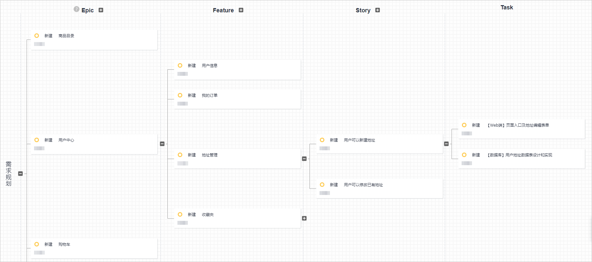
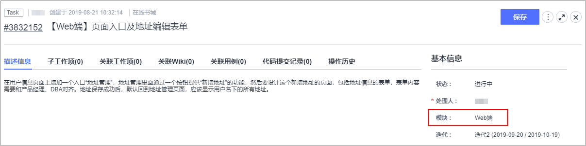
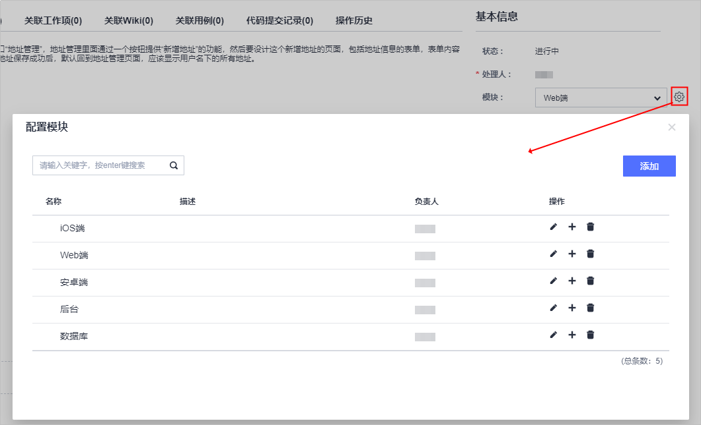
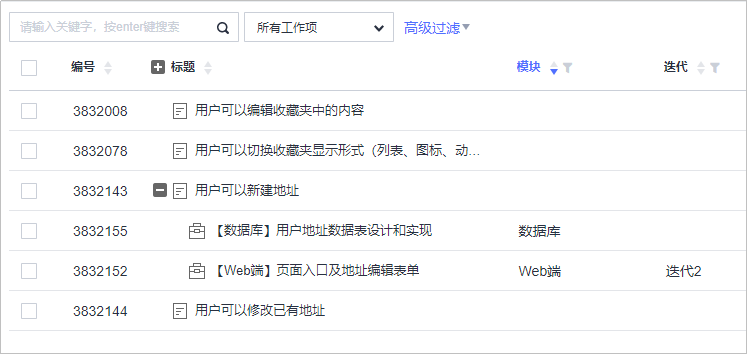

# **如何进行需求结构化管理**

## **为什么要进行需求结构化管理？**

首先，并不是说任何情况下都需要进行软件项目需求的结构化管理。如果只是事务性质的管理需求，也就是有需求了能记录、能跟踪状态、实现之后不需要继续跟踪、也不需要维护需求与需求之间的关联，那么不需要思考需求结构化管理这个问题。这种情况下，不管是用DevCloud的Scrum项目模板还是看板项目模板，都可以管理好需求和软件项目。只有在需求较多、且需求之间存在关联，而且即便是已经实现的需求也需要进行一定的管理、维护的情况下，我们才需要去思考需求结构化管理的问题，此时，我们需要使用DevCloud提供的Scrum项目模板，因为里面有Epic-Feature-Story的需求结构，以及需求规划功能可以辅助我们进行需求的结构化管理。

## **以什么为依据进行需求结构化管理？**

需求结构化管理，应该以什么为脉络来建立这个结构呢？软件研发无非是分为项目型软件研发和产品型软件研发两种，项目通常来讲都是临时性的，或者说短期性的，而产品或者软件系统是长期性的，或者说我们会持续维护、更新其功能特性的。项目复项目，我们很可能通过持续地完善和刷新同一套软件产品或系统来达成项目目标，交付软件项目所要求的功能特性的。这就意味着，**我们的需求结构化管理，需要以产品或系统的功能特性的脉络为依据**。而软件项目管理所需要关注的版本、客户、模块等信息，则可以通过需求的不同属性甚至标签等方式来实现。

## **使用DevCloud进行需求结构化管理的一种方式**

接下来，我们介绍推荐的一种方式。

-   **第一步：建立DevCloud项目**

    针对一个产品或系统一个产品或系统，建立一个DevCloud项目，该产品或系统的所有需求，都在此DevCloud项目里面进行管理。

    

      

-   **第二步：确立Epic-Feature-Story的需求结构**

    1.  Epic要承载业务价值，也即Epic需要是对企业本身是有意义的。

        将产品或系统的业务模块作为Epic，比如用户中心、购物车、配送管理等，比如一家货运云商，他们的油卡业务，就适合作为一个Epic，针对油卡的各种功能，就可以作为Feature展开。

    2.  Feature要承载用户价值，也即对于用户来说，是可以理解这个Feature，且认可其价值的，通常Feature也是用户可以直接感知、可以操作的。

        针对前面业务模块的具体展开、拆开，就可以作为Feature，也可以简单理解为一个业务流程、用户流程；以前面用户中心为例，用户信息可以是一个Feature、我的订单可以是一个Feature、地址管理可以是一个Feature；或者以油卡为例，购买油卡、我的油卡等就可以作为不同的Feature。

    3.  Feature往往还是有些大有些复杂，那就需要拆成颗粒度更小的Story，用来承载一个具体的用户操作。

        例如可以查看到所有订单、可以过滤订单、可以修改用户昵称、可以自定义头像等功能；

    4.  再往下一级的Task，就主要是为了分工协作，也即是说，如果Story可以包干到人，那么不再拆分Task也是可以的。

        Task往往是关于工程师需要具体做的工作，也就跟业务价值、用户价值、用户单步操作都没有了什么关系，通常都是把Story按照具体的组件、模块进行拆分，例如前端、后台、数据库之类的，或者是按照工作流程分工来拆分，例如UCD、开发、测试、部署等；

    如下图所示，各层级为：

    -   Epic：用户中心。
    -   Feature：地址管理。
    -   Story：用户可以新建地址。
    -   Task：【Web端】页面入口及地址编辑表单、【数据库】用户地址数据表设计和实现。

    

      

-   **第三步：通过工作项的属性，对于不同模块以及版本进行管理**

    工作项属性如下图所示：

    -   模块：Web端。
    -   发布版本号：1.0.1.2。

    

      

    对于模块清单的维护，可以在工作项编辑状态，点击“模块”字段右侧的小齿轮图标，即可在弹出窗口进行操作，可以添加、修改、删除模块。

    

      

    在工作项管理的Backlog视图下，通过“设置显示字段”增加“模块”字段后，既可以很方便地看到工作项相关的模块，当然也可以进行过滤。

    

      

_**参考文献**_：_《用户故事实战》，Mike Cohn_

  

