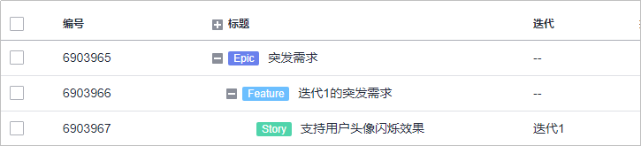
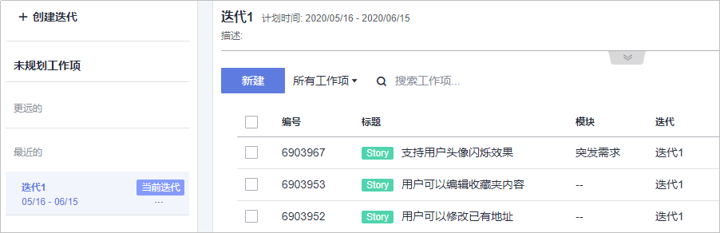

# 如何避免重要需求遗漏

## 避免重要需求遗漏的思路

避免重要需求遗漏，首先我们需要反问一句——为什么这些紧急重要的需求无法更早预见？同样的，我们需要了解：

-   具体是哪些外界原因？这些原因是否有共性，有的话，那就针对性处理；
-   增加的需求有无共性特点？有的话，可以针对性处理；
-   临时增加有多临时？我们是否有提高或改善响应能力的空间，如果我们可以更快调整和响应，使得这些临时需求对我们产生不了什么影响，那么这个问题也就不再是问题了；
-   既然是常态，为何我们的流程没有做出调整去应对？是调整过流程或工作方式，还是无法解决问题，还是说不知道该怎么调整流程或工作方式去适应？

## 具体操作方法

具体操作，可以按照事前、事中、事后各个阶段来采取不同的措施处理。

1.  **事中的处理**

    根据具体情况不同，在发现需求遗漏的当时，可以采取如下一些做法：

    -   重要需求遗漏，不紧急：既然不紧急，按照常规做法增加进去即可，但如果经常出现遗漏，就要考虑是否是需求分析和规划的实践做法有问题，才会导致问题持续出现，这种情况，应强化需求结构化管理，从全局出发进行思考和规划，避免因为思考的片面化和局部性导致的遗漏。
    -   重要需求遗漏，紧急：既然是又重要又紧急的需求，那么必然就得调整当前开发工作的顺序，把这个遗漏的重要紧急需求排进去，把工作安排下去；然后就要考虑从需求的优先级和需求的结构化管理两个方面入手复盘，并切实改进，避免类似情况再次发生。
    -   需求遗漏：如果是不太重要的需求遗漏，按照常规做法处理即可；可以根据其紧急程度和影响，决定是否调整工作顺序让这个需求插队；如果这种情况反复出现，那建议可以考虑进行复盘，从需求结构化管理的角度进行分析，并商讨改进措施。

2.  **事后的处理**

    事后其实就是复盘，复盘的关键是要基于盘来推演和分析，这个盘就是事前制定的模型和规范。是我们有模型有规范，但执行出了问题？还是说这几个需求情况特殊，模型比较简单没有覆盖到这些特殊情况？还是说模型和规范都没问题，就是人员能力不足，导致判断偏差大？只有找到正确的根因，才能够真正有效的解决问题，所以我们不复盘则已，要复盘就务必要认真严格地进行复盘。

    怎么复盘？复盘也是有方法有套路的，业界也有相关书籍可供我们参考借鉴。例如温伯格在《成为技术领导者》中提出的MOI模型就可以用作复盘的一种思路。

    -   M：激励（Motivation），是不是人们没有动力去做这件事情？
    -   O：组织（Organization），是不是无组织无纪律、一片混乱，人们不知道自己或别人该做什么？
    -   I：想法或创意（Idea/Innovation），是不是缺少如何解决这些问题的点子或创意，不知道有什么办法解决这个问题？

    复盘时要注意，受限于能力或经验以及出问题次数多少的影响，我们可能无法得出一个准确的结论和必然有效的解决方案。此时一方面需要秉持持续改进的心态，我们可以先落实当前已经比较明确的改进措施，后续再观察效果，持续复盘、持续改进即可。另一方面我们也可以先采取一些临时措施。

    1.  预留时间：比如，如果确实很难分析清楚为什么总是会遗漏需求，无法进行非常有针对性的处理时，也可以采取较为模糊应对的方式。可以拉取过去一段时间的工作记录，评估这段时间每个迭代的突发需求所消耗的工作量投入，可以取个平均值，然后在后续进行迭代工作安排的时候，固定的预留出一定量的时间，用于应对极有可能会出现的突发需求。
    2.  需求拆细：当出现突发需求，导致我们需要调整工作顺序时，很有可能会因为需求颗粒度大以至于腾挪余地有限，而难以避免突发需求带来的影响，因而还应该尽可能地采取拆细需求的方式，将颗粒度比较大的需求拆分为较小颗粒度的需求，可以增加调整需求工作顺序时的灵活性。

    要确定到底要预留多少时间，可以利用DevCloud的Epic-Feature-Story结构，把突发需求汇集在一起，便于统计。例如创建一个特殊的Epic“突发需求”，下一级是为每个迭代创建的Feature，用来承载各个迭代里面具体的那些突发需求（体现为Story），并做好工时的记录，迭代结束后，就可以来计算出现了多少个突发需求、投入了多少工作量了。

    

    也可以采用“模块”字段来辅助记录和统计突发需求的数据。例如，新建一个模块，取名“突发需求”，所有突发需求都标注为这个模块，那么后续就可以基于模块进行筛选或查看报表等方式来统计突发需求所消耗的工作量了。

    

3.  **事前的处理**

    事前的处理放到最后来介绍，是因为之所以会出现问题一般都是因为事前没有做好，但已经出现了问题就需要在当时尽快处理，所以先介绍了事中的处理。但当我们处理完问题也完成了事后复盘，就需要考虑未来的事前，尽可能的避免问题发生。 简单来讲，事前的话，就是要做好需求的结构化管理和需求的优先级管理，以及做好相关规范的宣导、人员的动员和能力的培养，这样就能够有效的避免或减小突发需求带来的影响了。

_**参考文献**_

-   _《成为技术领导者》_，_杰拉尔德·温伯格_
-   _《复盘+：把经验转化为能力》_，_邱昭良_

