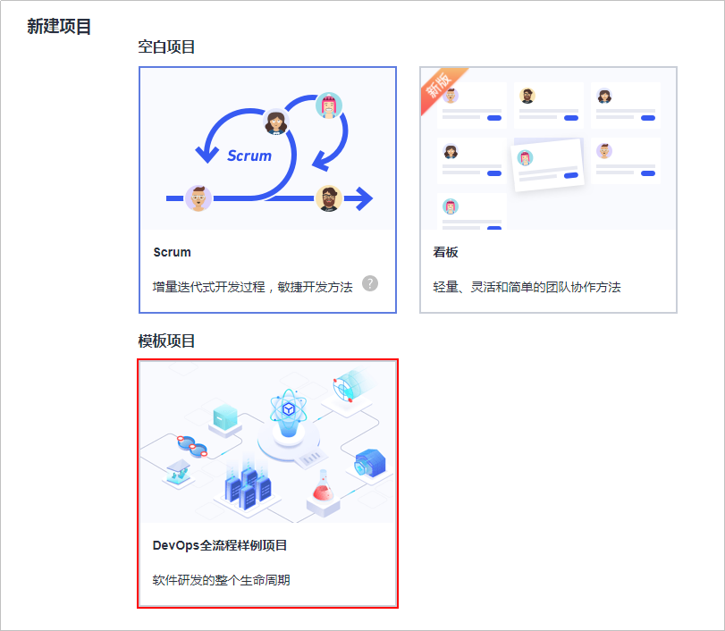

# **实践准备工作**

为了让您能更好的完成并体验HE2E项目在DevCloud上的端到端实施，在进行具体的任务操作前，您需要完成以下几个准备工作。

## **注册账号并实名认证**

使用软件开发平台（DevCloud）前，需要注册账号并进行实名认证，操作步骤如下：

1.  访问[官网](https://www.huaweicloud.com/)，单击右上角红色“注册“，进入注册界面，填写相应个人信息，填写完毕后单击“同意协议并注册“，即可完成注册。

    详细操作步骤请参考[账号中心-账号注册](https://support.huaweicloud.com/usermanual-account/zh-cn_topic_0069252244.html)。

2.  登录首页，单击页面右上方账号名下拉框中的“账号中心“，进入“账号中心“页面。

    单击左侧导航中的“实名认证“，选择账号类型，并根据页面提示进行实名认证。

    详细操作步骤请参考[账号中心-实名认证入口介绍](https://support.huaweicloud.com/usermanual-account/account_auth_00001.html)。

## **创建DevCloud项目、组建团队**

正式开始练习前，首先需要创建项目、添加项目成员。操作步骤如下：

1.  登录[DevCloud](https://devcloud.cn-north-4.huaweicloud.com/home)，单击页面上方右侧“新建项目“。

    在弹窗中选择“DevOps全流程样例项目“，输入项目名称，单击“确定“，完成项目创建。

    

      

2.  进入“设置  \>  通用设置  \>  成员管理“页面，择单击“添加成员  \>  从本企业用户“，添加项目成员并设置成员角色。

    详细操作步骤请参考[项目管理用户指南-成员管理](https://support.huaweicloud.com/usermanual-projectman/devcloud_hlp_00026.html)。

  

