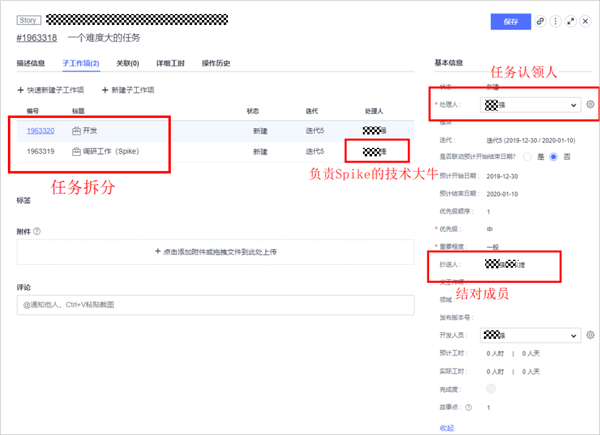
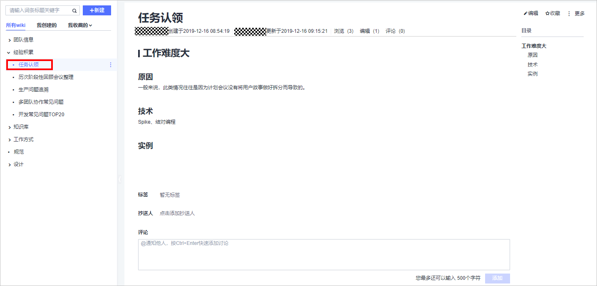

# **开发团队中的任务没人领取，你头疼吗？**

在传统开发模式下，开发任务是由项目经理指派给个人的，而在敏捷开发模式中，开发任务是团队领取的。很多企业在转型中遇到过这样的问题：“计划会议认领开发任务的时候，有几个任务没人认领怎么办？”

## **问题分析**

首先，相对于传统开发模式的指派开发任务，我们需要知道为什么在敏捷开发中是领取任务。在敏捷中，不管是**敏捷宣言**还是**Scrum指南**，都没有指派（assign）一词，而是使用了一个术语**自组织**，如下：

-   最佳的架构、需求和设计出自于自组织的团队（敏捷宣言12项原则）。
-   自组织团队自己选择如何以最好的方式完成工作，而不是由团队之外的人来指导（Scrum指南）。
-   他们是自组织的。没有人（即使是Scrum Master）有权告诉开发团队应该如何把产品待办列表变成潜在可发布的功能增量（Scrum指南）。

那么“自组织”是什么呢？

从字面的意思来理解，**自组织**就是：安排分散的人或事物使具有一定系统性或整体，而安排的人就是他们自己。在敏捷开发中，自组织团队就是具备自我管理、自我驱动、自我学习等能力的敏捷开发团队本身，这样的团队一般具备如下特点：

-   团队成员自己“拉”工作，不是被动等待他们的领导分配工作。
-   团队作为一个整体管理他们的工作。
-   团队仍然需要辅导和指导，但不需要指挥和控制。
-   团队成员彼此沟通紧密互通有无。
-   团队主动发现和提出问题并共同解决。
-   团队不断提高自己的技能，鼓励探索和创新。

更多关于**自组织**的相关内容不在本文的范围内，如感兴趣请参阅更多文献。

从**敏捷宣言**和**Scrum指南**关于任务的工作方式上来看，在我们践行敏捷的时候，主要发挥的是开发团队自身的主观能动性，开发团队由原来的控制性转变成了自组织性，而开发任务也就由原来的指派变为了领取。这样的好处是，领取任务就是发挥了人的主动性，而自主性是人们从事创造性和解决问题的动力之一，良好的自我组织能给团队和个人带来高绩效、出色的工作成果以及喜欢的工作环境。另外，每个人都是最了解自己的，也擅长为自己分配任务，相对于传统的指派开发任务所带来的易主观臆断、分配不当等更具有合理性。

然后，回到“计划会议认领任务的时候，有几个任务没人认领怎么办？”这个问题上。

在此之前需要先澄清的一个观点：在计划会议中，不一定非要全部领取完开发任务。在**Scrum指南**中指出“领取工作在Sprint计划会议和Sprint期间按需进行。”可以理解为，在每日Scrum站会上基于目标领取任务。另外，Mike Cohn也表示过，不建议在计划会议中领取开发任务，这样可能会导致目标由团队变为了个人，进而违背了敏捷的本意，降低了灵活性。更多请详见文末参考文献。

一般来说，开发任务没人认领的原因主要有：

-   **开发任务的难度大**：当开发任务比较难以解决，超出了团队大部分成员的能力时，团队成员可能会存在担心加班加点，甚至“996”的情况而不愿意认领。
-   **开发任务超范围**：当开发任务的内容超出团队成员所掌握的范围时，如Android不会IOS，开发不会测试等，就可能会出现“我是想认领的，但实例它不允许啊”的情况。
-   **担心受到他人指责**：工作内容存在一定的挑战性，担心由于自己没有做好，导致团队目标没有达成而受到指责。

那么应该如何解决呢？

## **解决方案**

在一个敏捷Scrum团队中，Scrum Master扮演着重要的角色，该角色一部分的作用就是要帮助团队成为自组织型团队，以便让团队能以积极的心态去面对冲刺的开发任务。此外，当出现任务没有人愿意认领的情况时，首先Scrum Master应该帮助团队弄清楚没有人认领的原因是什么再对症下药，下面基于分析中的三种情况分别给出解决措施。

-   **开发任务难度大**

    对于开发任务难度大的情况，Scrum Master应该组织团队进行有效的任务分解，使用探针Spike技术，探索出解决措施以降低任务的难度，再由团队去认领；或者鼓励技术能力较一般的成员和技术大牛通过结对编程的方式来一同认领任务。更多Spike及结对编程的介绍请见文末参考文献。

    在华为云DevCloud中，可以对该类难度大的用户故事通过子工作项的方式进行拆分，同时在基本信息中通过设置处理人和抄送人的方式以记录结对编程的人员配对情况，如下图。

    

      

    除此以外，在每日Scrum站会的时候要留意和了解该开发任务的情况，进行风险评估，如有问题及时帮助协调解决。在回顾会议中，应对该类情况问题进行分析并能输出基于团队的一套标准工作方式方法，然后将解决方案记录在团队知识库中，华为云DevCloud提供了Wiki的功能，可以为团队很好的整理和记录工作方式，如下图。

    

      

-   **开发任务超范围**

    敏捷提倡的团队是跨职能团队，但是团队的跨职能并不意味着一个人能做所有的事情，我们希望的跨职能团队往往是由掌握多项技能的T型人才（每个成员在一个专业领域具有深度，而在其他领域具有广度）所组成的。首先需要Scrum Master能够和团队整理和维护成员技术矩阵，把个人技能掌握情况对团队公开（知道团队欠缺什么、知道可以和谁学等），然后定期组织技术分享等活动以帮助团队成员学习（主要以学习一项新的技术后的分享方式），这样可以在一定程度上提升成员在冲刺中愿意领取其他任务的热情（学完了当然是想去用一下咯）。另外，还可以由专长成员和意愿成员组队，采用结对编程的方式领取任务，以实现个人技术的扩充。团队成员的T型能力建设，不仅仅能让团队领取任务的时候有更多的选择，也提供了成员的backup能力，减少无人认领的情况发生。此外，同样也需要Scrum Master留意日常评估风险和引导团队回顾该事项并维护团队知识库。

-   **担心受到他人指责**

    工作内容存在一定的挑战性，担心由于自己没有做好，导致团队目标没有达成而受到指责。Scrum Master应该对团队贯彻以团队为整体的思想，并指导和强调Scrum的价值观，尊重团队的每一个成员的背景、经验，当然也包括开发任务的选择，还要鼓励成员能有勇气去选择和尝试。在实际的工作中，我们可以通过在墙上、白板等贴上标语（如“尊重他人”、“只有团队没有个人”等）的方式，让团队从思想意识方面发生转变，慢慢敢于去领取有挑战性的任务。此外，Scrum Master要充分保护好成员对有挑战工作认领的热情。如防止在回顾会议上出现指责和批斗的情况，回顾和总结永远应该聚焦的是做事的方式方法而不是对人的苛刻和指责。

## **总结**

以上三种没有人认领任务的情况，是比较常见的。但在真正的实际项目中，每个公司或团队的情况都不尽相同，无法穷举所有，应具体情况具体分析。比如，一个刚刚转型的敏捷团队，在开发任务的领取上可能会更偏向于半指派半领取的方式。这就好比中国经济一样 “以市场经济为导向，适当进行宏观调控”。但不管这个“调控”的力度如何，我们都应该鼓励团队成员能积极主动地领取任务，并随着任务的进展情况灵活调整，及时做好风险把控，必要的时候需要其他渠道的协调帮助或相关领导的介入，以保证迭代的目标不受影响。

  

_**参考文献**__：__[Should Team Member Sign Up for Tasks During Sprint Planning？](https://www.mountaingoatsoftware.com/blog/should-team-members-sign-up-for-tasks-during-sprint-planning)_

